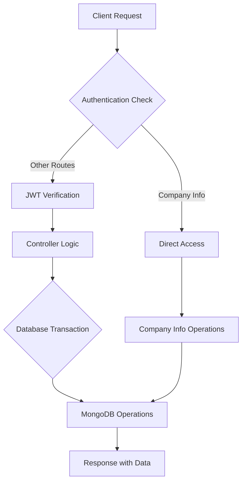
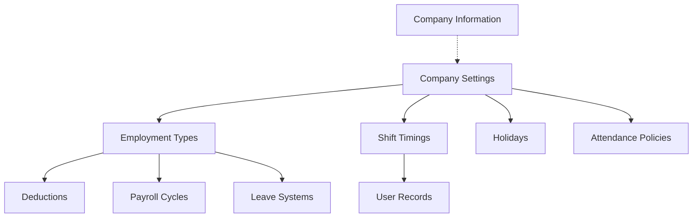

# Company Settings


<!-- # Company Settings API Documentation -->

## System Overview

The Company Settings API provides comprehensive management capabilities for company configuration, including company information, shift timings, holidays, payroll cycles, deductions, employment types, and working day systems. This API serves as the central configuration hub for HR and payroll management systems.

## Base URL
```
/v1/company-settings
```

## Authentication Requirements

- **Company Information Routes**: No authentication required
- **All Other Routes**: JWT authentication required via `verifyJWT` middleware
- **File Upload Routes**: Support multipart/form-data for logo uploads

## System Architecture Flow



## Complete Workflow Process

### 1. Company Setup Workflow
1. **Create Company Information** → One-time setup with basic details and logo
2. **Configure Company Settings** → Set up core operational parameters
3. **Define Shift Timings** → Create work schedules
4. **Setup Holidays** → Configure company holidays
5. **Configure Deductions** → Define salary deduction rules
6. **Setup Payroll Cycles** → Define payment schedules
7. **Configure Employment Types** → Link all components together

### 2. Data Relationships
- **Employment Types** ← Links to → **Deductions, Payroll Cycles, Working Day Systems**
- **Shift Timings** ← Updates → **User Records** (when modified/deleted)
- **Company Settings** ← Contains → **All Configuration Arrays**

## API Endpoints

### Company Information Management

#### Create Company Information
**POST** `/info/saveCompany`

Creates company information (one-time only operation).

**Request Headers:**
```
Content-Type: multipart/form-data
```

**Request Body:**
```json
{
  "name": "Tech Solutions Inc.",
  "addresses": [
    {
      "address": "123 Business District, New York, NY 10001",
      "latitude": "40.7128",
      "longitude": "-74.0060"
    },
    {
      "address": "456 Innovation Hub, San Francisco, CA 94102", 
      "latitude": "37.7749",
      "longitude": "-122.4194"
    }
  ],
  "contact": "+1-555-0123",
  "email": "info@techsolutions.com",
  "currency": "USD",
  "logo": "company_logo.png"
}
```

**Success Response (201):**
```json
{
  "success": true,
  "message": "Company information saved successfully.",
  "data": {
    "_id": "64f8b2a1c4d5e6f7g8h9i0j1",
    "name": "Tech Solutions Inc.",
    "addresses": [
      {
        "address": "123 Business District, New York, NY 10001",
        "latitude": "40.7128",
        "longitude": "-74.0060"
      }
    ],
    "contact": "+1-555-0123",
    "email": "info@techsolutions.com",
    "currency": "USD",
    "logo": "https://cloudinary.com/company-logos/uploaded_logo.jpg"
  }
}
```

**Error Responses:**
```json
// Company already exists (400)
{
  "success": false,
  "message": "Company information already exists. Only one document is allowed."
}

// Missing required fields (400)
{
  "success": false,
  "message": "All fields (name, addresses, contact, email, currency) are required."
}
```

#### Get Company Information
**GET** `/info/getCompany`

Retrieves all company information.

**Success Response (200):**
```json
{
  "success": true,
  "message": "Company information retrieved successfully.",
  "data": [
    {
      "id": "64f8b2a1c4d5e6f7g8h9i0j1",
      "name": "Tech Solutions Inc.",
      "addresses": [
        {
          "address": "123 Business District, New York, NY 10001",
          "latitude": "40.7128",
          "longitude": "-74.0060"
        }
      ],
      "contact": "+1-555-0123",
      "email": "info@techsolutions.com",
      "logo": "https://cloudinary.com/company-logos/uploaded_logo.jpg",
      "currency": "USD"
    }
  ]
}
```

#### Get Company Logo
**GET** `/info/company-logo`

Retrieves only company logo information.

**Success Response (200):**
```json
{
  "success": true,
  "message": "Company logo(s) retrieved successfully.",
  "data": [
    {
      "id": "64f8b2a1c4d5e6f7g8h9i0j1",
      "logo": "https://cloudinary.com/company-logos/uploaded_logo.jpg"
    }
  ]
}
```

#### Update Company Information
**PUT** `/info/editCompany/:id`

Updates existing company information.

**Request Parameters:**
- `id` (string): Company document ID

**Request Body:** Same as create company information

**Success Response (200):**
```json
{
  "success": true,
  "message": "Company information updated successfully.",
  "data": {
    "_id": "64f8b2a1c4d5e6f7g8h9i0j1",
    "name": "Updated Tech Solutions Inc.",
    // ... updated fields
  }
}
```

#### Delete Company Information
**DELETE** `/info/deleteCompany/:id`

Deletes company information by ID.

**Request Parameters:**
- `id` (string): Company document ID

**Success Response (200):**
```json
{
  "success": true,
  "message": "Company information deleted successfully."
}
```

### Company Settings Management

#### Get Company Settings
**GET** `/settings`

**Authentication:** Required (JWT)

Retrieves all company settings configuration.

**Success Response (200):**
```json
{
  "success": true,
  "data": {
    "_id": "64f8b2a1c4d5e6f7g8h9i0j1",
    "shiftTimings": [
      {
        "id": "64f8b2a1c4d5e6f7g8h9i0j2",
        "name": "Morning Shift",
        "startTime": "09:00",
        "endTime": "18:00"
      }
    ],
    "holidays": [
      {
        "id": "64f8b2a1c4d5e6f7g8h9i0j3",
        "name": "New Year",
        "date": "2024-01-01",
        "recurring": true
      }
    ],
    "deductions": [],
    "payrollCycles": [],
    "employmentTypes": [],
    "leaveSystems": []
  }
}
```

#### Create or Update Company Settings
**POST** `/settings`

**Authentication:** Required (JWT)

Creates new or updates existing company settings.

**Request Body:**
```json
{
  "attendancePolicies": {
    "enableOvertime": true,
    "overtimeRate": 1.5,
    "overtimeEligibilityHours": 8,
    "enableLateComing": true,
    "lateComingGraceMinutes": 15,
    "lateComingPenaltyType": "fixed",
    "lateComingPenaltyValue": 100,
    "maxMonthlyLatenessAllowed": 5,
    "calcSalaryBasedOn": "attendance"
  },
  "monthsBetweenHikesOrAdvances": 12
}
```

**Success Response (200):**
```json
{
  "success": true,
  "data": {
    "_id": "64f8b2a1c4d5e6f7g8h9i0j1",
    "attendancePolicies": {
      "enableOvertime": true,
      "overtimeRate": 1.5,
      "overtimeEligibilityHours": 8,
      "enableLateComing": true,
      "lateComingGraceMinutes": 15,
      "lateComingPenaltyType": "fixed",
      "lateComingPenaltyValue": 100,
      "maxMonthlyLatenessAllowed": 5,
      "calcSalaryBasedOn": "attendance"
    },
    "monthsBetweenHikesOrAdvances": 12
  },
  "message": "Settings saved successfully"
}
```

### Shift Timings Management

#### Get Shift Timings
**GET** `/shift-timings`

**Authentication:** Required (JWT)

Retrieves all shift timing configurations.

**Success Response (200):**
```json
{
  "success": true,
  "data": [
    {
      "id": "64f8b2a1c4d5e6f7g8h9i0j2",
      "name": "Morning Shift",
      "startTime": "09:00",
      "endTime": "18:00"
    },
    {
      "id": "64f8b2a1c4d5e6f7g8h9i0j3", 
      "name": "Night Shift",
      "startTime": "22:00",
      "endTime": "06:00"
    }
  ]
}
```

#### Add or Update Shift Timing
**POST** `/shift-timings`

**Authentication:** Required (JWT)

Creates new or updates existing shift timing. Uses database transactions to ensure data consistency with user records.

**Request Body (Create):**
```json
{
  "name": "Evening Shift",
  "startTime": "14:00",
  "endTime": "23:00"
}
```

**Request Body (Update):**
```json
{
  "id": "64f8b2a1c4d5e6f7g8h9i0j2",
  "name": "Updated Morning Shift",
  "startTime": "08:30",
  "endTime": "17:30"
}
```

**Success Response (200):**
```json
{
  "success": true,
  "data": [
    {
      "id": "64f8b2a1c4d5e6f7g8h9i0j2",
      "name": "Updated Morning Shift", 
      "startTime": "08:30",
      "endTime": "17:30"
    }
  ],
  "message": "Shift timings updated successfully"
}
```

#### Delete Shift Timing
**DELETE** `/shift-timings/:id`

**Authentication:** Required (JWT)

**Important:** This operation uses database transactions to update all affected user records. When a shift timing is deleted, all users assigned to that shift receive a message: "Please Contact To Your Admin for Updated Shift Timing"

**Request Parameters:**
- `id` (string): Shift timing ID

**Success Response (200):**
```json
{
  "success": true,
  "data": [
    // Updated shift timings array without deleted item
  ],
  "message": "Shift timing deleted successfully",
  "modifiedCount": 3
}
```

### Holidays Management

#### Get Holidays
**GET** `/holidays`

**Authentication:** Required (JWT)

**Success Response (200):**
```json
{
  "success": true,
  "data": [
    {
      "id": "64f8b2a1c4d5e6f7g8h9i0j3",
      "name": "New Year",
      "date": "2024-01-01",
      "recurring": true
    },
    {
      "id": "64f8b2a1c4d5e6f7g8h9i0j4",
      "name": "Independence Day",
      "date": "2024-07-04", 
      "recurring": true
    }
  ]
}
```

#### Add or Update Holiday
**POST** `/holidays`

**Authentication:** Required (JWT)

**Request Body (Create):**
```json
{
  "name": "Christmas Day",
  "date": "2024-12-25",
  "recurring": true
}
```

**Request Body (Update):**
```json
{
  "id": "64f8b2a1c4d5e6f7g8h9i0j3",
  "name": "Updated New Year",
  "date": "2024-01-01",
  "recurring": false
}
```

**Success Response (200):**
```json
{
  "success": true,
  "data": [
    {
      "id": "64f8b2a1c4d5e6f7g8h9i0j3",
      "name": "Christmas Day",
      "date": "2024-12-25",
      "recurring": true
    }
  ],
  "message": "Holidays updated successfully"
}
```

#### Delete Holiday
**DELETE** `/holidays/:id`

**Authentication:** Required (JWT)

**Success Response (200):**
```json
{
  "success": true,
  "data": [
    // Updated holidays array
  ],
  "message": "Holiday deleted successfully"
}
```

### Deductions Management

#### Get Deductions
**GET** `/deductions`

**Authentication:** Required (JWT)

**Success Response (200):**
```json
{
  "success": true,
  "data": [
    {
      "id": "64f8b2a1c4d5e6f7g8h9i0j5",
      "name": "Tax Deduction",
      "percentage": 10
    },
    {
      "id": "64f8b2a1c4d5e6f7g8h9i0j6",
      "name": "Health Insurance",
      "percentage": 5
    }
  ]
}
```

#### Add or Update Deduction
**POST** `/deductions`

**Authentication:** Required (JWT)

**Request Body (Create):**
```json
{
  "name": "Provident Fund",
  "percentage": 12
}
```

**Request Body (Update):**
```json
{
  "id": "64f8b2a1c4d5e6f7g8h9i0j5",
  "name": "Updated Tax Deduction",
  "percentage": 15
}
```

**Success Response (200):**
```json
{
  "success": true,
  "data": [
    {
      "id": "64f8b2a1c4d5e6f7g8h9i0j5",
      "name": "Provident Fund",
      "percentage": 12
    }
  ],
  "message": "Deductions updated successfully"
}
```

#### Delete Deduction
**DELETE** `/deductions/:id`

**Authentication:** Required (JWT)

**Success Response (200):**
```json
{
  "success": true,
  "data": [
    // Updated deductions array
  ],
  "message": "Deduction deleted successfully"
}
```

### Payroll Cycles Management

#### Get Payroll Cycles
**GET** `/payroll-cycles`

**Authentication:** Required (JWT)

**Success Response (200):**
```json
{
  "success": true,
  "data": [
    {
      "id": "64f8b2a1c4d5e6f7g8h9i0j7",
      "name": "Monthly",
      "processingDate": "30"
    },
    {
      "id": "64f8b2a1c4d5e6f7g8h9i0j8",
      "name": "Bi-weekly",
      "processingDate": "15"
    }
  ]
}
```

#### Add or Update Payroll Cycle
**POST** `/payroll-cycles`

**Authentication:** Required (JWT)

**Request Body (Create):**
```json
{
  "name": "Weekly",
  "processingDate": "7"
}
```

**Success Response (200):**
```json
{
  "success": true,
  "data": [
    {
      "id": "64f8b2a1c4d5e6f7g8h9i0j9",
      "name": "Weekly",
      "processingDate": "7"
    }
  ],
  "message": "Payroll cycles updated successfully"
}
```

#### Delete Payroll Cycle
**DELETE** `/payroll-cycles/:id`

**Authentication:** Required (JWT)

**Success Response (200):**
```json
{
  "success": true,
  "data": [
    // Updated payroll cycles array
  ],
  "message": "Payroll cycle deleted successfully"
}
```

### Working Day Systems Management

#### Get Working Day Systems
**GET** `/workingDay-systems`

**Authentication:** Required (JWT)

**Success Response (200):**
```json
{
  "success": true,
  "data": [
    {
      "id": "64f8b2a1c4d5e6f7g8h9i0j10",
      "name": "5-Day Work Week",
      "workingDays": ["Monday", "Tuesday", "Wednesday", "Thursday", "Friday"],
      "monthlyPaidLeaves": 2
    },
    {
      "id": "64f8b2a1c4d5e6f7g8h9i0j11",
      "name": "6-Day Work Week", 
      "workingDays": ["Monday", "Tuesday", "Wednesday", "Thursday", "Friday", "Saturday"],
      "monthlyPaidLeaves": 1
    }
  ]
}
```

#### Add or Update Working Day System
**POST** `/workingDay-systems`

**Authentication:** Required (JWT)

**Request Body (Create):**
```json
{
  "name": "4-Day Work Week",
  "workingDays": ["Monday", "Tuesday", "Wednesday", "Thursday"],
  "monthlyPaidLeaves": 3
}
```

**Success Response (200):**
```json
{
  "success": true,
  "data": [
    {
      "id": "64f8b2a1c4d5e6f7g8h9i0j12",
      "name": "4-Day Work Week",
      "workingDays": ["Monday", "Tuesday", "Wednesday", "Thursday"],
      "monthlyPaidLeaves": 3
    }
  ],
  "message": "Working Day systems updated successfully"
}
```

#### Delete Working Day System
**DELETE** `/workingDay-systems/:id`

**Authentication:** Required (JWT)

**Success Response (200):**
```json
{
  "success": true,
  "data": [
    // Updated working day systems array
  ],
  "message": "Working day system deleted successfully"
}
```

### Employment Types Management

#### Get Employment Types
**GET** `/employment-types`

**Authentication:** Required (JWT)

**Success Response (200):**
```json
{
  "success": true,
  "data": [
    {
      "id": "64f8b2a1c4d5e6f7g8h9i0j13",
      "name": "Full-Time",
      "deductions": ["64f8b2a1c4d5e6f7g8h9i0j5", "64f8b2a1c4d5e6f7g8h9i0j6"],
      "payrollCycleId": "64f8b2a1c4d5e6f7g8h9i0j7",
      "leaveSystemId": "64f8b2a1c4d5e6f7g8h9i0j10",
      "salaryHikePercentage": 8
    },
    {
      "id": "64f8b2a1c4d5e6f7g8h9i0j14",
      "name": "Part-Time",
      "deductions": ["64f8b2a1c4d5e6f7g8h9i0j5"],
      "payrollCycleId": "64f8b2a1c4d5e6f7g8h9i0j8", 
      "leaveSystemId": "64f8b2a1c4d5e6f7g8h9i0j11",
      "salaryHikePercentage": 5
    }
  ]
}
```

#### Add or Update Employment Type
**POST** `/employment-types`

**Authentication:** Required (JWT)

**Request Body (Create):**
```json
{
  "name": "Contract",
  "deductions": ["64f8b2a1c4d5e6f7g8h9i0j5"],
  "payrollCycleId": "64f8b2a1c4d5e6f7g8h9i0j8",
  "leaveSystemId": "64f8b2a1c4d5e6f7g8h9i0j11",
  "salaryHikePercentage": 3
}
```

**Success Response (200):**
```json
{
  "success": true,
  "data": [
    {
      "id": "64f8b2a1c4d5e6f7g8h9i0j15",
      "name": "Contract",
      "deductions": ["64f8b2a1c4d5e6f7g8h9i0j5"],
      "payrollCycleId": "64f8b2a1c4d5e6f7g8h9i0j8",
      "leaveSystemId": "64f8b2a1c4d5e6f7g8h9i0j11", 
      "salaryHikePercentage": 3
    }
  ],
  "message": "Employment types updated successfully"
}
```

#### Delete Employment Type
**DELETE** `/employment-types/:id`

**Authentication:** Required (JWT)

**Success Response (200):**
```json
{
  "success": true,
  "data": [
    // Updated employment types array
  ],
  "message": "Employment type deleted successfully"
}
```

## Frontend Integration Examples

### JavaScript/React Integration

```javascript
// API Configuration
const API_BASE_URL = 'https://your-api-domain.com/v1/company-settings';
const getAuthHeaders = () => ({
  'Authorization': `Bearer ${localStorage.getItem('authToken')}`,
  'Content-Type': 'application/json'
});

// Company Settings Service Class
class CompanySettingsService {
  
  // Get all company settings
  async getCompanySettings() {
    try {
      const response = await fetch(`${API_BASE_URL}/settings`, {
        method: 'GET',
        headers: getAuthHeaders()
      });
      
      if (!response.ok) {
        throw new Error(`HTTP error! status: ${response.status}`);
      }
      
      return await response.json();
    } catch (error) {
      console.error('Error fetching company settings:', error);
      throw error;
    }
  }

  // Create/Update company settings
  async saveCompanySettings(settingsData) {
    try {
      const response = await fetch(`${API_BASE_URL}/settings`, {
        method: 'POST',
        headers: getAuthHeaders(),
        body: JSON.stringify(settingsData)
      });
      
      return await response.json();
    } catch (error) {
      console.error('Error saving company settings:', error);
      throw error;
    }
  }

  // Shift Timings Management
  async getShiftTimings() {
    const response = await fetch(`${API_BASE_URL}/shift-timings`, {
      method: 'GET',
      headers: getAuthHeaders()
    });
    return await response.json();
  }

  async addShiftTiming(shiftData) {
    const response = await fetch(`${API_BASE_URL}/shift-timings`, {
      method: 'POST', 
      headers: getAuthHeaders(),
      body: JSON.stringify(shiftData)
    });
    return await response.json();
  }

  async deleteShiftTiming(shiftId) {
    const response = await fetch(`${API_BASE_URL}/shift-timings/${shiftId}`, {
      method: 'DELETE',
      headers: getAuthHeaders()
    });
    return await response.json();
  }

  // Company Information with File Upload
  async saveCompanyInfo(formData) {
    try {
      const response = await fetch(`${API_BASE_URL}/info/saveCompany`, {
        method: 'POST',
        // Note: Don't set Content-Type for FormData, let browser set it with boundary
        body: formData
      });
      
      return await response.json();
    } catch (error) {
      console.error('Error saving company info:', error);
      throw error;
    }
  }
}

// React Hook Example
import { useState, useEffect } from 'react';

const useCompanySettings = () => {
  const [settings, setSettings] = useState(null);
  const [loading, setLoading] = useState(false);
  const [error, setError] = useState(null);
  
  const settingsService = new CompanySettingsService();

  const fetchSettings = async () => {
    setLoading(true);
    try {
      const response = await settingsService.getCompanySettings();
      if (response.success) {
        setSettings(response.data);
      } else {
        setError(response.message);
      }
    } catch (err) {
      setError(err.message);
    } finally {
      setLoading(false);
    }
  };

  useEffect(() => {
    fetchSettings();
  }, []);

  return { settings, loading, error, refetch: fetchSettings };
};

// Form Data Helper for File Uploads
const createCompanyInfoFormData = (companyData, logoFile) => {
  const formData = new FormData();
  
  formData.append('name', companyData.name);
  formData.append('addresses', JSON.stringify(companyData.addresses));
  formData.append('contact', companyData.contact);
  formData.append('email', companyData.email);
  formData.append('currency', companyData.currency);
  
  if (logoFile) {
    formData.append('logo', logoFile);
  }
  
  return formData;
};
```

### Angular Integration

```typescript
// company-settings.service.ts
import { Injectable } from '@angular/core';
import { HttpClient, HttpHeaders } from '@angular/common/http';
import { Observable } from 'rxjs';

@Injectable({
  providedIn: 'root'
})
export class CompanySettingsService {
  private apiUrl = 'https://your-api-domain.com/v1/company-settings';

  constructor(private http: HttpClient) {}

  private getHeaders(): HttpHeaders {
    const token = localStorage.getItem('authToken');
    return new HttpHeaders({
      'Authorization': `Bearer ${token}`,
      'Content-Type': 'application/json'
    });
  }

  getCompanySettings(): Observable {
    return this.http.get(`${this.apiUrl}/settings`, { 
      headers: this.getHeaders() 
    });
  }

  saveCompanySettings(settings: any): Observable {
    return this.http.post(`${this.apiUrl}/settings`, settings, {
      headers: this.getHeaders()
    });
  }

  // Shift Timings
  getShiftTimings(): Observable {
    return this.http.get(`${this.apiUrl}/shift-timings`, {
      headers: this.getHeaders()
    });
  }

  addShiftTiming(shiftData: any): Observable {
    return this.http.post(`${this.apiUrl}/shift-timings`, shiftData, {
      headers: this.getHeaders()
    });
  }

  deleteShiftTiming(id: string): Observable {
    return this.http.delete(`${this.apiUrl}/shift-timings/${id}`, {
      headers: this.getHeaders()
    });
  }
}
```

## Security Features

### Authentication & Authorization
- **JWT Token Validation**: All authenticated routes verify JWT tokens via `verifyJWT` middleware
- **Route-Level Security**: Company info routes are public, all others require authentication
- **Token Expiration**: Handles expired tokens with 401 responses

### File Upload Security
- **Cloudinary Integration**: Secure file uploads to cloud storage
- **File Type Validation**: Logo uploads restricted to image files
- **File Size Limits**: Configured via multer middleware
- **Secure URLs**: Generated secure URLs for uploaded files

### Data Validation Rules

#### Company Information Validation
- **Required Fields**: name, addresses, contact, email, currency
- **Address Validation**: Non-empty address field, valid latitude/longitude strings
- **Email Format**: Standard email validation
- **One Document Rule**: Only one company info document allowed

#### Settings Validation
- **Percentage Fields**: Valid numeric ranges for deductions and salary hikes
- **Time Format**: Valid time format for shift timings (HH:mm)
- **Date Format**: Valid date format for holidays (YYYY-MM-DD)
- **Array Fields**: Proper array structure for working days, deductions

### Database Transaction Safety
- **Atomic Operations**: Shift timing operations use database transactions
- **Rollback on Error**: Automatic rollback if any operation fails
- **Data Consistency**: Ensures related user records stay synchronized

## Error Handling

### Common Error Responses

#### Authentication Errors (401)
```json
{
  "success": false,
  "message": "Access denied. No token provided."
}
```

#### Authorization Errors (403)
```json
{
  "success": false,
  "message": "Invalid token."
}
```

#### Validation Errors (400)
```json
{
  "success": false,
  "message": "All fields (name, addresses, contact, email, currency) are required."
}
```

#### Not Found Errors (404)
```json
{
  "success": false,
  "message": "Company settings not found"
}
```

#### Server Errors (500)
```json
{
  "success": false,
  "message": "Server error while fetching company settings"
}
```

### Error Handling in Frontend

```javascript
// Generic Error Handler
const handleApiError = (error, operation) => {
  if (error.status === 401) {
    // Redirect to login
    localStorage.removeItem('authToken');
    window.location.href = '/login';
  } else if (error.status === 404) {
    console.warn(`${operation}: Resource not found`);
  } else if (error.status >= 500) {
    console.error(`${operation}: Server error`, error);
  } else {
    console.error(`${operation}: Request failed`, error);
  }
};

// Usage in API calls
try {
  const response = await fetch(url, options);
  if (!response.ok) {
    handleApiError(response, 'Fetch Company Settings');
  }
} catch (error) {
  handleApiError(error, 'Network Error');
}
```

## Testing Guide

### cURL Commands

#### Company Information Tests
```bash
# Create company information
curl -X POST "http://localhost:3000/v1/company-settings/info/saveCompany" \
  -F "name=Tech Solutions Inc." \
  -F "addresses=[{\"address\":\"123 Business St\",\"latitude\":\"40.7128\",\"longitude\":\"-74.0060\"}]" \
  -F "contact=+1-555-0123" \
  -F "email=info@techsolutions.com" \
  -F "currency=USD" \
  -F "logo=@company_logo.png"

# Get company information
curl -X GET "http://localhost:3000/v1/company-settings/info/getCompany"

# Get company logo
curl -X GET "http://localhost:3000/v1/company-settings/info/company-logo"
```

#### Authenticated Routes Tests
```bash
# Set JWT token
TOKEN="your_jwt_token_here"

# Get company settings
curl -X GET "http://localhost:3000/v1/company-settings/settings" \
  -H "Authorization: Bearer $TOKEN"

# Create company settings
curl -X POST "http://localhost:3000/v1/company-settings/settings" \
  -H "Authorization: Bearer $TOKEN" \
  -H "Content-Type: application/json" \
  -d '{
    "attendancePolicies": {
      "enableOvertime": true,
      "overtimeRate": 1.5,
      "enableLateComing": true,
      "lateComingGraceMinutes": 15
    }
  }'

# Get shift timings
curl -X GET "http://localhost:3000/v1/company-settings/shift-timings" \
  -H "Authorization: Bearer $TOKEN"

# Add shift timing
curl -X POST "http://localhost:3000/v1/company-settings/shift-timings" \
  -H "Authorization: Bearer $TOKEN" \
  -H "Content-Type: application/json" \
  -d '{
    "name": "Morning Shift",
    "startTime": "09:00",
    "endTime": "18:00"
  }'

# Delete shift timing
curl -X DELETE "http://localhost:3000/v1/company-settings/shift-timings/64f8b2a1c4d5e6f7g8h9i0j2" \
  -H "Authorization: Bearer $TOKEN"
```

#### Holiday Management Tests
```bash
# Get holidays
curl -X GET "http://localhost:3000/v1/company-settings/holidays" \
  -H "Authorization: Bearer $TOKEN"

# Add holiday
curl -X POST "http://localhost:3000/v1/company-settings/holidays" \
  -H "Authorization: Bearer $TOKEN" \
  -H "Content-Type: application/json" \
  -d '{
    "name": "Christmas",
    "date": "2024-12-25",
    "recurring": true
  }'

# Update holiday
curl -X POST "http://localhost:3000/v1/company-settings/holidays" \
  -H "Authorization: Bearer $TOKEN" \
  -H "Content-Type: application/json" \
  -d '{
    "id": "64f8b2a1c4d5e6f7g8h9i0j3",
    "name": "Updated Christmas",
    "date": "2024-12-25",
    "recurring": false
  }'
```

### Postman Collection Example

```json
{
  "info": {
    "name": "Company Settings API",
    "schema": "https://schema.getpostman.com/json/collection/v2.1.0/collection.json"
  },
  "auth": {
    "type": "bearer",
    "bearer": [
      {
        "key": "token",
        "value": "{{authToken}}",
        "type": "string"
      }
    ]
  },
  "variable": [
    {
      "key": "baseUrl",
      "value": "http://localhost:3000/v1/company-settings"
    }
  ],
  "item": [
    {
      "name": "Company Settings",
      "item": [
        {
          "name": "Get Company Settings",
          "request": {
            "method": "GET",
            "url": "{{baseUrl}}/settings"
          }
        },
        {
          "name": "Create Company Settings",
          "request": {
            "method": "POST",
            "url": "{{baseUrl}}/settings",
            "body": {
              "mode": "raw",
              "raw": "{\n  \"attendancePolicies\": {\n    \"enableOvertime\": true,\n    \"overtimeRate\": 1.5\n  }\n}",
              "options": {
                "raw": {
                  "language": "json"
                }
              }
            }
          }
        }
      ]
    }
  ]
}
```

## Database Schema

### Company Settings Model Structure

```javascript
// CompanySettings Schema Structure
{
  _id: ObjectId,
  
  // Shift Timings Array
  shiftTimings: [
    {
      id: ObjectId,
      name: String,        // e.g., "Morning Shift"
      startTime: String,   // e.g., "09:00"
      endTime: String      // e.g., "18:00"
    }
  ],
  
  // Holidays Array
  holidays: [
    {
      id: ObjectId,
      name: String,        // e.g., "Christmas"
      date: String,        // e.g., "2024-12-25"
      recurring: Boolean   // true/false
    }
  ],
  
  // Deductions Array
  deductions: [
    {
      id: ObjectId,
      name: String,        // e.g., "Tax Deduction"
      percentage: Number   // e.g., 10
    }
  ],
  
  // Payroll Cycles Array
  payrollCycles: [
    {
      id: ObjectId,
      name: String,           // e.g., "Monthly"
      processingDate: String  // e.g., "30"
    }
  ],
  
  // Employment Types Array
  employmentTypes: [
    {
      id: ObjectId,
      name: String,                    // e.g., "Full-Time"
      deductions: [ObjectId],          // References to deduction IDs
      payrollCycleId: ObjectId,        // Reference to payroll cycle
      leaveSystemId: ObjectId,         // Reference to leave system
      salaryHikePercentage: Number     // e.g., 8
    }
  ],
  
  // Leave Systems Array (Working Day Systems)
  leaveSystems: [
    {
      id: ObjectId,
      name: String,                    // e.g., "5-Day Work Week"
      workingDays: [String],           // e.g., ["Monday", "Tuesday", ...]
      monthlyPaidLeaves: Number        // e.g., 2
    }
  ],
  
  // Attendance Policies Object
  attendancePolicies: {
    enableOvertime: Boolean,
    overtimeRate: Number,
    overtimeEligibilityHours: Number,
    enableLateComing: Boolean,
    lateComingGraceMinutes: Number,
    lateComingPenaltyType: String,    // "fixed" or "percentage"
    lateComingPenaltyValue: Number,
    maxMonthlyLatenessAllowed: Number,
    calcSalaryBasedOn: String         // "attendance" or other criteria
  },
  
  // Policy Settings
  monthsBetweenHikesOrAdvances: Number,  // e.g., 12
  
  // Timestamps
  createdAt: Date,
  updatedAt: Date
}
```

### Company Information Model Structure

```javascript
// Company Information Schema Structure
{
  _id: ObjectId,
  name: String,              // e.g., "Tech Solutions Inc."
  
  // Addresses Array with Geolocation
  addresses: [
    {
      address: String,       // e.g., "123 Business District, NY"
      latitude: String,      // e.g., "40.7128"
      longitude: String      // e.g., "-74.0060"
    }
  ],
  
  contact: String,           // e.g., "+1-555-0123"
  email: String,             // e.g., "info@company.com"
  currency: String,          // e.g., "USD"
  logo: String,              // Cloudinary URL
  
  // Timestamps
  createdAt: Date,
  updatedAt: Date
}
```

### Data Relationships



## Troubleshooting Guide

### Common Issues & Solutions

#### 1. Authentication Issues

**Problem**: "Access denied. No token provided"
```bash
# Solution: Ensure JWT token is included in Authorization header
curl -H "Authorization: Bearer your_jwt_token_here"
```

**Problem**: Token expired errors
```javascript
// Solution: Implement token refresh logic
if (error.status === 401) {
  await refreshAuthToken();
  // Retry the original request
}
```

#### 2. File Upload Issues

**Problem**: Logo upload failing
```javascript
// Solution: Ensure proper FormData usage
const formData = new FormData();
formData.append('logo', file);
// Don't set Content-Type header for FormData
```

**Problem**: File too large errors
```javascript
// Solution: Check file size before upload
if (file.size > 5 * 1024 * 1024) { // 5MB limit
  throw new Error('File too large');
}
```

#### 3. Database Transaction Issues

**Problem**: Shift timing deletion failing
- **Cause**: Database transaction timeout or connection issues
- **Solution**: Check MongoDB connection and retry logic

```javascript
// Add retry logic for failed transactions
const retryOperation = async (operation, maxRetries = 3) => {
  for (let i = 0; i  setTimeout(resolve, 1000 * (i + 1)));
    }
  }
};
```

#### 4. Validation Errors

**Problem**: "All fields required" error
```json
// Solution: Ensure all required fields are provided
{
  "name": "Required",
  "addresses": [{"address": "Required", "latitude": "Required", "longitude": "Required"}],
  "contact": "Required",
  "email": "Required", 
  "currency": "Required"
}
```

**Problem**: Invalid date format errors
```javascript
// Solution: Use proper date format (YYYY-MM-DD)
const formatDate = (date) => {
  return new Date(date).toISOString().split('T')[0];
};
```

#### 5. CORS Issues (Frontend Development)

**Problem**: CORS errors in browser
```javascript
// Solution: Configure CORS in your server or use proxy
// In development, add proxy to package.json:
"proxy": "http://localhost:3000"
```

#### 6. Performance Issues

**Problem**: Slow response times
- **Monitor**: Check database query performance
- **Solution**: Add database indexes for frequently queried fields

```javascript
// Add indexes in MongoDB
db.companysettings.createIndex({ "shiftTimings.id": 1 });
db.companysettings.createIndex({ "holidays.date": 1 });
```

### Debug Mode

Enable detailed logging for troubleshooting:

```javascript
// Add to your API client
const DEBUG = process.env.NODE_ENV === 'development';

const apiCall = async (url, options) => {
  if (DEBUG) {
    console.log('API Request:', { url, options });
  }
  
  try {
    const response = await fetch(url, options);
    const data = await response.json();
    
    if (DEBUG) {
      console.log('API Response:', { status: response.status, data });
    }
    
    return data;
  } catch (error) {
    if (DEBUG) {
      console.error('API Error:', error);
    }
    throw error;
  }
};
```

### Health Check Endpoint

```bash
# Test server connectivity
curl -X GET "http://localhost:3000/v1/company-settings/info/getCompany"

# Expected response for healthy API:
{
  "success": true,
  "message": "Company information retrieved successfully.",
  "data": [...]
}
```

## Best Practices for Implementation

### 1. Error Handling Strategy
```javascript
// Implement consistent error handling
const handleApiResponse = async (response) => {
  const data = await response.json();
  
  if (!data.success) {
    throw new Error(data.message || 'API request failed');
  }
  
  return data;
};
```

### 2. Loading States Management
```javascript
// Always handle loading states
const [loading, setLoading] = useState(false);
const [error, setError] = useState(null);

const fetchData = async () => {
  setLoading(true);
  setError(null);
  
  try {
    const data = await apiService.getData();
    // Handle success
  } catch (err) {
    setError(err.message);
  } finally {
    setLoading(false);
  }
};
```

### 3. Data Validation
```javascript
// Validate data before sending to API
const validateCompanyInfo = (data) => {
  const required = ['name', 'addresses', 'contact', 'email', 'currency'];
  const missing = required.filter(field => !data[field]);
  
  if (missing.length > 0) {
    throw new Error(`Missing required fields: ${missing.join(', ')}`);
  }
};
```

### 4. Caching Strategy
```javascript
// Implement simple caching for frequently accessed data
const cache = new Map();
const CACHE_DURATION = 5 * 60 * 1000; // 5 minutes

const getCachedData = async (key, fetchFunction) => {
  const cached = cache.get(key);
  
  if (cached && Date.now() - cached.timestamp < CACHE_DURATION) {
    return cached.data;
  }
  
  const data = await fetchFunction();
  cache.set(key, { data, timestamp: Date.now() });
  
  return data;
};
```

This comprehensive API documentation provides everything needed for new team members to understand and integrate with the Company Settings API system effectively.