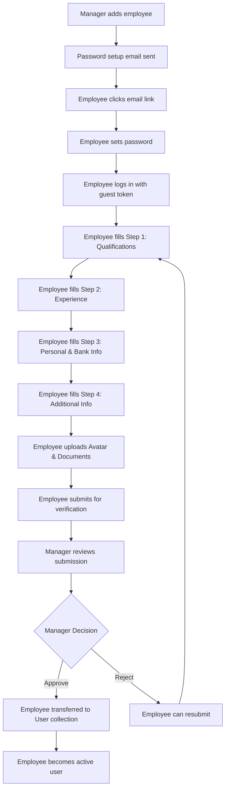

# Employee Onboarding


<!-- # Registration API - Employee Onboarding Documentation -->

Complete guide to the HCM Employee Onboarding system with multi-step registration, verification workflow, and manager approval process.

## Base URL
```
/api/v1/registration
```

## 🎯 System Overview

The HCM onboarding system is a comprehensive multi-step process that involves:

### **👥 Two User Types:**
- **Employee**: Completes registration forms using guest authentication
- **Manager**: Reviews and approves employees using full authentication

### **📋 Registration Flow:**
1. **Manager** adds employee basic details → Password setup email sent
2. **Employee** sets password → Can login to registration system
3. **Employee** completes multi-step onboarding form
4. **Employee** submits for verification
5. **Manager** reviews and approves/rejects
6. **If approved**: Employee transferred to main User collection
7. **If rejected**: Employee can resubmit with corrections

### **🔐 Authentication:**
- **Guest Token**: For employees during registration (`JWT_SECRET_FOR_GUEST`)
- **Full Token**: For managers and approved employees (`JWT_SECRET_KEY`)

---

## 📝 Employee Registration Process

### 1. 🔑 Set Password (Initial Setup)

Employee receives email with password setup link and creates their password.

**POST** `/set-password/{token}`

**URL Parameter:**
- `token`: Password setup token from email

**Request Body:**
```json
{
  "password": "SecurePassword123"
}
```

**Response Success:**
```json
{
  "status": true,
  "message": "Password set successfully and confirmation email sent."
}
```

**Response Errors:**
```json
// Invalid or expired token
{
  "status": false,
  "message": "Invalid or expired token."
}

// Password already set
{
  "status": false,
  "message": "Password already set. Link has expired."
}
```

**Process Flow:**
1. Employee clicks link from email
2. System validates token (must be within 1 hour)
3. Password is hashed and stored
4. `isPasswordSet` flag is set to true
5. Token is cleared from database
6. Confirmation email sent to employee

---

### 2. 🔐 Login (Guest Authentication)

Employee logs into the registration system using guest authentication.

**POST** `/login`

**Headers:**
```
x-device-type: android | ios | web
```

**Request Body:**
```json
{
  "employee_Id": "EMP001",
  "password": "SecurePassword123"
}
```

**Response Success:**
```json
{
  "success": true,
  "message": "Login successful",
  "data": {
    "accessToken": "eyJhbGciOiJIUzI1NiIsInR5cCI6IkpXVCJ9...",
    "employee_Id": "EMP001",
    "first_Name": "John",
    "last_Name": "Doe"
  }
}
```

**Response Errors:**
```json
// User not found
{
  "success": false,
  "message": "User not found"
}

// Password not set
{
  "success": false,
  "message": "Password not set for this account"
}

// Invalid credentials
{
  "success": false,
  "message": "Invalid credentials"
}
```

**Key Features:**
- Uses `JWT_SECRET_FOR_GUEST` for token generation
- Stores device-specific tokens
- Only works for Registration collection users

---

### 3. ✅ Verify Token

Validates guest token and returns user information.

**GET** `/verify-token`

**Headers:**
```
Authorization: Bearer <guest-token>
x-device-type: android | ios | web
```

**Response Success:**
```json
{
  "success": true,
  "message": "Token is valid",
  "user": {
    "_id": "user_id_123",
    "employee_Id": "EMP001",
    "first_Name": "John",
    "last_Name": "Doe",
    "isPasswordSet": true
  }
}
```

---

### 4. 📋 Get Basic Details

Retrieves employee's basic information.

**GET** `/basic-detail/{employee_Id}`

**Response Success:**
```json
{
  "success": true,
  "message": "Employee details fetched successfully",
  "data": {
    "first_Name": "John",
    "last_Name": "Doe",
    "personal_Email_Id": "john@personal.com",
    "mobile_No": "1234567890",
    "date_of_Joining": "2024-01-15",
    "employee_Id": "EMP001"
  }
}
```

---

### 5. 🎓 Add Qualifications

Employee adds their educational qualifications.

**POST** `/qualifications/{empid}`

**Request Body:**
```json
{
  "qualifications": [
    {
      "qualificationName": "Bachelor of Technology",
      "universityBoard": "Mumbai University",
      "specialization": "Computer Science",
      "certifications": "Oracle Certified",
      "totalMarks": 1000,
      "year": 2020,
      "percentageCgpa": "85%"
    },
    {
      "qualificationName": "Master of Computer Applications",
      "universityBoard": "Delhi University",
      "specialization": "Software Engineering",
      "totalMarks": 800,
      "year": 2022,
      "percentageCgpa": "8.5 CGPA"
    }
  ]
}
```

**Response Success:**
```json
{
  "success": true,
  "message": "Qualifications updated successfully.",
  "data": [
    {
      "qualificationName": "Bachelor of Technology",
      "universityBoard": "Mumbai University",
      "specialization": "Computer Science",
      "certifications": "Oracle Certified",
      "totalMarks": 1000,
      "year": 2020,
      "percentageCgpa": "85%"
    }
  ]
}
```

**Validation Rules:**
- Qualifications must be an array
- Each qualification must have required fields
- Array replaces existing qualifications

---

### 6. 💼 Add Experience

Employee adds their work experience and language skills.

**POST** `/experiences/{empid}`

**Request Body:**
```json
{
  "experiences": [
    {
      "companyName": "Tech Corp",
      "startDate": "2020-01-15",
      "endDate": "2022-12-31",
      "designation": "Software Developer",
      "grade_Band_Level": "L2",
      "previous_Positions": "Junior Developer"
    },
    {
      "companyName": "Innovation Labs",
      "startDate": "2023-01-01",
      "endDate": "2024-01-14",
      "designation": "Senior Developer",
      "grade_Band_Level": "L3",
      "previous_Positions": "Team Lead"
    }
  ],
  "languages_Known": ["English", "Hindi", "Marathi"],
  "total_Experience": 4.5
}
```

**Response Success:**
```json
{
  "success": true,
  "message": "Experience & additional info updated successfully.",
  "data": {
    "experiences": [...],
    "languages_Known": ["English", "Hindi", "Marathi"],
    "total_Experience": 4.5
  }
}
```

**Validation Rules:**
- All experience entries must have companyName, designation, startDate, endDate
- languages_Known must be an array
- total_Experience must be a number

---

### 7. 🏦 Personal & Bank Information

Employee adds personal identification and banking details.

**POST** `/personal-bank/{empid}`

**Request Body:**
```json
{
  "pan_No": "ABCDE1234F",
  "adhaar_Number": "1234-5678-9012",
  "pf_Details": "PF123456789",
  "esi_Details": "ESI987654321",
  "passport_Number": "P1234567",
  "bank_Holder_Name": "John Doe",
  "bank_Name": "State Bank of India",
  "bank_Account_No": "12345678901234",
  "confirm_Account_No": "12345678901234",
  "ifsc_Code": "SBIN0001234"
}
```

**Response Success:**
```json
{
  "success": true,
  "message": "Personal and bank info saved successfully."
}
```

**Validation Rules:**
- All fields except pf_Details, esi_Details, passport_Number are required
- bank_Account_No must match confirm_Account_No
- PAN format validation
- IFSC code format validation

---

### 8. 📱 Additional Information

Employee adds personal and emergency contact information.

**POST** `/additional-info/{empid}`

**Request Body:**
```json
{
  "linkedin_Profile_URL": "https://linkedin.com/in/johndoe",
  "github_Portfolio_URL": "https://github.com/johndoe",
  "disability_Status": "None",
  "marital_Status": "Single",
  "nationality": "Indian",
  "emergency_Contact_Person": "Jane Doe",
  "emergency_Contact_Number": "9876543210",
  "emergency_Contact_Blood_Group": "O+",
  "gender": "Male",
  "dob": "1995-06-15",
  "permanent_Address": "123 Main St, City, State, 12345",
  "current_Address": "456 Oak Ave, City, State, 67890",
  "date_of_Conformation": "2024-07-15",
  "working_Email_Id": "john@company.com"
}
```

**Response Success:**
```json
{
  "success": true,
  "message": "Additional information saved successfully."
}
```

**Required Fields:**
- marital_Status, nationality, emergency_Contact_Person
- emergency_Contact_Number, emergency_Contact_Blood_Group

---

### 9. 🖼️ Upload Avatar

Employee uploads profile picture.

**POST** `/upload/avatar/{empid}`

**Headers:**
```
Content-Type: multipart/form-data
```

**Request Body (FormData):**
```
user_Avatar: [image file]
```

**Response Success:**
```json
{
  "success": true,
  "avatar": "https://cloudinary.com/avatar_url"
}
```

**File Requirements:**
- Allowed types: JPEG, PNG, JPG, WebP
- Maximum size: 5MB
- Uploaded to Cloudinary

---

### 10. 📄 Upload Documents

Employee uploads required documents.

**POST** `/upload/documents/{empid}`

**Headers:**
```
Content-Type: multipart/form-data
```

**Request Body (FormData):**
```
documents[0][name]: "PAN Card"
documents[0][file]: [file]
documents[1][name]: "Aadhar Card"
documents[1][file]: [file]
documents[2][name]: "Educational Certificate"
documents[2][file]: [file]
```

**Response Success:**
```json
{
  "success": true,
  "uploaded": [
    {
      "name": "PAN Card",
      "url": "https://cloudinary.com/document_url_1"
    },
    {
      "name": "Aadhar Card",
      "url": "https://cloudinary.com/document_url_2"
    }
  ]
}
```

**File Requirements:**
- Allowed types: Images (JPEG, PNG, JPG, WebP), PDF, Excel files
- Maximum size: 5MB per file
- Each document must have a name and file

---

### 11. 📊 Get Employee Sections

Retrieves all sections of employee data for review.

**GET** `/employee/sections/{empid}`

**Response Success:**
```json
{
  "success": true,
  "data": {
    "basic": {
      "first_Name": "John",
      "last_Name": "Doe",
      "personal_Email_Id": "john@personal.com",
      "mobile_No": "1234567890",
      "date_of_Joining": "2024-01-15",
      "employee_Id": "EMP001"
    },
    "qualifications": [
      {
        "qualificationName": "Bachelor of Technology",
        "universityBoard": "Mumbai University",
        "specialization": "Computer Science"
      }
    ],
    "experiences": {
      "list": [
        {
          "companyName": "Tech Corp",
          "designation": "Software Developer",
          "startDate": "2020-01-15",
          "endDate": "2022-12-31"
        }
      ],
      "languages_Known": ["English", "Hindi"],
      "total_Experience": 4.5
    },
    "identityAndBank": {
      "pan_No": "ABCDE1234F",
      "adhaar_Number": "1234-5678-9012",
      "bank_Holder_Name": "John Doe",
      "bank_Name": "State Bank of India",
      "bank_Account_No": "12345678901234",
      "ifsc_Code": "SBIN0001234"
    },
    "personalAndAdditional": {
      "marital_Status": "Single",
      "nationality": "Indian",
      "emergency_Contact_Person": "Jane Doe",
      "emergency_Contact_Number": "9876543210",
      "gender": "Male",
      "dob": "1995-06-15"
    },
    "uploads": {
      "avatar": "https://cloudinary.com/avatar_url",
      "documents": [
        {
          "name": "PAN Card",
          "url": "https://cloudinary.com/document_url"
        }
      ]
    }
  }
}
```

---

### 12. 📤 Submit for Verification

Employee submits completed profile for manager review.

**PUT** `/verify-pending/{empid}`

**Response Success:**
```json
{
  "success": true,
  "message": "Submitted Successfully"
}
```

**Process:**
- Changes `isUserVerified` status to "Pending"
- Notifies manager for review
- Employee can no longer edit details until review is complete

---

### 13. 🚪 Logout

Clears guest authentication token.

**POST** `/logout`

**Headers:**
```
Authorization: Bearer <guest-token>
x-device-type: android | ios | web
```

**Response Success:**
```json
{
  "success": true,
  "message": "Logout successful and token cleared"
}
```

---

## 👨‍💼 Manager Operations

### 14. ➕ Add New Employee

Manager adds a new employee and sends password setup email.

**POST** `/add-new-employee`

**Request Body:**
```json
{
  "firstName": "John",
  "lastName": "Doe",
  "email": "john@company.com",
  "mobile": "1234567890",
  "doj": "2024-01-15",
  "employee_Id": "EMP001",
  "addedBy": "MGR001"
}
```

**Response Success:**
```json
{
  "status": true,
  "message": "Employee added successfully, email sent.",
  "employee": {
    "_id": "employee_id_123",
    "first_Name": "John",
    "last_Name": "Doe",
    "personal_Email_Id": "john@company.com",
    "mobile_No": "1234567890",
    "date_of_Joining": "2024-01-15",
    "employee_Id": "EMP001",
    "isUserVerified": "Not Verified",
    "addedHistory": [
      {
        "addedBy": "MGR001",
        "addedAt": "2024-01-15T10:30:00Z"
      }
    ]
  }
}
```

**Process Flow:**
1. Validates all required fields
2. Checks for duplicate employee_Id, email, mobile
3. Validates email and mobile formats
4. Generates password reset token (expires in 1 hour)
5. Creates employee record in Registration collection
6. Sends password setup email with link
7. Email link format: `${FRONTEND_URL}/registration/set-password/v2/{token}`

**Validation Rules:**
- All fields are required
- Email format validation
- Mobile number must be 10 digits
- Employee ID must be unique
- Email must be unique
- Mobile number must be unique

---

### 15. 📋 Get Employees by Status

Manager retrieves employees filtered by verification status.

**GET** `/emp-status/{status}`

**URL Parameters:**
- `status`: "Pending" | "Verified" | "Not Verified"

**Query Parameters:**
- `empid`: Manager's employee ID
- `search`: Search term (optional)
- `page`: Page number (default: 1)
- `limit`: Items per page (default: 10)

**Example:**
```
GET /emp-status/Pending?empid=MGR001&search=john&page=1&limit=5
```

**Response Success:**
```json
{
  "success": true,
  "data": [
    {
      "first_Name": "John",
      "last_Name": "Doe",
      "department": "Engineering",
      "employee_Id": "EMP001",
      "mobile_No": "1234567890",
      "personal_Email_Id": "john@company.com",
      "date_of_Joining": "2024-01-15",
      "addedHistory": [
        {
          "addedBy": "MGR001",
          "addedAt": "2024-01-15T10:30:00Z"
        }
      ]
    }
  ],
  "totalPages": 3,
  "totalEmployees": 25,
  "counts": {
    "Pending": 15,
    "Verified": 8,
    "Not Verified": 2
  }
}
```

**Search Functionality:**
- Searches in first_Name, last_Name, and employee_Id
- Case-insensitive search
- Supports pagination

---

### 16. 🔍 Get Employee Section Details

Manager retrieves detailed employee information for review.

**GET** `/employee-section/{employeeId}`

**Response Success:**
```json
{
  "success": true,
  "data": {
    "exitDetails": {
      "certifications": "",
      "org_Specific_IDs": "",
      "date_of_Resignation": "",
      "reason_for_Leaving": "",
      "notice_Period_Served": "",
      "exit_Interview_Feedback": "",
      "full_Final_Settlement": "",
      "relieving_Certificate_Date": ""
    },
    "benefitsAndVerification": {
      "gratuity_Details": "",
      "medical_Insurance": "",
      "other_Benefits": "",
      "background_Verification_Status": "",
      "police_Verification": "",
      "trainingStatus": "upToDate",
      "complianceTrainingStatus": "pending"
    },
    "compensationAndAccess": {
      "no_of_Paid_Leave": 0,
      "employee_Type": "",
      "department": "",
      "designation": "",
      "roleId": null,
      "managerId": null,
      "base_Salary": "",
      "current_Base_Salary": "",
      "otp_Required": "no",
      "work_Mode": "",
      "overtime_allowed": "",
      "permission": [],
      "office_location": "",
      "latitude": "",
      "longitude": "",
      "shift_Timing": null,
      "break_Type": null,
      "allowances_Provided": []
    }
  }
}
```

---

### 17. 📝 Send Remark

Manager sends message/remark to employee during review process.

**POST** `/remarks`

**Request Body:**
```json
{
  "sender": "MGR001",
  "receiver": "EMP001",
  "message": "Please provide additional documentation for your previous employment."
}
```

**Response Success:**
```json
{
  "success": true,
  "message": "Message sent successfully."
}
```

**Chat System Features:**
- Creates unique room ID for each manager-employee pair
- Stores messages in Registration collection
- Supports real-time communication during review

---

### 18. 💬 Get Chat Messages

Manager retrieves chat history with specific employee.

**GET** `/remarks/{user1}/{user2}`

**Response Success:**
```json
{
  "success": true,
  "messages": [
    {
      "roomId": "MGR001_EMP001",
      "sender": "MGR001",
      "message": "Please provide additional documentation.",
      "createdAt": "2024-01-15T10:30:00Z"
    },
    {
      "roomId": "MGR001_EMP001",
      "sender": "EMP001",
      "message": "I have uploaded the required documents.",
      "createdAt": "2024-01-15T11:00:00Z"
    }
  ]
}
```

---

### 19. 👤 Get Added By Manager

Retrieves who originally added the employee.

**GET** `/addedby/{employeeId}`

**Response Success:**
```json
{
  "success": true,
  "addedBy": "MGR001"
}
```

---

### 20. 📊 Get Verification Status

Checks current verification status of employee.

**GET** `/verify-status/{empid}`

**Response Success:**
```json
{
  "success": true,
  "isUserVerified": "Pending"
}
```

**Possible Values:**
- "Not Verified": Initial state
- "Pending": Submitted for review
- "Verified": Approved by manager

---

### 21. ✅ Mark User as Verified (Simple)

Manager updates employee verification status.

**PUT** `/mark-verified/{empid}`

**Request Body:**
```json
{
  "isUserVerified": "Verified"
}
```

**Response Success:**
```json
{
  "success": true,
  "message": "User marked as Verified",
  "isUserVerified": "Verified"
}
```

**Allowed Values:**
- "Verified"
- "Pending"
- "Not Verified"

---

### 22. ✅ Mark User as Verified (Advanced)

Manager verifies employee with history tracking and auto-transfer to main system.

**PUT** `/mark-verifiedv2/{empid}`

**Headers:**
```
Authorization: Bearer <manager-token>
```

**Request Body:**
```json
{
  "isUserVerified": "Verified",
  "remarks": "All documents verified and approved"
}
```

**Response Success:**
```json
{
  "success": true,
  "message": "User marked as Verified",
  "status": "Verified"
}
```

**Advanced Features:**
- **Auto-Transfer**: If status is "Verified", employee data is automatically moved from Registration to User collection
- **History Tracking**: Creates verification history record
- **Data Migration**: Transfers all employee data to main system
- **Cleanup**: Removes from Registration collection after successful transfer

**Process Flow for "Verified" Status:**
1. Checks if employee exists in main User collection
2. If not exists, creates new User record with all Registration data
3. Assigns new MongoDB ObjectId for User collection
4. Deletes employee from Registration collection
5. Creates verification history record
6. Returns success response

---

### 23. 📋 Save Exit Details

Manager adds exit-related information for departing employees.

**POST** `/exit-details/{employeeId}`

**Request Body:**
```json
{
  "certifications": "AWS Certified, PMP",
  "org_Specific_IDs": "Badge: 12345, Laptop: LAP001",
  "date_of_Resignation": "2024-12-31",
  "reason_for_Leaving": "Better opportunity",
  "notice_Period_Served": "30 days",
  "exit_Interview_Feedback": "Positive feedback about team and growth",
  "full_Final_Settlement": "Completed on 2024-12-31",
  "relieving_Certificate_Date": "2024-12-31"
}
```

**Response Success:**
```json
{
  "success": true,
  "message": "Exit details saved successfully."
}
```

**Required Fields:**
- date_of_Resignation
- reason_for_Leaving
- notice_Period_Served
- relieving_Certificate_Date

---

### 24. 🏥 Save Benefits and Verification

Manager adds benefits and verification information.

**POST** `/verification-benefits/{employeeId}`

**Request Body:**
```json
{
  "gratuity_Details": "Eligible after 5 years",
  "medical_Insurance": "Family coverage included",
  "other_Benefits": "Meal vouchers, Transport allowance",
  "background_Verification_Status": "Completed",
  "police_Verification": "Clear",
  "trainingStatus": "upToDate",
  "complianceTrainingStatus": "completed"
}
```

**Response Success:**
```json
{
  "success": true,
  "message": "Benefits and verification info saved successfully.",
  "data": {
    // Updated employee data
  }
}
```

**Required Fields:**
- medical_Insurance
- background_Verification_Status
- trainingStatus
- complianceTrainingStatus

**Enum Values:**
- trainingStatus: "upToDate", "needsRefresh", "needsCertification"
- complianceTrainingStatus: "completed", "pending"

---

### 25. 💰 Update Employee Compensation

Manager updates compensation and access details for employee.

**PUT** `/employee-compensation/{employeeId}`

**Request Body:**
```json
{
  "no_of_Paid_Leave": 24,
  "employee_Type": "permanent",
  "department": "Engineering",
  "designation": "Software Developer",
  "roleId": "role_id_123",
  "managerId": "manager_id_456",
  "base_Salary": "50000",
  "current_Base_Salary": "55000",
  "otp_Required": "yes",
  "work_Mode": "hybrid",
  "overtime_allowed": "yes",
  "permission": ["attendance-view", "profile-edit"],
  "office_location": "Mumbai Office",
  "latitude": "19.0760",
  "longitude": "72.8777",
  "shift_Timing": "shift_timing_id",
  "break_Type": "flexible",
  "allowances_Provided": ["transport", "meal"],
  "permission_role": "employee"
}
```

**Response Success:**
```json
{
  "success": true,
  "message": "Compensation & access details updated successfully.",
  "data": {
    // Updated employee data
  }
}
```

**Required Fields:**
- roleId (must be provided)

**Field Mapping:**
- managerId → assigned_to
- base_Salary → salary  
- otp_Required → otp
- office_location → office_address

---

## 🔄 Complete Registration Flow

### **Step-by-Step Process:**



### **Data Flow:**

1. **Registration Collection**: Temporary storage during onboarding
2. **User Collection**: Permanent storage for active employees
3. **Verification History**: Audit trail of all verification actions

---

## 🔐 Authentication & Security

### **Token Types:**

#### **Guest Token (Registration Process):**
```javascript
// Generated using JWT_SECRET_FOR_GUEST
const guestToken = jwt.sign(
  { _id: user._id, employee_Id: user.employee_Id },
  process.env.JWT_SECRET_FOR_GUEST,
  { expiresIn: "7d" }
);
```

#### **Full Token (Approved Users):**
```javascript
// Generated using JWT_SECRET_KEY
const fullToken = jwt.sign(
  { _id: user._id, employee_Id: user.employee_Id },
  process.env.JWT_SECRET_KEY,
  { expiresIn: "7d" }
);
```

### **Middleware Usage:**

| Operation | Middleware | Purpose |
|-----------|------------|---------|
| Employee Registration | `verifyJWTGuest` | Limited access during onboarding |
| Manager Operations | `verifyJWT` | Full system access |
| File Uploads | `upload.any()` | Multer file handling |

### **Password Security:**
- Bcrypt hashing with salt rounds = 10
- Token-based password reset (1-hour expiry)
- Email verification for password setup

---

## 📧 Email System

### **Email Templates:**

#### **Password Setup Email:**
```javascript
const resetLink = `${process.env.FRONTEND_URL}/registration/set-password/v2/${passwordToken}`;
```

#### **Password Success Email:**
Sent after successful password setup with employee details.

### **SMTP Configuration:**
```javascript
const transporter = nodemailer.createTransporter({
  host: 'smtp.hostinger.com',
  port: 587,
  secure: false,
  auth: {
    user: process.env.MYUSER,
    pass: process.env.MYPASS,
  },
});
```

---

## 📁 File Upload System

### **Supported File Types:**
- **Images**: JPEG, PNG, JPG, WebP
- **Documents**: PDF, Excel files (XLS, XLSX)
- **Size Limit**: 5MB per file

### **Upload Destinations:**
- **Avatar**: `ems-user-avatars` folder
- **Documents**: `ems-documents` folder
- **Storage**: Cloudinary integration

### **File Structure:**
```javascript
// Avatar naming
avatar_${empid}

// Document naming  
document_${empid}_${index}
```

---

## 💬 Chat System

### **Room ID Generation:**
```javascript
const getRoomId = (user1, user2) => {
  return [user1, user2].sort().join('_');
};
// Example: "EMP001_MGR001"
```

### **Message Storage:**
```javascript
{
  onboardFormRemarksChat: [
    {
      roomId: "EMP001_MGR001",
      sender: "MGR001",
      message: "Please provide additional documents",
      createdAt: "2024-01-15T10:30:00Z"
    }
  ]
}
```

---

## 🔧 Development Examples

### **Frontend Integration:**

#### **Employee Registration Flow:**
```javascript
// Step 1: Set Password
const setPassword = async (token, password) => {
  const response = await fetch(`/api/v1/registration/set-password/${token}`, {
    method: 'POST',
    headers: { 'Content-Type': 'application/json' },
    body: JSON.stringify({ password })
  });
  return response.json();
};

// Step 2: Login
const registrationLogin = async (employee_Id, password) => {
  const response = await fetch('/api/v1/registration/login', {
    method: 'POST',
    headers: {
      'Content-Type': 'application/json',
      'x-device-type': 'web'
    },
    body: JSON.stringify({ employee_Id, password })
  });
  const data = await response.json();
  
  if (data.success) {
    localStorage.setItem('guestToken', data.data.accessToken);
    return data;
  }
};

// Step 3: Add Qualifications
const addQualifications = async (empid, qualifications) => {
  const token = localStorage.getItem('guestToken');
  const response = await fetch(`/api/v1/registration/qualifications/${empid}`, {
    method: 'POST',
    headers: {
      'Content-Type': 'application/json',
      'Authorization': `Bearer ${token}`,
      'x-device-type': 'web'
    },
    body: JSON.stringify({ qualifications })
  });
  return response.json();
};

// Step 4: Upload Avatar
const uploadAvatar = async (empid, avatarFile) => {
  const token = localStorage.getItem('guestToken');
  const formData = new FormData();
  formData.append('user_Avatar', avatarFile);
  
  const response = await fetch(`/api/v1/registration/upload/avatar/${empid}`, {
    method: 'POST',
    headers: {
      'Authorization': `Bearer ${token}`,
      'x-device-type': 'web'
    },
    body: formData
  });
  return response.json();
};

// Step 5: Submit for Verification
const submitForVerification = async (empid) => {
  const token = localStorage.getItem('guestToken');
  const response = await fetch(`/api/v1/registration/verify-pending/${empid}`, {
    method: 'PUT',
    headers: {
      'Authorization': `Bearer ${token}`,
      'x-device-type': 'web'
    }
  });
  return response.json();
};
```

#### **Manager Operations:**
```javascript
// Add New Employee
const addEmployee = async (employeeData) => {
  const token = localStorage.getItem('managerToken');
  const response = await fetch('/api/v1/registration/add-new-employee', {
    method: 'POST',
    headers: {
      'Content-Type': 'application/json',
      'Authorization': `Bearer ${token}`,
      'x-device-type': 'web'
    },
    body: JSON.stringify(employeeData)
  });
  return response.json();
};

// Get Pending Employees
const getPendingEmployees = async (search = '', page = 1) => {
  const token = localStorage.getItem('managerToken');
  const response = await fetch(`/api/v1/registration/emp-status/Pending?search=${search}&page=${page}`, {
    headers: {
      'Authorization': `Bearer ${token}`,
      'x-device-type': 'web'
    }
  });
  return response.json();
};

// Verify Employee
const verifyEmployee = async (empid, status, remarks) => {
  const token = localStorage.getItem('managerToken');
  const response = await fetch(`/api/v1/registration/mark-verifiedv2/${empid}`, {
    method: 'PUT',
    headers: {
      'Content-Type': 'application/json',
      'Authorization': `Bearer ${token}`,
      'x-device-type': 'web'
    },
    body: JSON.stringify({ isUserVerified: status, remarks })
  });
  return response.json();
};
```

---

## 🧪 Testing Guide

### **Test Employee Registration:**
```bash
# Step 1: Manager adds employee
curl -X POST http://localhost:6006/api/v1/registration/add-new-employee \
  -H "Content-Type: application/json" \
  -H "Authorization: Bearer MANAGER_TOKEN" \
  -d '{
    "firstName": "John",
    "lastName": "Doe",
    "email": "john@company.com",
    "mobile": "1234567890",
    "doj": "2024-01-15",
    "employee_Id": "EMP001",
    "addedBy": "MGR001"
  }'

# Step 2: Employee sets password (use token from email)
curl -X POST http://localhost:6006/api/v1/registration/set-password/TOKEN_HERE \
  -H "Content-Type: application/json" \
  -d '{"password": "SecurePass123"}'

# Step 3: Employee login
curl -X POST http://localhost:6006/api/v1/registration/login \
  -H "Content-Type: application/json" \
  -H "x-device-type: web" \
  -d '{
    "employee_Id": "EMP001",
    "password": "SecurePass123"
  }'

# Step 4: Add qualifications (use guest token from login)
curl -X POST http://localhost:6006/api/v1/registration/qualifications/EMP001 \
  -H "Content-Type: application/json" \
  -H "Authorization: Bearer GUEST_TOKEN" \
  -d '{
    "qualifications": [{
      "qualificationName": "Bachelor of Technology",
      "universityBoard": "Mumbai University",
      "specialization": "Computer Science",
      "year": 2020,
      "percentageCgpa": "85%"
    }]
  }'
```

---

## 📊 Database Schema

### **Registration Collection:**
```javascript
{
  // Basic Info
  first_Name: String,
  last_Name: String,
  personal_Email_Id: String,
  mobile_No: String,
  date_of_Joining: String,
  employee_Id: String, // unique
  
  // Password & Auth
  password: String,
  isPasswordSet: Boolean,
  resetPasswordToken: String,
  resetPasswordExpires: Date,
  
  // Multi-device tokens
  accessTokenAndroid: String,
  accessTokenIOS: String,
  accessTokenWeb: String,
  
  // Verification
  isUserVerified: {
    type: String,
    enum: ["Not Verified", "Pending", "Verified"],
    default: "Not Verified"
  },
  
  // Onboarding Data
  qualifications: [QualificationSchema],
  experiences: [ExperienceSchema],
  documents: [DocumentSchema],
  
  // Personal Info
  pan_No: String,
  adhaar_Number: String,
  bank_Account_No: String,
  // ... other fields
  
  // Audit Trail
  addedHistory: [{
    addedBy: String,
    addedAt: Date
  }],
  
  // Chat System
  onboardFormRemarksChat: [{
    roomId: String,
    sender: String,
    message: String,
    createdAt: Date
  }]
}
```

---

## 🚨 Error Handling

### **Common Error Responses:**

#### **Validation Errors:**
```json
{
  "success": false,
  "message": "Validation failed for entry #1",
  "errors": ["Company Name is required", "Designation is required"]
}
```

#### **Authentication Errors:**
```json
{
  "success": false,
  "message": "Invalid or expired access token."
}
```

#### **File Upload Errors:**
```json
{
  "success": false,
  "message": "File type not supported. Please upload an image or PDF."
}
```

---

## 🔄 Status Workflow

### **Employee Verification States:**

1. **"Not Verified"**: Initial state when employee is added
2. **"Pending"**: Employee submitted for manager review
3. **"Verified"**: Manager approved - employee moved to User collection

### **State Transitions:**
- Not Verified → Pending (Employee submits)
- Pending → Verified (Manager approves)
- Pending → Not Verified (Manager rejects)
- Verified → User Collection (Auto-transfer)

---

This comprehensive documentation covers the complete employee onboarding process, from initial employee addition by managers to final approval and system integration. The multi-step workflow ensures thorough data collection while maintaining security and proper approval processes.