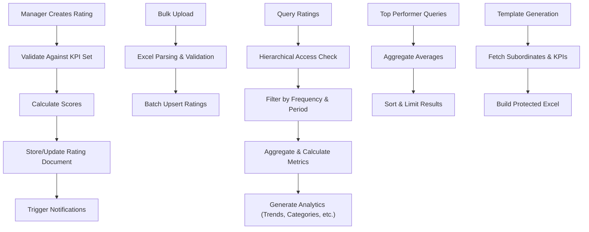

# Performance Ratings 

{/* # Performance Ratings Management API Documentation */}

## System Overview

The Performance Ratings API is part of a comprehensive performance management system that enables managers to rate employee performance based on predefined KPI sets. It supports various evaluation frequencies (daily, weekly, monthly, quarterly, half-yearly, yearly) and provides advanced querying, aggregation, analytics, and bulk operations. Key features include rating creation, Excel-based bulk uploads (for current and past periods), hierarchical access (self, team, organization), top performer identification, and detailed analytics with trends, distributions, and visualizations.

This API integrates with the KPI Set Management API (`/v1/kpis`) to ensure ratings align with configured KPIs.

## Base URL
```
/v1/ratings
```

## Authentication Requirements

- **All Routes**: JWT authentication required via `verifyJWT` middleware
- **Role-based Access**:
  - Employees: View own ratings (`/my-advanced`)
  - Managers: Access team ratings and analytics (`/team-advanced`, `/manager/team/analytics`)
  - Superadmins: Access organization-wide data (`/organization-advanced`, `/superadmin/org/analytics`)
- **File Uploads**: Multer middleware for Excel files in bulk operations
- **Permission Checks**: Hierarchical validation ensures managers can only access direct/indirect reports

## System Architecture Flow



## Complete Workflow Process

### 1. Single Rating Creation
1. **Manager Submits Rating** → Provides employee ID, frequency, period details, KPI achievements/scores, and comments
2. **Validation** → Checks against matching KPI set (designation, frequency, version)
3. **Score Calculation** → Recalculates scores (quantitative: achieved/target * marks; qualitative: clamped score)
4. **Upsert** → Creates or updates the rating document for that period
5. **Notification** → (Optional) Notifies employee of new rating

### 2. Bulk Rating Upload
1. **Generate Template** → Manager downloads Excel template for team/frequency/period
2. **Fill & Upload** → Manager populates achievements/scores/comments and uploads
3. **Parse & Validate** → System validates data, recalculates scores
4. **Batch Upsert** → Processes ratings in bulk, grouping by employee/period
5. **Report** → Returns success counts and any error rows

### 3. Past Ratings Upload
1. **Generate Past Template** → For a specific employee and date range
2. **Fill Periods** → Template includes rows for each period/KPI
3. **Upload & Process** → Similar to bulk, but focused on historical data

### 4. Advanced Querying & Analytics
1. **Filter & Aggregate** → Query ratings by frequency, date ranges, departments, etc.
2. **Hierarchy Enforcement** → Managers see team data; superadmins see org-wide
3. **Analytics Generation** → Computes trends, categories, distributions, top performers
4. **Visualization Data** → Returns chart-ready data (e.g., trends, heatmaps)

## API Endpoints

### Create/Update Rating
**POST** `/create`

Creates or updates a performance rating for an employee in a specific period.

**Authentication:** Required (JWT - Manager role)

**Request Body:**
```json
{
  "employeeId": "64f8b2a1c4d5e6f7g8h9i0j1",
  "frequency": "monthly",
  "version": 2,
  "year": 2025,
  "month": 3,
  "kpis": [
    {
      "kpiName": "Number of Sales",
      "type": "quantitative",
      "marks": 60,
      "target": 50,
      "achieved": 45
    },
    {
      "kpiName": "Product Knowledge",
      "type": "qualitative",
      "marks": 40,
      "score": 36
    }
  ],
  "comment": "Good performance overall, but sales targets missed slightly."
}
```

**Success Response (200):**
```json
{
  "success": true,
  "message": "Rating upserted successfully.",
  "data": {
    "_id": "64f8b2a1c4d5e6f7g8h9i0j2",
    "employeeId": "64f8b2a1c4d5e6f7g8h9i0j1",
    "ratedBy": "64f8b2a1c4d5e6f7g8h9i0j3",
    "frequency": "monthly",
    "version": 2,
    "year": 2025,
    "month": 3,
    "kpis": [
      {
        "kpiName": "Number of Sales",
        "type": "quantitative",
        "marks": 60,
        "target": 50,
        "achieved": 45,
        "score": 54
      },
      {
        "kpiName": "Product Knowledge",
        "type": "qualitative",
        "marks": 40,
        "score": 36
      }
    ],
    "totalScore": 90,
    "comment": "Good performance overall, but sales targets missed slightly.",
    "hasRating": true,
    "updatedAt": "2024-01-25T10:30:00.000Z"
  }
}
```

**Error Responses:**
```json
// Missing required fields (400)
{
  "success": false,
  "message": "employeeId & frequency are required."
}

// No matching KPI set (400)
{
  "success": false,
  "message": "No KPI set found for designation=Sales Manager, freq=monthly, version=2"
}

// Server error (500)
{
  "success": false,
  "message": "Server Error"
}
```

### Generate Bulk Rating Template
**GET** `/template`

Generates an Excel template for bulk rating uploads for the manager's team.

**Authentication:** Required (JWT - Manager role)

**Query Parameters:**
- `frequency` (string, required): "daily", "weekly", "monthly", "yearly"
- `date` (string, optional): For daily frequency (YYYY-MM-DD)
- `year` (number, optional): Required for weekly/monthly/yearly
- `month` (number, optional): Required for weekly/monthly (1-12)
- `week` (number, optional): Required for weekly (1-53)
- `designation` (string, optional): Filter subordinates by designation

**Success Response (200):** 
Downloads a protected Excel file with sheets per KPI, rows per subordinate.

**Error Responses:**
```json
// No subordinates (200)
{
  "success": true,
  "message": "No subordinates found for this manager or no matching designation.",
  "file": null
}

// No KPI sets (200)
{
  "success": true,
  "message": "No KPI sets found for these subordinates.",
  "file": null
}

// Server error (500)
{
  "success": false,
  "message": "Server Error"
}
```

### Upload Bulk Ratings
**POST** `/bulk-upload`

Uploads and processes bulk ratings from an Excel file.

**Authentication:** Required (JWT - Manager role)

**Request Body:** Multipart form with `file` (Excel file matching template)

**Success Response (200):**
```json
{
  "success": true,
  "message": "Bulk ratings upserted successfully.",
  "data": {
    "newCount": 5,
    "updatedCount": 3,
    "errorCount": 1,
    "errors": [
      {
        "rowNumber": 4,
        "errors": ["Score cannot exceed Max Marks"]
      }
    ]
  }
}
```

**Error Responses:**
```json
// No file uploaded (400)
{
  "success": false,
  "message": "No file uploaded."
}

// Empty/invalid Excel (400)
{
  "success": false,
  "message": "Uploaded Excel is empty or invalid."
}

// Server error (500)
{
  "success": false,
  "message": "Server Error"
}
```

### Generate Past Ratings Template
**GET** `/past-template`

Generates an Excel template for uploading past ratings for a specific employee.

**Authentication:** Required (JWT - Manager role)

**Query Parameters:**
- `employeeId` (string, required): Employee ID
- `frequency` (string, required): "daily", "weekly", "monthly", "yearly"
- Frequency-specific date parameters (e.g., `startDate`, `endDate` for daily)

**Success Response (200):** 
Downloads an Excel file with sheets per KPI, rows per period.

**Error Responses:**
```json
// Missing parameters (400)
{
  "success": false,
  "message": "employeeId and frequency are required"
}

// Employee not found (404)
{
  "success": false,
  "message": "Employee not found"
}

// No KPI set (404)
{
  "success": false,
  "errorCode": "NO_KPI_SET",
  "message": "No KPIs configured for this role/frequency"
}

// Unsupported frequency (400)
{
  "success": false,
  "message": "Unsupported frequency"
}
```

### Upload Past Ratings
**POST** `/bulk-upload-past`

Uploads and processes past ratings for a single employee from an Excel file.

**Authentication:** Required (JWT - Manager role)

**Request Body:** Multipart form with `file` (Excel file)

**Success Response (200):**
```json
{
  "success": true,
  "message": "Past ratings uploaded successfully.",
  "data": {
    "newCount": 12,
    "updatedCount": 4,
    "errorCount": 0,
    "errors": []
  }
}
```

**Error Responses:**
```json
// No file (400)
{
  "success": false,
  "message": "No file uploaded."
}

// Multiple employees in file (400)
{
  "success": false,
  "message": "Multiple employees found. Please upload data for a single employee only."
}

// Empty/invalid file (400)
{
  "success": false,
  "message": "Uploaded Excel is empty or invalid."
}
```

### Get Team Ratings (Advanced)
**GET** `/team-advanced`

Retrieves advanced ratings data for the manager's team with filtering and sorting.

**Authentication:** Required (JWT - Manager role)

**Query Parameters:**
- `frequency` (string, optional): Filter by frequency
- Date range parameters (e.g., `startDate`, `endDate`, `startYear`, etc.)
- `sortBy` (string, optional): "scoreDesc", "scoreAsc", "nameAsc", "nameDesc"
- `limit` (number, optional): Limit number of results
- `department` (string, optional): Filter by department
- `designation` (string, optional): Filter by designation

**Success Response (200):**
```json
{
  "success": true,
  "data": [
    {
      "employee": {
        "_id": "64f8b2a1c4d5e6f7g8h9i0j1",
        "first_Name": "John",
        "last_Name": "Doe",
        "designation": "Sales Manager",
        "department": "Sales",
        "employee_Id": "EMP001",
        "user_Avatar": "https://example.com/avatar.jpg",
        "isActive": true
      },
      "filteredRatings": [...], // Array of rating documents
      "averageRating": 85.3,
      "ratingCount": 12,
      "category": "Exceeds Expectations"
    }
  ]
}
```

### Get Team Ratings (Aggregated)
**GET** `/team-advanced/aggregated`

Retrieves aggregated ratings for the team across specified periods.

**Authentication:** Required (JWT - Manager role)

**Query Parameters:** Same as above, plus period-specific params (e.g., `startQuarter`, `endQuarter` for quarterly)

**Success Response (200):**
```json
{
  "success": true,
  "data": [
    {
      "employee": {...},
      "ratingCount": 45,
      "averageScore": 88.2,
      "category": "Exceeds Expectations",
      "aggregatedData": [
        {
          "periodLabel": "2025-Q1",
          "periodStartDate": "2025-01-01T00:00:00.000Z",
          "periodEndDate": "2025-04-01T00:00:00.000Z",
          "summary": {
            "totalTarget": 1500,
            "totalAchieved": 1425,
            "totalScore": 95,
            "perKpi": [...],
            "percentOfTarget": 95,
            "category": "Outstanding"
          }
        }
      ],
      "filteredRatings": [...] // Raw daily ratings in range
    }
  ]
}
```

### Get Employee Ratings (Advanced)
**GET** `/employee-advanced/:employeeId`

Retrieves advanced ratings for a specific employee (must be subordinate).

**Authentication:** Required (JWT - Manager role)

**Request Parameters:**
- `employeeId` (string, required): Employee ID

**Query Parameters:** Date/frequency filters as above

**Success Response (200):**
```json
{
  "success": true,
  "data": {
    "employee": {...},
    "filteredRatings": [...],
    "averageRating": 85.3,
    "ratingCount": 12
  }
}
```

**Error Responses:**
```json
// Not subordinate (403)
{
  "success": false,
  "message": "This employee is not under your management."
}
```

### Get Own Ratings (Advanced)
**GET** `/my-advanced`

Retrieves advanced ratings for the authenticated user.

**Authentication:** Required (JWT)

**Query Parameters:** Date/frequency filters

**Success Response (200):** Similar to employee advanced response

### Get Organization Ratings (Advanced)
**GET** `/organization-advanced`

Retrieves advanced ratings across the entire organization (superadmin).

**Authentication:** Required (JWT - Superadmin role)

**Query Parameters:** Filters, sortBy, limit, department, designation

**Success Response (200):** Array of employee ratings similar to team advanced

### Get Organization Ratings (Aggregated)
**GET** `/organization-advanced/aggregated`

Retrieves aggregated organization-wide ratings.

**Authentication:** Required (JWT - Superadmin role)

**Query Parameters:** Same as team aggregated

**Success Response (200):** Aggregated data across all employees

### Get Organization Top Performer
**GET** `/top-performer`

Retrieves the top performer organization-wide based on filters.

**Authentication:** Required (JWT - Superadmin role)

**Query Parameters:** Date/frequency filters

**Success Response (200):**
```json
{
  "success": true,
  "data": {
    "employee": {...},
    "averageRating": 95.8,
    "ratingCount": 365,
    "category": "Outstanding"
  }
}
```

### Get Designation Top Performer
**GET** `/top-performer/by-designation`

Retrieves the top performer within the user's designation.

**Authentication:** Required (JWT)

**Query Parameters:** Date/frequency filters

**Success Response (200):** Similar to organization top performer

**Error Responses:**
```json
// No designation set (400)
{
  "success": false,
  "message": "Your designation is not set."
}

// No peers (200)
{
  "success": true,
  "data": null,
  "message": "No active employees with designation 'Sales Manager'."
}
```

### Get All Ratings by Employee
**GET** `/employee/:employeeId/all-ratings`

Retrieves all historical ratings for an employee, sorted newest first.

**Authentication:** Required (JWT)

**Request Parameters:**
- `employeeId` (string, required)

**Success Response (200):**
```json
{
  "success": true,
  "data": {
    "employee": {
      "first_Name": "John",
      "last_Name": "Doe",
      "employee_Id": "EMP001"
    },
    "ratings": [...] // Array of rating documents
  }
}
```

### Get Employee Aggregated Ratings
**GET** `/employee/:employeeId/aggregate`

Aggregates employee ratings by specified period type.

**Authentication:** Required (JWT - Manager role)

**Query Parameters:**
- `periodType` (string, required): "daily", "weekly", "monthly", "quarterly", "halfyearly", "yearly"
- Period-specific params (e.g., `startDate`, `endDate`)

**Success Response (200):**
```json
{
  "success": true,
  "data": {
    "employee": {...},
    "aggregatedBy": "monthly",
    "aggregatedData": [
      {
        "periodLabel": "January 2025",
        "periodStartDate": "2025-01-01T00:00:00.000Z",
        "periodEndDate": "2025-02-01T00:00:00.000Z",
        "summary": {
          "totalTarget": 1500,
          "totalAchieved": 1425,
          "totalScore": 95,
          "perKpi": [...],
          "percentOfTarget": 95,
          "category": "Outstanding"
        }
      }
    ],
    "filteredRatings": [...],
    "averageRating": 92.5,
    "ratingCount": 31
  }
}
```

### Get Manager Team Analytics
**GET** `/manager/team/analytics`

Provides comprehensive analytics for the manager's team.

**Authentication:** Required (JWT - Manager role)

**Query Parameters:** Frequency and date ranges, filters

**Success Response (200):**
```json
{
  "success": true,
  "data": {
    "periods": ["2025-01", "2025-02"],
    "aggregatedTeam": [...],
    "rawRatingsTeam": [...],
    "chartDataTeam": [...],
    "categoryDist": [...],
    "avgKpiPerf": [...],
    "scatterData": [...],
    "avgDailyKpi": [...],
    "normalizedBuckets": [...],
    "employeeAggregates": [...],
    "topPerformers": [...],
    "bottomPerformers": [...],
    "heatmap": [...],
    "movingAverage": [...],
    "periodChange": [...]
  }
}
```

### Get Superadmin Organization Analytics
**GET** `/superadmin/org/analytics`

Provides organization-wide analytics (superadmin only).

**Authentication:** Required (JWT - Superadmin role)

**Query Parameters:** Same as team analytics

**Success Response (200):** Similar structure to team analytics, but organization-wide

## Frontend Integration Examples

### JavaScript/React Integration

```javascript
// API Configuration
const API_BASE_URL = 'https://your-api-domain.com/v1/ratings';

const getAuthHeaders = () => ({
  'Authorization': `Bearer ${localStorage.getItem('authToken')}`
});

// Performance Service Class
class PerformanceService {
  // Create or update rating
  async createRating(ratingData) {
    const response = await fetch(`${API_BASE_URL}/create`, {
      method: 'POST',
      headers: {
        ...getAuthHeaders(),
        'Content-Type': 'application/json'
      },
      body: JSON.stringify(ratingData)
    });
    return await response.json();
  }

  // Download bulk template
  async downloadBulkTemplate(frequency, dateParams) {
    const params = new URLSearchParams({ frequency, ...dateParams });
    const response = await fetch(`${API_BASE_URL}/template?${params}`, {
      headers: getAuthHeaders()
    });
    
    if (response.ok) {
      const blob = await response.blob();
      const url = window.URL.createObjectURL(blob);
      const a = document.createElement('a');
      a.href = url;
      a.download = 'bulk_rating_template.xlsx';
      document.body.appendChild(a);
      a.click();
      a.remove();
    } else {
      throw new Error('Failed to download template');
    }
  }

  // Upload bulk ratings
  async uploadBulkRatings(file) {
    const formData = new FormData();
    formData.append('file', file);

    const response = await fetch(`${API_BASE_URL}/bulk-upload`, {
      method: 'POST',
      headers: getAuthHeaders(),
      body: formData
    });
    return await response.json();
  }

  // Get team ratings (advanced)
  async getTeamRatings(params = {}) {
    const queryParams = new URLSearchParams(params);
    const response = await fetch(`${API_BASE_URL}/team-advanced?${queryParams}`, {
      headers: getAuthHeaders()
    });
    return await response.json();
  }

  // Get aggregated team ratings
  async getAggregatedTeamRatings(params = {}) {
    const queryParams = new URLSearchParams(params);
    const response = await fetch(`${API_BASE_URL}/team-advanced/aggregated?${queryParams}`, {
      headers: getAuthHeaders()
    });
    return await response.json();
  }

  // Get own ratings
  async getMyRatings(params = {}) {
    const queryParams = new URLSearchParams(params);
    const response = await fetch(`${API_BASE_URL}/my-advanced?${queryParams}`, {
      headers: getAuthHeaders()
    });
    return await response.json();
  }

  // Get top performer in designation
  async getDesignationTopPerformer(params = {}) {
    const queryParams = new URLSearchParams(params);
    const response = await fetch(`${API_BASE_URL}/top-performer/by-designation?${queryParams}`, {
      headers: getAuthHeaders()
    });
    return await response.json();
  }

  // Get team analytics
  async getTeamAnalytics(params = {}) {
    const queryParams = new URLSearchParams(params);
    const response = await fetch(`${API_BASE_URL}/manager/team/analytics?${queryParams}`, {
      headers: getAuthHeaders()
    });
    return await response.json();
  }
}

// React Hook for Performance Management
import { useState, useEffect } from 'react';

const usePerformance = (userRole = 'employee') => {
  const [ratings, setRatings] = useState([]);
  const [analytics, setAnalytics] = useState(null);
  const [loading, setLoading] = useState(false);
  const [error, setError] = useState(null);
  
  const performanceService = new PerformanceService();

  const fetchRatings = async (params = {}) => {
    setLoading(true);
    setError(null);
    
    try {
      let response;
      if (userRole === 'manager') {
        response = await performanceService.getTeamRatings(params);
      } else if (userRole === 'admin') {
        response = await performanceService.getOrganizationRatings(params);
      } else {
        response = await performanceService.getMyRatings(params);
      }
      
      if (response.success) {
        setRatings(response.data);
      } else {
        setError(response.message);
      }
    } catch (err) {
      setError(err.message);
    } finally {
      setLoading(false);
    }
  };

  const fetchAnalytics = async (params = {}) => {
    try {
      const response = userRole === 'manager' 
        ? await performanceService.getTeamAnalytics(params)
        : await performanceService.getOrgAnalytics(params);
        
      if (response.success) {
        setAnalytics(response.data);
      }
    } catch (err) {
      setError(err.message);
    }
  };

  const createRating = async (ratingData) => {
    setLoading(true);
    try {
      const response = await performanceService.createRating(ratingData);
      if (response.success) {
        await fetchRatings(); // Refresh ratings
        return response;
      } else {
        throw new Error(response.message);
      }
    } catch (err) {
      setError(err.message);
      throw err;
    } finally {
      setLoading(false);
    }
  };

  useEffect(() => {
    fetchRatings();
    fetchAnalytics();
  }, [userRole]);

  return {
    ratings,
    analytics,
    loading,
    error,
    fetchRatings,
    fetchAnalytics,
    createRating
  };
};

// Performance Rating Form Component
const RatingForm = ({ employeeId }) => {
  const [formData, setFormData] = useState({
    frequency: 'monthly',
    year: new Date().getFullYear(),
    month: new Date().getMonth() + 1,
    kpis: [] // Populated from KPI set
  });
  
  const { createRating, loading } = usePerformance('manager');

  // Fetch KPI set and populate form (simplified)
  useEffect(() => {
    // Fetch KPI set for employee's designation and frequency
    // setFormData({...formData, kpis: kpiSet.kpis});
  }, [employeeId, formData.frequency]);

  const handleKpiChange = (index, field, value) => {
    const updatedKpis = [...formData.kpis];
    updatedKpis[index][field] = value;
    setFormData({...formData, kpis: updatedKpis});
  };

  const handleSubmit = async (e) => {
    e.preventDefault();
    try {
      await createRating({
        employeeId,
        ...formData
      });
      alert('Rating submitted successfully!');
    } catch (error) {
      alert(`Error: ${error.message}`);
    }
  };

  return (
    
      Rate Performance for {employeeId}
      
      
        Frequency
         setFormData({...formData, frequency: e.target.value})}
        >
          Daily
          Weekly
          Monthly
          Quarterly
          Half-Yearly
          Yearly
        
      

      {/* Period fields based on frequency */}
      {formData.frequency === 'monthly' && (
        <>
           setFormData({...formData, year: parseInt(e.target.value)})}
          />
           setFormData({...formData, month: parseInt(e.target.value)})}
          />
        
      )}

      KPIs
      {formData.kpis.map((kpi, index) => (
        
          {kpi.kpiName} (Max: {kpi.marks})
          {kpi.type === 'quantitative' ? (
            <>
              
               handleKpiChange(index, 'achieved', parseFloat(e.target.value))}
              />
            
          ) : (
             handleKpiChange(index, 'score', parseFloat(e.target.value))}
            />
          )}
        
      ))}

      
        {loading ? 'Submitting...' : 'Submit Rating'}
      
    
  );
};

// Analytics Dashboard Component
const AnalyticsDashboard = () => {
  const { analytics, loading } = usePerformance('manager');

  if (loading) return Loading analytics...;

  return (
    
      Team Performance Analytics
      
      {analytics && (
        <>
          
            Performance Trend
            {/* Render chart using chartDataTeam */}
          
          
          
            Top Performers
            
              {analytics.topPerformers.map(perf => (
                
                  {perf.employee.first_Name} {perf.employee.last_Name} - {perf.averageRating}%
                
              ))}
            
          
          
          
            Performance Heatmap
            {/* Render heatmap using analytics.heatmap */}
          
        
      )}
    
  );
};
```

## Security Features

- **Authentication**: JWT required for all endpoints
- **Hierarchy Enforcement**: Managers can only access subordinate data via graphLookup
- **Data Validation**: Scores recalculated server-side to prevent tampering
- **Excel Protection**: Templates have protected sheets with unlocked input cells
- **Rate Limiting**: Recommended for bulk operations to prevent abuse
- **Audit Trail**: Ratings include `ratedBy` and timestamps

## Error Handling

### Common Error Responses

| Status | Message Example | Description |
|--------|-----------------|-------------|
| 400 | "employeeId & frequency are required." | Missing required fields |
| 400 | "No KPI set found for designation=..., freq=..., version=..." | No matching KPI template |
| 403 | "This employee is not under your management." | Access denied |
| 404 | "Employee not found" | Invalid employee ID |
| 500 | "Server Error" | Internal error |

## Testing Guide

### cURL Commands

#### Create Rating
```bash
curl -X POST "http://localhost:3000/v1/ratings/create" \
  -H "Authorization: Bearer YOUR_JWT_TOKEN" \
  -H "Content-Type: application/json" \
  -d '{
    "employeeId": "EMPLOYEE_ID",
    "frequency": "monthly",
    "version": 2,
    "year": 2025,
    "month": 3,
    "kpis": [...],
    "comment": "Good performance"
  }'
```

#### Generate Bulk Template
```bash
curl -X GET "http://localhost:3000/v1/ratings/template?frequency=monthly&year=2025&month=3" \
  -H "Authorization: Bearer YOUR_JWT_TOKEN" \
  --output bulk_template.xlsx
```

#### Upload Bulk Ratings
```bash
curl -X POST "http://localhost:3000/v1/ratings/bulk-upload" \
  -H "Authorization: Bearer YOUR_JWT_TOKEN" \
  -F "file=@filled_template.xlsx"
```

#### Get Team Ratings
```bash
curl -X GET "http://localhost:3000/v1/ratings/team-advanced?frequency=monthly&startYear=2025&startMonth=1&endYear=2025&endMonth=6&sortBy=scoreDesc&limit=5" \
  -H "Authorization: Bearer YOUR_JWT_TOKEN"
```

#### Get Aggregated Employee Ratings
```bash
curl -X GET "http://localhost:3000/v1/ratings/employee/EMPLOYEE_ID/aggregate?periodType=monthly&startYear=2025&startMonth=1&endYear=2025&endMonth=6" \
  -H "Authorization: Bearer YOUR_JWT_TOKEN"
```

#### Get Team Analytics
```bash
curl -X GET "http://localhost:3000/v1/ratings/manager/team/analytics?frequency=monthly&startYear=2025&startMonth=1&endYear=2025&endMonth=6" \
  -H "Authorization: Bearer YOUR_JWT_TOKEN"
```

### Integration Testing Examples

```javascript
// Jest Test Examples
describe('Performance Ratings API Tests', () => {
  let authToken;
  let managerId;
  let employeeId;
  let ratingId;
  
  beforeAll(async () => {
    // Login as manager
    const loginResponse = await request(app)
      .post('/auth/login')
      .send({ username: 'testmanager', password: 'testpass' });
    
    authToken = loginResponse.body.accessToken;
    managerId = loginResponse.body.user._id;

    // Assume test employee exists or create one
    employeeId = '64f8b2a1c4d5e6f7g8h9i0j1';
  });

  test('Should create rating', async () => {
    const ratingData = {
      employeeId,
      frequency: 'monthly',
      version: 1,
      year: 2025,
      month: 1,
      kpis: [
        { kpiName: 'Sales', type: 'quantitative', marks: 60, target: 50, achieved: 45 },
        { kpiName: 'Knowledge', type: 'qualitative', marks: 40, score: 36 }
      ],
      comment: 'Test rating'
    };

    const response = await request(app)
      .post('/v1/ratings/create')
      .set('Authorization', `Bearer ${authToken}`)
      .send(ratingData);

    expect(response.status).toBe(200);
    expect(response.body.success).toBe(true);
    expect(response.body.data.totalScore).toBe(90);
    
    ratingId = response.body.data._id;
  });

  test('Should get team ratings', async () => {
    const response = await request(app)
      .get('/v1/ratings/team-advanced?frequency=monthly&startYear=2025&startMonth=1&endYear=2025&endMonth=1')
      .set('Authorization', `Bearer ${authToken}`);

    expect(response.status).toBe(200);
    expect(response.body.success).toBe(true);
    expect(Array.isArray(response.body.data)).toBe(true);
  });

  test('Should get aggregated employee ratings', async () => {
    const response = await request(app)
      .get(`/v1/ratings/employee/${employeeId}/aggregate?periodType=monthly&startYear=2025&startMonth=1&endYear=2025&endMonth=1`)
      .set('Authorization', `Bearer ${authToken}`);

    expect(response.status).toBe(200);
    expect(response.body.success).toBe(true);
    expect(response.body.data.aggregatedData).toBeDefined();
  });
});
```

## Database Schema

### EmployeeRating Model

```javascript
{
  _id: ObjectId,
  employeeId: ObjectId,      // Reference to User
  ratedBy: ObjectId,         // Manager who rated
  hasRating: Boolean,        // True if rating exists
  frequency: String,         // "daily", "weekly", etc.
  version: Number,           // KPI set version
  date: Date,                // For daily
  year: Number,              // For weekly/monthly/yearly
  month: Number,             // For weekly/monthly
  week: Number,              // For weekly
  kpis: [
    {
      kpiName: String,
      type: String,          // "quantitative" or "qualitative"
      marks: Number,
      target: Number,        // Quantitative only
      achieved: Number,      // Quantitative only
      score: Number          // Calculated score
    }
  ],
  totalScore: Number,        // Sum of KPI scores
  comment: String,
  createdAt: Date,
  updatedAt: Date
}
```

## Troubleshooting Guide

### Common Issues

- **No KPI Set Found**: Ensure KPI sets are created for the employee's designation and frequency.
- **Invalid Period Parameters**: Check required params for each periodType (e.g., start/end dates for daily).
- **Access Denied (403)**: Verify the employee is in the manager's hierarchy.
- **Excel Upload Errors**: Ensure file matches template structure; check for multiple employees in past uploads.
- **Score Mismatches**: Scores are recalculated server-side—client inputs are validated but may be adjusted.

### Debug Tools

```javascript
// Debug rating calculation
const debugRating = (kpi) => {
  const score = calculateKpiScore(kpi);
  console.log('KPI Debug:', {
    name: kpi.kpiName,
    type: kpi.type,
    input: { achieved: kpi.achieved, score: kpi.score },
    calculated: score
  });
  return score;
};
```

This documentation provides a complete guide to the Performance Ratings API, covering all endpoints, workflows, and integration details.

[1] https://ppl-ai-file-upload.s3.amazonaws.com/web/direct-files/attachments/81502589/90b53454-5c59-4a9a-8f72-1cb1dae40a5b/paste.txt