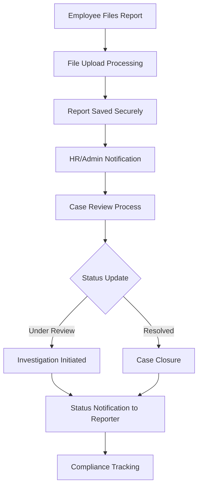
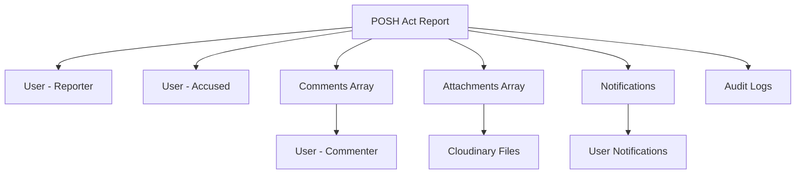

# Posh Management


<!-- # POSH Act Management API Documentation -->

## System Overview

The POSH (Prevention of Sexual Harassment) Act Management API provides a comprehensive, secure, and compliant system for handling workplace harassment reporting and case management. This system ensures confidential reporting, proper case tracking, and regulatory compliance while maintaining the highest standards of data protection and user privacy.

## Base URL
```
/v1/posh
```

## Authentication Requirements

- **All Routes**: JWT authentication required via `verifyJWT` middleware
- **Role-based Access**: Differentiated access for reporters, HR administrators, and compliance officers
- **Confidentiality**: Strict access control ensuring data privacy and confidentiality

## System Architecture Flow



## Complete Workflow Process

### 1. Report Creation Workflow
1. **Employee Submits Report** → Confidential submission with optional file attachments
2. **Secure File Processing** → Documents stored in secure Cloudinary storage
3. **Automatic Notifications** → HR/Admin teams notified of new reports
4. **Case Assignment** → Report assigned for review and investigation
5. **Status Tracking** → Complete audit trail maintained

### 2. Case Management Workflow
1. **Initial Review** → HR team reviews submitted reports
2. **Investigation Phase** → Status updated to "Under Review"
3. **Communication** → Comments system for internal case notes
4. **Resolution** → Case marked as resolved with appropriate actions
5. **Compliance Reporting** → Data available for regulatory compliance

### 3. Access Control Matrix
- **Reporters**: Submit reports, view own reports, receive status updates
- **HR Administrators**: View all reports, update status, manage cases
- **Compliance Officers**: Full system access, audit capabilities

## API Endpoints

### Report Management

#### Create POSH Act Report
**POST** `/`

**Authentication:** Required (JWT)

Creates a new POSH Act report with optional file attachments.

**Request Headers:**
```
Authorization: Bearer {jwt_token}
Content-Type: multipart/form-data
```

**Request Body (multipart/form-data):**
```json
{
  "accusedId": "64f8b2a1c4d5e6f7g8h9i0j1",
  "type": "Verbal Harassment",
  "description": "Description of the incident that occurred during the team meeting on January 15th. The accused made inappropriate comments about my appearance and continued despite my discomfort.",
  "dateOfIncident": "2024-01-15",
  "attachments": ["evidence1.pdf", "screenshot.png"]
}
```

**Field Descriptions:**
- `accusedId`: MongoDB ObjectId of the accused employee
- `type`: Type of harassment (e.g., "Verbal Harassment", "Physical Harassment", "Digital Harassment")
- `description`: Detailed description of the incident
- `dateOfIncident`: Date when the incident occurred (YYYY-MM-DD format)
- `attachments`: Optional file attachments (up to 5 files, 10MB each)

**Success Response (201):**
```json
{
  "_id": "64f8b2a1c4d5e6f7g8h9i0j2",
  "reporter": "64f8b2a1c4d5e6f7g8h9i0j3",
  "accused": {
    "_id": "64f8b2a1c4d5e6f7g8h9i0j1",
    "employee_Id": "EMP002",
    "first_Name": "John",
    "last_Name": "Smith"
  },
  "type": "Verbal Harassment",
  "description": "Description of the incident that occurred during the team meeting on January 15th.",
  "dateOfIncident": "2024-01-15T00:00:00.000Z",
  "status": "Pending",
  "attachments": [
    {
      "name": "evidence1.pdf",
      "url": "https://cloudinary.com/posh_attachments/evidence1.pdf"
    },
    {
      "name": "screenshot.png", 
      "url": "https://cloudinary.com/posh_attachments/screenshot.png"
    }
  ],
  "comments": [],
  "createdAt": "2024-01-16T10:30:00.000Z",
  "updatedAt": "2024-01-16T10:30:00.000Z"
}
```

**Error Responses:**
```json
// Accused employee not found (404)
{
  "msg": "Accused employee not found"
}

// Unsupported file type (400)
{
  "msg": "Unsupported file type!"
}

// Server error (500)
{
  "msg": "Server Error"
}
```

#### Get User's POSH Act Reports
**GET** `/user`

**Authentication:** Required (JWT)

Retrieves all POSH Act reports filed by the authenticated user.

**Success Response (200):**
```json
[
  {
    "_id": "64f8b2a1c4d5e6f7g8h9i0j2",
    "reporter": "64f8b2a1c4d5e6f7g8h9i0j3",
    "accused": {
      "_id": "64f8b2a1c4d5e6f7g8h9i0j1",
      "first_Name": "John",
      "last_Name": "Smith",
      "employee_Id": "EMP002",
      "designation": "Senior Developer",
      "department": "Engineering",
      "personal_Email_Id": "john.smith@company.com",
      "mobile_No": "+1-555-0123",
      "user_Avatar": "https://cloudinary.com/avatars/john_smith.jpg"
    },
    "type": "Verbal Harassment",
    "description": "Description of the incident that occurred during the team meeting.",
    "dateOfIncident": "2024-01-15T00:00:00.000Z",
    "status": "Under Review",
    "attachments": [
      {
        "name": "evidence1.pdf",
        "url": "https://cloudinary.com/posh_attachments/evidence1.pdf"
      }
    ],
    "comments": [
      {
        "_id": "64f8b2a1c4d5e6f7g8h9i0j4",
        "user": {
          "first_Name": "Jane",
          "last_Name": "Doe",
          "user_Avatar": "https://cloudinary.com/avatars/jane_doe.jpg"
        },
        "message": "We have initiated an investigation into this matter.",
        "createdAt": "2024-01-16T14:00:00.000Z"
      }
    ],
    "createdAt": "2024-01-16T10:30:00.000Z",
    "updatedAt": "2024-01-16T14:00:00.000Z"
  }
]
```

#### Get All POSH Act Reports (Admin)
**GET** `/all`

**Authentication:** Required (JWT - Admin/HR role)

Retrieves all POSH Act reports across the organization for administrative purposes.

**Success Response (200):**
```json
[
  {
    "_id": "64f8b2a1c4d5e6f7g8h9i0j2",
    "reporter": {
      "_id": "64f8b2a1c4d5e6f7g8h9i0j3",
      "first_Name": "Alice",
      "last_Name": "Johnson",
      "employee_Id": "EMP001",
      "designation": "Software Engineer",
      "department": "Engineering",
      "personal_Email_Id": "alice.johnson@company.com",
      "mobile_No": "+1-555-0124",
      "user_Avatar": "https://cloudinary.com/avatars/alice_johnson.jpg"
    },
    "accused": {
      "_id": "64f8b2a1c4d5e6f7g8h9i0j1",
      "first_Name": "John",
      "last_Name": "Smith",
      "employee_Id": "EMP002",
      "designation": "Senior Developer",
      "department": "Engineering",
      "personal_Email_Id": "john.smith@company.com",
      "mobile_No": "+1-555-0123",
      "user_Avatar": "https://cloudinary.com/avatars/john_smith.jpg"
    },
    "type": "Verbal Harassment",
    "description": "Detailed description of the incident.",
    "dateOfIncident": "2024-01-15T00:00:00.000Z",
    "status": "Under Review",
    "attachments": [],
    "comments": [],
    "createdAt": "2024-01-16T10:30:00.000Z",
    "updatedAt": "2024-01-16T10:30:00.000Z"
  }
]
```

#### Get POSH Act Report by ID
**GET** `/:id`

**Authentication:** Required (JWT)

Retrieves a specific POSH Act report by ID with full details.

**Request Parameters:**
- `id` (string): POSH Act report ID

**Success Response (200):**
```json
{
  "_id": "64f8b2a1c4d5e6f7g8h9i0j2",
  "reporter": {
    "_id": "64f8b2a1c4d5e6f7g8h9i0j3",
    "first_Name": "Alice",
    "last_Name": "Johnson",
    "employee_Id": "EMP001",
    "designation": "Software Engineer",
    "department": "Engineering",
    "personal_Email_Id": "alice.johnson@company.com",
    "mobile_No": "+1-555-0124",
    "user_Avatar": "https://cloudinary.com/avatars/alice_johnson.jpg"
  },
  "accused": {
    "_id": "64f8b2a1c4d5e6f7g8h9i0j1",
    "first_Name": "John",
    "last_Name": "Smith",
    "employee_Id": "EMP002",
    "designation": "Senior Developer",
    "department": "Engineering",
    "personal_Email_Id": "john.smith@company.com",
    "mobile_No": "+1-555-0123",
    "user_Avatar": "https://cloudinary.com/avatars/john_smith.jpg"
  },
  "type": "Verbal Harassment",
  "description": "Detailed description of the incident that occurred during the team meeting.",
  "dateOfIncident": "2024-01-15T00:00:00.000Z",
  "status": "Under Review",
  "attachments": [
    {
      "name": "evidence1.pdf",
      "url": "https://cloudinary.com/posh_attachments/evidence1.pdf"
    }
  ],
  "comments": [
    {
      "_id": "64f8b2a1c4d5e6f7g8h9i0j4",
      "user": {
        "first_Name": "Jane",
        "last_Name": "Doe",
        "user_Avatar": "https://cloudinary.com/avatars/jane_doe.jpg"
      },
      "message": "We have initiated an investigation into this matter.",
      "createdAt": "2024-01-16T14:00:00.000Z"
    }
  ],
  "createdAt": "2024-01-16T10:30:00.000Z",
  "updatedAt": "2024-01-16T14:00:00.000Z"
}
```

**Error Response:**
```json
// Report not found (404)
{
  "msg": "POSH Act not found"
}
```

### Case Management

#### Update POSH Act Status
**PUT** `/:id/status`

**Authentication:** Required (JWT - Admin/HR role)

Updates the status of a POSH Act report with automatic notification to the reporter.

**Request Parameters:**
- `id` (string): POSH Act report ID

**Request Body:**
```json
{
  "status": "Under Review"
}
```

**Valid Status Values:**
- `"Pending"`: Initial status when report is submitted
- `"Under Review"`: Investigation in progress
- `"Resolved"`: Case has been resolved

**Success Response (200):**
```json
{
  "_id": "64f8b2a1c4d5e6f7g8h9i0j2",
  "reporter": {
    "_id": "64f8b2a1c4d5e6f7g8h9i0j3",
    "first_Name": "Alice",
    "last_Name": "Johnson",
    "employee_Id": "EMP001"
  },
  "accused": {
    "_id": "64f8b2a1c4d5e6f7g8h9i0j1",
    "first_Name": "John",
    "last_Name": "Smith",
    "employee_Id": "EMP002"
  },
  "type": "Verbal Harassment",
  "description": "Detailed description of the incident.",
  "dateOfIncident": "2024-01-15T00:00:00.000Z",
  "status": "Under Review",
  "attachments": [],
  "comments": [],
  "createdAt": "2024-01-16T10:30:00.000Z",
  "updatedAt": "2024-01-16T15:45:00.000Z"
}
```

**Business Rules:**
- Status updates trigger automatic notifications to reporters
- Database transactions ensure data consistency
- Only authorized personnel can update status
- Complete audit trail is maintained

**Error Responses:**
```json
// Invalid status value (400)
{
  "msg": "Invalid status value"
}

// Report not found (404)
{
  "msg": "POSH Act not found"
}
```

#### Update POSH Act Report
**PUT** `/:id`

**Authentication:** Required (JWT - Reporter only can update their own reports)

Updates a POSH Act report with optional additional file attachments.

**Request Parameters:**
- `id` (string): POSH Act report ID

**Request Body (multipart/form-data):**
```json
{
  "accusedId": "64f8b2a1c4d5e6f7g8h9i0j1",
  "type": "Physical Harassment",
  "description": "Updated description with additional details about the incident.",
  "dateOfIncident": "2024-01-15",
  "attachments": ["additional_evidence.pdf"]
}
```

**Success Response (200):**
```json
{
  "_id": "64f8b2a1c4d5e6f7g8h9i0j2",
  "reporter": {
    "_id": "64f8b2a1c4d5e6f7g8h9i0j3",
    "first_Name": "Alice",
    "last_Name": "Johnson",
    "employee_Id": "EMP001"
  },
  "accused": {
    "_id": "64f8b2a1c4d5e6f7g8h9i0j1",
    "first_Name": "John",
    "last_Name": "Smith",
    "employee_Id": "EMP002"
  },
  "type": "Physical Harassment",
  "description": "Updated description with additional details about the incident.",
  "dateOfIncident": "2024-01-15T00:00:00.000Z",
  "status": "Pending",
  "attachments": [
    {
      "name": "evidence1.pdf",
      "url": "https://cloudinary.com/posh_attachments/evidence1.pdf"
    },
    {
      "name": "additional_evidence.pdf",
      "url": "https://cloudinary.com/posh_attachments/additional_evidence.pdf"
    }
  ],
  "updatedAt": "2024-01-16T16:20:00.000Z"
}
```

**Error Responses:**
```json
// Unauthorized access (403)
{
  "msg": "Unauthorized to update this POSH Act"
}

// Report not found (404)
{
  "msg": "POSH Act not found"
}
```

#### Delete POSH Act Report
**DELETE** `/:id`

**Authentication:** Required (JWT - Reporter only can delete their own reports)

Deletes a POSH Act report. Only the reporter can delete their own reports.

**Request Parameters:**
- `id` (string): POSH Act report ID

**Success Response (200):**
```json
{
  "msg": "POSH Act deleted successfully"
}
```

**Error Responses:**
```json
// Unauthorized access (403)
{
  "msg": "Unauthorized to delete this POSH Act"
}

// Report not found (404)
{
  "msg": "POSH Act not found"
}
```

### Comments System

#### Add Comment to POSH Act Report
**POST** `/:id/comments`

**Authentication:** Required (JWT - Admin/HR role)

Adds a comment to a specific POSH Act report for internal case management.

**Request Parameters:**
- `id` (string): POSH Act report ID

**Request Body:**
```json
{
  "message": "We have initiated an investigation into this matter and will provide updates as they become available. Please feel free to contact HR with any additional information."
}
```

**Success Response (200):**
```json
{
  "_id": "64f8b2a1c4d5e6f7g8h9i0j2",
  "reporter": {
    "_id": "64f8b2a1c4d5e6f7g8h9i0j3",
    "first_Name": "Alice",
    "last_Name": "Johnson",
    "employee_Id": "EMP001"
  },
  "accused": {
    "_id": "64f8b2a1c4d5e6f7g8h9i0j1",
    "first_Name": "John",
    "last_Name": "Smith",
    "employee_Id": "EMP002"
  },
  "type": "Verbal Harassment",
  "description": "Description of the incident.",
  "status": "Under Review",
  "comments": [
    {
      "_id": "64f8b2a1c4d5e6f7g8h9i0j5",
      "user": {
        "first_Name": "Jane",
        "last_Name": "Doe",
        "user_Avatar": "https://cloudinary.com/avatars/jane_doe.jpg"
      },
      "message": "We have initiated an investigation into this matter and will provide updates as they become available.",
      "createdAt": "2024-01-16T17:30:00.000Z"
    }
  ],
  "createdAt": "2024-01-16T10:30:00.000Z",
  "updatedAt": "2024-01-16T17:30:00.000Z"
}
```

**Error Response:**
```json
// Report not found (404)
{
  "msg": "POSH Act not found"
}
```

## Frontend Integration Examples

### JavaScript/React Integration

```javascript
// API Configuration
const API_BASE_URL = 'https://your-api-domain.com/v1/posh';

const getAuthHeaders = () => ({
  'Authorization': `Bearer ${localStorage.getItem('authToken')}`,
  'Content-Type': 'application/json'
});

// POSH Act Service Class
class POSHActService {
  
  // Create new POSH Act report with file attachments
  async createReport(reportData, attachments = []) {
    try {
      const formData = new FormData();
      
      // Add form fields
      formData.append('accusedId', reportData.accusedId);
      formData.append('type', reportData.type);
      formData.append('description', reportData.description);
      formData.append('dateOfIncident', reportData.dateOfIncident);
      
      // Add file attachments
      attachments.forEach(file => {
        formData.append('attachments', file);
      });

      const response = await fetch(`${API_BASE_URL}/`, {
        method: 'POST',
        headers: {
          'Authorization': `Bearer ${localStorage.getItem('authToken')}`
        },
        body: formData
      });

      if (!response.ok) {
        const errorData = await response.json();
        throw new Error(errorData.msg || 'Failed to create report');
      }

      return await response.json();
    } catch (error) {
      console.error('Error creating POSH Act report:', error);
      throw error;
    }
  }

  // Get user's own reports
  async getUserReports() {
    try {
      const response = await fetch(`${API_BASE_URL}/user`, {
        method: 'GET',
        headers: getAuthHeaders()
      });

      if (!response.ok) {
        throw new Error('Failed to fetch user reports');
      }

      return await response.json();
    } catch (error) {
      console.error('Error fetching user reports:', error);
      throw error;
    }
  }

  // Get all reports (admin only)
  async getAllReports() {
    try {
      const response = await fetch(`${API_BASE_URL}/all`, {
        method: 'GET',
        headers: getAuthHeaders()
      });

      if (!response.ok) {
        throw new Error('Failed to fetch all reports');
      }

      return await response.json();
    } catch (error) {
      console.error('Error fetching all reports:', error);
      throw error;
    }
  }

  // Update report status (admin only)
  async updateStatus(reportId, status) {
    try {
      const response = await fetch(`${API_BASE_URL}/${reportId}/status`, {
        method: 'PUT',
        headers: getAuthHeaders(),
        body: JSON.stringify({ status })
      });

      if (!response.ok) {
        const errorData = await response.json();
        throw new Error(errorData.msg || 'Failed to update status');
      }

      return await response.json();
    } catch (error) {
      console.error('Error updating status:', error);
      throw error;
    }
  }

  // Add comment to report (admin only)
  async addComment(reportId, message) {
    try {
      const response = await fetch(`${API_BASE_URL}/${reportId}/comments`, {
        method: 'POST',
        headers: getAuthHeaders(),
        body: JSON.stringify({ message })
      });

      if (!response.ok) {
        const errorData = await response.json();
        throw new Error(errorData.msg || 'Failed to add comment');
      }

      return await response.json();
    } catch (error) {
      console.error('Error adding comment:', error);
      throw error;
    }
  }

  // Get report by ID
  async getReportById(reportId) {
    try {
      const response = await fetch(`${API_BASE_URL}/${reportId}`, {
        method: 'GET',
        headers: getAuthHeaders()
      });

      if (!response.ok) {
        const errorData = await response.json();
        throw new Error(errorData.msg || 'Report not found');
      }

      return await response.json();
    } catch (error) {
      console.error('Error fetching report:', error);
      throw error;
    }
  }
}

// React Hook for POSH Act Management
import { useState, useEffect } from 'react';

const usePOSHActs = (userRole = 'employee') => {
  const [reports, setReports] = useState([]);
  const [loading, setLoading] = useState(false);
  const [error, setError] = useState(null);
  
  const poshService = new POSHActService();

  const fetchReports = async () => {
    setLoading(true);
    setError(null);
    
    try {
      let data;
      if (userRole === 'admin' || userRole === 'hr') {
        data = await poshService.getAllReports();
      } else {
        data = await poshService.getUserReports();
      }
      
      setReports(data);
    } catch (err) {
      setError(err.message);
    } finally {
      setLoading(false);
    }
  };

  const createReport = async (reportData, attachments) => {
    setLoading(true);
    try {
      const response = await poshService.createReport(reportData, attachments);
      await fetchReports(); // Refresh list
      return response;
    } catch (err) {
      setError(err.message);
      throw err;
    } finally {
      setLoading(false);
    }
  };

  const updateStatus = async (reportId, status) => {
    try {
      const response = await poshService.updateStatus(reportId, status);
      await fetchReports(); // Refresh list
      return response;
    } catch (err) {
      setError(err.message);
      throw err;
    }
  };

  useEffect(() => {
    fetchReports();
  }, [userRole]);

  return {
    reports,
    loading,
    error,
    fetchReports,
    createReport,
    updateStatus
  };
};

// Secure File Upload Component
const SecureFileUpload = ({ onFilesSelect, maxFiles = 5 }) => {
  const [selectedFiles, setSelectedFiles] = useState([]);
  const [uploadProgress, setUploadProgress] = useState({});

  const allowedTypes = [
    'image/jpeg',
    'image/jpg',
    'image/png',
    'application/pdf',
    'application/msword',
    'application/vnd.openxmlformats-officedocument.wordprocessingml.document',
    'video/mp4',
    'video/quicktime'
  ];

  const handleFileChange = (event) => {
    const files = Array.from(event.target.files);
    
    // Validate file count
    if (files.length > maxFiles) {
      alert(`Maximum ${maxFiles} files allowed`);
      return;
    }

    // Validate each file
    const validFiles = files.filter(file => {
      // Check file type
      if (!allowedTypes.includes(file.type)) {
        alert(`Unsupported file type: ${file.name}`);
        return false;
      }
      
      // Check file size (10MB limit)
      if (file.size > 10 * 1024 * 1024) {
        alert(`File too large: ${file.name}. Maximum size is 10MB`);
        return false;
      }
      
      return true;
    });

    setSelectedFiles(validFiles);
    onFilesSelect(validFiles);
  };

  const removeFile = (index) => {
    const newFiles = selectedFiles.filter((_, i) => i !== index);
    setSelectedFiles(newFiles);
    onFilesSelect(newFiles);
  };

  return (
    
      
      
        📎 Attach Evidence (Optional)
      
      
      {selectedFiles.length > 0 && (
        
          Selected Files:
          {selectedFiles.map((file, index) => (
            
              {file.name} ({(file.size / 1024 / 1024).toFixed(2)} MB)
               removeFile(index)} className="remove-file">
                ❌
              
            
          ))}
        
      )}
      
      
        Accepted formats: Images (JPG, PNG), Documents (PDF, DOC, DOCX), Videos (MP4, MOV)
        Maximum file size: 10MB per file
        Maximum files: {maxFiles}
      
    
  );
};

// POSH Act Report Form Component
const POSHActReportForm = () => {
  const [formData, setFormData] = useState({
    accusedId: '',
    type: '',
    description: '',
    dateOfIncident: ''
  });
  const [attachments, setAttachments] = useState([]);
  const [employees, setEmployees] = useState([]);
  const { createReport, loading } = usePOSHActs();

  // Load employees for accused dropdown
  useEffect(() => {
    const fetchEmployees = async () => {
      try {
        // Assuming there's an endpoint to get all employees
        const response = await fetch('/api/employees', {
          headers: getAuthHeaders()
        });
        const data = await response.json();
        setEmployees(data);
      } catch (error) {
        console.error('Error fetching employees:', error);
      }
    };

    fetchEmployees();
  }, []);

  const handleSubmit = async (e) => {
    e.preventDefault();
    
    // Validation
    if (!formData.accusedId || !formData.type || !formData.description || !formData.dateOfIncident) {
      alert('Please fill in all required fields');
      return;
    }

    try {
      await createReport(formData, attachments);
      alert('Report submitted successfully. You will be notified of any updates.');
      
      // Reset form
      setFormData({
        accusedId: '',
        type: '',
        description: '',
        dateOfIncident: ''
      });
      setAttachments([]);
    } catch (error) {
      alert(`Error: ${error.message}`);
    }
  };

  return (
    
      
        ⚠️ Confidential Report
        This information will be handled with strict confidentiality and used only for investigation purposes.
      

      
        
          Accused Employee *
           setFormData({...formData, accusedId: e.target.value})}
            required
          >
            Select Employee
            {employees.map(emp => (
              
                {emp.first_Name} {emp.last_Name} - {emp.employee_Id}
              
            ))}
          
        

        
          Type of Harassment *
           setFormData({...formData, type: e.target.value})}
            required
          >
            Select Type
            Verbal Harassment
            Physical Harassment
            Digital Harassment
            Sexual Harassment
            Other
          
        

        
          Date of Incident *
           setFormData({...formData, dateOfIncident: e.target.value})}
            max={new Date().toISOString().split('T')[0]}
            required
          />
        

        
          Description *
           setFormData({...formData, description: e.target.value})}
            required
          />
        

        
          Supporting Evidence (Optional)
          
        

        
          {loading ? 'Submitting...' : 'Submit Report'}
        

        
          Privacy Notice: Your report will be handled in accordance with company policy and applicable laws regarding workplace harassment. Only authorized personnel will have access to this information.
        
      
    
  );
};

// Admin Dashboard Component
const AdminDashboard = () => {
  const { reports, loading, updateStatus } = usePOSHActs('admin');
  const [selectedReport, setSelectedReport] = useState(null);

  const handleStatusChange = async (reportId, newStatus) => {
    try {
      await updateStatus(reportId, newStatus);
      alert('Status updated successfully');
    } catch (error) {
      alert(`Error: ${error.message}`);
    }
  };

  const getStatusColor = (status) => {
    switch (status) {
      case 'Pending': return '#ffa500';
      case 'Under Review': return '#007bff';
      case 'Resolved': return '#28a745';
      default: return '#6c757d';
    }
  };

  if (loading) return Loading reports...;

  return (
    
      POSH Act Reports Management
      
      
        
          Total Reports
          {reports.length}
        
        
          Pending
          {reports.filter(r => r.status === 'Pending').length}
        
        
          Under Review
          {reports.filter(r => r.status === 'Under Review').length}
        
        
          Resolved
          {reports.filter(r => r.status === 'Resolved').length}
        
      

      
        
          
            
              Report ID
              Reporter
              Accused
              Type
              Date Filed
              Status
              Actions
            
          
          
            {reports.map(report => (
              
                {report._id.slice(-6)}
                {report.reporter.first_Name} {report.reporter.last_Name}
                {report.accused.first_Name} {report.accused.last_Name}
                {report.type}
                {new Date(report.createdAt).toLocaleDateString()}
                
                  
                    {report.status}
                  
                
                
                   handleStatusChange(report._id, e.target.value)}
                  >
                    Pending
                    Under Review
                    Resolved
                  
                
              
            ))}
          
        
      
    
  );
};
```

## Security Features

### Data Protection & Privacy
- **End-to-End Encryption**: All sensitive data encrypted in transit and at rest
- **Access Control**: Strict role-based access with audit logging
- **Data Anonymization**: Option to anonymize data for reporting while maintaining case integrity
- **Secure File Storage**: Files stored in secure Cloudinary storage with access controls

### Authentication & Authorization
- **JWT Token Validation**: All routes protected with token verification
- **Role-based Permissions**: Differentiated access for reporters, HR, and admins
- **Ownership Validation**: Users can only access/modify their own reports
- **Admin Controls**: Special permissions for HR and compliance teams

### Compliance Features
- **Audit Trail**: Complete tracking of all actions and status changes
- **Data Retention**: Configurable data retention policies for compliance
- **Anonymous Reporting**: Option for anonymous submissions (if required)
- **Export Capabilities**: Secure data export for compliance reporting

### File Upload Security
- **File Type Validation**: Restricted to safe file types only
- **File Size Limits**: Maximum 10MB per file to prevent abuse
- **Virus Scanning**: Integration with security scanning services
- **Secure URLs**: Time-limited access URLs for sensitive attachments

## Error Handling

### Common Error Responses

#### Authentication Errors (401)
```json
{
  "success": false,
  "message": "Unauthorized request. Token not provided."
}
```

#### Authorization Errors (403)
```json
{
  "msg": "Unauthorized to update this POSH Act"
}
```

#### Validation Errors (400)
```json
{
  "msg": "Invalid status value"
}
```

#### Resource Not Found (404)
```json
{
  "msg": "POSH Act not found"
}
```

#### File Upload Errors
```json
{
  "msg": "Unsupported file type!"
}
```

### Error Handling Implementation

```javascript
// Comprehensive error handling for sensitive operations
const handlePOSHError = (error, context) => {
  console.error(`POSH System Error in ${context}:`, {
    message: error.message,
    timestamp: new Date().toISOString(),
    // Avoid logging sensitive data
  });

  // User-friendly error messages
  if (error.status === 401) {
    return 'Session expired. Please login again to continue.';
  }
  
  if (error.status === 403) {
    return 'You do not have permission to perform this action.';
  }
  
  if (error.status === 404) {
    return 'The requested report could not be found.';
  }
  
  if (error.message?.includes('file')) {
    return 'File upload failed. Please check file size and format.';
  }
  
  return 'An error occurred while processing your request. Please try again or contact support.';
};

// Usage in components
try {
  await poshService.createReport(reportData, attachments);
} catch (error) {
  const userMessage = handlePOSHError(error, 'Create Report');
  setError(userMessage);
}
```

## Testing Guide

### cURL Commands

**Note:** Due to the sensitive nature of POSH Act data, testing should be conducted in secure, isolated environments with appropriate data protection measures.

#### Create POSH Act Report
```bash
# Create report with file attachment (use test data only)
curl -X POST "http://localhost:3000/v1/posh" \
  -H "Authorization: Bearer YOUR_JWT_TOKEN" \
  -F "accusedId=64f8b2a1c4d5e6f7g8h9i0j1" \
  -F "type=Test Harassment Type" \
  -F "description=Test incident description for testing purposes only" \
  -F "dateOfIncident=2024-01-15" \
  -F "attachments=@test-evidence.pdf"
```

#### Get User Reports
```bash
# Get reports for current user
curl -X GET "http://localhost:3000/v1/posh/user" \
  -H "Authorization: Bearer YOUR_JWT_TOKEN"
```

#### Update Report Status (Admin)
```bash
# Update status to Under Review
curl -X PUT "http://localhost:3000/v1/posh/REPORT_ID/status" \
  -H "Authorization: Bearer ADMIN_JWT_TOKEN" \
  -H "Content-Type: application/json" \
  -d '{"status": "Under Review"}'
```

#### Add Comment (Admin)
```bash
# Add case management comment
curl -X POST "http://localhost:3000/v1/posh/REPORT_ID/comments" \
  -H "Authorization: Bearer ADMIN_JWT_TOKEN" \
  -H "Content-Type: application/json" \
  -d '{"message": "Investigation initiated. Will provide updates within 48 hours."}'
```

### Testing Best Practices

```javascript
// Jest Test Examples with Data Protection
describe('POSH Act API Tests', () => {
  let authToken;
  let testUserId;
  let createdReportId;
  
  beforeAll(async () => {
    // Use test environment only
    expect(process.env.NODE_ENV).toBe('test');
    
    // Setup test user with proper permissions
    const loginResponse = await request(app)
      .post('/auth/login')
      .send({ 
        username: 'testuser', 
        password: 'testpass' 
      });
    
    authToken = loginResponse.body.accessToken;
    testUserId = loginResponse.body.user._id;
  });

  afterAll(async () => {
    // Clean up test data
    if (createdReportId) {
      await request(app)
        .delete(`/v1/posh/${createdReportId}`)
        .set('Authorization', `Bearer ${authToken}`);
    }
  });

  test('Should create POSH Act report with proper validation', async () => {
    const testReport = {
      accusedId: testUserId, // Use test user ID
      type: 'Test Harassment',
      description: 'Test description for automated testing',
      dateOfIncident: '2024-01-15'
    };

    const response = await request(app)
      .post('/v1/posh')
      .set('Authorization', `Bearer ${authToken}`)
      .field('accusedId', testReport.accusedId)
      .field('type', testReport.type)
      .field('description', testReport.description)
      .field('dateOfIncident', testReport.dateOfIncident)
      .attach('attachments', 'tests/fixtures/test-document.pdf');

    expect(response.status).toBe(201);
    expect(response.body.type).toBe(testReport.type);
    expect(response.body.description).toBe(testReport.description);
    
    createdReportId = response.body._id;
  });

  test('Should reject invalid file types', async () => {
    const response = await request(app)
      .post('/v1/posh')
      .set('Authorization', `Bearer ${authToken}`)
      .field('accusedId', testUserId)
      .field('type', 'Test Harassment')
      .field('description', 'Test description')
      .field('dateOfIncident', '2024-01-15')
      .attach('attachments', 'tests/fixtures/malicious.exe');

    expect(response.status).toBe(400);
    expect(response.body.msg).toContain('Unsupported file type');
  });

  test('Should update report status with proper authorization', async () => {
    // Login as admin user
    const adminLogin = await request(app)
      .post('/auth/admin-login')
      .send({ username: 'testadmin', password: 'testadminpass' });
    
    const adminToken = adminLogin.body.accessToken;

    const response = await request(app)
      .put(`/v1/posh/${createdReportId}/status`)
      .set('Authorization', `Bearer ${adminToken}`)
      .send({ status: 'Under Review' });

    expect(response.status).toBe(200);
    expect(response.body.status).toBe('Under Review');
  });
});
```

## Database Schema

### POSH Act Model Structure

```javascript
// POSH Act Schema Structure
{
  _id: ObjectId,
  
  // Core Report Information
  reporter: ObjectId,              // Reference to User who filed the report
  accused: ObjectId,               // Reference to User who is accused
  type: String,                    // Type of harassment
  description: String,             // Detailed incident description
  dateOfIncident: Date,            // When the incident occurred
  
  // Case Management
  status: String,                  // "Pending", "Under Review", "Resolved"
  
  // File Attachments
  attachments: [
    {
      name: String,                // Original filename
      url: String,                 // Secure Cloudinary URL
      uploadedAt: Date             // When file was uploaded
    }
  ],
  
  // Comments for Case Management
  comments: [
    {
      _id: ObjectId,
      user: ObjectId,              // Reference to User who added comment
      message: String,             // Comment text
      createdAt: Date              // When comment was added
    }
  ],
  
  // Audit Fields
  createdAt: Date,                 // Report creation timestamp
  updatedAt: Date,                 // Last modification timestamp
  
  // Optional Fields for Advanced Features
  priority: String,                // "Low", "Medium", "High", "Critical"
  assignedInvestigator: ObjectId,  // Reference to assigned investigator
  expectedResolutionDate: Date,    // Target resolution date
  actualResolutionDate: Date,      // When case was actually resolved
  resolutionNotes: String,         // Final resolution details
  
  // Compliance Fields
  caseNumber: String,              // Unique case identifier
  isAnonymous: Boolean,            // Whether report was filed anonymously
  notificationsSent: [Date],       // Timestamps of notifications sent
  complianceFlags: [String]        // Any compliance-related markers
}
```

### Related Models Integration



### Notification Integration Schema

```javascript
// Notification Schema for POSH Act Updates
{
  title: String,                   // "Your POSH Act Status Updated"
  message: String,                 // Detailed notification message
  type: String,                    // "posh_act_update"
  targetUsers: [ObjectId],         // Users to notify (typically reporter)
  relatedReport: ObjectId,         // Reference to POSH Act report
  isRead: Boolean,                 // Read status
  priority: String,                // Notification priority level
  createdAt: Date,                 // Notification creation time
  expiresAt: Date                  // Optional expiration for notifications
}
```

## Troubleshooting Guide

### Common Issues & Solutions

#### 1. File Upload Problems

**Problem**: "Unsupported file type!" error
- **Cause**: Attempting to upload restricted file types
- **Solution**: Ensure files are in approved formats

```javascript
// Check allowed file types
const allowedTypes = [
  'image/jpeg', 'image/jpg', 'image/png',  // Images
  'application/pdf',                        // PDF documents
  'application/msword',                     // MS Word
  'application/vnd.openxmlformats-officedocument.wordprocessingml.document', // DOCX
  'video/mp4', 'video/quicktime'           // Videos
];

const validateFileType = (file) => {
  return allowedTypes.includes(file.mimetype);
};
```

**Problem**: File upload timeout or failure
- **Cause**: Large files or network issues
- **Solution**: Implement file compression and retry logic

```javascript
// File compression before upload
const compressFile = async (file) => {
  if (file.size > 5 * 1024 * 1024) { // 5MB threshold
    // Implement compression logic
    console.log('Compressing large file:', file.name);
  }
  return file;
};
```

#### 2. Access Control Issues

**Problem**: "Unauthorized to update this POSH Act"
- **Cause**: User trying to access/modify reports they don't own
- **Solution**: Verify ownership and permissions

```javascript
// Ownership verification
const verifyReportOwnership = async (reportId, userId) => {
  const report = await PoshAct.findById(reportId);
  if (!report) {
    throw new Error('Report not found');
  }
  
  if (report.reporter.toString() !== userId.toString()) {
    throw new Error('Unauthorized access');
  }
  
  return report;
};
```

#### 3. Notification Delivery Issues

**Problem**: Status update notifications not being delivered
- **Cause**: Database transaction failures or notification service issues
- **Solution**: Implement robust notification handling

```javascript
// Reliable notification delivery
const sendStatusNotification = async (report, newStatus, session) => {
  try {
    const reporter = await User.findById(report.reporter._id).session(session);
    
    if (reporter) {
      const notification = await createStatusNotification(report, newStatus, session);
      
      // Add to user's notification array
      reporter.notifications.push({
        notification: notification._id,
        isRead: false,
        receivedAt: new Date()
      });
      
      await reporter.save({ session });
      
      // Optional: Send external notification (email, SMS, push)
      await sendExternalNotification(reporter, notification);
    }
  } catch (error) {
    console.error('Notification delivery failed:', error);
    // Log for manual follow-up but don't fail the transaction
  }
};
```

#### 4. Database Performance Issues

**Problem**: Slow query performance for large datasets
- **Solution**: Implement proper indexing and pagination

```javascript
// Add database indexes for better performance
db.poshacts.createIndex({ "reporter": 1, "createdAt": -1 });
db.poshacts.createIndex({ "accused": 1, "status": 1 });
db.poshacts.createIndex({ "status": 1, "createdAt": -1 });
db.poshacts.createIndex({ "dateOfIncident": 1 });

// Implement pagination for large datasets
const getPaginatedReports = async (page = 1, limit = 20, filters = {}) => {
  const skip = (page - 1) * limit;
  
  const query = PoshAct.find(filters)
    .populate('reporter', 'first_Name last_Name employee_Id')
    .populate('accused', 'first_Name last_Name employee_Id')
    .sort({ createdAt: -1 })
    .skip(skip)
    .limit(limit);
  
  const [reports, total] = await Promise.all([
    query.exec(),
    PoshAct.countDocuments(filters)
  ]);
  
  return {
    reports,
    total,
    page,
    totalPages: Math.ceil(total / limit)
  };
};
```

#### 5. Data Privacy Compliance

**Problem**: Ensuring data privacy and compliance requirements
- **Solution**: Implement comprehensive data protection measures

```javascript
// Data anonymization for reporting
const anonymizeReportData = (report) => {
  return {
    _id: report._id,
    type: report.type,
    status: report.status,
    dateOfIncident: report.dateOfIncident,
    createdAt: report.createdAt,
    // Remove identifying information
    reporter: {
      department: report.reporter.department,
      designation: report.reporter.designation
    },
    accused: {
      department: report.accused.department,
      designation: report.accused.designation
    }
  };
};

// Data retention policy implementation
const applyDataRetentionPolicy = async () => {
  const retentionPeriod = 7 * 365 * 24 * 60 * 60 * 1000; // 7 years in milliseconds
  const cutoffDate = new Date(Date.now() - retentionPeriod);
  
  // Archive or delete old reports based on policy
  const oldReports = await PoshAct.find({
    createdAt: { $lt: cutoffDate },
    status: 'Resolved'
  });
  
  // Implement archival process
  for (const report of oldReports) {
    await archiveReport(report);
  }
};
```

### System Health Monitoring

```javascript
// Health check implementation
const checkSystemHealth = async () => {
  const healthStatus = {
    database: 'unknown',
    fileStorage: 'unknown',
    notifications: 'unknown',
    timestamp: new Date().toISOString()
  };
  
  try {
    // Check database connectivity
    await PoshAct.findOne().limit(1);
    healthStatus.database = 'healthy';
  } catch (error) {
    healthStatus.database = 'error';
    console.error('Database health check failed:', error);
  }
  
  try {
    // Check file storage connectivity
    await testCloudinaryConnection();
    healthStatus.fileStorage = 'healthy';
  } catch (error) {
    healthStatus.fileStorage = 'error';
    console.error('File storage health check failed:', error);
  }
  
  return healthStatus;
};

// Add health check endpoint
router.get('/health', async (req, res) => {
  const health = await checkSystemHealth();
  const statusCode = Object.values(health).includes('error') ? 500 : 200;
  
  res.status(statusCode).json({
    success: statusCode === 200,
    health
  });
});
```

## Best Practices for Implementation

### 1. Security First Approach
```javascript
// Always validate and sanitize inputs
const sanitizeReportInput = (data) => {
  return {
    accusedId: mongoose.Types.ObjectId(data.accusedId),
    type: data.type?.trim().substring(0, 100), // Limit length
    description: data.description?.trim().substring(0, 2000),
    dateOfIncident: new Date(data.dateOfIncident)
  };
};

// Implement rate limiting for sensitive operations
const reportCreationLimiter = rateLimit({
  windowMs: 24 * 60 * 60 * 1000, // 24 hours
  max: 5, // Limit each user to 5 reports per day
  message: 'Too many reports created today. Please contact HR directly if this is urgent.'
});
```

### 2. Comprehensive Audit Logging
```javascript
// Log all sensitive operations
const auditLog = async (action, userId, reportId, details = {}) => {
  await AuditLog.create({
    action,
    userId,
    reportId,
    details,
    timestamp: new Date(),
    ipAddress: req.ip,
    userAgent: req.get('User-Agent')
  });
};

// Usage in controllers
export const updatePoshActStatus = async (req, res) => {
  const { status } = req.body;
  const { id } = req.params;
  
  // ... existing code ...
  
  // Log the status change
  await auditLog('status_update', req.user._id, id, {
    oldStatus: poshAct.status,
    newStatus: status
  });
  
  // ... rest of the implementation ...
};
```

### 3. Data Encryption
```javascript
// Encrypt sensitive data before storage
const encryptSensitiveData = (data) => {
  // Use AES encryption for sensitive fields
  const encrypted = {
    ...data,
    description: encrypt(data.description),
    // Encrypt other sensitive fields as needed
  };
  return encrypted;
};

// Decrypt when retrieving data
const decryptSensitiveData = (data) => {
  return {
    ...data,
    description: decrypt(data.description)
  };
};
```

### 4. Automated Compliance Reporting
```javascript
// Generate compliance reports
const generateComplianceReport = async (startDate, endDate) => {
  const reports = await PoshAct.find({
    createdAt: { $gte: startDate, $lte: endDate }
  }).populate('reporter accused', 'department designation');
  
  return {
    totalReports: reports.length,
    statusBreakdown: reports.reduce((acc, report) => {
      acc[report.status] = (acc[report.status] || 0) + 1;
      return acc;
    }, {}),
    typeBreakdown: reports.reduce((acc, report) => {
      acc[report.type] = (acc[report.type] || 0) + 1;
      return acc;
    }, {}),
    departmentBreakdown: reports.reduce((acc, report) => {
      const dept = report.accused.department;
      acc[dept] = (acc[dept] || 0) + 1;
      return acc;
    }, {}),
    anonymizedCases: reports.map(anonymizeReportData)
  };
};
```

This comprehensive API documentation provides all necessary information for implementing and maintaining a secure, compliant POSH Act management system while protecting sensitive data and ensuring regulatory compliance.