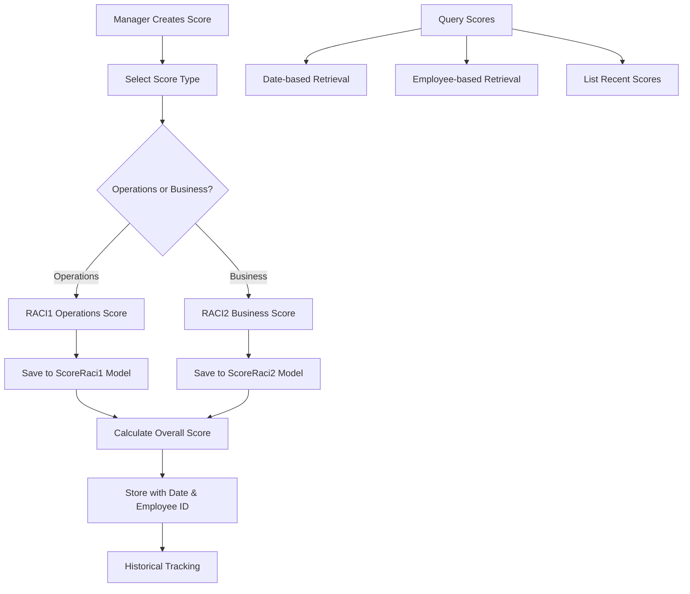
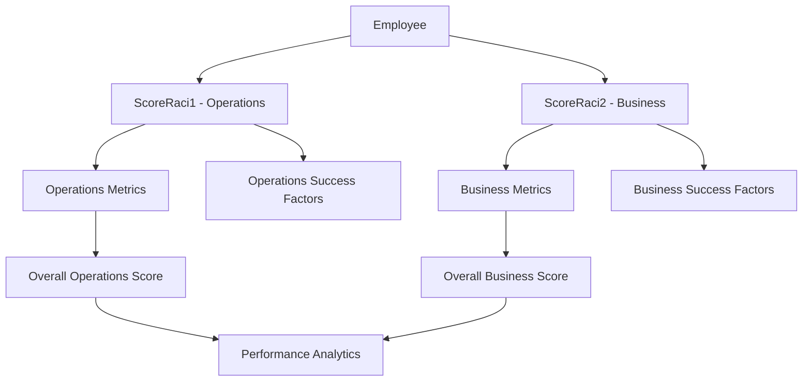

# RACI Performance Management


# RACI Performance Scoring API Documentation

## System Overview

The RACI Performance Scoring API provides a comprehensive system for tracking and managing employee performance scores across two key dimensions: **Operations (RACI1)** and **Business (RACI2)**. The system enables managers to score employees on various metrics, track key success factors, and maintain historical performance data with date-based organization. This dual-scoring approach allows organizations to evaluate both operational efficiency and business impact separately while maintaining a unified performance management framework.

## Base URL
```
/v1/raci
```

## Authentication Requirements

- **All Routes**: JWT authentication required via `verifyJWT` middleware
- **Role-based Access**: Typically restricted to managers, team leads, and HR administrators
- **Employee-specific Data**: Users can access scores for employees under their management hierarchy

## System Architecture Flow



## Complete Workflow Process

### 1. Operations Performance Scoring (RACI1)
1. **Manager Assessment** → Evaluates employee on operational metrics
2. **Metrics Input** → Records individual metric scores and achievements
3. **Key Success Factors** → Documents critical success indicators
4. **Overall Score Calculation** → Computes weighted overall performance score
5. **Date Association** → Links score to specific evaluation date

### 2. Business Performance Scoring (RACI2)
1. **Business Impact Assessment** → Evaluates employee's business contribution
2. **Strategic Metrics** → Captures business-focused performance indicators
3. **Success Factor Documentation** → Records business-critical achievements
4. **Integrated Scoring** → Calculates business performance rating
5. **Historical Tracking** → Maintains timeline of business performance

### 3. Data Retrieval & Analytics
1. **Date-based Queries** → Retrieve scores for specific evaluation periods
2. **Employee Tracking** → Access complete performance history per employee
3. **Recent Performance** → List most recent scores across teams
4. **Comparative Analysis** → Compare operations vs business performance

## API Endpoints

### Operations Scoring (RACI1)

#### Create Operations Score
**POST** `/operations/score`

Creates a new operations performance score for an employee.

**Authentication:** Required (JWT)

**Request Body:**
```json
{
  "employee_Id": "EMP001",
  "metrics": [
    {
      "name": "Task Completion Rate",
      "score": 85,
      "target": 90,
      "weight": 0.3
    },
    {
      "name": "Quality Standards",
      "score": 92,
      "target": 85,
      "weight": 0.25
    },
    {
      "name": "Process Efficiency",
      "score": 78,
      "target": 80,
      "weight": 0.25
    },
    {
      "name": "Team Collaboration",
      "score": 88,
      "target": 85,
      "weight": 0.2
    }
  ],
  "overallScore": 85.5,
  "date": "2024-01-25"
}
```

**Field Descriptions:**
- `employee_Id`: Employee identifier (required)
- `metrics`: Array of performance metrics with scores, targets, and weights
- `overallScore`: Calculated overall performance score (required)
- `date`: Evaluation date in YYYY-MM-DD format (required)

**Success Response (201):**
```json
{
  "success": true,
  "message": "Operations score saved successfully (RACI1).",
  "data": {
    "_id": "64f8b2a1c4d5e6f7g8h9i0j1",
    "employee_Id": "EMP001",
    "metrics": [
      {
        "name": "Task Completion Rate",
        "score": 85,
        "target": 90,
        "weight": 0.3
      }
    ],
    "overallScore": 85.5,
    "date": "2024-01-25",
    "createdAt": "2024-01-25T10:30:00.000Z",
    "updatedAt": "2024-01-25T10:30:00.000Z"
  }
}
```

**Error Responses:**
```json
// Missing required fields (400)
{
  "success": false,
  "message": "Missing required fields."
}

// Server error (500)
{
  "success": false,
  "message": "Internal Server Error",
  "error": "Detailed error message"
}
```

#### Get Operations Score by Date
**GET** `/operations/score`

Retrieves operations score for a specific date.

**Authentication:** Required (JWT)

**Query Parameters:**
- `date` (string, required): Date in YYYY-MM-DD format

**Example Request:**
```
GET /v1/raci/operations/score?date=2024-01-25
```

**Success Response (200):**
```json
{
  "success": true,
  "data": {
    "_id": "64f8b2a1c4d5e6f7g8h9i0j1",
    "employee_Id": "EMP001",
    "metrics": [...],
    "overallScore": 85.5,
    "date": "2024-01-25",
    "createdAt": "2024-01-25T10:30:00.000Z"
  }
}
```

**Error Responses:**
```json
// Missing date parameter (400)
{
  "success": false,
  "message": "date query param required."
}

// No score found (404)
{
  "success": false,
  "message": "No RACI1 Operations for date 2024-01-25"
}
```

#### List Operations Scores
**GET** `/operations/scores`

Retrieves a list of recent operations scores, sorted by date (newest first).

**Authentication:** Required (JWT)

**Query Parameters:**
- `limit` (number, optional): Number of records to return (default: 5)

**Example Request:**
```
GET /v1/raci/operations/scores?limit=10
```

**Success Response (200):**
```json
{
  "success": true,
  "data": [
    {
      "_id": "64f8b2a1c4d5e6f7g8h9i0j3",
      "employee_Id": "EMP003",
      "metrics": [...],
      "overallScore": 92.0,
      "date": "2024-01-27",
      "createdAt": "2024-01-27T14:15:00.000Z"
    },
    {
      "_id": "64f8b2a1c4d5e6f7g8h9i0j2",
      "employee_Id": "EMP002",
      "metrics": [...],
      "overallScore": 88.5,
      "date": "2024-01-26",
      "createdAt": "2024-01-26T11:45:00.000Z"
    },
    {
      "_id": "64f8b2a1c4d5e6f7g8h9i0j1",
      "employee_Id": "EMP001",
      "metrics": [...],
      "overallScore": 85.5,
      "date": "2024-01-25",
      "createdAt": "2024-01-25T10:30:00.000Z"
    }
  ]
}
```

#### Save Operations Scores (Enhanced)
**POST** `/operations/saveScores`

Enhanced operations score creation with key success factors.

**Authentication:** Required (JWT)

**Request Body:**
```json
{
  "employee_Id": "EMP001",
  "metrics": [
    {
      "name": "Task Completion Rate",
      "score": 85,
      "target": 90,
      "weight": 0.3,
      "notes": "Improved from last quarter"
    }
  ],
  "keySuccessFactors": [
    {
      "factor": "Process Improvement",
      "achievement": "Implemented new workflow that reduced processing time by 15%",
      "impact": "High"
    },
    {
      "factor": "Team Leadership",
      "achievement": "Mentored 3 junior team members",
      "impact": "Medium"
    }
  ],
  "overallScore": 85.5,
  "date": "2024-01-25"
}
```

**Success Response (201):**
```json
{
  "success": true,
  "message": "Scores saved successfully.",
  "data": {
    "_id": "64f8b2a1c4d5e6f7g8h9i0j1",
    "employee_Id": "EMP001",
    "metrics": [...],
    "keySuccessFactors": [...],
    "overallScore": 85.5,
    "date": "2024-01-25",
    "createdAt": "2024-01-25T10:30:00.000Z"
  }
}
```

#### Get Operations Scores by Employee
**POST** `/operations/getScores`

Retrieves all operations scores for a specific employee, sorted by date (newest first).

**Authentication:** Required (JWT)

**Request Body:**
```json
{
  "employee_Id": "EMP001"
}
```

**Success Response (200):**
```json
{
  "success": true,
  "message": "Scores retrieved successfully.",
  "data": [
    {
      "_id": "64f8b2a1c4d5e6f7g8h9i0j2",
      "employee_Id": "EMP001",
      "metrics": [...],
      "keySuccessFactors": [...],
      "overallScore": 88.0,
      "date": "2024-02-01",
      "createdAt": "2024-02-01T09:00:00.000Z"
    },
    {
      "_id": "64f8b2a1c4d5e6f7g8h9i0j1",
      "employee_Id": "EMP001",
      "metrics": [...],
      "keySuccessFactors": [...],
      "overallScore": 85.5,
      "date": "2024-01-25",
      "createdAt": "2024-01-25T10:30:00.000Z"
    }
  ]
}
```

**Error Responses:**
```json
// No scores found (404)
{
  "success": false,
  "message": "No scores found."
}
```

### Business Scoring (RACI2)

#### Create Business Score
**POST** `/business/score`

Creates a new business performance score for an employee.

**Authentication:** Required (JWT)

**Request Body:**
```json
{
  "employee_Id": "EMP001",
  "metrics": [
    {
      "name": "Revenue Impact",
      "score": 90,
      "target": 85,
      "weight": 0.4
    },
    {
      "name": "Client Satisfaction",
      "score": 88,
      "target": 90,
      "weight": 0.3
    },
    {
      "name": "Strategic Initiatives",
      "score": 85,
      "target": 80,
      "weight": 0.3
    }
  ],
  "overallScore": 88.1,
  "date": "2024-01-25"
}
```

**Success Response (201):**
```json
{
  "success": true,
  "message": "Business score saved successfully (RACI2).",
  "data": {
    "_id": "64f8b2a1c4d5e6f7g8h9i0j4",
    "employee_Id": "EMP001",
    "metrics": [
      {
        "name": "Revenue Impact",
        "score": 90,
        "target": 85,
        "weight": 0.4
      },
      {
        "name": "Client Satisfaction",
        "score": 88,
        "target": 90,
        "weight": 0.3
      },
      {
        "name": "Strategic Initiatives",
        "score": 85,
        "target": 80,
        "weight": 0.3
      }
    ],
    "overallScore": 88.1,
    "date": "2024-01-25",
    "createdAt": "2024-01-25T10:30:00.000Z",
    "updatedAt": "2024-01-25T10:30:00.000Z"
  }
}
```

#### Get Business Score by Date
**GET** `/business/score`

Retrieves business score for a specific date.

**Authentication:** Required (JWT)

**Query Parameters:**
- `date` (string, required): Date in YYYY-MM-DD format

**Example Request:**
```
GET /v1/raci/business/score?date=2024-01-25
```

**Success Response (200):**
```json
{
  "success": true,
  "data": {
    "_id": "64f8b2a1c4d5e6f7g8h9i0j4",
    "employee_Id": "EMP001",
    "metrics": [...],
    "overallScore": 88.1,
    "date": "2024-01-25",
    "createdAt": "2024-01-25T10:30:00.000Z"
  }
}
```

**Error Responses:**
```json
// Missing date parameter (400)
{
  "success": false,
  "message": "date query param required."
}

// No score found (404)
{
  "success": false,
  "message": "No RACI2 Business for date 2024-01-25"
}
```

#### List Business Scores
**GET** `/business/scores`

Retrieves a list of recent business scores, sorted by date (newest first).

**Authentication:** Required (JWT)

**Query Parameters:**
- `limit` (number, optional): Number of records to return (default: 5)

**Success Response (200):**
```json
{
  "success": true,
  "data": [
    {
      "_id": "64f8b2a1c4d5e6f7g8h9i0j6",
      "employee_Id": "EMP003",
      "metrics": [...],
      "overallScore": 91.5,
      "date": "2024-01-27",
      "createdAt": "2024-01-27T14:15:00.000Z"
    },
    {
      "_id": "64f8b2a1c4d5e6f7g8h9i0j5",
      "employee_Id": "EMP002",
      "metrics": [...],
      "overallScore": 87.2,
      "date": "2024-01-26",
      "createdAt": "2024-01-26T11:45:00.000Z"
    }
  ]
}
```

#### Save Business Scores (Enhanced)
**POST** `/business/saveScores`

Enhanced business score creation with key success factors.

**Authentication:** Required (JWT)

**Request Body:**
```json
{
  "employee_Id": "EMP001",
  "metrics": [
    {
      "name": "Revenue Impact",
      "score": 90,
      "target": 85,
      "weight": 0.4,
      "notes": "Exceeded quarterly revenue target by 15%"
    },
    {
      "name": "Client Satisfaction",
      "score": 88,
      "target": 90,
      "weight": 0.3,
      "notes": "Strong client feedback, minor improvement areas identified"
    }
  ],
  "keySuccessFactors": [
    {
      "factor": "New Business Development",
      "achievement": "Secured 3 major client contracts worth $2M total",
      "impact": "High"
    },
    {
      "factor": "Market Expansion",
      "achievement": "Successfully launched product in 2 new markets",
      "impact": "High"
    }
  ],
  "overallScore": 88.1,
  "date": "2024-01-25"
}
```

**Success Response (201):**
```json
{
  "success": true,
  "message": "Scores saved successfully for RACI2.",
  "data": {
    "_id": "64f8b2a1c4d5e6f7g8h9i0j4",
    "employee_Id": "EMP001",
    "metrics": [...],
    "keySuccessFactors": [...],
    "overallScore": 88.1,
    "date": "2024-01-25",
    "createdAt": "2024-01-25T10:30:00.000Z"
  }
}
```

#### Get Business Scores by Employee
**POST** `/business/getScores`

Retrieves all business scores for a specific employee, sorted by date (newest first).

**Authentication:** Required (JWT)

**Request Body:**
```json
{
  "employee_Id": "EMP001"
}
```

**Success Response (200):**
```json
{
  "success": true,
  "message": "Scores retrieved successfully for RACI2.",
  "data": [
    {
      "_id": "64f8b2a1c4d5e6f7g8h9i0j5",
      "employee_Id": "EMP001",
      "metrics": [...],
      "keySuccessFactors": [...],
      "overallScore": 90.2,
      "date": "2024-02-01",
      "createdAt": "2024-02-01T09:00:00.000Z"
    },
    {
      "_id": "64f8b2a1c4d5e6f7g8h9i0j4",
      "employee_Id": "EMP001",
      "metrics": [...],
      "keySuccessFactors": [...],
      "overallScore": 88.1,
      "date": "2024-01-25",
      "createdAt": "2024-01-25T10:30:00.000Z"
    }
  ]
}
```

**Error Responses:**
```json
// No scores found (404)
{
  "success": false,
  "message": "No scores found for RACI2."
}
```

## Frontend Integration Examples

### JavaScript/React Integration

```javascript
// API Configuration
const API_BASE_URL = 'https://your-api-domain.com/v1/raci';

const getAuthHeaders = () => ({
  'Authorization': `Bearer ${localStorage.getItem('authToken')}`,
  'Content-Type': 'application/json'
});

// RACI Service Class
class RACIService {
  
  // Operations Scoring (RACI1)
  async createOperationsScore(scoreData) {
    try {
      const response = await fetch(`${API_BASE_URL}/operations/score`, {
        method: 'POST',
        headers: getAuthHeaders(),
        body: JSON.stringify(scoreData)
      });

      if (!response.ok) {
        const errorData = await response.json();
        throw new Error(errorData.message || 'Failed to create operations score');
      }

      return await response.json();
    } catch (error) {
      console.error('Error creating operations score:', error);
      throw error;
    }
  }

  async getOperationsScoreByDate(date) {
    try {
      const response = await fetch(`${API_BASE_URL}/operations/score?date=${date}`, {
        method: 'GET',
        headers: getAuthHeaders()
      });

      return await response.json();
    } catch (error) {
      console.error('Error fetching operations score by date:', error);
      throw error;
    }
  }

  async listOperationsScores(limit = 5) {
    try {
      const response = await fetch(`${API_BASE_URL}/operations/scores?limit=${limit}`, {
        method: 'GET',
        headers: getAuthHeaders()
      });

      return await response.json();
    } catch (error) {
      console.error('Error listing operations scores:', error);
      throw error;
    }
  }

  async saveOperationsScores(scoreData) {
    try {
      const response = await fetch(`${API_BASE_URL}/operations/saveScores`, {
        method: 'POST',
        headers: getAuthHeaders(),
        body: JSON.stringify(scoreData)
      });

      return await response.json();
    } catch (error) {
      console.error('Error saving operations scores:', error);
      throw error;
    }
  }

  async getOperationsScoresByEmployee(employeeId) {
    try {
      const response = await fetch(`${API_BASE_URL}/operations/getScores`, {
        method: 'POST',
        headers: getAuthHeaders(),
        body: JSON.stringify({ employee_Id: employeeId })
      });

      return await response.json();
    } catch (error) {
      console.error('Error getting operations scores by employee:', error);
      throw error;
    }
  }

  // Business Scoring (RACI2)
  async createBusinessScore(scoreData) {
    try {
      const response = await fetch(`${API_BASE_URL}/business/score`, {
        method: 'POST',
        headers: getAuthHeaders(),
        body: JSON.stringify(scoreData)
      });

      if (!response.ok) {
        const errorData = await response.json();
        throw new Error(errorData.message || 'Failed to create business score');
      }

      return await response.json();
    } catch (error) {
      console.error('Error creating business score:', error);
      throw error;
    }
  }

  async getBusinessScoreByDate(date) {
    try {
      const response = await fetch(`${API_BASE_URL}/business/score?date=${date}`, {
        method: 'GET',
        headers: getAuthHeaders()
      });

      return await response.json();
    } catch (error) {
      console.error('Error fetching business score by date:', error);
      throw error;
    }
  }

  async listBusinessScores(limit = 5) {
    try {
      const response = await fetch(`${API_BASE_URL}/business/scores?limit=${limit}`, {
        method: 'GET',
        headers: getAuthHeaders()
      });

      return await response.json();
    } catch (error) {
      console.error('Error listing business scores:', error);
      throw error;
    }
  }

  async saveBusinessScores(scoreData) {
    try {
      const response = await fetch(`${API_BASE_URL}/business/saveScores`, {
        method: 'POST',
        headers: getAuthHeaders(),
        body: JSON.stringify(scoreData)
      });

      return await response.json();
    } catch (error) {
      console.error('Error saving business scores:', error);
      throw error;
    }
  }

  async getBusinessScoresByEmployee(employeeId) {
    try {
      const response = await fetch(`${API_BASE_URL}/business/getScores`, {
        method: 'POST',
        headers: getAuthHeaders(),
        body: JSON.stringify({ employee_Id: employeeId })
      });

      return await response.json();
    } catch (error) {
      console.error('Error getting business scores by employee:', error);
      throw error;
    }
  }
}

// React Hook for RACI Management
import { useState, useEffect } from 'react';

const useRACIScores = (employeeId) => {
  const [operationsScores, setOperationsScores] = useState([]);
  const [businessScores, setBusinessScores] = useState([]);
  const [loading, setLoading] = useState(false);
  const [error, setError] = useState(null);
  
  const raciService = new RACIService();

  const fetchScores = async () => {
    if (!employeeId) return;
    
    setLoading(true);
    setError(null);
    
    try {
      const [opsResponse, bizResponse] = await Promise.all([
        raciService.getOperationsScoresByEmployee(employeeId),
        raciService.getBusinessScoresByEmployee(employeeId)
      ]);
      
      if (opsResponse.success) {
        setOperationsScores(opsResponse.data);
      }
      if (bizResponse.success) {
        setBusinessScores(bizResponse.data);
      }
    } catch (err) {
      setError(err.message);
    } finally {
      setLoading(false);
    }
  };

  const createOperationsScore = async (scoreData) => {
    setLoading(true);
    try {
      const response = await raciService.saveOperationsScores(scoreData);
      if (response.success) {
        await fetchScores(); // Refresh scores
        return response;
      } else {
        throw new Error(response.message);
      }
    } catch (err) {
      setError(err.message);
      throw err;
    } finally {
      setLoading(false);
    }
  };

  const createBusinessScore = async (scoreData) => {
    setLoading(true);
    try {
      const response = await raciService.saveBusinessScores(scoreData);
      if (response.success) {
        await fetchScores(); // Refresh scores
        return response;
      } else {
        throw new Error(response.message);
      }
    } catch (err) {
      setError(err.message);
      throw err;
    } finally {
      setLoading(false);
    }
  };

  useEffect(() => {
    fetchScores();
  }, [employeeId]);

  return {
    operationsScores,
    businessScores,
    loading,
    error,
    fetchScores,
    createOperationsScore,
    createBusinessScore
  };
};

// Operations Score Form Component
const OperationsScoreForm = ({ employeeId, onSubmit }) => {
  const [formData, setFormData] = useState({
    employee_Id: employeeId,
    metrics: [
      { name: 'Task Completion Rate', score: 0, target: 0, weight: 0.25, notes: '' },
      { name: 'Quality Standards', score: 0, target: 0, weight: 0.25, notes: '' },
      { name: 'Process Efficiency', score: 0, target: 0, weight: 0.25, notes: '' },
      { name: 'Team Collaboration', score: 0, target: 0, weight: 0.25, notes: '' }
    ],
    keySuccessFactors: [
      { factor: '', achievement: '', impact: 'Medium' }
    ],
    overallScore: 0,
    date: new Date().toISOString().split('T')[0]
  });

  const { createOperationsScore, loading } = useRACIScores(employeeId);

  const calculateOverallScore = () => {
    const weightedSum = formData.metrics.reduce((sum, metric) => {
      return sum + (metric.score * metric.weight);
    }, 0);
    return Math.round(weightedSum * 100) / 100;
  };

  const handleMetricChange = (index, field, value) => {
    const updatedMetrics = [...formData.metrics];
    updatedMetrics[index][field] = field === 'score' || field === 'target' || field === 'weight' 
      ? parseFloat(value) || 0 
      : value;
    
    const newFormData = { ...formData, metrics: updatedMetrics };
    newFormData.overallScore = calculateOverallScore();
    setFormData(newFormData);
  };

  const handleSuccessFactorChange = (index, field, value) => {
    const updatedFactors = [...formData.keySuccessFactors];
    updatedFactors[index][field] = value;
    setFormData({ ...formData, keySuccessFactors: updatedFactors });
  };

  const addSuccessFactor = () => {
    setFormData({
      ...formData,
      keySuccessFactors: [
        ...formData.keySuccessFactors,
        { factor: '', achievement: '', impact: 'Medium' }
      ]
    });
  };

  const removeSuccessFactor = (index) => {
    const updatedFactors = formData.keySuccessFactors.filter((_, i) => i !== index);
    setFormData({ ...formData, keySuccessFactors: updatedFactors });
  };

  const handleSubmit = async (e) => {
    e.preventDefault();
    
    try {
      await createOperationsScore(formData);
      alert('Operations score submitted successfully!');
      if (onSubmit) onSubmit();
    } catch (error) {
      alert(`Error: ${error.message}`);
    }
  };

  return (
    
      Operations Performance Score (RACI1)
      
      
        Employee ID
         setFormData({...formData, employee_Id: e.target.value})}
          required
        />
      

      
        Evaluation Date
         setFormData({...formData, date: e.target.value})}
          required
        />
      

      Performance Metrics
      {formData.metrics.map((metric, index) => (
        
          {metric.name}
          
             handleMetricChange(index, 'score', e.target.value)}
              min="0"
              max="100"
              required
            />
             handleMetricChange(index, 'target', e.target.value)}
              min="0"
              max="100"
              required
            />
             handleMetricChange(index, 'weight', e.target.value)}
              min="0"
              max="1"
              step="0.01"
              required
            />
             handleMetricChange(index, 'notes', e.target.value)}
            />
          
        
      ))}

      
        Overall Score: {formData.overallScore}%
      

      Key Success Factors
      {formData.keySuccessFactors.map((factor, index) => (
        
           handleSuccessFactorChange(index, 'factor', e.target.value)}
          />
           handleSuccessFactorChange(index, 'achievement', e.target.value)}
            rows={2}
          />
           handleSuccessFactorChange(index, 'impact', e.target.value)}
          >
            Low Impact
            Medium Impact
            High Impact
          
          {formData.keySuccessFactors.length > 1 && (
             removeSuccessFactor(index)}
              className="remove-factor-btn"
            >
              Remove
            
          )}
        
      ))}
      
      
        Add Success Factor
      

      
        {loading ? 'Saving...' : 'Save Operations Score'}
      
    
  );
};

// Business Score Form Component (similar structure)
const BusinessScoreForm = ({ employeeId, onSubmit }) => {
  const [formData, setFormData] = useState({
    employee_Id: employeeId,
    metrics: [
      { name: 'Revenue Impact', score: 0, target: 0, weight: 0.4, notes: '' },
      { name: 'Client Satisfaction', score: 0, target: 0, weight: 0.3, notes: '' },
      { name: 'Strategic Initiatives', score: 0, target: 0, weight: 0.3, notes: '' }
    ],
    keySuccessFactors: [
      { factor: '', achievement: '', impact: 'Medium' }
    ],
    overallScore: 0,
    date: new Date().toISOString().split('T')[0]
  });

  const { createBusinessScore, loading } = useRACIScores(employeeId);

  // Similar implementation to Operations form...
  // (Implementation details omitted for brevity)

  return (
    
      Business Performance Score (RACI2)
      {/* Similar form structure with business-focused metrics */}
    
  );
};

// Score History Dashboard Component
const ScoreHistoryDashboard = ({ employeeId }) => {
  const { operationsScores, businessScores, loading } = useRACIScores(employeeId);

  if (loading) return Loading score history...;

  return (
    
      Performance Score History
      
      
        
          Operations Scores (RACI1)
          
            
              
                
                  Date
                  Overall Score
                  Key Metrics
                  Success Factors
                
              
              
                {operationsScores.map(score => (
                  
                    {new Date(score.date).toLocaleDateString()}
                    
                      
                        {score.overallScore}%
                      
                    
                    
                      
                        {score.metrics.slice(0, 2).map(metric => (
                          
                            {metric.name}: {metric.score}
                          
                        ))}
                      
                    
                    {score.keySuccessFactors?.length || 0} factors
                  
                ))}
              
            
          
        

        
          Business Scores (RACI2)
          
            
              
                
                  Date
                  Overall Score
                  Key Metrics
                  Success Factors
                
              
              
                {businessScores.map(score => (
                  
                    {new Date(score.date).toLocaleDateString()}
                    
                      
                        {score.overallScore}%
                      
                    
                    
                      
                        {score.metrics.slice(0, 2).map(metric => (
                          
                            {metric.name}: {metric.score}
                          
                        ))}
                      
                    
                    {score.keySuccessFactors?.length || 0} factors
                  
                ))}
              
            
          
        
      
    
  );
};

// Helper function for score classification
const getScoreClass = (score) => {
  if (score >= 90) return 'excellent';
  if (score >= 80) return 'good';
  if (score >= 70) return 'average';
  return 'needs-improvement';
};
```

## Security Features

### Authentication & Authorization
- **JWT Token Validation**: All endpoints require valid JWT authentication
- **Role-based Access Control**: Typically restricted to managers and HR administrators
- **Employee Data Protection**: Users can only access scores for employees under their management
- **Audit Trail**: All score creations and updates are timestamped and linked to the creating user

### Data Validation
- **Required Field Validation**: Ensures all necessary fields are provided
- **Score Range Validation**: Prevents invalid score values outside acceptable ranges
- **Date Format Validation**: Ensures proper date format (YYYY-MM-DD)
- **Weight Sum Validation**: Ensures metric weights are properly distributed

### Input Sanitization
- **XSS Prevention**: All text inputs are sanitized to prevent cross-site scripting
- **SQL Injection Prevention**: MongoDB queries use parameterized approaches
- **Data Type Validation**: Ensures numeric fields contain valid numbers
- **String Length Limits**: Prevents excessively long input strings

## Error Handling

### Common Error Responses

#### Authentication Errors (401)
```json
{
  "success": false,
  "message": "Unauthorized request. Token not provided."
}
```

#### Validation Errors (400)
```json
{
  "success": false,
  "message": "Missing required fields."
}
```

#### Resource Not Found (404)
```json
{
  "success": false,
  "message": "No scores found."
}
```

#### Server Errors (500)
```json
{
  "success": false,
  "message": "Internal Server Error",
  "error": "Detailed error message"
}
```

### Error Handling Implementation

```javascript
// Comprehensive error handler
const handleRACIError = (error, context) => {
  console.error(`RACI Error in ${context}:`, error);

  if (error.status === 401) {
    localStorage.removeItem('authToken');
    window.location.href = '/login';
    return 'Session expired. Please login again.';
  }
  
  if (error.status === 400) {
    return error.message || 'Invalid request data. Please check your inputs.';
  }
  
  if (error.status === 404) {
    return 'The requested data could not be found.';
  }
  
  if (error.status >= 500) {
    return 'Server error. Please try again later or contact support.';
  }
  
  return error.message || 'An unexpected error occurred.';
};

// Usage in API calls
try {
  const response = await raciService.createOperationsScore(scoreData);
} catch (error) {
  const errorMessage = handleRACIError(error, 'Create Operations Score');
  setError(errorMessage);
}
```

## Testing Guide

### cURL Commands

#### Create Operations Score
```bash
# Create operations score
curl -X POST "http://localhost:3000/v1/raci/operations/score" \
  -H "Authorization: Bearer YOUR_JWT_TOKEN" \
  -H "Content-Type: application/json" \
  -d '{
    "employee_Id": "EMP001",
    "metrics": [
      {
        "name": "Task Completion Rate",
        "score": 85,
        "target": 90,
        "weight": 0.3
      }
    ],
    "overallScore": 85.5,
    "date": "2024-01-25"
  }'
```

#### Get Operations Score by Date
```bash
# Get operations score for specific date
curl -X GET "http://localhost:3000/v1/raci/operations/score?date=2024-01-25" \
  -H "Authorization: Bearer YOUR_JWT_TOKEN"
```

#### List Recent Operations Scores
```bash
# List recent operations scores
curl -X GET "http://localhost:3000/v1/raci/operations/scores?limit=10" \
  -H "Authorization: Bearer YOUR_JWT_TOKEN"
```

#### Save Enhanced Operations Scores
```bash
# Save operations scores with key success factors
curl -X POST "http://localhost:3000/v1/raci/operations/saveScores" \
  -H "Authorization: Bearer YOUR_JWT_TOKEN" \
  -H "Content-Type: application/json" \
  -d '{
    "employee_Id": "EMP001",
    "metrics": [
      {
        "name": "Task Completion Rate",
        "score": 85,
        "target": 90,
        "weight": 0.3,
        "notes": "Improved from last quarter"
      }
    ],
    "keySuccessFactors": [
      {
        "factor": "Process Improvement",
        "achievement": "Implemented new workflow reducing processing time by 15%",
        "impact": "High"
      }
    ],
    "overallScore": 85.5,
    "date": "2024-01-25"
  }'
```

#### Get Operations Scores by Employee
```bash
# Get all operations scores for specific employee
curl -X POST "http://localhost:3000/v1/raci/operations/getScores" \
  -H "Authorization: Bearer YOUR_JWT_TOKEN" \
  -H "Content-Type: application/json" \
  -d '{
    "employee_Id": "EMP001"
  }'
```

#### Create Business Score
```bash
# Create business score
curl -X POST "http://localhost:3000/v1/raci/business/score" \
  -H "Authorization: Bearer YOUR_JWT_TOKEN" \
  -H "Content-Type: application/json" \
  -d '{
    "employee_Id": "EMP001",
    "metrics": [
      {
        "name": "Revenue Impact",
        "score": 90,
        "target": 85,
        "weight": 0.4
      },
      {
        "name": "Client Satisfaction",
        "score": 88,
        "target": 90,
        "weight": 0.3
      }
    ],
    "overallScore": 88.1,
    "date": "2024-01-25"
  }'
```

#### Get Business Score by Date
```bash
# Get business score for specific date
curl -X GET "http://localhost:3000/v1/raci/business/score?date=2024-01-25" \
  -H "Authorization: Bearer YOUR_JWT_TOKEN"
```

#### Save Enhanced Business Scores
```bash
# Save business scores with key success factors
curl -X POST "http://localhost:3000/v1/raci/business/saveScores" \
  -H "Authorization: Bearer YOUR_JWT_TOKEN" \
  -H "Content-Type: application/json" \
  -d '{
    "employee_Id": "EMP001",
    "metrics": [
      {
        "name": "Revenue Impact",
        "score": 90,
        "target": 85,
        "weight": 0.4,
        "notes": "Exceeded quarterly revenue target by 15%"
      }
    ],
    "keySuccessFactors": [
      {
        "factor": "New Business Development",
        "achievement": "Secured 3 major client contracts worth $2M total",
        "impact": "High"
      }
    ],
    "overallScore": 88.1,
    "date": "2024-01-25"
  }'
```

### Integration Testing Examples

```javascript
// Jest Test Examples
describe('RACI API Integration Tests', () => {
  let authToken;
  let testEmployeeId;
  
  beforeAll(async () => {
    // Login and get auth token
    const loginResponse = await request(app)
      .post('/auth/login')
      .send({ username: 'testmanager', password: 'testpass' });
    
    authToken = loginResponse.body.accessToken;
    testEmployeeId = 'EMP001';
  });

  test('Should create operations score', async () => {
    const scoreData = {
      employee_Id: testEmployeeId,
      metrics: [
        {
          name: 'Task Completion Rate',
          score: 85,
          target: 90,
          weight: 0.5
        },
        {
          name: 'Quality Standards',
          score: 92,
          target: 85,
          weight: 0.5
        }
      ],
      overallScore: 88.5,
      date: '2024-01-25'
    };

    const response = await request(app)
      .post('/v1/raci/operations/score')
      .set('Authorization', `Bearer ${authToken}`)
      .send(scoreData);

    expect(response.status).toBe(201);
    expect(response.body.success).toBe(true);
    expect(response.body.data.employee_Id).toBe(testEmployeeId);
    expect(response.body.data.overallScore).toBe(88.5);
  });

  test('Should get operations score by date', async () => {
    const response = await request(app)
      .get('/v1/raci/operations/score?date=2024-01-25')
      .set('Authorization', `Bearer ${authToken}`);

    expect(response.status).toBe(200);
    expect(response.body.success).toBe(true);
    expect(response.body.data.date).toBe('2024-01-25');
  });

  test('Should create business score', async () => {
    const scoreData = {
      employee_Id: testEmployeeId,
      metrics: [
        {
          name: 'Revenue Impact',
          score: 90,
          target: 85,
          weight: 0.6
        },
        {
          name: 'Client Satisfaction',
          score: 88,
          target: 90,
          weight: 0.4
        }
      ],
      overallScore: 89.2,
      date: '2024-01-25'
    };

    const response = await request(app)
      .post('/v1/raci/business/score')
      .set('Authorization', `Bearer ${authToken}`)
      .send(scoreData);

    expect(response.status).toBe(201);
    expect(response.body.success).toBe(true);
    expect(response.body.data.employee_Id).toBe(testEmployeeId);
    expect(response.body.data.overallScore).toBe(89.2);
  });

  test('Should get operations scores by employee', async () => {
    const response = await request(app)
      .post('/v1/raci/operations/getScores')
      .set('Authorization', `Bearer ${authToken}`)
      .send({ employee_Id: testEmployeeId });

    expect(response.status).toBe(200);
    expect(response.body.success).toBe(true);
    expect(Array.isArray(response.body.data)).toBe(true);
    expect(response.body.data.length).toBeGreaterThan(0);
  });

  test('Should save enhanced operations scores with key success factors', async () => {
    const scoreData = {
      employee_Id: testEmployeeId,
      metrics: [
        {
          name: 'Process Efficiency',
          score: 87,
          target: 80,
          weight: 1.0,
          notes: 'Significant improvement in workflow optimization'
        }
      ],
      keySuccessFactors: [
        {
          factor: 'Process Improvement',
          achievement: 'Implemented automated reporting system',
          impact: 'High'
        }
      ],
      overallScore: 87,
      date: '2024-01-26'
    };

    const response = await request(app)
      .post('/v1/raci/operations/saveScores')
      .set('Authorization', `Bearer ${authToken}`)
      .send(scoreData);

    expect(response.status).toBe(201);
    expect(response.body.success).toBe(true);
    expect(response.body.data.keySuccessFactors).toBeDefined();
    expect(response.body.data.keySuccessFactors.length).toBe(1);
  });

  test('Should return 404 for non-existent employee scores', async () => {
    const response = await request(app)
      .post('/v1/raci/operations/getScores')
      .set('Authorization', `Bearer ${authToken}`)
      .send({ employee_Id: 'NONEXISTENT' });

    expect(response.status).toBe(404);
    expect(response.body.success).toBe(false);
    expect(response.body.message).toContain('No scores found');
  });
});
```

## Database Schema

### ScoreRaci1 Model (Operations)

```javascript
// ScoreRaci1 Schema Structure (Operations)
{
  _id: ObjectId,
  
  // Employee Reference
  employee_Id: String,               // Employee identifier
  
  // Performance Metrics
  metrics: [
    {
      name: String,                  // Metric name (e.g., "Task Completion Rate")
      score: Number,                 // Achieved score (0-100)
      target: Number,                // Target score
      weight: Number,                // Weight in overall calculation (0-1)
      notes: String                  // Additional notes or comments
    }
  ],
  
  // Key Success Factors
  keySuccessFactors: [
    {
      factor: String,                // Success factor name
      achievement: String,           // Description of achievement
      impact: String                 // Impact level: "Low", "Medium", "High"
    }
  ],
  
  // Overall Assessment
  overallScore: Number,              // Calculated overall score
  
  // Date Information
  date: String,                      // Evaluation date (YYYY-MM-DD)
  
  // System Fields
  createdAt: Date,                   // Creation timestamp
  updatedAt: Date                    // Last update timestamp
}
```

### ScoreRaci2 Model (Business)

```javascript
// ScoreRaci2 Schema Structure (Business)
{
  _id: ObjectId,
  
  // Employee Reference
  employee_Id: String,               // Employee identifier
  
  // Business Performance Metrics
  metrics: [
    {
      name: String,                  // Metric name (e.g., "Revenue Impact")
      score: Number,                 // Achieved score (0-100)
      target: Number,                // Target score
      weight: Number,                // Weight in overall calculation (0-1)
      notes: String                  // Additional notes or comments
    }
  ],
  
  // Key Success Factors
  keySuccessFactors: [
    {
      factor: String,                // Success factor name
      achievement: String,           // Description of achievement
      impact: String                 // Impact level: "Low", "Medium", "High"
    }
  ],
  
  // Overall Assessment
  overallScore: Number,              // Calculated overall score
  
  // Date Information
  date: String,                      // Evaluation date (YYYY-MM-DD)
  
  // System Fields
  createdAt: Date,                   // Creation timestamp
  updatedAt: Date                    // Last update timestamp
}
```

### Data Relationships Diagram



## Troubleshooting Guide

### Common Issues & Solutions

#### 1. Score Calculation Issues

**Problem**: Overall score doesn't match expected calculation
- **Cause**: Metric weights don't sum to 1.0 or calculation logic error
- **Solution**: Validate weight distribution and calculation method

```javascript
// Debug score calculation
const debugScoreCalculation = (metrics) => {
  const weightSum = metrics.reduce((sum, metric) => sum + metric.weight, 0);
  const weightedSum = metrics.reduce((sum, metric) => sum + (metric.score * metric.weight), 0);
  
  console.log('Score Calculation Debug:', {
    weightSum,
    expectedWeightSum: 1.0,
    weightedSum,
    metrics: metrics.map(m => ({
      name: m.name,
      score: m.score,
      weight: m.weight,
      contribution: m.score * m.weight
    }))
  });
  
  if (Math.abs(weightSum - 1.0) > 0.01) {
    console.warn('Warning: Metric weights do not sum to 1.0');
  }
  
  return weightedSum;
};
```

#### 2. Date Formatting Issues

**Problem**: Date queries returning no results
- **Cause**: Inconsistent date format or timezone issues
- **Solution**: Standardize date format and handling

```javascript
// Standardize date format
const formatDateForAPI = (date) => {
  if (date instanceof Date) {
    return date.toISOString().split('T')[0]; // YYYY-MM-DD
  }
  
  // Validate YYYY-MM-DD format
  const dateRegex = /^\d{4}-\d{2}-\d{2}$/;
  if (!dateRegex.test(date)) {
    throw new Error('Date must be in YYYY-MM-DD format');
  }
  
  return date;
};
```

#### 3. Missing Data Issues

**Problem**: "No scores found" when data should exist
- **Cause**: Case-sensitive employee ID matching or data inconsistency
- **Solution**: Implement case-insensitive search and data validation

```javascript
// Debug data retrieval
const debugDataRetrieval = async (employeeId) => {
  console.log('Searching for scores:', { employeeId });
  
  // Check both models
  const [opsCount, bizCount] = await Promise.all([
    ScoreRaci1.countDocuments({ employee_Id: employeeId }),
    ScoreRaci2.countDocuments({ employee_Id: employeeId })
  ]);
  
  console.log('Score counts:', { operations: opsCount, business: bizCount });
  
  // Check for similar employee IDs (case variations)
  const [opsSimilar, bizSimilar] = await Promise.all([
    ScoreRaci1.find({ employee_Id: { $regex: employeeId, $options: 'i' } }).limit(5),
    ScoreRaci2.find({ employee_Id: { $regex: employeeId, $options: 'i' } }).limit(5)
  ]);
  
  console.log('Similar IDs found:', {
    operations: opsSimilar.map(s => s.employee_Id),
    business: bizSimilar.map(s => s.employee_Id)
  });
};
```

#### 4. Performance Issues

**Problem**: Slow response times when fetching historical scores
- **Cause**: Large datasets without proper indexing
- **Solution**: Add database indexes and implement pagination

```javascript
// Add necessary database indexes
db.scoreraci1s.createIndex({ "employee_Id": 1, "date": -1 });
db.scoreraci1s.createIndex({ "date": -1 });
db.scoreraci2s.createIndex({ "employee_Id": 1, "date": -1 });
db.scoreraci2s.createIndex({ "date": -1 });

// Implement pagination for large datasets
const getPaginatedScores = async (employeeId, page = 1, limit = 20) => {
  const skip = (page - 1) * limit;
  
  const [operations, business] = await Promise.all([
    ScoreRaci1.find({ employee_Id: employeeId })
      .sort({ date: -1 })
      .skip(skip)
      .limit(limit),
    ScoreRaci2.find({ employee_Id: employeeId })
      .sort({ date: -1 })
      .skip(skip)
      .limit(limit)
  ]);
  
  return { operations, business };
};
```

#### 5. Data Validation Issues

**Problem**: Invalid metric data causing calculation errors
- **Cause**: Missing validation on score ranges or weights
- **Solution**: Implement comprehensive validation

```javascript
// Comprehensive data validation
const validateScoreData = (scoreData) => {
  const errors = [];
  
  // Validate required fields
  if (!scoreData.employee_Id) {
    errors.push('Employee ID is required');
  }
  
  if (!scoreData.date) {
    errors.push('Date is required');
  }
  
  if (!scoreData.metrics || !Array.isArray(scoreData.metrics)) {
    errors.push('Metrics array is required');
  } else {
    // Validate each metric
    scoreData.metrics.forEach((metric, index) => {
      if (!metric.name) {
        errors.push(`Metric ${index + 1}: Name is required`);
      }
      
      if (typeof metric.score !== 'number' || metric.score  100) {
        errors.push(`Metric ${index + 1}: Score must be between 0 and 100`);
      }
      
      if (typeof metric.weight !== 'number' || metric.weight  1) {
        errors.push(`Metric ${index + 1}: Weight must be between 0 and 1`);
      }
    });
    
    // Validate weight sum
    const weightSum = scoreData.metrics.reduce((sum, metric) => sum + metric.weight, 0);
    if (Math.abs(weightSum - 1.0) > 0.01) {
      errors.push('Metric weights must sum to 1.0');
    }
  }
  
  if (typeof scoreData.overallScore !== 'number' || scoreData.overallScore  100) {
    errors.push('Overall score must be between 0 and 100');
  }
  
  return errors;
};
```

### System Health Monitoring

```javascript
// Health check for RACI system
const checkRACIHealth = async () => {
  const healthStatus = {
    timestamp: new Date().toISOString(),
    database: 'unknown',
    dataConsistency: 'unknown',
    performance: 'unknown'
  };
  
  try {
    // Database connectivity
    await ScoreRaci1.findOne().limit(1);
    await ScoreRaci2.findOne().limit(1);
    healthStatus.database = 'healthy';
  } catch (error) {
    healthStatus.database = 'error';
    console.error('Database health check failed:', error);
  }
  
  try {
    // Data consistency checks
    const [opsCount, bizCount] = await Promise.all([
      ScoreRaci1.countDocuments(),
      ScoreRaci2.countDocuments()
    ]);
    
    healthStatus.dataConsistency = 'healthy';
    healthStatus.recordCounts = { operations: opsCount, business: bizCount };
  } catch (error) {
    healthStatus.dataConsistency = 'error';
  }
  
  try {
    // Performance check
    const startTime = Date.now();
    await ScoreRaci1.find({}).limit(10);
    const queryTime = Date.now() - startTime;
    
    healthStatus.performance = queryTime  {
  try {
    const health = await checkRACIHealth();
    const statusCode = Object.values(health).includes('error') ? 500 : 200;
    
    res.status(statusCode).json({
      success: statusCode === 200,
      health
    });
  } catch (error) {
    res.status(500).json({
      success: false,
      error: 'Health check failed',
      message: error.message
    });
  }
});
```

## Best Practices for Implementation

### 1. Score Calculation Consistency
```javascript
// Standardized score calculation
const calculateOverallScore = (metrics) => {
  const totalWeight = metrics.reduce((sum, metric) => sum + metric.weight, 0);
  
  if (Math.abs(totalWeight - 1.0) > 0.01) {
    throw new Error('Metric weights must sum to 1.0');
  }
  
  const weightedSum = metrics.reduce((sum, metric) => {
    return sum + (metric.score * metric.weight);
  }, 0);
  
  return Math.round(weightedSum * 100) / 100; // Round to 2 decimal places
};
```

### 2. Data Validation and Sanitization
```javascript
// Input sanitization
const sanitizeScoreInput = (data) => {
  return {
    employee_Id: data.employee_Id?.trim().toUpperCase(),
    metrics: data.metrics?.map(metric => ({
      name: metric.name?.trim(),
      score: Math.max(0, Math.min(100, Number(metric.score) || 0)),
      target: Math.max(0, Math.min(100, Number(metric.target) || 0)),
      weight: Math.max(0, Math.min(1, Number(metric.weight) || 0)),
      notes: metric.notes?.trim().substring(0, 500) // Limit length
    })),
    keySuccessFactors: data.keySuccessFactors?.map(factor => ({
      factor: factor.factor?.trim().substring(0, 200),
      achievement: factor.achievement?.trim().substring(0, 1000),
      impact: ['Low', 'Medium', 'High'].includes(factor.impact) ? factor.impact : 'Medium'
    })),
    overallScore: Math.max(0, Math.min(100, Number(data.overallScore) || 0)),
    date: formatDateForAPI(data.date)
  };
};
```

### 3. Performance Optimization
```javascript
// Efficient data retrieval with aggregation
const getEmployeeScoresSummary = async (employeeId) => {
  const [operationsSummary, businessSummary] = await Promise.all([
    ScoreRaci1.aggregate([
      { $match: { employee_Id: employeeId } },
      { $group: {
        _id: null,
        averageScore: { $avg: '$overallScore' },
        maxScore: { $max: '$overallScore' },
        minScore: { $min: '$overallScore' },
        totalRecords: { $sum: 1 },
        latestDate: { $max: '$date' }
      }}
    ]),
    ScoreRaci2.aggregate([
      { $match: { employee_Id: employeeId } },
      { $group: {
        _id: null,
        averageScore: { $avg: '$overallScore' },
        maxScore: { $max: '$overallScore' },
        minScore: { $min: '$overallScore' },
        totalRecords: { $sum: 1 },
        latestDate: { $max: '$date' }
      }}
    ])
  ]);
  
  return {
    operations: operationsSummary[0] || null,
    business: businessSummary[0] || null
  };
};
```

This comprehensive RACI Performance Scoring API documentation provides everything needed for developers to implement and maintain a robust dual-track performance evaluation system with operations and business scoring capabilities.