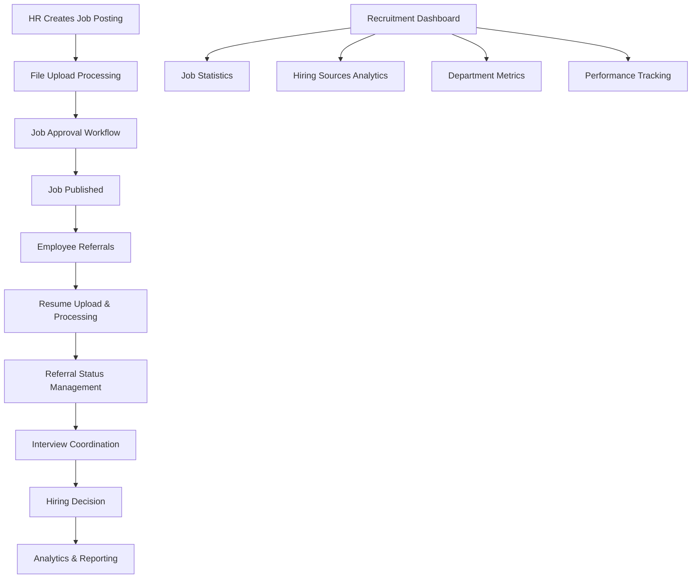
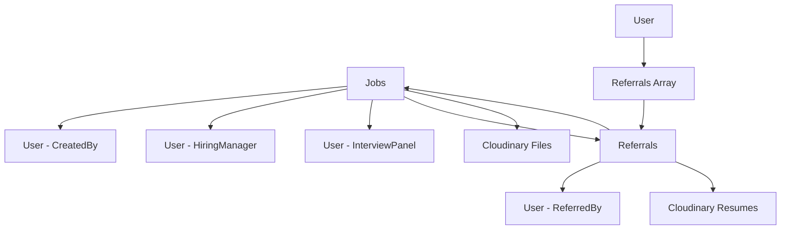

# Recruitment Management


<!-- # Recruitment Management API Documentation -->

## System Overview

The Recruitment Management API provides a comprehensive talent acquisition and recruitment tracking system. It supports job posting management, employee referral programs, recruitment analytics, and hiring workflow automation. The system enables HR teams, hiring managers, and employees to collaborate effectively throughout the recruitment lifecycle while maintaining complete audit trails and performance metrics.

## Base URL
```
/v1/recruitment
```

## Authentication Requirements

- **All Routes**: JWT authentication required via `verifyJWT` middleware
- **Role-based Access**: Differentiated permissions for HR admins, hiring managers, and employees
- **File Upload Support**: Multer middleware for job descriptions and resume handling
- **Permission Checks**: Specialized middleware for recruitment-specific permissions

## System Architecture Flow



## Complete Workflow Process

### 1. Job Creation & Management Workflow
1. **Job Posting Creation** → HR/Manager creates job with requirements and attachments
2. **Approval Process** → Jobs go through approval workflow before publication
3. **Budget Allocation** → Budget assignment for recruitment activities
4. **Status Management** → Track job status from vacant to filled
5. **Performance Monitoring** → Analytics on job posting effectiveness

### 2. Referral Management Workflow
1. **Employee Referrals** → Employees submit candidate referrals with resumes
2. **Application Processing** → HR reviews and processes referral applications
3. **Status Updates** → Referral status tracking through hiring pipeline
4. **Feedback Loop** → Status updates communicated back to referring employees
5. **Success Tracking** → Monitoring referral program effectiveness

### 3. Analytics & Reporting Workflow
1. **Real-time Dashboards** → Overview of recruitment activities and metrics
2. **Source Analysis** → Track effectiveness of different hiring sources
3. **Department Insights** → Department-wise hiring statistics
4. **Performance Metrics** → Time-to-hire, application rates, success ratios

## API Endpoints

### Job Management

#### Create Job Posting
**POST** `/jobs`

**Authentication:** Required (JWT)

Creates a new job posting with optional file attachment for job description.

**Request Headers:**
```
Authorization: Bearer {jwt_token}
Content-Type: multipart/form-data
```

**Request Body (multipart/form-data):**
```json
{
  "jobTitle": "Senior Software Engineer",
  "jobDepartment": "Engineering",
  "jobDescription": "We are looking for an experienced software engineer to join our team and work on cutting-edge web applications using React and Node.js.",
  "employmentType": ["Full-time", "Permanent"],
  "jobLocations": ["New York", "Remote"],
  "multipleCandidates": true,
  "vacancyStatus": "Open",
  "openingDate": "2024-02-01",
  "closingDate": "2024-03-15",
  "workExperience": "3-5 years",
  "education": "Bachelor's degree in Computer Science or related field",
  "suitableFor": ["Experienced", "Mid-level"],
  "responsibilities": "Develop and maintain web applications, collaborate with cross-functional teams, participate in code reviews",
  "duties": "Write clean, maintainable code, debug and troubleshoot issues, mentor junior developers",
  "requiredSkills": ["JavaScript", "React", "Node.js", "MongoDB", "Git"],
  "isPromotionOpportunity": false,
  "eligibilityCriteria": "3+ years experience in web development, strong knowledge of JavaScript frameworks",
  "interviewPanel": ["64f8b2a1c4d5e6f7g8h9i0j1", "64f8b2a1c4d5e6f7g8h9i0j2"],
  "hiringManager": "64f8b2a1c4d5e6f7g8h9i0j3",
  "contactPerson": "Jane Smith",
  "contactPhone": "+1-555-0123",
  "additionalContact": "hr@company.com",
  "showContacts": true,
  "jobDescriptionFile": "job_description.pdf"
}
```

**Field Descriptions:**
- `jobTitle`: Position title (required)
- `jobDepartment`: Department name (required)
- `jobDescription`: Detailed job description
- `employmentType`: Array of employment types (Full-time, Part-time, Contract, Internship)
- `jobLocations`: Array of work locations
- `multipleCandidates`: Whether multiple candidates can be hired
- `vacancyStatus`: "Open", "Draft", "Closed", "On Hold"
- `openingDate/closingDate`: Application period dates
- `requiredSkills`: Array of required technical skills
- `interviewPanel`: Array of interviewer user IDs
- `hiringManager`: User ID of hiring manager

**Success Response (201):**
```json
{
  "success": true,
  "message": "Job posting created successfully",
  "data": {
    "_id": "64f8b2a1c4d5e6f7g8h9i0j4",
    "createdBy": "64f8b2a1c4d5e6f7g8h9i0j5",
    "hiringManager": "64f8b2a1c4d5e6f7g8h9i0j3",
    "jobTitle": "Senior Software Engineer",
    "jobDepartment": "Engineering",
    "jobDescription": "We are looking for an experienced software engineer...",
    "img": "https://cloudinary.com/jobs/job_description.pdf",
    "employmentType": ["Full-time", "Permanent"],
    "jobLocations": ["New York", "Remote"],
    "multipleCandidates": true,
    "vacancyStatus": "Open",
    "openingDate": "2024-02-01T00:00:00.000Z",
    "closingDate": "2024-03-15T00:00:00.000Z",
    "workExperience": "3-5 years",
    "education": "Bachelor's degree in Computer Science or related field",
    "suitableFor": ["Experienced", "Mid-level"],
    "responsibilities": "Develop and maintain web applications...",
    "duties": "Write clean, maintainable code...",
    "requiredSkills": ["JavaScript", "React", "Node.js", "MongoDB", "Git"],
    "isPromotionOpportunity": false,
    "eligibilityCriteria": "3+ years experience in web development...",
    "interviewPanel": ["64f8b2a1c4d5e6f7g8h9i0j1", "64f8b2a1c4d5e6f7g8h9i0j2"],
    "contactPerson": "Jane Smith",
    "contactPhone": "+1-555-0123",
    "additionalContact": "hr@company.com",
    "showContacts": true,
    "approvalStatus": "Pending",
    "status": "vacant",
    "createdAt": "2024-01-25T10:30:00.000Z",
    "updatedAt": "2024-01-25T10:30:00.000Z"
  }
}
```

**Error Responses:**
```json
// Missing required fields (400)
{
  "success": false,
  "message": "Job title and department are required"
}

// File upload error (500)
{
  "success": false,
  "message": "Error uploading file to Cloudinary"
}
```

#### Get All Jobs
**GET** `/jobs`

**Authentication:** Required (JWT)

Retrieves all job postings with optional filtering by approval status.

**Request Parameters:**
- `approvalStatus` (string, optional): Filter by approval status ("Pending", "Approved", "Rejected")

**Example Request:**
```
GET /v1/recruitment/jobs?approvalStatus=Approved
```

**Success Response (200):**
```json
{
  "success": true,
  "data": [
    {
      "_id": "64f8b2a1c4d5e6f7g8h9i0j4",
      "jobTitle": "Senior Software Engineer",
      "jobDepartment": "Engineering",
      "jobDescription": "We are looking for an experienced software engineer...",
      "employmentType": ["Full-time", "Permanent"],
      "jobLocations": ["New York", "Remote"],
      "vacancyStatus": "Open",
      "approvalStatus": "Approved",
      "status": "vacant",
      "workExperience": "3-5 years",
      "requiredSkills": ["JavaScript", "React", "Node.js", "MongoDB", "Git"],
      "createdBy": {
        "_id": "64f8b2a1c4d5e6f7g8h9i0j5",
        "first_Name": "Alice",
        "last_Name": "Johnson",
        "employee_Id": "HR001"
      },
      "createdAt": "2024-01-25T10:30:00.000Z",
      "updatedAt": "2024-01-25T10:30:00.000Z"
    }
  ]
}
```

#### Update Job Posting
**PUT** `/jobs/:id`

**Authentication:** Required (JWT)

Updates an existing job posting with optional image/file upload.

**Request Parameters:**
- `id` (string): Job posting ID

**Request Body (multipart/form-data):**
```json
{
  "jobTitle": "Senior Software Engineer - Updated",
  "jobDescription": "Updated job description with new requirements",
  "vacancyStatus": "On Hold",
  "approvalStatus": "Approved",
  "salaryRange": [80000, 120000],
  "currency": "USD",
  "payPeriod": "Annual",
  "img": "updated_job_image.jpg"
}
```

**Success Response (200):**
```json
{
  "success": true,
  "message": "Job posting updated successfully",
  "data": {
    "_id": "64f8b2a1c4d5e6f7g8h9i0j4",
    "jobTitle": "Senior Software Engineer - Updated",
    "jobDescription": "Updated job description with new requirements",
    "vacancyStatus": "On Hold",
    "approvalStatus": "Approved",
    "salaryRange": [80000, 120000],
    "currency": "USD",
    "payPeriod": "Annual",
    "img": "https://cloudinary.com/jobs/updated_job_image.jpg",
    "updatedAt": "2024-01-26T14:20:00.000Z"
  }
}
```

#### Delete Job Posting
**DELETE** `/jobs/:id`

**Authentication:** Required (JWT)

Deletes a job posting and associated files.

**Request Parameters:**
- `id` (string): Job posting ID

**Success Response (200):**
```json
{
  "success": true,
  "message": "Job posting deleted successfully",
  "data": {
    "_id": "64f8b2a1c4d5e6f7g8h9i0j4",
    "jobTitle": "Senior Software Engineer",
    "deletedAt": "2024-01-26T15:30:00.000Z"
  }
}
```

### Job Status Management

#### Toggle Job Status
**PATCH** `/jobs/:id/toggle`

**Authentication:** Required (JWT)

Toggles job status between "vacant" and "filled".

**Request Parameters:**
- `id` (string): Job posting ID

**Success Response (200):**
```json
{
  "success": true,
  "message": "Job status changed to filled",
  "data": {
    "_id": "64f8b2a1c4d5e6f7g8h9i0j4",
    "jobTitle": "Senior Software Engineer",
    "status": "filled",
    "updatedAt": "2024-01-26T16:00:00.000Z"
  }
}
```

#### Allocate Budget for Job
**PATCH** `/jobs/:id/budget`

**Authentication:** Required (JWT)

Allocates recruitment budget to a specific job posting.

**Request Parameters:**
- `id` (string): Job posting ID

**Request Body:**
```json
{
  "budget": 15000
}
```

**Success Response (200):**
```json
{
  "success": true,
  "message": "Budget allocated successfully",
  "data": {
    "_id": "64f8b2a1c4d5e6f7g8h9i0j4",
    "jobTitle": "Senior Software Engineer",
    "budget": 15000,
    "updatedAt": "2024-01-26T16:15:00.000Z"
  }
}
```

#### Get Jobs by Status
**GET** `/jobs/status/filled`
**GET** `/jobs/status/vacant`

**Authentication:** Required (JWT)

Retrieves jobs filtered by their current status.

**Success Response (200):**
```json
{
  "success": true,
  "message": "Fetched vacant job vacancies",
  "totalCount": 5,
  "data": [
    {
      "_id": "64f8b2a1c4d5e6f7g8h9i0j4",
      "jobTitle": "Senior Software Engineer",
      "jobDepartment": "Engineering",
      "status": "vacant",
      "vacancyStatus": "Open",
      "createdAt": "2024-01-25T10:30:00.000Z"
    }
  ]
}
```

#### Get Jobs by Employee
**GET** `/jobs/employee`

**Authentication:** Required (JWT)

Retrieves jobs created by the current authenticated user with summary statistics.

**Success Response (200):**
```json
{
  "success": true,
  "summary": {
    "totalCreated": 8,
    "totalApproved": 5,
    "totalRejected": 1
  },
  "data": [
    {
      "_id": "64f8b2a1c4d5e6f7g8h9i0j4",
      "jobTitle": "Senior Software Engineer",
      "jobDepartment": "Engineering",
      "approvalStatus": "Approved",
      "vacancyStatus": "Open",
      "status": "vacant",
      "createdAt": "2024-01-25T10:30:00.000Z"
    }
  ]
}
```

### Analytics & Dashboard

#### Get Recruitment Overview
**GET** `/overview`

**Authentication:** Required (JWT)

Retrieves current month recruitment overview statistics.

**Success Response (200):**
```json
{
  "success": true,
  "data": {
    "openPositions": 12,
    "applicants": 45,
    "pendingPositions": 3,
    "onboarding": 8
  }
}
```

**Metrics Explanation:**
- `openPositions`: New job postings created this month
- `applicants`: Referrals submitted this month
- `pendingPositions`: Jobs in "Pending" approval status
- `onboarding`: New employee joinings this month

#### Get Top Hiring Sources
**GET** `/top-sources`

**Authentication:** Required (JWT)

Retrieves hiring source analytics with chart data for visualization.

**Success Response (200):**
```json
{
  "success": true,
  "data": {
    "labels": ["01/09", "02/09", "03/09", "04/09", "05/09", "06/09", "07/09"],
    "datasets": [
      {
        "label": "Referral",
        "data": [25, 60, 15, 40, 30, 55, 10],
        "backgroundColor": "#8B5CF6"
      },
      {
        "label": "Indeed",
        "data": [10, 20, 50, 25, 45, 20, 15],
        "backgroundColor": "#22C55E"
      },
      {
        "label": "LinkedIn",
        "data": [40, 30, 35, 55, 70, 65, 35],
        "backgroundColor": "#F59E0B"
      }
    ]
  }
}
```

#### Get Recent Vacancies
**GET** `/recent-vacancies`

**Authentication:** Required (JWT)

Retrieves the 6 most recent job postings with applicant statistics and trending data.

**Success Response (200):**
```json
{
  "success": true,
  "data": [
    {
      "title": "Senior Software Engineer",
      "location": "New York",
      "applicants": 15,
      "newApplicants": 4,
      "sparkData": [5, 8, 3, 9, 7]
    },
    {
      "title": "Product Manager",
      "location": "Remote",
      "applicants": 22,
      "newApplicants": 6,
      "sparkData": [3, 6, 9, 4, 8]
    }
  ]
}
```

**Field Descriptions:**
- `title`: Job position title
- `location`: Primary job location or "Remote"
- `applicants`: Total number of applicants
- `newApplicants`: New applicants in last 7 days
- `sparkData`: Trending data for visualization (5 data points)

#### Get Department Statistics
**GET** `/departments`

**Authentication:** Required (JWT)

Retrieves open vacancy statistics grouped by department for the current month.

**Success Response (200):**
```json
{
  "success": true,
  "data": [
    {
      "department": "Engineering",
      "count": 8
    },
    {
      "department": "Product",
      "count": 3
    },
    {
      "department": "Sales",
      "count": 5
    },
    {
      "department": "Marketing",
      "count": 2
    }
  ]
}
```

### Referral Management

#### Create Referral
**POST** `/referrals`

**Authentication:** Required (JWT)

Creates a new employee referral with resume upload.

**Request Headers:**
```
Authorization: Bearer {jwt_token}
Content-Type: multipart/form-data
```

**Request Body (multipart/form-data):**
```json
{
  "jobId": "64f8b2a1c4d5e6f7g8h9i0j4",
  "name": "John Smith",
  "email": "john.smith@gmail.com",
  "phone": "+1-555-0987",
  "location": "Boston, MA",
  "address": "123 Main Street, Boston, MA 02101",
  "linkedIn": "https://linkedin.com/in/johnsmith",
  "notes": "John has excellent React skills and has worked on similar projects in the past. He's looking for new opportunities.",
  "resume": "john_smith_resume.pdf"
}
```

**Field Descriptions:**
- `jobId`: ID of the job position being referred to (required)
- `name`: Full name of the candidate (required)
- `email`: Candidate's email address (required)
- `phone`: Contact phone number
- `location`: Current location/city
- `address`: Full address
- `linkedIn`: LinkedIn profile URL
- `notes`: Additional notes about the candidate
- `resume`: Resume file (required)

**Success Response (201):**
```json
{
  "success": true,
  "message": "Referral submitted successfully",
  "data": {
    "_id": "64f8b2a1c4d5e6f7g8h9i0j6",
    "job": "64f8b2a1c4d5e6f7g8h9i0j4",
    "referredBy": "64f8b2a1c4d5e6f7g8h9i0j7",
    "referredCandidate": {
      "name": "John Smith",
      "email": "john.smith@gmail.com",
      "phone": "+1-555-0987",
      "location": "Boston, MA",
      "address": "123 Main Street, Boston, MA 02101",
      "resume": "https://cloudinary.com/resumes/john_smith_resume.pdf",
      "linkedIn": "https://linkedin.com/in/johnsmith",
      "notes": "John has excellent React skills..."
    },
    "status": "Submitted",
    "createdAt": "2024-01-26T11:30:00.000Z"
  }
}
```

**Error Responses:**
```json
// Job not found (404)
{
  "success": false,
  "message": "Job not found"
}

// Resume file missing (400)
{
  "success": false,
  "message": "Resume file is required"
}
```

#### Get All Referrals
**GET** `/referrals`

**Authentication:** Required (JWT - Admin/HR role)

Retrieves all referrals across the organization with populated job and referrer information.

**Success Response (200):**
```json
{
  "success": true,
  "data": [
    {
      "id": "64f8b2a1c4d5e6f7g8h9i0j6",
      "designation": "Senior Software Engineer",
      "department": "Engineering",
      "referredBy": "Alice Johnson (HR001)",
      "resume": "https://cloudinary.com/resumes/john_smith_resume.pdf",
      "candidateName": "John Smith",
      "candidatePhone": "+1-555-0987",
      "candidateLinkedIn": "https://linkedin.com/in/johnsmith",
      "candidateEmail": "john.smith@gmail.com",
      "candidateLocation": "Boston, MA",
      "status": "Under Review",
      "createdAt": "2024-01-26T11:30:00.000Z",
      "updatedAt": "2024-01-27T09:15:00.000Z"
    }
  ]
}
```

#### Update Referral Status
**PUT** `/referrals/:referralId/status`

**Authentication:** Required (JWT - Admin/HR role)

Updates the status of a referral application with optional feedback.

**Request Parameters:**
- `referralId` (string): Referral ID

**Request Body:**
```json
{
  "status": "Interview Scheduled",
  "feedback": "Candidate looks promising. Initial screening completed successfully. Technical interview scheduled for next week."
}
```

**Valid Status Values:**
- `"Submitted"`: Initial submission status
- `"Under Review"`: HR reviewing the application
- `"Interview Scheduled"`: Interview arranged
- `"Interview Completed"`: Interview process finished
- `"Selected"`: Candidate selected for position
- `"Rejected"`: Application rejected
- `"On Hold"`: Application on hold

**Success Response (200):**
```json
{
  "success": true,
  "message": "Referral status updated to Interview Scheduled.",
  "data": {
    "id": "64f8b2a1c4d5e6f7g8h9i0j6",
    "designation": "Senior Software Engineer",
    "department": "Engineering",
    "referredBy": "Alice Johnson (HR001)",
    "candidateName": "John Smith",
    "candidateEmail": "john.smith@gmail.com",
    "candidateLocation": "Boston, MA",
    "status": "Interview Scheduled"
  }
}
```

#### Get Employee Referrals
**GET** `/referrals/me`

**Authentication:** Required (JWT)

Retrieves all referrals submitted by the current authenticated employee.

**Success Response (200):**
```json
{
  "success": true,
  "data": [
    {
      "_id": "64f8b2a1c4d5e6f7g8h9i0j6",
      "job": {
        "_id": "64f8b2a1c4d5e6f7g8h9i0j4",
        "jobTitle": "Senior Software Engineer",
        "jobDepartment": "Engineering"
      },
      "referredBy": "64f8b2a1c4d5e6f7g8h9i0j7",
      "referredCandidate": {
        "name": "John Smith",
        "email": "john.smith@gmail.com",
        "phone": "+1-555-0987",
        "location": "Boston, MA",
        "resume": "https://cloudinary.com/resumes/john_smith_resume.pdf"
      },
      "status": "Under Review",
      "feedback": "",
      "createdAt": "2024-01-26T11:30:00.000Z",
      "updatedAt": "2024-01-27T09:15:00.000Z"
    }
  ]
}
```

## Frontend Integration Examples

### JavaScript/React Integration

```javascript
// API Configuration
const API_BASE_URL = 'https://your-api-domain.com/v1/recruitment';

const getAuthHeaders = () => ({
  'Authorization': `Bearer ${localStorage.getItem('authToken')}`,
  'Content-Type': 'application/json'
});

// Recruitment Service Class
class RecruitmentService {
  
  // Create job posting with file upload
  async createJob(jobData, file = null) {
    try {
      const formData = new FormData();
      
      // Add all job data fields
      Object.keys(jobData).forEach(key => {
        if (Array.isArray(jobData[key])) {
          jobData[key].forEach(item => formData.append(key, item));
        } else {
          formData.append(key, jobData[key]);
        }
      });
      
      if (file) {
        formData.append('jobDescriptionFile', file);
      }

      const response = await fetch(`${API_BASE_URL}/jobs`, {
        method: 'POST',
        headers: {
          'Authorization': `Bearer ${localStorage.getItem('authToken')}`
        },
        body: formData
      });

      if (!response.ok) {
        const errorData = await response.json();
        throw new Error(errorData.message || 'Failed to create job');
      }

      return await response.json();
    } catch (error) {
      console.error('Error creating job:', error);
      throw error;
    }
  }

  // Get all jobs with optional filtering
  async getAllJobs(approvalStatus = null) {
    try {
      const params = new URLSearchParams();
      if (approvalStatus) {
        params.append('approvalStatus', approvalStatus);
      }

      const response = await fetch(`${API_BASE_URL}/jobs?${params}`, {
        method: 'GET',
        headers: getAuthHeaders()
      });

      return await response.json();
    } catch (error) {
      console.error('Error fetching jobs:', error);
      throw error;
    }
  }

  // Update job posting
  async updateJob(jobId, updateData, file = null) {
    try {
      const formData = new FormData();
      
      Object.keys(updateData).forEach(key => {
        if (Array.isArray(updateData[key])) {
          formData.append(key, JSON.stringify(updateData[key]));
        } else {
          formData.append(key, updateData[key]);
        }
      });
      
      if (file) {
        formData.append('img', file);
      }

      const response = await fetch(`${API_BASE_URL}/jobs/${jobId}`, {
        method: 'PUT',
        headers: {
          'Authorization': `Bearer ${localStorage.getItem('authToken')}`
        },
        body: formData
      });

      return await response.json();
    } catch (error) {
      console.error('Error updating job:', error);
      throw error;
    }
  }

  // Create referral with resume upload
  async createReferral(referralData, resumeFile) {
    try {
      const formData = new FormData();
      
      Object.keys(referralData).forEach(key => {
        formData.append(key, referralData[key]);
      });
      
      formData.append('resume', resumeFile);

      const response = await fetch(`${API_BASE_URL}/referrals`, {
        method: 'POST',
        headers: {
          'Authorization': `Bearer ${localStorage.getItem('authToken')}`
        },
        body: formData
      });

      if (!response.ok) {
        const errorData = await response.json();
        throw new Error(errorData.message || 'Failed to create referral');
      }

      return await response.json();
    } catch (error) {
      console.error('Error creating referral:', error);
      throw error;
    }
  }

  // Get recruitment dashboard overview
  async getRecruitmentOverview() {
    try {
      const response = await fetch(`${API_BASE_URL}/overview`, {
        method: 'GET',
        headers: getAuthHeaders()
      });

      return await response.json();
    } catch (error) {
      console.error('Error fetching recruitment overview:', error);
      throw error;
    }
  }

  // Get top hiring sources analytics
  async getTopHiringSources() {
    try {
      const response = await fetch(`${API_BASE_URL}/top-sources`, {
        method: 'GET',
        headers: getAuthHeaders()
      });

      return await response.json();
    } catch (error) {
      console.error('Error fetching hiring sources:', error);
      throw error;
    }
  }

  // Update referral status
  async updateReferralStatus(referralId, status, feedback = '') {
    try {
      const response = await fetch(`${API_BASE_URL}/referrals/${referralId}/status`, {
        method: 'PUT',
        headers: getAuthHeaders(),
        body: JSON.stringify({ status, feedback })
      });

      return await response.json();
    } catch (error) {
      console.error('Error updating referral status:', error);
      throw error;
    }
  }

  // Toggle job status
  async toggleJobStatus(jobId) {
    try {
      const response = await fetch(`${API_BASE_URL}/jobs/${jobId}/toggle`, {
        method: 'PATCH',
        headers: getAuthHeaders()
      });

      return await response.json();
    } catch (error) {
      console.error('Error toggling job status:', error);
      throw error;
    }
  }

  // Allocate budget to job
  async allocateBudget(jobId, budget) {
    try {
      const response = await fetch(`${API_BASE_URL}/jobs/${jobId}/budget`, {
        method: 'PATCH',
        headers: getAuthHeaders(),
        body: JSON.stringify({ budget })
      });

      return await response.json();
    } catch (error) {
      console.error('Error allocating budget:', error);
      throw error;
    }
  }
}

// React Hook for Recruitment Management
import { useState, useEffect } from 'react';

const useRecruitment = (userRole = 'employee') => {
  const [jobs, setJobs] = useState([]);
  const [referrals, setReferrals] = useState([]);
  const [overview, setOverview] = useState(null);
  const [loading, setLoading] = useState(false);
  const [error, setError] = useState(null);
  
  const recruitmentService = new RecruitmentService();

  const fetchJobs = async (approvalStatus = null) => {
    setLoading(true);
    setError(null);
    
    try {
      const response = await recruitmentService.getAllJobs(approvalStatus);
      if (response.success) {
        setJobs(response.data);
      } else {
        setError(response.message);
      }
    } catch (err) {
      setError(err.message);
    } finally {
      setLoading(false);
    }
  };

  const fetchReferrals = async () => {
    try {
      const response = userRole === 'admin' 
        ? await recruitmentService.getAllReferrals()
        : await recruitmentService.getEmployeeReferrals();
        
      if (response.success) {
        setReferrals(response.data);
      }
    } catch (err) {
      setError(err.message);
    }
  };

  const fetchOverview = async () => {
    try {
      const response = await recruitmentService.getRecruitmentOverview();
      if (response.success) {
        setOverview(response.data);
      }
    } catch (err) {
      setError(err.message);
    }
  };

  const createJob = async (jobData, file) => {
    setLoading(true);
    try {
      const response = await recruitmentService.createJob(jobData, file);
      if (response.success) {
        await fetchJobs(); // Refresh job list
        return response;
      } else {
        throw new Error(response.message);
      }
    } catch (err) {
      setError(err.message);
      throw err;
    } finally {
      setLoading(false);
    }
  };

  const createReferral = async (referralData, resumeFile) => {
    setLoading(true);
    try {
      const response = await recruitmentService.createReferral(referralData, resumeFile);
      if (response.success) {
        await fetchReferrals(); // Refresh referral list
        return response;
      } else {
        throw new Error(response.message);
      }
    } catch (err) {
      setError(err.message);
      throw err;
    } finally {
      setLoading(false);
    }
  };

  useEffect(() => {
    fetchJobs();
    fetchReferrals();
    fetchOverview();
  }, [userRole]);

  return {
    jobs,
    referrals,
    overview,
    loading,
    error,
    fetchJobs,
    fetchReferrals,
    createJob,
    createReferral
  };
};

// Job Creation Form Component
const JobCreationForm = () => {
  const [formData, setFormData] = useState({
    jobTitle: '',
    jobDepartment: '',
    jobDescription: '',
    employmentType: [],
    jobLocations: [],
    workExperience: '',
    education: '',
    requiredSkills: [],
    responsibilities: '',
    duties: '',
    contactPerson: '',
    contactPhone: '',
    showContacts: true
  });
  
  const [jobDescFile, setJobDescFile] = useState(null);
  const { createJob, loading } = useRecruitment('hr');

  const handleSkillsChange = (skills) => {
    setFormData({
      ...formData,
      requiredSkills: skills.split(',').map(skill => skill.trim()).filter(skill => skill)
    });
  };

  const handleSubmit = async (e) => {
    e.preventDefault();
    
    if (!formData.jobTitle || !formData.jobDepartment) {
      alert('Job title and department are required');
      return;
    }

    try {
      await createJob(formData, jobDescFile);
      alert('Job posted successfully!');
      
      // Reset form
      setFormData({
        jobTitle: '',
        jobDepartment: '',
        jobDescription: '',
        employmentType: [],
        jobLocations: [],
        workExperience: '',
        education: '',
        requiredSkills: [],
        responsibilities: '',
        duties: '',
        contactPerson: '',
        contactPhone: '',
        showContacts: true
      });
      setJobDescFile(null);
    } catch (error) {
      alert(`Error: ${error.message}`);
    }
  };

  return (
    
      Create New Job Posting
      
      
        
          Job Title *
           setFormData({...formData, jobTitle: e.target.value})}
            placeholder="e.g., Senior Software Engineer"
            required
          />
        

        
          Department *
           setFormData({...formData, jobDepartment: e.target.value})}
            required
          >
            Select Department
            Engineering
            Product
            Sales
            Marketing
            Human Resources
            Finance
          
        
      

      
        Job Description
         setFormData({...formData, jobDescription: e.target.value})}
          placeholder="Detailed description of the role, responsibilities, and requirements..."
        />
      

      
        
          Work Experience
           setFormData({...formData, workExperience: e.target.value})}
            placeholder="e.g., 3-5 years"
          />
        

        
          Education
           setFormData({...formData, education: e.target.value})}
            placeholder="e.g., Bachelor's degree in Computer Science"
          />
        
      

      
        Required Skills (comma-separated)
         handleSkillsChange(e.target.value)}
          placeholder="e.g., JavaScript, React, Node.js, MongoDB"
        />
      

      
        Key Responsibilities
         setFormData({...formData, responsibilities: e.target.value})}
          placeholder="List the main responsibilities for this role..."
        />
      

      
        
          Contact Person
           setFormData({...formData, contactPerson: e.target.value})}
            placeholder="Hiring manager or HR contact"
          />
        

        
          Contact Phone
           setFormData({...formData, contactPhone: e.target.value})}
            placeholder="+1-555-0123"
          />
        
      

      
        Job Description File (Optional)
         setJobDescFile(e.target.files[0])}
          accept=".pdf,.doc,.docx"
        />
        Upload additional job description document (PDF, DOC, DOCX)
      

      
        
           setFormData({...formData, showContacts: e.target.checked})}
          />
          Show contact information on job posting
        
      

      
        {loading ? 'Creating Job...' : 'Create Job Posting'}
      
    
  );
};

// Referral Submission Form Component
const ReferralForm = ({ availableJobs }) => {
  const [formData, setFormData] = useState({
    jobId: '',
    name: '',
    email: '',
    phone: '',
    location: '',
    linkedIn: '',
    notes: ''
  });
  
  const [resumeFile, setResumeFile] = useState(null);
  const { createReferral, loading } = useRecruitment();

  const handleSubmit = async (e) => {
    e.preventDefault();
    
    if (!formData.jobId || !formData.name || !formData.email || !resumeFile) {
      alert('Please fill in all required fields and upload a resume');
      return;
    }

    try {
      await createReferral(formData, resumeFile);
      alert('Referral submitted successfully!');
      
      // Reset form
      setFormData({
        jobId: '',
        name: '',
        email: '',
        phone: '',
        location: '',
        linkedIn: '',
        notes: ''
      });
      setResumeFile(null);
    } catch (error) {
      alert(`Error: ${error.message}`);
    }
  };

  return (
    
      Submit Employee Referral
      
      
        Select Position *
         setFormData({...formData, jobId: e.target.value})}
          required
        >
          Choose a job opening...
          {availableJobs.map(job => (
            
              {job.jobTitle} - {job.jobDepartment}
            
          ))}
        
      

      
        
          Candidate Name *
           setFormData({...formData, name: e.target.value})}
            placeholder="Full name"
            required
          />
        

        
          Email Address *
           setFormData({...formData, email: e.target.value})}
            placeholder="candidate@email.com"
            required
          />
        
      

      
        
          Phone Number
           setFormData({...formData, phone: e.target.value})}
            placeholder="+1-555-0123"
          />
        

        
          Location
           setFormData({...formData, location: e.target.value})}
            placeholder="City, State"
          />
        
      

      
        LinkedIn Profile
         setFormData({...formData, linkedIn: e.target.value})}
          placeholder="https://linkedin.com/in/profile"
        />
      

      
        Resume *
         setResumeFile(e.target.files[0])}
          accept=".pdf,.doc,.docx"
          required
        />
        Upload candidate's resume (PDF, DOC, DOCX - Max 10MB)
      

      
        Additional Notes
         setFormData({...formData, notes: e.target.value})}
          placeholder="Why do you recommend this candidate? Include relevant experience, skills, or achievements..."
        />
      

      
        {loading ? 'Submitting Referral...' : 'Submit Referral'}
      
    
  );
};

// Recruitment Dashboard Component
const RecruitmentDashboard = () => {
  const { overview, jobs, loading } = useRecruitment('admin');
  const [chartData, setChartData] = useState(null);
  
  const recruitmentService = new RecruitmentService();

  useEffect(() => {
    const fetchChartData = async () => {
      try {
        const response = await recruitmentService.getTopHiringSources();
        if (response.success) {
          setChartData(response.data);
        }
      } catch (error) {
        console.error('Error fetching chart data:', error);
      }
    };

    fetchChartData();
  }, []);

  if (loading) return Loading dashboard...;

  return (
    
      Recruitment Dashboard
      
      {overview && (
        
          
            Open Positions
            {overview.openPositions}
            This Month
          
          
          
            Total Applicants
            {overview.applicants}
            This Month
          
          
          
            Pending Positions
            {overview.pendingPositions}
            Awaiting Approval
          
          
          
            New Hires
            {overview.onboarding}
            This Month
          
        
      )}

      {chartData && (
        
          Top Hiring Sources
          
            {/* Implement chart using Chart.js or similar library */}
            
          
        
      )}

      
        Recent Job Postings
        
          
            
              
                Position
                Department
                Status
                Approval
                Created
                Actions
              
            
            
              {jobs.slice(0, 10).map(job => (
                
                  {job.jobTitle}
                  {job.jobDepartment}
                  
                    
                      {job.status}
                    
                  
                  
                    
                      {job.approvalStatus}
                    
                  
                  {new Date(job.createdAt).toLocaleDateString()}
                  
                    View
                    Edit
                  
                
              ))}
            
          
        
      
    
  );
};
```

## Security Features

### Authentication & Authorization
- **JWT Token Validation**: All routes protected with authentication middleware
- **Role-based Permissions**: Different access levels for HR, hiring managers, and employees
- **File Upload Security**: Secure file handling for job descriptions and resumes
- **Data Access Control**: Users can only access relevant recruitment data

### File Upload Security
- **File Type Validation**: Restricted to safe document formats (PDF, DOC, DOCX)
- **File Size Limits**: Maximum file size enforcement (typically 10MB)
- **Secure Storage**: Files uploaded to Cloudinary with access controls
- **Virus Scanning**: Integration with security scanning for uploaded files

### Data Protection
- **Input Sanitization**: All inputs validated and sanitized
- **XSS Prevention**: Protection against cross-site scripting attacks
- **SQL Injection Prevention**: MongoDB with parameterized queries
- **Sensitive Data Handling**: Proper handling of candidate personal information

### Privacy & Compliance
- **Candidate Data Privacy**: Secure handling of personal and professional information
- **GDPR Compliance**: Support for data privacy regulations
- **Audit Trail**: Complete logging of all recruitment activities
- **Data Retention Policies**: Configurable retention periods for candidate data

## Error Handling

### Common Error Responses

#### Authentication Errors (401)
```json
{
  "success": false,
  "message": "Unauthorized request. Token not provided."
}
```

#### Authorization Errors (403)
```json
{
  "success": false,
  "message": "Insufficient permissions to access this resource."
}
```

#### Validation Errors (400)
```json
{
  "success": false,
  "message": "Job title and department are required"
}
```

#### Resource Not Found (404)
```json
{
  "success": false,
  "message": "Job posting not found"
}
```

#### File Upload Errors (500)
```json
{
  "success": false,
  "message": "Error uploading file to Cloudinary"
}
```

### Error Handling Implementation

```javascript
// Comprehensive error handler for recruitment operations
const handleRecruitmentError = (error, context) => {
  console.error(`Recruitment Error in ${context}:`, error);

  if (error.status === 401) {
    localStorage.removeItem('authToken');
    window.location.href = '/login';
    return 'Session expired. Please login again.';
  }
  
  if (error.status === 403) {
    return 'You do not have permission to perform this action.';
  }
  
  if (error.status === 404) {
    return 'The requested resource could not be found.';
  }
  
  if (error.status === 413) {
    return 'File too large. Please select a smaller file.';
  }
  
  if (error.message?.includes('file')) {
    return 'File upload failed. Please check file format and size.';
  }
  
  if (error.status >= 500) {
    return 'Server error. Please try again later or contact support.';
  }
  
  return error.message || 'An unexpected error occurred.';
};

// Usage in API calls
try {
  const response = await recruitmentService.createJob(jobData, file);
} catch (error) {
  const errorMessage = handleRecruitmentError(error, 'Create Job');
  setError(errorMessage);
}
```

## Testing Guide

### cURL Commands

#### Create Job Posting
```bash
# Create job with file attachment
curl -X POST "http://localhost:3000/v1/recruitment/jobs" \
  -H "Authorization: Bearer YOUR_JWT_TOKEN" \
  -F "jobTitle=Senior Software Engineer" \
  -F "jobDepartment=Engineering" \
  -F "jobDescription=Looking for experienced software engineer..." \
  -F "employmentType=Full-time" \
  -F "jobLocations=New York,Remote" \
  -F "workExperience=3-5 years" \
  -F "requiredSkills=JavaScript,React,Node.js" \
  -F "contactPerson=Jane Smith" \
  -F "contactPhone=+1-555-0123" \
  -F "showContacts=true" \
  -F "jobDescriptionFile=@job_description.pdf"
```

#### Get All Jobs
```bash
# Get all jobs
curl -X GET "http://localhost:3000/v1/recruitment/jobs" \
  -H "Authorization: Bearer YOUR_JWT_TOKEN"

# Get jobs by approval status
curl -X GET "http://localhost:3000/v1/recruitment/jobs?approvalStatus=Approved" \
  -H "Authorization: Bearer YOUR_JWT_TOKEN"
```

#### Update Job Posting
```bash
# Update job details
curl -X PUT "http://localhost:3000/v1/recruitment/jobs/JOB_ID" \
  -H "Authorization: Bearer YOUR_JWT_TOKEN" \
  -H "Content-Type: application/json" \
  -d '{
    "vacancyStatus": "On Hold",
    "salaryRange": [80000, 120000],
    "approvalStatus": "Approved"
  }'
```

#### Create Referral
```bash
# Submit employee referral
curl -X POST "http://localhost:3000/v1/recruitment/referrals" \
  -H "Authorization: Bearer YOUR_JWT_TOKEN" \
  -F "jobId=JOB_ID" \
  -F "name=John Smith" \
  -F "email=john.smith@gmail.com" \
  -F "phone=+1-555-0987" \
  -F "location=Boston, MA" \
  -F "linkedIn=https://linkedin.com/in/johnsmith" \
  -F "notes=Excellent React developer with 5 years experience" \
  -F "resume=@john_smith_resume.pdf"
```

#### Get Analytics Data
```bash
# Get recruitment overview
curl -X GET "http://localhost:3000/v1/recruitment/overview" \
  -H "Authorization: Bearer YOUR_JWT_TOKEN"

# Get top hiring sources
curl -X GET "http://localhost:3000/v1/recruitment/top-sources" \
  -H "Authorization: Bearer YOUR_JWT_TOKEN"

# Get recent vacancies
curl -X GET "http://localhost:3000/v1/recruitment/recent-vacancies" \
  -H "Authorization: Bearer YOUR_JWT_TOKEN"

# Get department statistics
curl -X GET "http://localhost:3000/v1/recruitment/departments" \
  -H "Authorization: Bearer YOUR_JWT_TOKEN"
```

#### Job Status Management
```bash
# Toggle job status
curl -X PATCH "http://localhost:3000/v1/recruitment/jobs/JOB_ID/toggle" \
  -H "Authorization: Bearer YOUR_JWT_TOKEN"

# Allocate budget
curl -X PATCH "http://localhost:3000/v1/recruitment/jobs/JOB_ID/budget" \
  -H "Authorization: Bearer YOUR_JWT_TOKEN" \
  -H "Content-Type: application/json" \
  -d '{"budget": 15000}'

# Get jobs by status
curl -X GET "http://localhost:3000/v1/recruitment/jobs/status/vacant" \
  -H "Authorization: Bearer YOUR_JWT_TOKEN"
```

#### Referral Management
```bash
# Get all referrals (admin)
curl -X GET "http://localhost:3000/v1/recruitment/referrals" \
  -H "Authorization: Bearer ADMIN_JWT_TOKEN"

# Update referral status
curl -X PUT "http://localhost:3000/v1/recruitment/referrals/REFERRAL_ID/status" \
  -H "Authorization: Bearer ADMIN_JWT_TOKEN" \
  -H "Content-Type: application/json" \
  -d '{
    "status": "Interview Scheduled",
    "feedback": "Candidate looks promising. Initial screening passed."
  }'

# Get employee's own referrals
curl -X GET "http://localhost:3000/v1/recruitment/referrals/me" \
  -H "Authorization: Bearer EMPLOYEE_JWT_TOKEN"
```

### Postman Collection

```json
{
  "info": {
    "name": "Recruitment Management API",
    "schema": "https://schema.getpostman.com/json/collection/v2.1.0/collection.json"
  },
  "auth": {
    "type": "bearer",
    "bearer": [
      {
        "key": "token",
        "value": "{{authToken}}",
        "type": "string"
      }
    ]
  },
  "variable": [
    {
      "key": "baseUrl",
      "value": "http://localhost:3000/v1/recruitment"
    }
  ],
  "item": [
    {
      "name": "Job Management",
      "item": [
        {
          "name": "Create Job",
          "request": {
            "method": "POST",
            "url": "{{baseUrl}}/jobs",
            "body": {
              "mode": "formdata",
              "formdata": [
                {
                  "key": "jobTitle",
                  "value": "Senior Software Engineer",
                  "type": "text"
                },
                {
                  "key": "jobDepartment",
                  "value": "Engineering",
                  "type": "text"
                },
                {
                  "key": "jobDescription",
                  "value": "Looking for experienced developer...",
                  "type": "text"
                },
                {
                  "key": "jobDescriptionFile",
                  "type": "file"
                }
              ]
            }
          }
        },
        {
          "name": "Get All Jobs",
          "request": {
            "method": "GET",
            "url": "{{baseUrl}}/jobs"
          }
        },
        {
          "name": "Update Job",
          "request": {
            "method": "PUT",
            "url": "{{baseUrl}}/jobs/{{jobId}}",
            "body": {
              "mode": "raw",
              "raw": "{\n  \"vacancyStatus\": \"Open\",\n  \"approvalStatus\": \"Approved\"\n}",
              "options": {
                "raw": {
                  "language": "json"
                }
              }
            }
          }
        }
      ]
    },
    {
      "name": "Analytics",
      "item": [
        {
          "name": "Get Overview",
          "request": {
            "method": "GET",
            "url": "{{baseUrl}}/overview"
          }
        },
        {
          "name": "Get Top Sources",
          "request": {
            "method": "GET",
            "url": "{{baseUrl}}/top-sources"
          }
        }
      ]
    },
    {
      "name": "Referrals",
      "item": [
        {
          "name": "Create Referral",
          "request": {
            "method": "POST",
            "url": "{{baseUrl}}/referrals",
            "body": {
              "mode": "formdata",
              "formdata": [
                {
                  "key": "jobId",
                  "value": "{{jobId}}",
                  "type": "text"
                },
                {
                  "key": "name",
                  "value": "John Smith",
                  "type": "text"
                },
                {
                  "key": "email",
                  "value": "john@example.com",
                  "type": "text"
                },
                {
                  "key": "resume",
                  "type": "file"
                }
              ]
            }
          }
        }
      ]
    }
  ]
}
```

### Integration Testing Examples

```javascript
// Jest Test Examples
describe('Recruitment API Integration Tests', () => {
  let authToken;
  let createdJobId;
  let createdReferralId;
  
  beforeAll(async () => {
    // Login and get auth token
    const loginResponse = await request(app)
      .post('/auth/login')
      .send({ username: 'testhr', password: 'testpass' });
    
    authToken = loginResponse.body.accessToken;
  });

  test('Should create new job posting', async () => {
    const jobData = {
      jobTitle: 'Test Software Engineer',
      jobDepartment: 'Engineering',
      jobDescription: 'Test job description',
      employmentType: 'Full-time',
      workExperience: '2-3 years',
      contactPerson: 'Test HR',
      showContacts: true
    };

    const response = await request(app)
      .post('/v1/recruitment/jobs')
      .set('Authorization', `Bearer ${authToken}`)
      .field('jobTitle', jobData.jobTitle)
      .field('jobDepartment', jobData.jobDepartment)
      .field('jobDescription', jobData.jobDescription)
      .field('employmentType', jobData.employmentType)
      .field('workExperience', jobData.workExperience)
      .field('contactPerson', jobData.contactPerson)
      .field('showContacts', jobData.showContacts);

    expect(response.status).toBe(201);
    expect(response.body.success).toBe(true);
    expect(response.body.data.jobTitle).toBe(jobData.jobTitle);
    
    createdJobId = response.body.data._id;
  });

  test('Should get all jobs', async () => {
    const response = await request(app)
      .get('/v1/recruitment/jobs')
      .set('Authorization', `Bearer ${authToken}`);

    expect(response.status).toBe(200);
    expect(response.body.success).toBe(true);
    expect(Array.isArray(response.body.data)).toBe(true);
  });

  test('Should create referral with resume', async () => {
    const referralData = {
      jobId: createdJobId,
      name: 'Test Candidate',
      email: 'test@example.com',
      phone: '+1-555-0123',
      location: 'Test City'
    };

    const response = await request(app)
      .post('/v1/recruitment/referrals')
      .set('Authorization', `Bearer ${authToken}`)
      .field('jobId', referralData.jobId)
      .field('name', referralData.name)
      .field('email', referralData.email)
      .field('phone', referralData.phone)
      .field('location', referralData.location)
      .attach('resume', 'tests/fixtures/test_resume.pdf');

    expect(response.status).toBe(201);
    expect(response.body.success).toBe(true);
    expect(response.body.data.referredCandidate.name).toBe(referralData.name);
    
    createdReferralId = response.body.data._id;
  });

  test('Should get recruitment overview', async () => {
    const response = await request(app)
      .get('/v1/recruitment/overview')
      .set('Authorization', `Bearer ${authToken}`);

    expect(response.status).toBe(200);
    expect(response.body.success).toBe(true);
    expect(response.body.data).toHaveProperty('openPositions');
    expect(response.body.data).toHaveProperty('applicants');
    expect(response.body.data).toHaveProperty('pendingPositions');
    expect(response.body.data).toHaveProperty('onboarding');
  });

  test('Should update referral status', async () => {
    const updateData = {
      status: 'Interview Scheduled',
      feedback: 'Candidate looks promising'
    };

    const response = await request(app)
      .put(`/v1/recruitment/referrals/${createdReferralId}/status`)
      .set('Authorization', `Bearer ${authToken}`)
      .send(updateData);

    expect(response.status).toBe(200);
    expect(response.body.success).toBe(true);
    expect(response.body.data.status).toBe(updateData.status);
  });

  afterAll(async () => {
    // Cleanup test data
    if (createdJobId) {
      await request(app)
        .delete(`/v1/recruitment/jobs/${createdJobId}`)
        .set('Authorization', `Bearer ${authToken}`);
    }
  });
});
```

## Database Schema

### Jobs Model Structure

```javascript
// Jobs Schema Structure
{
  _id: ObjectId,
  
  // Basic Job Information
  jobTitle: String,                    // Position title
  jobDepartment: String,               // Department name
  jobDescription: String,              // Detailed job description
  img: String,                         // Job description file URL
  
  // Employment Details
  employmentType: [String],            // ["Full-time", "Part-time", "Contract"]
  jobLocations: [String],              // ["New York", "Remote", "Boston"]
  salaryRange: [Number],               // [min, max] salary range
  currency: String,                    // "USD", "EUR", etc.
  payPeriod: String,                   // "Annual", "Monthly", "Hourly"
  
  // Job Configuration
  multipleCandidates: Boolean,         // Can hire multiple people
  vacancyStatus: String,               // "Open", "Draft", "Closed", "On Hold"
  status: String,                      // "vacant", "filled"
  approvalStatus: String,              // "Pending", "Approved", "Rejected"
  
  // Date Management
  openingDate: Date,                   // Application period start
  closingDate: Date,                   // Application period end
  
  // Requirements
  workExperience: String,              // "3-5 years"
  education: String,                   // Education requirements
  requiredSkills: [String],            // ["JavaScript", "React", "Node.js"]
  suitableFor: [String],               // ["Experienced", "Fresher"]
  
  // Job Details
  responsibilities: String,            // Key responsibilities
  duties: String,                      // Specific duties
  eligibilityCriteria: String,         // Eligibility requirements
  
  // Internal Management
  isPromotionOpportunity: Boolean,     // Internal promotion available
  interviewPanel: [ObjectId],          // Interviewer user IDs
  hiringManager: ObjectId,             // Hiring manager user ID
  budget: Number,                      // Allocated recruitment budget
  
  // Contact Information
  contactPerson: String,               // Contact person name
  contactPhone: String,                // Contact phone number
  additionalContact: String,           // Additional contact info
  showContacts: Boolean,               // Show contacts on job posting
  
  // System Fields
  createdBy: ObjectId,                 // User who created the job
  createdAt: Date,                     // Creation timestamp
  updatedAt: Date                      // Last update timestamp
}
```

### Referral Model Structure

```javascript
// Referral Schema Structure
{
  _id: ObjectId,
  
  // References
  job: ObjectId,                       // Reference to Jobs collection
  referredBy: ObjectId,                // Reference to User who made referral
  
  // Candidate Information
  referredCandidate: {
    name: String,                      // Candidate full name
    email: String,                     // Candidate email
    phone: String,                     // Contact phone
    location: String,                  // Current location
    address: String,                   // Full address
    resume: String,                    // Resume file URL (Cloudinary)
    linkedIn: String,                  // LinkedIn profile URL
    notes: String                      // Additional notes about candidate
  },
  
  // Processing Information
  status: String,                      // "Submitted", "Under Review", "Interview Scheduled", 
                                      // "Interview Completed", "Selected", "Rejected", "On Hold"
  feedback: String,                    // HR feedback on the referral
  
  // Timestamps
  createdAt: Date,                     // Referral submission time
  updatedAt: Date,                     // Last status update time
  referredAt: Date                     // Referral date (defaults to createdAt)
}
```

### User Model Integration (Recruitment Fields)

```javascript
// User Schema (Recruitment-related Fields)
{
  _id: ObjectId,
  
  // Basic Information
  first_Name: String,
  last_Name: String,
  employee_Id: String,
  
  // Recruitment References
  referrals: [ObjectId],               // References to Referral documents
  
  // Date Fields
  date_of_Joining: String,             // Used for onboarding analytics
  
  // System Fields
  isActive: Boolean,
  createdAt: Date,
  updatedAt: Date
}
```

### Data Relationships Diagram



## Troubleshooting Guide

### Common Issues & Solutions

#### 1. File Upload Problems

**Problem**: "Error uploading file to Cloudinary"
- **Cause**: Cloudinary configuration issues or file format problems
- **Solution**: Verify Cloudinary credentials and file formats

```javascript
// Debug file upload issues
const debugFileUpload = async (file, folder, originalname) => {
  console.log('File upload debug:', {
    fileSize: file.buffer?.length || 'No buffer',
    originalName: originalname,
    folder: folder,
    cloudinaryConfig: {
      cloudName: process.env.CLOUDINARY_CLOUD_NAME ? 'Set' : 'Missing',
      apiKey: process.env.CLOUDINARY_API_KEY ? 'Set' : 'Missing',
      apiSecret: process.env.CLOUDINARY_API_SECRET ? 'Set' : 'Missing'
    }
  });
  
  try {
    const result = await uploadToCloudinary(file.buffer, folder, originalname);
    console.log('Upload successful:', result.secure_url);
    return result;
  } catch (error) {
    console.error('Upload failed:', error);
    throw error;
  }
};
```

**Problem**: "Resume file is required" when file is uploaded
- **Cause**: Multer middleware not processing file correctly
- **Solution**: Check multer configuration and field names

```javascript
// Verify multer file processing
const debugMulterFile = (req, res, next) => {
  console.log('Multer debug:', {
    file: req.file ? {
      fieldname: req.file.fieldname,
      originalname: req.file.originalname,
      mimetype: req.file.mimetype,
      size: req.file.size
    } : 'No file',
    body: Object.keys(req.body),
    contentType: req.headers['content-type']
  });
  next();
};
```

#### 2. Data Consistency Issues

**Problem**: Jobs showing incorrect applicant counts
- **Cause**: Referrals not properly linked to jobs
- **Solution**: Verify job ID references in referrals

```javascript
// Fix orphaned referrals
const fixOrphanedReferrals = async () => {
  const referrals = await Referral.find({});
  let fixedCount = 0;
  
  for (const referral of referrals) {
    const jobExists = await Jobs.findById(referral.job);
    if (!jobExists) {
      console.log(`Orphaned referral found: ${referral._id}`);
      // Option 1: Delete orphaned referral
      // await Referral.findByIdAndDelete(referral._id);
      
      // Option 2: Mark as orphaned
      referral.isOrphaned = true;
      await referral.save();
      fixedCount++;
    }
  }
  
  console.log(`Fixed ${fixedCount} orphaned referrals`);
};
```

#### 3. Analytics Calculation Problems

**Problem**: Incorrect analytics data in dashboard
- **Cause**: Date filtering or aggregation issues
- **Solution**: Debug date calculations and aggregation pipelines

```javascript
// Debug analytics calculations
const debugAnalytics = async () => {
  const now = new Date();
  const year = now.getFullYear();
  const month = now.getMonth();
  
  const currentMonthStart = new Date(year, month, 1);
  const currentMonthEnd = new Date(year, month + 1, 0, 23, 59, 59, 999);
  
  console.log('Analytics Debug:', {
    currentDate: now.toISOString(),
    monthStart: currentMonthStart.toISOString(),
    monthEnd: currentMonthEnd.toISOString()
  });
  
  // Test each metric
  const openPositions = await Jobs.countDocuments({
    vacancyStatus: { $in: ["Open", "Draft", "vacant"] },
    createdAt: { $gte: currentMonthStart, $lte: currentMonthEnd }
  });
  
  const applicants = await Referral.countDocuments({
    createdAt: { $gte: currentMonthStart, $lte: currentMonthEnd }
  });
  
  console.log('Metric counts:', { openPositions, applicants });
};
```

#### 4. Permission and Access Issues

**Problem**: Users unable to access certain recruitment features
- **Cause**: Permission middleware or role configuration issues
- **Solution**: Verify user roles and permission settings

```javascript
// Debug user permissions
const debugUserPermissions = async (userId) => {
  const user = await User.findById(userId);
  console.log('User permissions debug:', {
    userId: user._id,
    employeeId: user.employee_Id,
    role: user.role,
    department: user.department,
    isActive: user.isActive,
    permissions: user.permissions || 'Not set'
  });
};

// Check recruitment-specific permissions
const checkRecruitmentAccess = (user, action) => {
  const permissions = {
    'create_job': ['hr', 'hiring_manager'],
    'approve_job': ['hr_admin', 'department_head'],
    'view_all_referrals': ['hr', 'hr_admin'],
    'update_referral_status': ['hr', 'hr_admin']
  };
  
  const allowedRoles = permissions[action] || [];
  return allowedRoles.includes(user.role) || user.isAdmin;
};
```

#### 5. Performance Issues

**Problem**: Slow loading of job listings or analytics
- **Cause**: Large datasets without proper indexing
- **Solution**: Add database indexes and implement pagination

```javascript
// Add necessary database indexes
db.jobs.createIndex({ "createdAt": -1, "vacancyStatus": 1 });
db.jobs.createIndex({ "jobDepartment": 1, "status": 1 });
db.jobs.createIndex({ "createdBy": 1, "approvalStatus": 1 });
db.referrals.createIndex({ "job": 1, "status": 1 });
db.referrals.createIndex({ "referredBy": 1, "createdAt": -1 });
db.referrals.createIndex({ "createdAt": -1 });

// Implement pagination for large datasets
const getPaginatedJobs = async (page = 1, limit = 20, filters = {}) => {
  const skip = (page - 1) * limit;
  
  const [jobs, total] = await Promise.all([
    Jobs.find(filters)
      .sort({ createdAt: -1 })
      .skip(skip)
      .limit(limit)
      .populate('createdBy', 'first_Name last_Name employee_Id'),
    Jobs.countDocuments(filters)
  ]);
  
  return {
    jobs,
    pagination: {
      currentPage: page,
      totalPages: Math.ceil(total / limit),
      totalItems: total,
      hasNext: page * limit  1
    }
  };
};
```

#### 6. Email and Notification Issues

**Problem**: Referral status updates not reaching employees
- **Cause**: Notification system not integrated properly
- **Solution**: Implement notification system for status updates

```javascript
// Notification system for recruitment updates
const sendRecruitmentNotification = async (type, data) => {
  try {
    switch (type) {
      case 'job_approved':
        await sendJobApprovalNotification(data.job, data.creator);
        break;
      case 'referral_status_update':
        await sendReferralUpdateNotification(data.referral, data.employee);
        break;
      case 'new_referral':
        await sendNewReferralNotification(data.referral, data.hrTeam);
        break;
    }
  } catch (error) {
    console.error('Notification sending failed:', error);
  }
};

const sendReferralUpdateNotification = async (referral, employee) => {
  const message = `Your referral for ${referral.job.jobTitle} has been updated to: ${referral.status}`;
  
  // Create internal notification
  await Notification.create({
    title: 'Referral Status Update',
    message: message,
    type: 'referral_update',
    targetUsers: [employee._id]
  });
  
  // Send email notification (if email service is configured)
  if (process.env.EMAIL_SERVICE_ENABLED) {
    await sendEmail({
      to: employee.working_Email_Id,
      subject: 'Referral Status Update',
      body: message
    });
  }
};
```

### System Health Monitoring

```javascript
// Health check for recruitment system
const checkRecruitmentHealth = async () => {
  const healthStatus = {
    timestamp: new Date().toISOString(),
    database: 'unknown',
    fileStorage: 'unknown',
    dataConsistency: 'unknown',
    performance: 'unknown'
  };
  
  try {
    // Database connectivity
    await Jobs.findOne().limit(1);
    await Referral.findOne().limit(1);
    healthStatus.database = 'healthy';
  } catch (error) {
    healthStatus.database = 'error';
    console.error('Database health check failed:', error);
  }
  
  try {
    // File storage connectivity (test Cloudinary)
    healthStatus.fileStorage = process.env.CLOUDINARY_CLOUD_NAME ? 'configured' : 'not_configured';
  } catch (error) {
    healthStatus.fileStorage = 'error';
  }
  
  try {
    // Data consistency checks
    const orphanedReferrals = await Referral.countDocuments({
      job: { $nin: await Jobs.find({}).distinct('_id') }
    });
    
    healthStatus.dataConsistency = orphanedReferrals === 0 ? 'healthy' : 'warning';
    healthStatus.orphanedReferrals = orphanedReferrals;
  } catch (error) {
    healthStatus.dataConsistency = 'error';
  }
  
  try {
    // Performance check
    const startTime = Date.now();
    await Jobs.find({}).limit(10);
    const queryTime = Date.now() - startTime;
    
    healthStatus.performance = queryTime  {
  try {
    const health = await checkRecruitmentHealth();
    const statusCode = Object.values(health).includes('error') ? 500 : 200;
    
    res.status(statusCode).json({
      success: statusCode === 200,
      health
    });
  } catch (error) {
    res.status(500).json({
      success: false,
      error: 'Health check failed',
      message: error.message
    });
  }
});
```

## Best Practices for Implementation

### 1. Data Validation and Sanitization
```javascript
// Comprehensive input validation
const validateJobData = (data) => {
  const errors = [];
  
  if (!data.jobTitle || data.jobTitle.trim().length  max) {
      errors.push('Invalid salary range');
    }
  }
  
  if (data.employmentType && !Array.isArray(data.employmentType)) {
    errors.push('Employment type must be an array');
  }
  
  return errors;
};
```

### 2. File Management Best Practices
```javascript
// Secure file handling
const handleFileUpload = async (file, folder) => {
  // Validate file type
  const allowedTypes = ['application/pdf', 'application/msword', 'application/vnd.openxmlformats-officedocument.wordprocessingml.document'];
  if (!allowedTypes.includes(file.mimetype)) {
    throw new Error('Invalid file type. Only PDF, DOC, and DOCX files are allowed.');
  }
  
  // Check file size (10MB limit)
  if (file.size > 10 * 1024 * 1024) {
    throw new Error('File size exceeds 10MB limit');
  }
  
  // Generate unique filename
  const timestamp = Date.now();
  const randomString = Math.random().toString(36).substring(7);
  const filename = `${timestamp}_${randomString}_${file.originalname}`;
  
  return await uploadToCloudinary(file.buffer, folder, filename);
};
```

### 3. Analytics Data Caching
```javascript
// Cache analytics data for better performance
const analyticsCache = new Map();
const CACHE_DURATION = 15 * 60 * 1000; // 15 minutes

const getCachedAnalytics = async (key, fetchFunction) => {
  const cached = analyticsCache.get(key);
  
  if (cached && Date.now() - cached.timestamp  {
  return await getCachedAnalytics('recruitment_overview', async () => {
    // Expensive analytics calculations here
    return await calculateRecruitmentMetrics();
  });
};
```

This comprehensive Recruitment Management API documentation provides everything needed for developers to implement and maintain a robust recruitment system with job posting, referral management, and analytics capabilities.