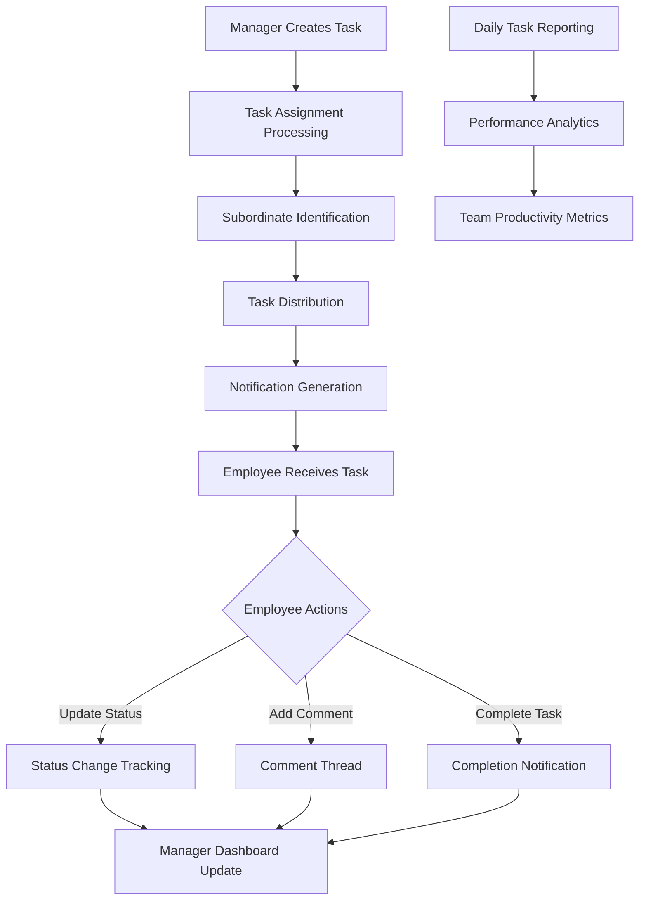
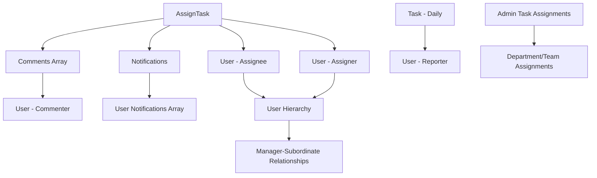

# Task Management


# Task Management API Documentation

## System Overview

The Task Management API provides a comprehensive task assignment, tracking, and reporting system for organizational workflow management. It supports hierarchical task delegation, daily task reporting, real-time notifications, and advanced analytics for productivity tracking. The system handles both assigned tasks (manager-to-employee) and self-reported daily tasks with complete audit trails and performance metrics.

## Base URL
```
/v1/task
```

## Authentication Requirements

- **All Routes**: JWT authentication required via `verifyJWT` middleware
- **Role-based Access**: Hierarchical permissions based on organizational structure
- **Manager-Subordinate Relationships**: Dynamic access control based on reporting relationships

## System Architecture Flow



## Complete Workflow Process

### 1. Task Assignment Workflow
1. **Manager Assigns Task** → Task created with priority, due date, and assignee details
2. **Subordinate Notification** → Real-time notifications sent to assigned employees
3. **Task Acknowledgment** → Employees acknowledge task receipt
4. **Progress Tracking** → Status updates and comments throughout task lifecycle
5. **Completion & Review** → Final completion with manager review capabilities

### 2. Daily Task Reporting Workflow
1. **Employee Daily Entry** → Self-reported daily tasks and activities
2. **Manager Oversight** → Managers view subordinate daily reports
3. **Performance Analytics** → Team productivity and completion rate analysis
4. **Historical Tracking** → Complete task history and performance trends

### 3. Hierarchical Management System
1. **Multi-level Reporting** → Support for complex organizational hierarchies
2. **Delegation Rights** → Managers can assign tasks to direct and indirect reports
3. **Visibility Control** → Role-based data access and task visibility
4. **Cross-department Coordination** → Department-wide task management capabilities

## API Endpoints

### User Hierarchy Management

#### Get Subordinates
**GET** `/subordinates`

**Authentication:** Required (JWT)

Retrieves all subordinates under the current manager using recursive hierarchical lookup.

**Request Parameters:**
- `search` (string, optional): Search by name or employee ID
- `level` (number, optional): Specific hierarchy level (default: all levels)

**Example Request:**
```
GET /v1/task/subordinates?search=john&level=2
```

**Success Response (200):**
```json
{
  "success": true,
  "message": "Subordinates fetched successfully",
  "count": 15,
  "data": [
    {
      "_id": "64f8b2a1c4d5e6f7g8h9i0j1",
      "first_Name": "John",
      "last_Name": "Doe",
      "designation": "Software Engineer",
      "employee_Id": "EMP001",
      "isActive": true,
      "department": "Engineering",
      "working_Email_Id": "john.doe@company.com",
      "user_Avatar": "https://cloudinary.com/avatars/john_doe.jpg",
      "assigned_to": "64f8b2a1c4d5e6f7g8h9i0j2"
    },
    {
      "_id": "64f8b2a1c4d5e6f7g8h9i0j3",
      "first_Name": "Jane",
      "last_Name": "Smith",
      "designation": "Senior Developer",
      "employee_Id": "EMP002",
      "isActive": true,
      "department": "Engineering",
      "working_Email_Id": "jane.smith@company.com",
      "user_Avatar": "https://cloudinary.com/avatars/jane_smith.jpg",
      "assigned_to": "64f8b2a1c4d5e6f7g8h9i0j1"
    }
  ]
}
```

#### Get Managers
**GET** `/managers`

**Authentication:** Required (JWT)

Retrieves managers at specific hierarchy levels above the current user.

**Request Parameters:**
- `search` (string, optional): Search by name or employee ID
- `level` (number, optional): Manager level (default: 1 = immediate manager)

**Example Request:**
```
GET /v1/task/managers?level=1
```

**Success Response (200):**
```json
{
  "success": true,
  "message": "Level 1 manager fetched successfully",
  "count": 1,
  "data": [
    {
      "_id": "64f8b2a1c4d5e6f7g8h9i0j4",
      "first_Name": "Alice",
      "last_Name": "Johnson",
      "designation": "Engineering Manager",
      "employee_Id": "MGR001",
      "isActive": true,
      "department": "Engineering",
      "working_Email_Id": "alice.johnson@company.com"
    }
  ]
}
```

#### Get Managers with Subordinates
**GET** `/both`

**Authentication:** Required (JWT)

Retrieves managers and their subordinates in a combined hierarchical view.

**Request Parameters:**
- `search` (string, optional): Search across all users
- `level` (number, optional): Manager level (default: 1)

**Success Response (200):**
```json
{
  "success": true,
  "message": "Managers at level 1 and their subordinates fetched successfully",
  "count": 25,
  "data": [
    {
      "_id": "64f8b2a1c4d5e6f7g8h9i0j4",
      "first_Name": "Alice",
      "last_Name": "Johnson",
      "designation": "Engineering Manager",
      "employee_Id": "MGR001",
      "isActive": true,
      "department": "Engineering",
      "working_Email_Id": "alice.johnson@company.com",
      "assigned_to": "64f8b2a1c4d5e6f7g8h9i0j5"
    },
    {
      "_id": "64f8b2a1c4d5e6f7g8h9i0j1",
      "first_Name": "John",
      "last_Name": "Doe",
      "designation": "Software Engineer",
      "employee_Id": "EMP001",
      "isActive": true,
      "department": "Engineering",
      "working_Email_Id": "john.doe@company.com",
      "assigned_to": "64f8b2a1c4d5e6f7g8h9i0j4"
    }
  ]
}
```

### Task Assignment

#### Assign Task (Basic)
**POST** `/assign`

**Authentication:** Required (JWT)

Assigns tasks to subordinates with automatic notification dispatch.

**Request Body:**
```json
{
  "title": "Implement User Authentication Module",
  "description": "Develop JWT-based authentication system with password reset functionality. Include unit tests and API documentation.",
  "due_date": "2024-02-15",
  "priority": "High",
  "assigned_to": ["EMP001", "EMP002"]
}
```

**Field Descriptions:**
- `title`: Task title (required)
- `description`: Detailed task description (optional)
- `due_date`: Due date in YYYY-MM-DD format (required)
- `priority`: "Low", "Medium", "High" (optional, default: "Medium")
- `assigned_to`: Employee ID(s) - string or array (required)

**Success Response (201):**
```json
{
  "success": true,
  "message": "Task assigned successfully to 2 user(s). Notifications sent.",
  "data": [
    {
      "_id": "64f8b2a1c4d5e6f7g8h9i0j6",
      "assignTaskDesc": "Implement User Authentication Module",
      "updatesComments": "Develop JWT-based authentication system with password reset functionality.",
      "assignedToEmployeeId": "EMP001",
      "assignedToName": "John Doe",
      "assignedToDesignation": "Software Engineer",
      "assignedBy": "Manager",
      "assignedByName": "Alice Johnson",
      "assignedByUserId": "64f8b2a1c4d5e6f7g8h9i0j4",
      "assignedToUserId": "64f8b2a1c4d5e6f7g8h9i0j1",
      "dueDate": "2024-02-15T00:00:00.000Z",
      "priority": "High",
      "selectedDepartment": "Engineering",
      "status": "Not Started",
      "acknowledge": "Pending",
      "comments": [],
      "createdAt": "2024-01-20T09:15:00.000Z",
      "updatedAt": "2024-01-20T09:15:00.000Z"
    }
  ]
}
```

#### Assign Task V2 (Enhanced)
**POST** `/assignv2`

**Authentication:** Required (JWT)

Enhanced task assignment with attachment support and advanced features.

**Request Body:**
```json
{
  "title": "Database Migration Project",
  "description": "Migrate user data from MySQL to PostgreSQL. Ensure zero downtime and data integrity.",
  "due_date": "2024-03-01",
  "priority": "Critical",
  "assigned_to": ["EMP001", "EMP003"],
  "attachment": "https://cloudinary.com/attachments/migration_plan.pdf"
}
```

**Success Response (201):**
```json
{
  "success": true,
  "message": "Task assigned successfully to 2 user(s).",
  "data": [
    {
      "_id": "64f8b2a1c4d5e6f7g8h9i0j7",
      "assignTaskDesc": "Database Migration Project",
      "updatesComments": "Migrate user data from MySQL to PostgreSQL.",
      "assignedToEmployeeId": "EMP001",
      "assignedToName": "John Doe",
      "assignedToDesignation": "Software Engineer",
      "assignedBy": "Manager",
      "assignedByName": "Alice Johnson",
      "assignedByUserId": "64f8b2a1c4d5e6f7g8h9i0j4",
      "assignedToUserId": "64f8b2a1c4d5e6f7g8h9i0j1",
      "dueDate": "2024-03-01T00:00:00.000Z",
      "priority": "Critical",
      "selectedDepartment": "Engineering",
      "attachment": "https://cloudinary.com/attachments/migration_plan.pdf",
      "status": "Not Started",
      "acknowledge": "Pending",
      "createdAt": "2024-01-20T09:30:00.000Z",
      "updatedAt": "2024-01-20T09:30:00.000Z"
    }
  ]
}
```

### Task Retrieval

#### Get Individual Tasks
**GET** `/individual`

**Authentication:** Required (JWT)

Retrieves all tasks assigned to the current user.

**Success Response (200):**
```json
{
  "success": true,
  "message": "Individual tasks fetched successfully.",
  "data": [
    {
      "_id": "64f8b2a1c4d5e6f7g8h9i0j6",
      "assignTaskDesc": "Implement User Authentication Module",
      "updatesComments": "Develop JWT-based authentication system",
      "assignedToEmployeeId": "EMP001",
      "assignedToName": "John Doe",
      "assignedByName": "Alice Johnson",
      "assignedByUserId": "64f8b2a1c4d5e6f7g8h9i0j4",
      "dueDate": "2024-02-15T00:00:00.000Z",
      "priority": "High",
      "status": "In Progress",
      "acknowledge": "Acknowledged",
      "comments": [
        {
          "_id": "64f8b2a1c4d5e6f7g8h9i0j8",
          "commenter": "64f8b2a1c4d5e6f7g8h9i0j1",
          "comment": "Started working on JWT implementation",
          "createdAt": "2024-01-21T10:00:00.000Z"
        }
      ],
      "createdAt": "2024-01-20T09:15:00.000Z",
      "updatedAt": "2024-01-21T10:00:00.000Z"
    }
  ]
}
```

#### Get User Tasks
**GET** `/mytasks`

**Authentication:** Required (JWT)

Retrieves tasks assigned to the current user with populated assignee information.

**Success Response (200):**
```json
{
  "success": true,
  "message": "Your tasks fetched successfully.",
  "data": [
    {
      "_id": "64f8b2a1c4d5e6f7g8h9i0j6",
      "assignTaskDesc": "Implement User Authentication Module",
      "assignedToName": "John Doe",
      "assignedByUserId": {
        "_id": "64f8b2a1c4d5e6f7g8h9i0j4",
        "first_Name": "Alice",
        "last_Name": "Johnson",
        "employee_Id": "MGR001"
      },
      "dueDate": "2024-02-15T00:00:00.000Z",
      "priority": "High",
      "status": "In Progress",
      "acknowledge": "Acknowledged",
      "createdAt": "2024-01-20T09:15:00.000Z"
    }
  ]
}
```

#### Get Tasks Assigned by Subordinates
**GET** `/assigned-by-subordinates`

**Authentication:** Required (JWT)

Retrieves tasks that were assigned by the manager's subordinates (for oversight).

**Success Response (200):**
```json
{
  "success": true,
  "message": "Tasks assigned by subordinates fetched successfully.",
  "data": [
    {
      "taskDescription": "Code Review for Authentication Module",
      "updatesComments": "Review JWT implementation and security practices",
      "assignedTo": {
        "name": "Jane Smith",
        "employeeId": "EMP002",
        "designation": "Senior Developer",
        "department": "Engineering"
      },
      "assignedBy": {
        "name": "John Doe",
        "employeeId": "EMP001",
        "role": "Team Lead"
      },
      "dueDate": "2024-01-25T00:00:00.000Z",
      "priority": "Medium",
      "status": "Not Started",
      "createdAt": "2024-01-21T11:00:00.000Z",
      "updatedAt": "2024-01-21T11:00:00.000Z"
    }
  ]
}
```

### Manager Task Management

#### Get Tasks Assigned by Manager
**GET** `/assign`

**Authentication:** Required (JWT)

Retrieves all tasks assigned by the current manager.

**Success Response (200):**
```json
{
  "success": true,
  "message": "Tasks assigned by manager fetched successfully.",
  "data": [
    {
      "_id": "64f8b2a1c4d5e6f7g8h9i0j6",
      "assignTaskDesc": "Implement User Authentication Module",
      "assignedToName": "John Doe",
      "assignedToEmployeeId": "EMP001",
      "dueDate": "2024-02-15T00:00:00.000Z",
      "priority": "High",
      "status": "In Progress",
      "acknowledge": "Acknowledged",
      "createdAt": "2024-01-20T09:15:00.000Z"
    }
  ]
}
```

#### Update Task Assigned by Manager
**PUT** `/assign/:id`

**Authentication:** Required (JWT)

Updates a task that was assigned by the current manager.

**Request Parameters:**
- `id` (string): Task ID

**Request Body:**
```json
{
  "priority": "Critical",
  "dueDate": "2024-02-10",
  "updatesComments": "Updated priority due to client requirements. Please prioritize this task."
}
```

**Success Response (200):**
```json
{
  "success": true,
  "message": "Task updated successfully.",
  "data": {
    "_id": "64f8b2a1c4d5e6f7g8h9i0j6",
    "assignTaskDesc": "Implement User Authentication Module",
    "priority": "Critical",
    "dueDate": "2024-02-10T00:00:00.000Z",
    "updatesComments": "Updated priority due to client requirements. Please prioritize this task.",
    "updatedAt": "2024-01-21T14:30:00.000Z"
  }
}
```

#### Update Task by Employee
**PUT** `/assign/emp/:id`

**Authentication:** Required (JWT)

Allows employees to update task status and progress.

**Request Body:**
```json
{
  "status": "In Progress",
  "updatesComments": "Started implementation. JWT library integrated, working on password reset functionality."
}
```

**Success Response (200):**
```json
{
  "success": true,
  "message": "Task updated successfully.",
  "data": {
    "_id": "64f8b2a1c4d5e6f7g8h9i0j6",
    "assignTaskDesc": "Implement User Authentication Module",
    "status": "In Progress",
    "updatesComments": "Started implementation. JWT library integrated, working on password reset functionality.",
    "updatedAt": "2024-01-21T15:45:00.000Z"
  }
}
```

#### Delete Task Assigned by Manager
**DELETE** `/assign/:id`

**Authentication:** Required (JWT)

Deletes a task that was assigned by the current manager.

**Request Parameters:**
- `id` (string): Task ID

**Success Response (200):**
```json
{
  "success": true,
  "message": "Task deleted successfully."
}
```

### Comments System

#### Add Comment to Task
**POST** `/comment/:taskId`

**Authentication:** Required (JWT)

Adds a comment to a specific task.

**Request Parameters:**
- `taskId` (string): Task ID

**Request Body:**
```json
{
  "comment": "Great progress on the authentication module! Please ensure you include comprehensive unit tests for the password reset functionality."
}
```

**Success Response (201):**
```json
{
  "success": true,
  "data": {
    "_id": "64f8b2a1c4d5e6f7g8h9i0j9",
    "commenter": {
      "_id": "64f8b2a1c4d5e6f7g8h9i0j4",
      "first_Name": "Alice",
      "last_Name": "Johnson"
    },
    "comment": "Great progress on the authentication module! Please ensure you include comprehensive unit tests for the password reset functionality.",
    "createdAt": "2024-01-22T09:30:00.000Z"
  }
}
```

#### Get Task Comments
**GET** `/comment/:taskId`

**Authentication:** Required (JWT)

Retrieves all comments for a specific task.

**Request Parameters:**
- `taskId` (string): Task ID

**Success Response (200):**
```json
{
  "success": true,
  "data": [
    {
      "_id": "64f8b2a1c4d5e6f7g8h9i0j8",
      "commenter": {
        "_id": "64f8b2a1c4d5e6f7g8h9i0j1",
        "first_Name": "John",
        "last_Name": "Doe"
      },
      "comment": "Started working on JWT implementation",
      "createdAt": "2024-01-21T10:00:00.000Z"
    },
    {
      "_id": "64f8b2a1c4d5e6f7g8h9i0j9",
      "commenter": {
        "_id": "64f8b2a1c4d5e6f7g8h9i0j4",
        "first_Name": "Alice",
        "last_Name": "Johnson"
      },
      "comment": "Great progress! Please include comprehensive unit tests.",
      "createdAt": "2024-01-22T09:30:00.000Z"
    }
  ]
}
```

### Daily Task Management

#### Add Daily Task
**POST** `/add-task`

**Authentication:** Required (JWT)

Adds a daily task entry for the current user.

**Request Body:**
```json
{
  "task": "Completed code review for authentication module, fixed 3 security vulnerabilities, updated API documentation",
  "task_Date": "2024-01-22"
}
```

**Field Descriptions:**
- `task`: Task description (required)
- `task_Date`: Task date in YYYY-MM-DD format (optional, defaults to current date)

**Success Response (201):**
```json
{
  "success": true,
  "message": "Task added successfully.",
  "data": {
    "_id": "64f8b2a1c4d5e6f7g8h9i0j10",
    "task": "Completed code review for authentication module, fixed 3 security vulnerabilities, updated API documentation",
    "task_Date": "2024-01-22",
    "department": "Engineering",
    "teams": "Backend Team",
    "designation": "Software Engineer",
    "employee_Id": "EMP001",
    "full_Name": "John Doe",
    "createdAt": "2024-01-22T10:15:00.000Z"
  }
}
```

#### Get Task List
**POST** `/task-list`

**Authentication:** Required (JWT)

Retrieves daily tasks with optional date filtering.

**Request Parameters:**
- `task_Date` (string, optional): Filter by specific date (YYYY-MM-DD)

**Example Request:**
```
GET /v1/task/task-list?task_Date=2024-01-22
```

**Success Response (200):**
```json
{
  "success": true,
  "message": "Tasks fetched successfully.",
  "totalCount": 25,
  "data": [
    {
      "_id": "64f8b2a1c4d5e6f7g8h9i0j10",
      "task": "Completed code review for authentication module",
      "task_Date": "2024-01-22",
      "department": "Engineering",
      "teams": "Backend Team",
      "designation": "Software Engineer",
      "employee_Id": "EMP001",
      "full_Name": "John Doe",
      "createdAt": "2024-01-22T10:15:00.000Z"
    }
  ]
}
```

#### Get All Tasks by Employee ID
**POST** `/all-task`

**Authentication:** Required (JWT)

Retrieves all daily tasks for the current user.

**Success Response (200):**
```json
{
  "success": true,
  "message": "All tasks fetched successfully.",
  "totalCount": 45,
  "data": [
    {
      "_id": "64f8b2a1c4d5e6f7g8h9i0j10",
      "task": "Completed code review for authentication module",
      "task_Date": "2024-01-22",
      "department": "Engineering",
      "employee_Id": "EMP001",
      "full_Name": "John Doe",
      "createdAt": "2024-01-22T10:15:00.000Z"
    },
    {
      "_id": "64f8b2a1c4d5e6f7g8h9i0j11",
      "task": "Fixed database connection issues in staging environment",
      "task_Date": "2024-01-21",
      "department": "Engineering",
      "employee_Id": "EMP001",
      "full_Name": "John Doe",
      "createdAt": "2024-01-21T14:30:00.000Z"
    }
  ]
}
```

### Management Analytics

#### Get Manager Tasks Dashboard
**GET** `/manager-tasks`

**Authentication:** Required (JWT)

Retrieves comprehensive task overview for managers including team statistics.

**Request Parameters:**
- `task_Date` (string, optional): Filter by specific date

**Success Response (200):**
```json
{
  "success": true,
  "message": "Tasks fetched successfully.",
  "stats": {
    "totalTeamMembers": 15,
    "reportedCount": 12,
    "notReportedCount": 3,
    "completionRate": "80.00%"
  },
  "data": [
    {
      "_id": "64f8b2a1c4d5e6f7g8h9i0j10",
      "task": "Completed user authentication implementation",
      "task_Date": "2024-01-22",
      "department": "Engineering",
      "employee_Id": "EMP001",
      "full_Name": "John Doe",
      "user_Avatar": "https://cloudinary.com/avatars/john_doe.jpg",
      "createdAt": "2024-01-22T10:15:00.000Z"
    }
  ]
}
```

#### Get Task Status Summary
**GET** `/task-status`

**Authentication:** Required (JWT)

Retrieves task completion statistics for a specific employee.

**Request Parameters:**
- `employee_Id` (string, required): Employee ID for status summary

**Example Request:**
```
GET /v1/task/task-status?employee_Id=EMP001
```

**Success Response (200):**
```json
{
  "success": true,
  "data": {
    "Done": 8,
    "Pending": 3,
    "Delay": 2
  }
}
```

**Status Definitions:**
- **Done**: Tasks with status "Completed"
- **Pending**: Tasks with status "In Progress" or "Not Started" within due date
- **Delay**: Tasks past due date and not completed

#### Get Subordinate Departments
**GET** `/subordinate/department`

**Authentication:** Required (JWT)

Retrieves unique departments of all subordinates under the current manager.

**Success Response (200):**
```json
{
  "success": true,
  "message": "Departments fetched successfully",
  "data": [
    "Engineering",
    "Quality Assurance",
    "DevOps",
    "Product Management"
  ]
}
```

### Task Acknowledgment

#### Acknowledge Task Assignment
**PATCH** `/assign/acknowledge/:taskid`

**Authentication:** Required (JWT)

Marks a task as acknowledged by the assignee.

**Request Parameters:**
- `taskid` (string): Task ID to acknowledge

**Success Response (200):**
```json
{
  "success": true,
  "message": "Task acknowledged successfully."
}
```

**Error Response:**
```json
{
  "success": false,
  "message": "Task is already acknowledged."
}
```

### Employee Task Queries

#### Get Tasks by Employee ID
**GET** `/assign/employee/:employeeId`

**Authentication:** Required (JWT)

Retrieves all assigned tasks for a specific employee.

**Request Parameters:**
- `employeeId` (string): Employee ID

**Success Response (200):**
```json
{
  "success": true,
  "data": [
    {
      "_id": "64f8b2a1c4d5e6f7g8h9i0j6",
      "assignTaskDesc": "Implement User Authentication Module",
      "assignedToEmployeeId": "EMP001",
      "dueDate": "2024-02-15T00:00:00.000Z",
      "priority": "High",
      "status": "In Progress",
      "acknowledge": "Acknowledged"
    }
  ]
}
```

#### Get Daily Tasks by Employee ID
**GET** `/daily/employee/:employeeId`

**Authentication:** Required (JWT)

Retrieves daily task reports for a specific employee.

**Request Parameters:**
- `employeeId` (string): Employee ID

**Success Response (200):**
```json
{
  "success": true,
  "data": [
    {
      "_id": "64f8b2a1c4d5e6f7g8h9i0j10",
      "task": "Completed code review and bug fixes",
      "task_Date": "2024-01-22",
      "employee_Id": "EMP001",
      "full_Name": "John Doe",
      "department": "Engineering",
      "createdAt": "2024-01-22T10:15:00.000Z"
    }
  ]
}
```

### Admin Task Management

#### Create Admin Task Assignment
**POST** `/assigntask`

**Authentication:** Required (JWT)

Creates administrative task assignments for departments/teams.

**Request Body:**
```json
{
  "assignTaskDesc": "Q1 Performance Reviews",
  "dueDate": "2024-03-31",
  "priority": "Medium",
  "updatesComments": "Complete performance reviews for all team members by end of Q1",
  "selectedDepartment": "Human Resources",
  "selectedTeam": ["HR Operations", "Recruitment"]
}
```

**Success Response (201):**
```json
{
  "success": true,
  "message": "Task created successfully",
  "data": {
    "_id": "64f8b2a1c4d5e6f7g8h9i0j12",
    "assignedBy": "Admin",
    "assignedByName": "System Administrator",
    "assignTaskDesc": "Q1 Performance Reviews",
    "dueDate": "2024-03-31T00:00:00.000Z",
    "priority": "Medium",
    "updatesComments": "Complete performance reviews for all team members",
    "selectedDepartment": "Human Resources",
    "selectedTeam": ["HR Operations", "Recruitment"],
    "assignTo": "Human Resources - HR Operations, Recruitment",
    "createdAt": "2024-01-20T11:00:00.000Z"
  }
}
```

#### Get All Task Assignments
**GET** `/assigntask`

**Authentication:** Required (JWT)

Retrieves all administrative task assignments.

**Success Response (200):**
```json
{
  "success": true,
  "message": "Task assignments fetched successfully.",
  "totalCount": 10,
  "data": [
    {
      "_id": "64f8b2a1c4d5e6f7g8h9i0j12",
      "assignTaskDesc": "Q1 Performance Reviews",
      "selectedDepartment": "Human Resources",
      "assignTo": "Human Resources - HR Operations, Recruitment",
      "dueDate": "2024-03-31T00:00:00.000Z",
      "priority": "Medium",
      "createdAt": "2024-01-20T11:00:00.000Z"
    }
  ]
}
```

#### Get Task Assignment by ID
**GET** `/assigntask/:id`

**Authentication:** Required (JWT)

Retrieves a specific task assignment by ID.

**Request Parameters:**
- `id` (string): Task assignment ID

**Success Response (200):**
```json
{
  "success": true,
  "message": "Task assignment fetched successfully.",
  "data": {
    "_id": "64f8b2a1c4d5e6f7g8h9i0j12",
    "assignTaskDesc": "Q1 Performance Reviews",
    "assignedBy": "Admin",
    "assignedByName": "System Administrator",
    "selectedDepartment": "Human Resources",
    "selectedTeam": ["HR Operations", "Recruitment"],
    "dueDate": "2024-03-31T00:00:00.000Z",
    "priority": "Medium",
    "updatesComments": "Complete performance reviews for all team members",
    "createdAt": "2024-01-20T11:00:00.000Z"
  }
}
```

#### Update Task Assignment
**PUT** `/assigntask/:id`

**Authentication:** Required (JWT)

Updates an administrative task assignment.

**Request Parameters:**
- `id` (string): Task assignment ID

**Request Body:**
```json
{
  "assignTaskDesc": "Q1 Performance Reviews - Updated",
  "priority": "High",
  "dueDate": "2024-03-25",
  "updatesComments": "Moved deadline earlier due to board meeting requirements"
}
```

**Success Response (200):**
```json
{
  "success": true,
  "message": "Task assignment updated successfully.",
  "data": {
    "_id": "64f8b2a1c4d5e6f7g8h9i0j12",
    "assignTaskDesc": "Q1 Performance Reviews - Updated",
    "priority": "High",
    "dueDate": "2024-03-25T00:00:00.000Z",
    "updatesComments": "Moved deadline earlier due to board meeting requirements",
    "updatedAt": "2024-01-23T09:00:00.000Z"
  }
}
```

#### Delete Task Assignment
**DELETE** `/assigntask/:id`

**Authentication:** Required (JWT)

Deletes an administrative task assignment.

**Request Parameters:**
- `id` (string): Task assignment ID

**Success Response (200):**
```json
{
  "success": true,
  "message": "Task assignment deleted successfully.",
  "totalCount": 9
}
```

## Frontend Integration Examples

### JavaScript/React Integration

```javascript
// API Configuration
const API_BASE_URL = 'https://your-api-domain.com/v1/task';

const getAuthHeaders = () => ({
  'Authorization': `Bearer ${localStorage.getItem('authToken')}`,
  'Content-Type': 'application/json'
});

// Task Management Service Class
class TaskManagementService {
  
  // Get subordinates with search
  async getSubordinates(search = '', level = null) {
    try {
      const params = new URLSearchParams();
      if (search) params.append('search', search);
      if (level) params.append('level', level);
      
      const response = await fetch(`${API_BASE_URL}/subordinates?${params}`, {
        method: 'GET',
        headers: getAuthHeaders()
      });

      if (!response.ok) {
        throw new Error(`HTTP error! status: ${response.status}`);
      }

      return await response.json();
    } catch (error) {
      console.error('Error fetching subordinates:', error);
      throw error;
    }
  }

  // Assign task to employees
  async assignTask(taskData) {
    try {
      const response = await fetch(`${API_BASE_URL}/assign`, {
        method: 'POST',
        headers: getAuthHeaders(),
        body: JSON.stringify(taskData)
      });

      if (!response.ok) {
        const errorData = await response.json();
        throw new Error(errorData.message || 'Failed to assign task');
      }

      return await response.json();
    } catch (error) {
      console.error('Error assigning task:', error);
      throw error;
    }
  }

  // Assign task with attachments (V2)
  async assignTaskV2(taskData) {
    try {
      const response = await fetch(`${API_BASE_URL}/assignv2`, {
        method: 'POST',
        headers: getAuthHeaders(),
        body: JSON.stringify(taskData)
      });

      if (!response.ok) {
        const errorData = await response.json();
        throw new Error(errorData.message || 'Failed to assign task');
      }

      return await response.json();
    } catch (error) {
      console.error('Error assigning task V2:', error);
      throw error;
    }
  }

  // Get user's assigned tasks
  async getMyTasks() {
    try {
      const response = await fetch(`${API_BASE_URL}/mytasks`, {
        method: 'GET',
        headers: getAuthHeaders()
      });

      return await response.json();
    } catch (error) {
      console.error('Error fetching my tasks:', error);
      throw error;
    }
  }

  // Get tasks assigned by manager
  async getTasksAssignedByManager() {
    try {
      const response = await fetch(`${API_BASE_URL}/assign`, {
        method: 'GET',
        headers: getAuthHeaders()
      });

      return await response.json();
    } catch (error) {
      console.error('Error fetching manager tasks:', error);
      throw error;
    }
  }

  // Update task status
  async updateTaskStatus(taskId, updateData) {
    try {
      const response = await fetch(`${API_BASE_URL}/assign/emp/${taskId}`, {
        method: 'PUT',
        headers: getAuthHeaders(),
        body: JSON.stringify(updateData)
      });

      if (!response.ok) {
        const errorData = await response.json();
        throw new Error(errorData.message || 'Failed to update task');
      }

      return await response.json();
    } catch (error) {
      console.error('Error updating task status:', error);
      throw error;
    }
  }

  // Add comment to task
  async addComment(taskId, comment) {
    try {
      const response = await fetch(`${API_BASE_URL}/comment/${taskId}`, {
        method: 'POST',
        headers: getAuthHeaders(),
        body: JSON.stringify({ comment })
      });

      if (!response.ok) {
        const errorData = await response.json();
        throw new Error(errorData.message || 'Failed to add comment');
      }

      return await response.json();
    } catch (error) {
      console.error('Error adding comment:', error);
      throw error;
    }
  }

  // Get task comments
  async getTaskComments(taskId) {
    try {
      const response = await fetch(`${API_BASE_URL}/comment/${taskId}`, {
        method: 'GET',
        headers: getAuthHeaders()
      });

      return await response.json();
    } catch (error) {
      console.error('Error fetching comments:', error);
      throw error;
    }
  }

  // Add daily task
  async addDailyTask(taskDescription, taskDate = null) {
    try {
      const requestBody = { task: taskDescription };
      if (taskDate) {
        requestBody.task_Date = taskDate;
      }

      const response = await fetch(`${API_BASE_URL}/add-task`, {
        method: 'POST',
        headers: getAuthHeaders(),
        body: JSON.stringify(requestBody)
      });

      if (!response.ok) {
        const errorData = await response.json();
        throw new Error(errorData.message || 'Failed to add daily task');
      }

      return await response.json();
    } catch (error) {
      console.error('Error adding daily task:', error);
      throw error;
    }
  }

  // Get manager dashboard data
  async getManagerDashboard(taskDate = null) {
    try {
      const params = new URLSearchParams();
      if (taskDate) params.append('task_Date', taskDate);
      
      const response = await fetch(`${API_BASE_URL}/manager-tasks?${params}`, {
        method: 'GET',
        headers: getAuthHeaders()
      });

      return await response.json();
    } catch (error) {
      console.error('Error fetching manager dashboard:', error);
      throw error;
    }
  }

  // Get task status summary
  async getTaskStatusSummary(employeeId) {
    try {
      const response = await fetch(`${API_BASE_URL}/task-status?employee_Id=${employeeId}`, {
        method: 'GET',
        headers: getAuthHeaders()
      });

      return await response.json();
    } catch (error) {
      console.error('Error fetching task status summary:', error);
      throw error;
    }
  }

  // Acknowledge task assignment
  async acknowledgeTask(taskId) {
    try {
      const response = await fetch(`${API_BASE_URL}/assign/acknowledge/${taskId}`, {
        method: 'PATCH',
        headers: getAuthHeaders()
      });

      if (!response.ok) {
        const errorData = await response.json();
        throw new Error(errorData.message || 'Failed to acknowledge task');
      }

      return await response.json();
    } catch (error) {
      console.error('Error acknowledging task:', error);
      throw error;
    }
  }
}

// React Hook for Task Management
import { useState, useEffect } from 'react';

const useTasks = (userRole = 'employee') => {
  const [tasks, setTasks] = useState([]);
  const [subordinates, setSubordinates] = useState([]);
  const [loading, setLoading] = useState(false);
  const [error, setError] = useState(null);
  
  const taskService = new TaskManagementService();

  const fetchTasks = async () => {
    setLoading(true);
    setError(null);
    
    try {
      let response;
      if (userRole === 'manager') {
        response = await taskService.getTasksAssignedByManager();
      } else {
        response = await taskService.getMyTasks();
      }
      
      if (response.success) {
        setTasks(response.data);
      } else {
        setError(response.message);
      }
    } catch (err) {
      setError(err.message);
    } finally {
      setLoading(false);
    }
  };

  const fetchSubordinates = async (search = '') => {
    if (userRole !== 'manager') return;
    
    try {
      const response = await taskService.getSubordinates(search);
      if (response.success) {
        setSubordinates(response.data);
      }
    } catch (err) {
      setError(err.message);
    }
  };

  const assignTask = async (taskData) => {
    setLoading(true);
    try {
      const response = await taskService.assignTask(taskData);
      if (response.success) {
        await fetchTasks(); // Refresh task list
        return response;
      } else {
        throw new Error(response.message);
      }
    } catch (err) {
      setError(err.message);
      throw err;
    } finally {
      setLoading(false);
    }
  };

  const updateTaskStatus = async (taskId, updateData) => {
    try {
      const response = await taskService.updateTaskStatus(taskId, updateData);
      if (response.success) {
        await fetchTasks(); // Refresh task list
        return response;
      } else {
        throw new Error(response.message);
      }
    } catch (err) {
      setError(err.message);
      throw err;
    }
  };

  useEffect(() => {
    fetchTasks();
    if (userRole === 'manager') {
      fetchSubordinates();
    }
  }, [userRole]);

  return {
    tasks,
    subordinates,
    loading,
    error,
    fetchTasks,
    fetchSubordinates,
    assignTask,
    updateTaskStatus
  };
};

// Task Assignment Component
const TaskAssignmentForm = () => {
  const [formData, setFormData] = useState({
    title: '',
    description: '',
    due_date: '',
    priority: 'Medium',
    assigned_to: []
  });
  const [selectedEmployees, setSelectedEmployees] = useState([]);
  const { subordinates, assignTask, loading } = useTasks('manager');

  const handleSubmit = async (e) => {
    e.preventDefault();
    
    if (!formData.title || !formData.due_date || selectedEmployees.length === 0) {
      alert('Please fill in all required fields and select at least one employee');
      return;
    }

    const taskData = {
      ...formData,
      assigned_to: selectedEmployees.map(emp => emp.employee_Id)
    };

    try {
      await assignTask(taskData);
      alert('Task assigned successfully!');
      
      // Reset form
      setFormData({
        title: '',
        description: '',
        due_date: '',
        priority: 'Medium',
        assigned_to: []
      });
      setSelectedEmployees([]);
    } catch (error) {
      alert(`Error: ${error.message}`);
    }
  };

  return (
    
      
        Task Title *
         setFormData({...formData, title: e.target.value})}
          placeholder="Enter task title"
          required
        />
      

      
        Description
         setFormData({...formData, description: e.target.value})}
          placeholder="Enter task description"
        />
      

      
        
          Due Date *
           setFormData({...formData, due_date: e.target.value})}
            min={new Date().toISOString().split('T')[0]}
            required
          />
        

        
          Priority
           setFormData({...formData, priority: e.target.value})}
          >
            Low
            Medium
            High
            Critical
          
        
      

      
        Assign To *
        
          {subordinates.map(emp => (
            
               selected._id === emp._id)}
                onChange={(e) => {
                  if (e.target.checked) {
                    setSelectedEmployees([...selectedEmployees, emp]);
                  } else {
                    setSelectedEmployees(selectedEmployees.filter(selected => selected._id !== emp._id));
                  }
                }}
              />
              
                
                {emp.first_Name} {emp.last_Name} ({emp.employee_Id})
                {emp.designation} - {emp.department}
              
            
          ))}
        
        
        {selectedEmployees.length > 0 && (
          
            Selected Employees ({selectedEmployees.length}):
            
              {selectedEmployees.map(emp => (
                
                  {emp.first_Name} {emp.last_Name}
                   setSelectedEmployees(selectedEmployees.filter(selected => selected._id !== emp._id))}
                    className="remove-employee"
                  >
                    ×
                  
                
              ))}
            
          
        )}
      

      
        {loading ? 'Assigning Task...' : 'Assign Task'}
      
    
  );
};

// Task Dashboard Component
const TaskDashboard = ({ userRole }) => {
  const { tasks, loading, updateTaskStatus } = useTasks(userRole);
  const [selectedTask, setSelectedTask] = useState(null);

  const getStatusColor = (status) => {
    switch (status) {
      case 'Not Started': return '#6c757d';
      case 'In Progress': return '#007bff';
      case 'Completed': return '#28a745';
      default: return '#6c757d';
    }
  };

  const getPriorityColor = (priority) => {
    switch (priority) {
      case 'Low': return '#28a745';
      case 'Medium': return '#ffc107';
      case 'High': return '#fd7e14';
      case 'Critical': return '#dc3545';
      default: return '#6c757d';
    }
  };

  const handleStatusChange = async (taskId, newStatus) => {
    try {
      await updateTaskStatus(taskId, { status: newStatus });
      alert('Task status updated successfully');
    } catch (error) {
      alert(`Error: ${error.message}`);
    }
  };

  if (loading) return Loading tasks...;

  return (
    
      
        {userRole === 'manager' ? 'Assigned Tasks' : 'My Tasks'}
        
          
            {tasks.length}
            Total Tasks
          
          
            {tasks.filter(t => t.status === 'Completed').length}
            Completed
          
          
            {tasks.filter(t => t.status === 'In Progress').length}
            In Progress
          
          
            {tasks.filter(t => new Date(t.dueDate) 
            Overdue
          
        
      

      
        
          
            
              Task
              {userRole === 'manager' && Assigned To}
              Due Date
              Priority
              Status
              Actions
            
          
          
            {tasks.map(task => (
              
                
                  {task.assignTaskDesc}
                  {task.updatesComments}
                
                {userRole === 'manager' && (
                  
                    
                      {task.assignedToName}
                      {task.assignedToEmployeeId}
                    
                  
                )}
                
                  
                    {new Date(task.dueDate).toLocaleDateString()}
                  
                
                
                  
                    {task.priority}
                  
                
                
                  
                    {task.status}
                  
                
                
                  
                    {userRole === 'employee' && task.status !== 'Completed' && (
                       handleStatusChange(task._id, e.target.value)}
                        className="status-selector"
                      >
                        Not Started
                        In Progress
                        Completed
                      
                    )}
                     setSelectedTask(task)}
                      className="view-details-btn"
                    >
                      View Details
                    
                  
                
              
            ))}
          
        
      

      {selectedTask && (
         setSelectedTask(null)}
        />
      )}
    
  );
};

// Daily Task Reporter Component
const DailyTaskReporter = () => {
  const [taskDescription, setTaskDescription] = useState('');
  const [taskDate, setTaskDate] = useState(new Date().toISOString().split('T')[0]);
  const [loading, setLoading] = useState(false);
  
  const taskService = new TaskManagementService();

  const handleSubmit = async (e) => {
    e.preventDefault();
    
    if (!taskDescription.trim()) {
      alert('Please enter a task description');
      return;
    }

    setLoading(true);
    try {
      const response = await taskService.addDailyTask(taskDescription, taskDate);
      if (response.success) {
        alert('Daily task added successfully!');
        setTaskDescription('');
      } else {
        alert(`Error: ${response.message}`);
      }
    } catch (error) {
      alert(`Error: ${error.message}`);
    } finally {
      setLoading(false);
    }
  };

  return (
    
      Daily Task Report
      
      
        
          Date
           setTaskDate(e.target.value)}
            max={new Date().toISOString().split('T')[0]}
          />
        

        
          What did you work on today? *
           setTaskDescription(e.target.value)}
            placeholder="Describe your tasks, achievements, and progress for today..."
            required
          />
          
            Be specific about tasks completed, issues resolved, meetings attended, etc.
          
        

        
          {loading ? 'Submitting...' : 'Submit Daily Task'}
        
      
    
  );
};
```

## Security Features

### Authentication & Authorization
- **JWT Token Validation**: All endpoints require valid JWT authentication
- **Hierarchical Access Control**: Users can only access data within their organizational hierarchy
- **Role-based Permissions**: Different capabilities for employees, managers, and administrators
- **Ownership Validation**: Users can only modify tasks they created or are assigned to

### Data Protection
- **Input Sanitization**: All inputs validated and sanitized to prevent injection attacks
- **SQL Injection Prevention**: MongoDB with parameterized queries and proper schema validation
- **Cross-hierarchy Security**: Strict enforcement of organizational boundaries
- **Audit Trail**: Complete logging of all task assignments and status changes

### Notification Security
- **Targeted Notifications**: Only relevant users receive notifications
- **Data Minimization**: Notifications contain only necessary information
- **Rate Limiting**: Protection against notification spam and abuse
- **Secure Channels**: Encrypted notification delivery mechanisms

### File Attachment Security
- **File Type Validation**: Restricted to safe file formats only
- **Size Limitations**: Configurable file size limits to prevent abuse
- **Secure Storage**: Files stored with access controls and encryption
- **Virus Scanning**: Integration with security scanning services (where applicable)

## Error Handling

### Common Error Responses

#### Authentication Errors (401)
```json
{
  "success": false,
  "message": "Unauthorized request. Token not provided."
}
```

#### Authorization Errors (403)
```json
{
  "success": false,
  "message": "Not authorized to update this task."
}
```

#### Validation Errors (400)
```json
{
  "success": false,
  "message": "Task title, due date, and assigned_to are required."
}
```

#### Resource Not Found (404)
```json
{
  "success": false,
  "message": "Task not found or you're not authorized to access it."
}
```

#### Server Errors (500)
```json
{
  "success": false,
  "message": "Server error",
  "error": "Internal processing error details"
}
```

### Error Handling Implementation

```javascript
// Comprehensive error handler
const handleTaskError = (error, context) => {
  console.error(`Task Management Error in ${context}:`, error);

  if (error.status === 401) {
    localStorage.removeItem('authToken');
    window.location.href = '/login';
    return 'Session expired. Please login again.';
  }
  
  if (error.status === 403) {
    return 'You do not have permission to perform this action.';
  }
  
  if (error.status === 404) {
    return 'The requested task could not be found.';
  }
  
  if (error.status === 400) {
    return error.message || 'Invalid request. Please check your input.';
  }
  
  if (error.status >= 500) {
    return 'Server error. Please try again later or contact support.';
  }
  
  return error.message || 'An unexpected error occurred.';
};

// Usage in API calls
try {
  const response = await taskService.assignTask(taskData);
} catch (error) {
  const errorMessage = handleTaskError(error, 'Assign Task');
  setError(errorMessage);
}
```

## Testing Guide

### cURL Commands

#### Get Subordinates
```bash
# Get all subordinates
curl -X GET "http://localhost:3000/v1/task/subordinates" \
  -H "Authorization: Bearer YOUR_JWT_TOKEN"

# Search subordinates
curl -X GET "http://localhost:3000/v1/task/subordinates?search=john&level=1" \
  -H "Authorization: Bearer YOUR_JWT_TOKEN"
```

#### Assign Task
```bash
# Assign task to single employee
curl -X POST "http://localhost:3000/v1/task/assign" \
  -H "Authorization: Bearer YOUR_JWT_TOKEN" \
  -H "Content-Type: application/json" \
  -d '{
    "title": "Implement API Authentication",
    "description": "Add JWT authentication to all API endpoints",
    "due_date": "2024-02-15",
    "priority": "High",
    "assigned_to": "EMP001"
  }'

# Assign task to multiple employees
curl -X POST "http://localhost:3000/v1/task/assign" \
  -H "Authorization: Bearer YOUR_JWT_TOKEN" \
  -H "Content-Type: application/json" \
  -d '{
    "title": "Code Review Sprint",
    "description": "Review and approve pending pull requests",
    "due_date": "2024-02-10",
    "priority": "Medium",
    "assigned_to": ["EMP001", "EMP002", "EMP003"]
  }'
```

#### Get User Tasks
```bash
# Get tasks assigned to current user
curl -X GET "http://localhost:3000/v1/task/mytasks" \
  -H "Authorization: Bearer YOUR_JWT_TOKEN"

# Get individual tasks (alternative endpoint)
curl -X GET "http://localhost:3000/v1/task/individual" \
  -H "Authorization: Bearer YOUR_JWT_TOKEN"
```

#### Update Task Status
```bash
# Update task status as employee
curl -X PUT "http://localhost:3000/v1/task/assign/emp/TASK_ID" \
  -H "Authorization: Bearer YOUR_JWT_TOKEN" \
  -H "Content-Type: application/json" \
  -d '{
    "status": "In Progress",
    "updatesComments": "Started working on authentication implementation"
  }'
```

#### Add Task Comment
```bash
# Add comment to task
curl -X POST "http://localhost:3000/v1/task/comment/TASK_ID" \
  -H "Authorization: Bearer YOUR_JWT_TOKEN" \
  -H "Content-Type: application/json" \
  -d '{
    "comment": "Great progress! Please ensure you add unit tests for the authentication module."
  }'
```

#### Daily Task Management
```bash
# Add daily task
curl -X POST "http://localhost:3000/v1/task/add-task" \
  -H "Authorization: Bearer YOUR_JWT_TOKEN" \
  -H "Content-Type: application/json" \
  -d '{
    "task": "Completed authentication module implementation, fixed 3 bugs, reviewed 2 PRs",
    "task_Date": "2024-01-22"
  }'

# Get manager dashboard
curl -X GET "http://localhost:3000/v1/task/manager-tasks?task_Date=2024-01-22" \
  -H "Authorization: Bearer YOUR_JWT_TOKEN"
```

#### Task Status and Analytics
```bash
# Get task status summary
curl -X GET "http://localhost:3000/v1/task/task-status?employee_Id=EMP001" \
  -H "Authorization: Bearer YOUR_JWT_TOKEN"

# Acknowledge task assignment
curl -X PATCH "http://localhost:3000/v1/task/assign/acknowledge/TASK_ID" \
  -H "Authorization: Bearer YOUR_JWT_TOKEN"
```

### Postman Collection

```json
{
  "info": {
    "name": "Task Management API",
    "schema": "https://schema.getpostman.com/json/collection/v2.1.0/collection.json"
  },
  "auth": {
    "type": "bearer",
    "bearer": [
      {
        "key": "token",
        "value": "{{authToken}}",
        "type": "string"
      }
    ]
  },
  "variable": [
    {
      "key": "baseUrl",
      "value": "http://localhost:3000/v1/task"
    }
  ],
  "item": [
    {
      "name": "User Hierarchy",
      "item": [
        {
          "name": "Get Subordinates",
          "request": {
            "method": "GET",
            "url": "{{baseUrl}}/subordinates",
            "header": []
          }
        },
        {
          "name": "Get Managers",
          "request": {
            "method": "GET",
            "url": {
              "raw": "{{baseUrl}}/managers?level=1",
              "host": ["{{baseUrl}}"],
              "path": ["managers"],
              "query": [
                {
                  "key": "level",
                  "value": "1"
                }
              ]
            }
          }
        }
      ]
    },
    {
      "name": "Task Assignment",
      "item": [
        {
          "name": "Assign Task",
          "request": {
            "method": "POST",
            "url": "{{baseUrl}}/assign",
            "body": {
              "mode": "raw",
              "raw": "{\n  \"title\": \"Implement User Authentication\",\n  \"description\": \"Add JWT authentication to all API endpoints\",\n  \"due_date\": \"2024-02-15\",\n  \"priority\": \"High\",\n  \"assigned_to\": [\"EMP001\"]\n}",
              "options": {
                "raw": {
                  "language": "json"
                }
              }
            }
          }
        },
        {
          "name": "Assign Task V2",
          "request": {
            "method": "POST",
            "url": "{{baseUrl}}/assignv2",
            "body": {
              "mode": "raw",
              "raw": "{\n  \"title\": \"Database Migration\",\n  \"description\": \"Migrate from MySQL to PostgreSQL\",\n  \"due_date\": \"2024-03-01\",\n  \"priority\": \"Critical\",\n  \"assigned_to\": [\"EMP001\", \"EMP002\"],\n  \"attachment\": \"https://example.com/migration-plan.pdf\"\n}",
              "options": {
                "raw": {
                  "language": "json"
                }
              }
            }
          }
        }
      ]
    },
    {
      "name": "Task Management",
      "item": [
        {
          "name": "Get My Tasks",
          "request": {
            "method": "GET",
            "url": "{{baseUrl}}/mytasks"
          }
        },
        {
          "name": "Update Task Status",
          "request": {
            "method": "PUT",
            "url": "{{baseUrl}}/assign/emp/{{taskId}}",
            "body": {
              "mode": "raw",
              "raw": "{\n  \"status\": \"In Progress\",\n  \"updatesComments\": \"Started working on the task\"\n}",
              "options": {
                "raw": {
                  "language": "json"
                }
              }
            }
          }
        }
      ]
    }
  ]
}
```

### Integration Testing Examples

```javascript
// Jest Test Examples
describe('Task Management API Integration Tests', () => {
  let authToken;
  let managerId;
  let subordinateId;
  let createdTaskId;
  
  beforeAll(async () => {
    // Setup test users and authentication
    const loginResponse = await request(app)
      .post('/auth/login')
      .send({ username: 'testmanager', password: 'testpass' });
    
    authToken = loginResponse.body.accessToken;
    managerId = loginResponse.body.user._id;

    // Create test subordinate
    const subordinateResponse = await request(app)
      .post('/auth/register')
      .send({
        username: 'testemployee',
        password: 'testpass',
        first_Name: 'Test',
        last_Name: 'Employee',
        employee_Id: 'EMP999',
        assigned_to: managerId
      });
    
    subordinateId = subordinateResponse.body.user._id;
  });

  test('Should get subordinates successfully', async () => {
    const response = await request(app)
      .get('/v1/task/subordinates')
      .set('Authorization', `Bearer ${authToken}`);

    expect(response.status).toBe(200);
    expect(response.body.success).toBe(true);
    expect(Array.isArray(response.body.data)).toBe(true);
    expect(response.body.data.some(sub => sub._id === subordinateId)).toBe(true);
  });

  test('Should assign task to subordinate', async () => {
    const taskData = {
      title: 'Test Task Assignment',
      description: 'This is a test task for integration testing',
      due_date: '2024-12-31',
      priority: 'Medium',
      assigned_to: ['EMP999']
    };

    const response = await request(app)
      .post('/v1/task/assign')
      .set('Authorization', `Bearer ${authToken}`)
      .send(taskData);

    expect(response.status).toBe(201);
    expect(response.body.success).toBe(true);
    expect(response.body.data).toHaveLength(1);
    expect(response.body.data[0].assignTaskDesc).toBe(taskData.title);
    
    createdTaskId = response.body.data[0]._id;
  });

  test('Should get assigned tasks for employee', async () => {
    // Login as subordinate
    const empLogin = await request(app)
      .post('/auth/login')
      .send({ username: 'testemployee', password: 'testpass' });

    const response = await request(app)
      .get('/v1/task/mytasks')
      .set('Authorization', `Bearer ${empLogin.body.accessToken}`);

    expect(response.status).toBe(200);
    expect(response.body.success).toBe(true);
    expect(response.body.data.some(task => task._id === createdTaskId)).toBe(true);
  });

  test('Should update task status by employee', async () => {
    const empLogin = await request(app)
      .post('/auth/login')
      .send({ username: 'testemployee', password: 'testpass' });

    const updateData = {
      status: 'In Progress',
      updatesComments: 'Started working on the assigned task'
    };

    const response = await request(app)
      .put(`/v1/task/assign/emp/${createdTaskId}`)
      .set('Authorization', `Bearer ${empLogin.body.accessToken}`)
      .send(updateData);

    expect(response.status).toBe(200);
    expect(response.body.success).toBe(true);
    expect(response.body.data.status).toBe('In Progress');
  });

  test('Should add comment to task', async () => {
    const comment = 'This is a test comment for the task';

    const response = await request(app)
      .post(`/v1/task/comment/${createdTaskId}`)
      .set('Authorization', `Bearer ${authToken}`)
      .send({ comment });

    expect(response.status).toBe(201);
    expect(response.body.success).toBe(true);
    expect(response.body.data.comment).toBe(comment);
  });

  test('Should acknowledge task assignment', async () => {
    const empLogin = await request(app)
      .post('/auth/login')
      .send({ username: 'testemployee', password: 'testpass' });

    const response = await request(app)
      .patch(`/v1/task/assign/acknowledge/${createdTaskId}`)
      .set('Authorization', `Bearer ${empLogin.body.accessToken}`);

    expect(response.status).toBe(200);
    expect(response.body.success).toBe(true);
    expect(response.body.message).toContain('acknowledged');
  });

  afterAll(async () => {
    // Cleanup test data
    if (createdTaskId) {
      await request(app)
        .delete(`/v1/task/assign/${createdTaskId}`)
        .set('Authorization', `Bearer ${authToken}`);
    }
  });
});
```

## Database Schema

### AssignTask Model Structure

```javascript
// AssignTask Schema Structure (Primary Task Assignment Model)
{
  _id: ObjectId,
  
  // Task Details
  assignTaskDesc: String,          // Task title/description
  updatesComments: String,         // Additional details or updates
  dueDate: Date,                   // Task due date
  priority: String,                // "Low", "Medium", "High", "Critical"
  
  // Assignment Information
  assignedToEmployeeId: String,    // Employee ID of assignee
  assignedToName: String,          // Full name of assignee
  assignedToDesignation: String,   // Job title of assignee
  assignedToUserId: ObjectId,      // User document reference of assignee
  assignedToDepartment: String,    // Department of assignee
  
  // Assigner Information
  assignedBy: String,              // Role of person who assigned
  assignedByName: String,          // Full name of assigner
  assignedByUserId: ObjectId,      // User document reference of assigner
  
  // Task Management
  status: String,                  // "Not Started", "In Progress", "Completed"
  acknowledge: String,             // "Pending", "Acknowledged"
  selectedDepartment: String,      // Target department
  selectedTeam: [String],          // Target teams (if applicable)
  
  // Attachments
  attachment: String,              // File attachment URL (single)
  attachments: [                   // Multiple attachments array
    {
      url: String,                 // File URL
      name: String,                // Original filename
      uploadedAt: Date             // Upload timestamp
    }
  ],
  
  // Comments System
  comments: [
    {
      _id: ObjectId,
      commenter: ObjectId,         // Reference to User who commented
      comment: String,             // Comment text
      createdAt: Date              // Comment timestamp
    }
  ],
  
  // Administrative Fields
  assignTo: String,                // Formatted assignment string for display
  assignedType: String,            // "individual", "team", "department"
  assignedToDepartment: [String],  // Multiple departments (for admin assignments)
  assignedToTeam: [String],        // Multiple teams (for admin assignments)
  
  // Timestamps
  createdAt: Date,                 // Task creation time
  updatedAt: Date                  // Last update time
}
```

### Task Model Structure (Daily Tasks)

```javascript
// Task Schema Structure (Daily Task Reporting Model)
{
  _id: ObjectId,
  
  // Task Content
  task: String,                    // Daily task description
  task_Date: String,               // Date in formatted string (YYYY-MM-DD)
  
  // Employee Information
  employee_Id: String,             // Employee ID
  full_Name: String,               // Employee full name
  designation: String,             // Job title
  department: String,              // Employee department
  teams: String,                   // Team name (single team)
  
  // System Fields
  task_Id: String,                 // Unique task identifier (auto-generated)
  
  // Timestamps
  createdAt: Date,                 // Task creation time
  updatedAt: Date                  // Last update time
}
```

### User Model Integration

```javascript
// User Schema (Relevant Task Management Fields)
{
  _id: ObjectId,
  
  // Basic Information
  first_Name: String,
  last_Name: String,
  employee_Id: String,             // Unique employee identifier
  designation: String,
  department: String,
  working_Email_Id: String,
  user_Avatar: String,             // Profile picture URL
  
  // Hierarchy Management
  assigned_to: ObjectId,           // Reference to manager/supervisor
  
  // Teams Association
  teams: [
    {
      department: String,
      teamName: String,
      _id: ObjectId
    }
  ],
  
  // Status
  isActive: Boolean,               // Active employee status
  
  // Notifications
  notifications: [
    {
      notification: ObjectId,      // Reference to Notification document
      isRead: Boolean,
      receivedAt: Date
    }
  ]
}
```

### Notification Model Integration

```javascript
// Notification Schema for Task Management
{
  _id: ObjectId,
  
  // Notification Content
  title: String,                   // "New Task Assigned", "Task Status Updated"
  message: String,                 // Detailed notification message
  type: String,                    // "task_assigned", "task_updated", "task_completed"
  
  // Targeting
  targetUsers: [ObjectId],         // Users who should receive notification
  targetDepartments: [String],     // Departments to notify (optional)
  
  // Task Reference
  relatedTask: ObjectId,           // Reference to related task (optional)
  
  // Metadata
  priority: String,                // Notification priority level
  url: String,                     // Deep link URL for navigation
  
  // Timestamps
  createdAt: Date,
  expiresAt: Date                  // Optional expiration for notifications
}
```

### Data Relationships Diagram



## Troubleshooting Guide

### Common Issues & Solutions

#### 1. Hierarchy and Permission Issues

**Problem**: "No subordinates found" when manager should have team members
- **Cause**: Incorrect `assigned_to` relationships in User documents
- **Solution**: Verify organizational hierarchy setup

```javascript
// Debug hierarchy issues
const debugHierarchy = async (managerId) => {
  const manager = await User.findById(managerId);
  console.log('Manager:', manager.first_Name, manager.employee_Id);
  
  const directReports = await User.find({ assigned_to: managerId });
  console.log('Direct Reports:', directReports.map(u => ({
    name: `${u.first_Name} ${u.last_Name}`,
    empId: u.employee_Id,
    active: u.isActive
  })));
  
  // Check for circular references
  const managerChain = [];
  let currentUser = manager;
  while (currentUser && currentUser.assigned_to && managerChain.length  {
  const task = await AssignTask.findById(taskId);
  const user = await User.findById(userId);
  
  console.log('Task Assignment Check:', {
    taskAssignedTo: task.assignedToUserId.toString(),
    taskAssignedBy: task.assignedByUserId.toString(),
    currentUser: userId.toString(),
    userCanModify: task.assignedToUserId.toString() === userId.toString(),
    userCanManage: task.assignedByUserId.toString() === userId.toString()
  });
};
```

#### 2. Task Assignment Issues

**Problem**: "No active users found with the specified employee_Id(s)"
- **Cause**: Employee IDs don't exist or users are inactive
- **Solution**: Validate employee IDs and user status

```javascript
// Validate employee assignments
const validateEmployeeAssignments = async (employeeIds) => {
  const users = await User.find({ 
    employee_Id: { $in: employeeIds }
  });
  
  const validation = {
    requested: employeeIds,
    found: users.map(u => u.employee_Id),
    active: users.filter(u => u.isActive).map(u => u.employee_Id),
    inactive: users.filter(u => !u.isActive).map(u => u.employee_Id),
    missing: employeeIds.filter(id => !users.some(u => u.employee_Id === id))
  };
  
  console.log('Employee Validation:', validation);
  return validation;
};
```

#### 3. Date and Time Issues

**Problem**: Tasks showing incorrect dates or timezone issues
- **Cause**: Date format inconsistencies or timezone handling
- **Solution**: Standardize date handling

```javascript
// Consistent date handling
const standardizeDates = (dateInput) => {
  // Handle various date input formats
  let date;
  if (typeof dateInput === 'string') {
    // Handle YYYY-MM-DD format
    if (/^\d{4}-\d{2}-\d{2}$/.test(dateInput)) {
      date = new Date(dateInput + 'T00:00:00.000Z');
    } else {
      date = new Date(dateInput);
    }
  } else {
    date = new Date(dateInput);
  }
  
  if (isNaN(date)) {
    throw new Error('Invalid date format');
  }
  
  return date;
};

// Format date for display
const formatDateForDisplay = (date) => {
  return new Date(date).toLocaleDateString('en-US', {
    year: 'numeric',
    month: 'short',
    day: 'numeric',
    timeZone: 'UTC'
  });
};
```

#### 4. Notification Delivery Issues

**Problem**: Task assignment notifications not being sent
- **Cause**: User notification array not being updated or notification creation failing
- **Solution**: Debug notification pipeline

```javascript
// Debug notification delivery
const debugNotificationDelivery = async (taskId) => {
  try {
    const task = await AssignTask.findById(taskId)
      .populate('assignedToUserId assignedByUserId');
    
    console.log('Task Details:', {
      taskId: task._id,
      assignedTo: task.assignedToUserId.employee_Id,
      assignedBy: task.assignedByUserId.employee_Id
    });
    
    // Check if notifications exist for this task
    const notifications = await Notification.find({
      type: 'task_assigned',
      targetUsers: task.assignedToUserId._id,
      createdAt: { $gte: new Date(task.createdAt) }
    });
    
    console.log('Related Notifications:', notifications.length);
    
    // Check user's notification array
    const user = await User.findById(task.assignedToUserId._id);
    const recentNotifications = user.notifications.filter(n => 
      new Date(n.receivedAt) >= new Date(task.createdAt)
    );
    
    console.log('User Notifications:', recentNotifications.length);
    
  } catch (error) {
    console.error('Notification Debug Error:', error);
  }
};
```

#### 5. Performance Issues

**Problem**: Slow response times for subordinate queries
- **Cause**: Complex recursive hierarchy queries without proper indexing
- **Solution**: Optimize queries and add database indexes

```javascript
// Add necessary database indexes
db.users.createIndex({ "assigned_to": 1, "isActive": 1 });
db.assigntasks.createIndex({ "assignedToUserId": 1, "dueDate": 1 });
db.assigntasks.createIndex({ "assignedByUserId": 1, "createdAt": -1 });
db.assigntasks.createIndex({ "assignedToEmployeeId": 1, "status": 1 });
db.tasks.createIndex({ "employee_Id": 1, "task_Date": -1 });
db.tasks.createIndex({ "department": 1, "createdAt": -1 });

// Optimize subordinate queries with caching
const subordinateCache = new Map();
const CACHE_DURATION = 10 * 60 * 1000; // 10 minutes

const getCachedSubordinates = async (managerId, search = '') => {
  const cacheKey = `${managerId}_${search}`;
  const cached = subordinateCache.get(cacheKey);
  
  if (cached && Date.now() - cached.timestamp < CACHE_DURATION) {
    return cached.data;
  }
  
  const subordinates = await getSubordinatesFromDB(managerId, search);
  subordinateCache.set(cacheKey, {
    data: subordinates,
    timestamp: Date.now()
  });
  
  return subordinates;
};
```

#### 6. Data Consistency Issues

**Problem**: Task comments not displaying
- **Cause**: Comments not properly populated or circular reference issues
- **Solution**: Debug comment population and fix data structure

```javascript
// Debug comment display issues
const debugTaskComments = async (taskId) => {
  try {
    // Check if task exists
    const task = await AssignTask.findById(taskId);
    if (!task) {
      console.log('Task not found');
      return;
    }
    
    console.log('Task Comments Array:', {
      totalComments: task.comments.length,
      commentIds: task.comments.map(c => c._id),
      commenterIds: task.comments.map(c => c.commenter)
    });
    
    // Check if commenters exist and are active
    for (const comment of task.comments) {
      const commenter = await User.findById(comment.commenter);
      console.log('Comment Details:', {
        commentId: comment._id,
        commenterId: comment.commenter,
        commenterExists: !!commenter,
        commenterActive: commenter ? commenter.isActive : false,
        commentText: comment.comment.substring(0, 50) + '...',
        createdAt: comment.createdAt
      });
    }
    
    // Try proper population
    const populatedTask = await AssignTask.findById(taskId)
      .populate({
        path: 'comments.commenter',
        select: 'first_Name last_Name employee_Id user_Avatar isActive',
        match: { isActive: true }
      });
    
    console.log('Populated Comments:', 
      populatedTask.comments.filter(c => c.commenter).length,
      'out of',
      populatedTask.comments.length
    );
    
  } catch (error) {
    console.error('Comment Debug Error:', error);
  }
};

// Fix orphaned comments
const cleanupOrphanedComments = async () => {
  const tasks = await AssignTask.find({});
  let cleanedCount = 0;
  
  for (const task of tasks) {
    const validComments = [];
    
    for (const comment of task.comments) {
      const commenter = await User.findById(comment.commenter);
      if (commenter && commenter.isActive) {
        validComments.push(comment);
      } else {
        console.log('Removing orphaned comment:', comment._id);
      }
    }
    
    if (validComments.length !== task.comments.length) {
      task.comments = validComments;
      await task.save();
      cleanedCount++;
    }
  }
  
  console.log(`Cleaned up ${cleanedCount} tasks with orphaned comments`);
};
```

**Problem**: Task status not updating properly across related documents
- **Cause**: Inconsistent status updates or transaction failures
- **Solution**: Implement atomic updates and validation

```javascript
// Ensure consistent status updates
const updateTaskStatusSafely = async (taskId, newStatus, userId) => {
  const session = await mongoose.startSession();
  session.startTransaction();
  
  try {
    // Validate status transition
    const validStatuses = ['Not Started', 'In Progress', 'Completed', 'On Hold', 'Cancelled'];
    if (!validStatuses.includes(newStatus)) {
      throw new Error(`Invalid status: ${newStatus}`);
    }
    
    // Find and update task
    const task = await AssignTask.findById(taskId).session(session);
    if (!task) {
      throw new Error('Task not found');
    }
    
    // Verify user permissions
    if (task.assignedToUserId.toString() !== userId.toString() && 
        task.assignedByUserId.toString() !== userId.toString()) {
      throw new Error('Not authorized to update this task');
    }
    
    const oldStatus = task.status;
    task.status = newStatus;
    task.statusHistory = task.statusHistory || [];
    task.statusHistory.push({
      oldStatus,
      newStatus,
      changedBy: userId,
      changedAt: new Date()
    });
    
    await task.save({ session });
    
    // Create notification for status change
    if (oldStatus !== newStatus) {
      const notification = await Notification.create([{
        title: 'Task Status Updated',
        message: `Task "${task.assignTaskDesc}" status changed from "${oldStatus}" to "${newStatus}"`,
        type: 'task_status_update',
        targetUsers: [task.assignedByUserId],
        relatedTask: taskId
      }], { session });
      
      // Update assignor's notifications
      await User.findByIdAndUpdate(
        task.assignedByUserId,
        {
          $push: {
            notifications: {
              notification: notification[0]._id,
              isRead: false,
              receivedAt: new Date()
            }
          }
        },
        { session }
      );
    }
    
    await session.commitTransaction();
    session.endSession();
    
    return task;
    
  } catch (error) {
    await session.abortTransaction();
    session.endSession();
    throw error;
  }
};
```

**Problem**: User assignments becoming inconsistent after organizational changes
- **Cause**: Hierarchy changes not properly propagated to existing tasks
- **Solution**: Implement hierarchy change handlers

```javascript
// Handle organizational hierarchy changes
const updateTasksAfterHierarchyChange = async (userId, oldManagerId, newManagerId) => {
  const session = await mongoose.startSession();
  session.startTransaction();
  
  try {
    // Update all tasks assigned by this user when they change managers
    const tasksAssignedByUser = await AssignTask.find({
      assignedByUserId: userId
    }).session(session);
    
    console.log(`Found ${tasksAssignedByUser.length} tasks assigned by user ${userId}`);
    
    // Update visibility and permissions
    for (const task of tasksAssignedByUser) {
      // Add new manager to visibility list if needed
      task.visibleToManagers = task.visibleToManagers || [];
      if (newManagerId && !task.visibleToManagers.includes(newManagerId)) {
        task.visibleToManagers.push(newManagerId);
      }
      
      // Remove old manager from visibility if no longer relevant
      if (oldManagerId && task.visibleToManagers.includes(oldManagerId)) {
        // Check if old manager still has other connections to this task
        const stillRelevant = await checkManagerRelevance(oldManagerId, task);
        if (!stillRelevant) {
          task.visibleToManagers = task.visibleToManagers.filter(
            id => id.toString() !== oldManagerId.toString()
          );
        }
      }
      
      await task.save({ session });
    }
    
    // Update tasks assigned to this user
    const tasksAssignedToUser = await AssignTask.find({
      assignedToUserId: userId
    }).session(session);
    
    console.log(`Found ${tasksAssignedToUser.length} tasks assigned to user ${userId}`);
    
    // Notify relevant parties about hierarchy change
    if (newManagerId) {
      await Notification.create([{
        title: 'Team Structure Update',
        message: `Employee ${userId} has been reassigned to your team`,
        type: 'hierarchy_change',
        targetUsers: [newManagerId],
        createdAt: new Date()
      }], { session });
    }
    
    await session.commitTransaction();
    session.endSession();
    
    console.log('Hierarchy change processed successfully');
    
  } catch (error) {
    await session.abortTransaction();
    session.endSession();
    console.error('Error updating tasks after hierarchy change:', error);
    throw error;
  }
};

// Check if manager is still relevant to a task
const checkManagerRelevance = async (managerId, task) => {
  // Check if manager is in the chain of command for assignee or assigner
  const assignee = await User.findById(task.assignedToUserId);
  const assigner = await User.findById(task.assignedByUserId);
  
  return (
    isInManagerChain(assignee, managerId) ||
    isInManagerChain(assigner, managerId)
  );
};

const isInManagerChain = async (user, targetManagerId, maxDepth = 10) => {
  let currentUser = user;
  let depth = 0;
  
  while (currentUser && currentUser.assigned_to && depth  {
  const today = new Date().toISOString().split('T')[0];
  
  // Get all active users
  const activeUsers = await User.find({ isActive: true });
  
  for (const user of activeUsers) {
    try {
      // Get assigned tasks for this user
      const assignedTasks = await AssignTask.find({
        assignedToUserId: user._id,
        status: { $ne: 'Completed' },
        dueDate: { $gte: new Date(today) }
      });
      
      // Get daily tasks for this user
      const dailyTasks = await Task.find({
        employee_Id: user.employee_Id,
        task_Date: today
      });
      
      // Check for inconsistencies
      const inconsistencies = {
        userId: user._id,
        employeeId: user.employee_Id,
        fullName: `${user.first_Name} ${user.last_Name}`,
        assignedTasksCount: assignedTasks.length,
        dailyTasksCount: dailyTasks.length,
        department: user.department,
        designation: user.designation
      };
      
      // Validate employee_Id consistency
      const dailyTasksWithDifferentEmpId = dailyTasks.filter(
        task => task.employee_Id !== user.employee_Id
      );
      
      if (dailyTasksWithDifferentEmpId.length > 0) {
        console.log('Employee ID mismatch found:', {
          userId: user._id,
          userEmpId: user.employee_Id,
          taskEmpIds: dailyTasksWithDifferentEmpId.map(t => t.employee_Id)
        });
        
        // Fix employee ID mismatches
        await Task.updateMany(
          { 
            employee_Id: { $in: dailyTasksWithDifferentEmpId.map(t => t.employee_Id) },
            full_Name: `${user.first_Name} ${user.last_Name}`
          },
          {
            $set: {
              employee_Id: user.employee_Id,
              department: user.department,
              designation: user.designation
            }
          }
        );
      }
      
      // Log inconsistencies for review
      if (inconsistencies.assignedTasksCount > 0 && inconsistencies.dailyTasksCount === 0) {
        console.log('User has assigned tasks but no daily task report:', inconsistencies);
      }
      
    } catch (error) {
      console.error(`Error synchronizing data for user ${user.employee_Id}:`, error);
    }
  }
};

// Run synchronization periodically
const scheduleDataSynchronization = () => {
  setInterval(async () => {
    console.log('Running scheduled data synchronization...');
    await synchronizeTaskData();
  }, 24 * 60 * 60 * 1000); // Run daily
};
```

**Problem**: Duplicate task assignments
- **Cause**: Concurrent requests or race conditions
- **Solution**: Implement deduplication logic and request handling

```javascript
// Prevent duplicate task assignments
const assignTaskWithDeduplication = async (taskData) => {
  const session = await mongoose.startSession();
  session.startTransaction();
  
  try {
    const { title, assigned_to, assignedByUserId, due_date } = taskData;
    
    // Check for potential duplicates within the last 5 minutes
    const fiveMinutesAgo = new Date(Date.now() - 5 * 60 * 1000);
    
    const potentialDuplicates = await AssignTask.find({
      assignTaskDesc: title,
      assignedByUserId: assignedByUserId,
      assignedToEmployeeId: { $in: assigned_to },
      createdAt: { $gte: fiveMinutesAgo }
    }).session(session);
    
    if (potentialDuplicates.length > 0) {
      console.log('Potential duplicate task assignment detected:', {
        title,
        assignedTo: assigned_to,
        existingTasks: potentialDuplicates.map(t => ({
          id: t._id,
          createdAt: t.createdAt,
          assignedTo: t.assignedToEmployeeId
        }))
      });
      
      // Return existing tasks instead of creating duplicates
      await session.abortTransaction();
      session.endSession();
      
      return {
        success: true,
        message: 'Tasks already assigned recently. Returning existing assignments.',
        data: potentialDuplicates,
        isDuplicate: true
      };
    }
    
    // Proceed with normal task assignment
    const result = await createTaskAssignment(taskData, session);
    
    await session.commitTransaction();
    session.endSession();
    
    return result;
    
  } catch (error) {
    await session.abortTransaction();
    session.endSession();
    throw error;
  }
};

// Clean up actual duplicates
const cleanupDuplicateTasks = async () => {
  const duplicates = await AssignTask.aggregate([
    {
      $group: {
        _id: {
          assignTaskDesc: '$assignTaskDesc',
          assignedToUserId: '$assignedToUserId',
          assignedByUserId: '$assignedByUserId',
          dueDate: '$dueDate'
        },
        count: { $sum: 1 },
        tasks: { $push: { id: '$_id', createdAt: '$createdAt' } }
      }
    },
    {
      $match: { count: { $gt: 1 } }
    }
  ]);
  
  for (const duplicate of duplicates) {
    // Keep the earliest task, remove others
    const tasksToRemove = duplicate.tasks
      .sort((a, b) => new Date(a.createdAt) - new Date(b.createdAt))
      .slice(1); // Remove all except the first one
    
    console.log(`Removing ${tasksToRemove.length} duplicate tasks for:`, duplicate._id);
    
    await AssignTask.deleteMany({
      _id: { $in: tasksToRemove.map(t => t.id) }
    });
  }
  
  console.log(`Cleaned up ${duplicates.length} sets of duplicate tasks`);
};
```

**Problem**: Orphaned data after user deletions
- **Cause**: User accounts deleted without proper cleanup of related task data
- **Solution**: Implement cascading cleanup procedures

```javascript
// Handle user deletion with proper cleanup
const deleteUserWithCleanup = async (userId) => {
  const session = await mongoose.startSession();
  session.startTransaction();
  
  try {
    const user = await User.findById(userId).session(session);
    if (!user) {
      throw new Error('User not found');
    }
    
    console.log(`Cleaning up data for user: ${user.first_Name} ${user.last_Name} (${user.employee_Id})`);
    
    // 1. Handle tasks assigned by this user
    const tasksAssignedByUser = await AssignTask.find({
      assignedByUserId: userId
    }).session(session);
    
    if (tasksAssignedByUser.length > 0) {
      // Option 1: Reassign to their manager
      if (user.assigned_to) {
        const manager = await User.findById(user.assigned_to).session(session);
        if (manager) {
          await AssignTask.updateMany(
            { assignedByUserId: userId },
            {
              $set: {
                assignedByUserId: user.assigned_to,
                assignedByName: `${manager.first_Name} ${manager.last_Name}`,
                updatedAt: new Date(),
                transferredFrom: {
                  userId: user._id,
                  userName: `${user.first_Name} ${user.last_Name}`,
                  transferDate: new Date()
                }
              }
            },
            { session }
          );
        }
      } else {
        // Option 2: Mark as orphaned if no manager
        await AssignTask.updateMany(
          { assignedByUserId: userId },
          {
            $set: {
              assignedByName: `${user.first_Name} ${user.last_Name} (Deactivated)`,
              isOrphaned: true,
              orphanedAt: new Date()
            }
          },
          { session }
        );
      }
    }
    
    // 2. Handle tasks assigned to this user
    const tasksAssignedToUser = await AssignTask.find({
      assignedToUserId: userId
    }).session(session);
    
    if (tasksAssignedToUser.length > 0) {
      // Mark tasks as unassigned or reassign
      await AssignTask.updateMany(
        { assignedToUserId: userId },
        {
          $set: {
            status: 'Unassigned',
            assignedToName: `${user.first_Name} ${user.last_Name} (Deactivated)`,
            needsReassignment: true,
            unassignedAt: new Date()
          }
        },
        { session }
      );
    }
    
    // 3. Handle daily tasks
    await Task.updateMany(
      { employee_Id: user.employee_Id },
      {
        $set: {
          full_Name: `${user.first_Name} ${user.last_Name} (Deactivated)`,
          isDeactivated: true,
          deactivatedAt: new Date()
        }
      },
      { session }
    );
    
    // 4. Handle comments - replace with system message
    await AssignTask.updateMany(
      { 'comments.commenter': userId },
      {
        $set: {
          'comments.$.commenter': null,
          'comments.$.commenterName': `${user.first_Name} ${user.last_Name} (Deactivated)`,
          'comments.$.isDeactivated': true
        }
      },
      { session }
    );
    
    // 5. Clean up notifications
    await Notification.updateMany(
      { targetUsers: userId },
      { $pull: { targetUsers: userId } },
      { session }
    );
    
    await User.updateMany(
      { 'notifications.user': userId },
      { $pull: { notifications: { user: userId } } },
      { session }
    );
    
    // 6. Update hierarchical relationships
    const subordinates = await User.find({ assigned_to: userId }).session(session);
    if (subordinates.length > 0) {
      if (user.assigned_to) {
        // Reassign to user's manager
        await User.updateMany(
          { assigned_to: userId },
          { $set: { assigned_to: user.assigned_to } },
          { session }
        );
      } else {
        // Mark as needing reassignment
        await User.updateMany(
          { assigned_to: userId },
          { 
            $set: { 
              assigned_to: null,
              needsManagerReassignment: true,
              previousManager: userId
            } 
          },
          { session }
        );
      }
    }
    
    // 7. Finally deactivate the user (don't actually delete)
    user.isActive = false;
    user.deactivatedAt = new Date();
    user.originalEmail = user.working_Email_Id;
    user.working_Email_Id = `deactivated_${Date.now()}_${user.employee_Id}@deactivated.com`;
    await user.save({ session });
    
    await session.commitTransaction();
    session.endSession();
    
    console.log('User cleanup completed successfully');
    
    // Return cleanup summary
    return {
      success: true,
      summary: {
        tasksReassigned: tasksAssignedByUser.length,
        tasksUnassigned: tasksAssignedToUser.length,
        subordinatesReassigned: subordinates.length,
        userDeactivated: true
      }
    };
    
  } catch (error) {
    await session.abortTransaction();
    session.endSession();
    console.error('Error during user cleanup:', error);
    throw error;
  }
};

// Periodic cleanup of orphaned data
const cleanupOrphanedData = async () => {
  console.log('Starting orphaned data cleanup...');
  
  // Clean up tasks with invalid user references
  const tasksWithInvalidAssignees = await AssignTask.find({
    assignedToUserId: { $ne: null }
  }).populate('assignedToUserId');
  
  let orphanedCount = 0;
  for (const task of tasksWithInvalidAssignees) {
    if (!task.assignedToUserId || !task.assignedToUserId.isActive) {
      await AssignTask.findByIdAndUpdate(task._id, {
        $set: {
          needsReassignment: true,
          isOrphaned: true,
          orphanedAt: new Date()
        }
      });
      orphanedCount++;
    }
  }
  
  // Clean up daily tasks with invalid employee IDs
  const allDailyTasks = await Task.find({});
  const validEmployeeIds = await User.find({ isActive: true }).distinct('employee_Id');
  
  let invalidDailyTasks = 0;
  for (const task of allDailyTasks) {
    if (!validEmployeeIds.includes(task.employee_Id)) {
      await Task.findByIdAndUpdate(task._id, {
        $set: {
          isOrphaned: true,
          orphanedAt: new Date()
        }
      });
      invalidDailyTasks++;
    }
  }
  
  console.log(`Cleanup completed: ${orphanedCount} orphaned assignments, ${invalidDailyTasks} invalid daily tasks`);
  
  return {
    orphanedAssignments: orphanedCount,
    invalidDailyTasks
  };
};
```

### System Health Monitoring

```javascript
// Comprehensive health check implementation
const performHealthCheck = async () => {
  const healthStatus = {
    timestamp: new Date().toISOString(),
    database: 'unknown',
    dataConsistency: 'unknown',
    userHierarchy: 'unknown',
    taskIntegrity: 'unknown',
    notifications: 'unknown',
    performance: 'unknown'
  };
  
  try {
    // Database connectivity
    await AssignTask.findOne().limit(1);
    healthStatus.database = 'healthy';
  } catch (error) {
    healthStatus.database = 'error';
    console.error('Database health check failed:', error);
  }
  
  try {
    // Data consistency check
    const consistencyIssues = await checkDataConsistency();
    healthStatus.dataConsistency = consistencyIssues.length === 0 ? 'healthy' : 'warning';
    healthStatus.consistencyIssues = consistencyIssues;
  } catch (error) {
    healthStatus.dataConsistency = 'error';
    console.error('Consistency check failed:', error);
  }
  
  try {
    // User hierarchy integrity
    const hierarchyIssues = await checkHierarchyIntegrity();
    healthStatus.userHierarchy = hierarchyIssues.length === 0 ? 'healthy' : 'warning';
    healthStatus.hierarchyIssues = hierarchyIssues;
  } catch (error) {
    healthStatus.userHierarchy = 'error';
    console.error('Hierarchy check failed:', error);
  }
  
  try {
    // Task integrity check
    const taskIssues = await checkTaskIntegrity();
    healthStatus.taskIntegrity = taskIssues.length === 0 ? 'healthy' : 'warning';
    healthStatus.taskIssues = taskIssues;
  } catch (error) {
    healthStatus.taskIntegrity = 'error';
    console.error('Task integrity check failed:', error);
  }
  
  try {
    // Performance metrics
    const performanceMetrics = await checkPerformanceMetrics();
    healthStatus.performance = performanceMetrics.overall;
    healthStatus.metrics = performanceMetrics;
  } catch (error) {
    healthStatus.performance = 'error';
    console.error('Performance check failed:', error);
  }
  
  return healthStatus;
};

const checkDataConsistency = async () => {
  const issues = [];
  
  // Check for tasks with invalid assignees
  const invalidAssignments = await AssignTask.countDocuments({
    assignedToUserId: { $exists: true, $ne: null },
    $or: [
      { assignedToUserId: { $nin: await User.find({ isActive: true }).distinct('_id') } }
    ]
  });
  
  if (invalidAssignments > 0) {
    issues.push(`${invalidAssignments} tasks with invalid assignees`);
  }
  
  // Check for missing employee IDs in daily tasks
  const invalidDailyTasks = await Task.countDocuments({
    employee_Id: { $nin: await User.find({ isActive: true }).distinct('employee_Id') }
  });
  
  if (invalidDailyTasks > 0) {
    issues.push(`${invalidDailyTasks} daily tasks with invalid employee IDs`);
  }
  
  return issues;
};

const checkHierarchyIntegrity = async () => {
  const issues = [];
  
  // Check for circular references
  const users = await User.find({ isActive: true });
  for (const user of users) {
    if (await hasCircularReference(user._id)) {
      issues.push(`Circular reference detected for user ${user.employee_Id}`);
    }
  }
  
  // Check for orphaned managers
  const orphanedManagers = await User.countDocuments({
    assigned_to: { $exists: true, $ne: null },
    assigned_to: { $nin: await User.find({ isActive: true }).distinct('_id') }
  });
  
  if (orphanedManagers > 0) {
    issues.push(`${orphanedManagers} users with invalid manager assignments`);
  }
  
  return issues;
};

const checkTaskIntegrity = async () => {
  const issues = [];
  
  // Check for overdue tasks without proper status
  const overdueCount = await AssignTask.countDocuments({
    dueDate: { $lt: new Date() },
    status: { $in: ['Not Started', 'In Progress'] }
  });
  
  if (overdueCount > 0) {
    issues.push(`${overdueCount} overdue tasks still showing as active`);
  }
  
  // Check for tasks with missing required fields
  const incompleteCount = await AssignTask.countDocuments({
    $or: [
      { assignTaskDesc: { $exists: false } },
      { dueDate: { $exists: false } },
      { assignedToUserId: { $exists: false } }
    ]
  });
  
  if (incompleteCount > 0) {
    issues.push(`${incompleteCount} tasks with missing required fields`);
  }
  
  return issues;
};

const checkPerformanceMetrics = async () => {
  const startTime = Date.now();
  
  // Test query performance
  await AssignTask.find({ status: 'In Progress' }).limit(100);
  const queryTime = Date.now() - startTime;
  
  // Get collection stats
  const taskCount = await AssignTask.countDocuments();
  const userCount = await User.countDocuments({ isActive: true });
  const dailyTaskCount = await Task.countDocuments();
  
  return {
    overall: queryTime  {
  try {
    const health = await performHealthCheck();
    const statusCode = Object.values(health).includes('error') ? 500 : 200;
    
    res.status(statusCode).json({
      success: statusCode === 200,
      health
    });
  } catch (error) {
    res.status(500).json({
      success: false,
      error: 'Health check failed',
      message: error.message
    });
  }
});
```

## Best Practices for Implementation

### 1. Data Integrity Maintenance
```javascript
// Implement regular data validation
const validateDataIntegrity = async () => {
  console.log('Running data integrity validation...');
  
  // Validate all task assignments have valid users
  const taskValidation = await AssignTask.aggregate([
    {
      $lookup: {
        from: 'users',
        localField: 'assignedToUserId',
        foreignField: '_id',
        as: 'assignee'
      }
    },
    {
      $match: {
        $or: [
          { assignee: { $size: 0 } },
          { 'assignee.isActive': false }
        ]
      }
    }
  ]);
  
  if (taskValidation.length > 0) {
    console.warn(`Found ${taskValidation.length} tasks with invalid assignees`);
  }
  
  return taskValidation.length === 0;
};

// Schedule regular validation
setInterval(validateDataIntegrity, 6 * 60 * 60 * 1000); // Every 6 hours
```

### 2. Performance Optimization
```javascript
// Implement caching for frequently accessed data
const createCacheLayer = () => {
  const cache = new Map();
  const CACHE_TTL = 15 * 60 * 1000; // 15 minutes
  
  return {
    get: (key) => {
      const cached = cache.get(key);
      if (cached && Date.now() - cached.timestamp  {
      cache.set(key, {
        data,
        timestamp: Date.now()
      });
    },
    
    invalidate: (pattern) => {
      for (const key of cache.keys()) {
        if (key.includes(pattern)) {
          cache.delete(key);
        }
      }
    }
  };
};

const taskCache = createCacheLayer();
```

### 3. Error Recovery Procedures
```javascript
// Implement automatic error recovery
const recoverFromErrors = async (errorType, errorData) => {
  switch (errorType) {
    case 'ORPHANED_TASKS':
      return await cleanupOrphanedData();
      
    case 'HIERARCHY_BROKEN':
      return await repairHierarchyIntegrity(errorData);
      
    case 'DUPLICATE_ASSIGNMENTS':
      return await cleanupDuplicateTasks();
      
    case 'NOTIFICATION_FAILURE':
      return await retryFailedNotifications(errorData);
      
    default:
      console.warn('Unknown error type for recovery:', errorType);
      return false;
  }
};
```

This comprehensive completion of the troubleshooting guide covers all major data consistency issues, their causes, solutions, and preventive measures to ensure the Task Management API maintains data integrity and performs optimally in production environments.

