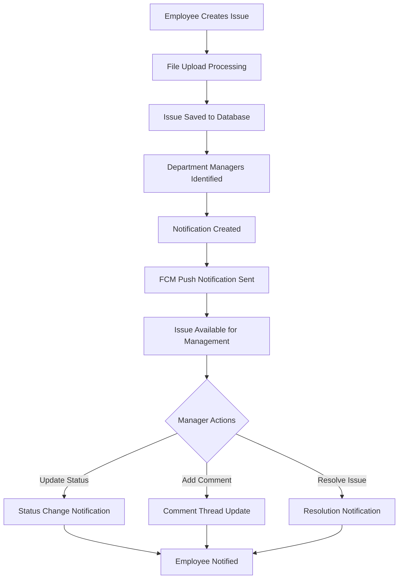
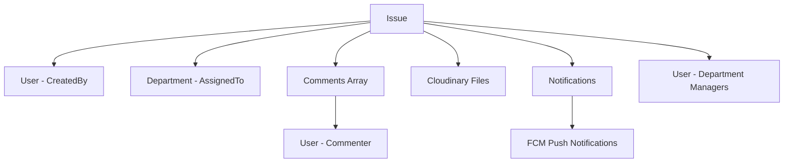

# Tickets Management

{/* # Issues Management API Documentation */}

## System Overview

The Issues Management API provides a comprehensive ticket/helpdesk system for employee issue tracking and resolution. The system supports role-based access control, file attachments, real-time notifications, comment threads, and department-based issue routing. It integrates with push notifications and maintains complete audit trails for issue lifecycle management.

## Base URL
```
/v1/issues
```

## Authentication Requirements

- **All Routes**: JWT authentication required via `verifyJWT` middleware
- **Device Type Tracking**: Supports Android, iOS, Web, and Desktop platforms
- **Role-based Access**: Different permissions for employees, department managers, and super admins

## System Architecture Flow



## Complete Workflow Process

### 1. Issue Creation Workflow
1. **Employee Submits Issue** → Includes title, description, priority, department assignment
2. **File Processing** → Optional file uploads to Cloudinary storage
3. **Department Assignment** → Automatically routes to appropriate department managers
4. **Notification Generation** → Creates system notifications for relevant managers
5. **Push Notifications** → Sends real-time alerts via FCM

### 2. Issue Management Workflow
1. **Department Managers Receive** → Get notified of new issues in their department
2. **Status Updates** → Can change status from Pending → In Progress → Resolved
3. **Comment System** → Add comments and communicate with issue creator
4. **Resolution Tracking** → Timestamps recorded for status changes

### 3. Access Control Matrix
- **Employees**: Create issues, view own issues, add comments
- **Department Managers**: Manage department issues, update status, view department tickets
- **Super Admins**: Access all issues across all departments

## API Endpoints

### Issue Creation & Management

#### Create New Issue
**POST** `/`

**Authentication:** Required (JWT)

Creates a new issue with optional file attachment.

**Request Headers:**
```
Authorization: Bearer {jwt_token}
Content-Type: multipart/form-data
X-Device-Type: web|android|ios|desktop
```

**Request Body (multipart/form-data):**
```json
{
  "issueTitle": "Login System Not Working",
  "issueDescription": "Unable to log into the system since morning. Getting 'Invalid credentials' error even with correct password.",
  "priority": "High",
  "assignedTo": "IT Support",
  "file": "screenshot.png"
}
```

**Success Response (201):**
```json
{
  "success": true,
  "message": "Issue created and notifications dispatched.",
  "data": {
    "_id": "64f8b2a1c4d5e6f7g8h9i0j1",
    "issueTitle": "Login System Not Working",
    "issueDescription": "Unable to log into the system since morning. Getting 'Invalid credentials' error even with correct password.",
    "priority": "High",
    "assignedTo": "IT Support",
    "issueStatus": "Pending",
    "file": "https://cloudinary.com/issue_files/screenshot.jpg",
    "fileId": "issue_files/screenshot_123456",
    "createdBy": {
      "_id": "64f8b2a1c4d5e6f7g8h9i0j2",
      "first_Name": "John",
      "last_Name": "Doe",
      "employee_Id": "EMP001"
    },
    "comments": [],
    "additionalFiles": [],
    "createdAt": "2024-01-15T10:30:00.000Z",
    "updatedAt": "2024-01-15T10:30:00.000Z"
  }
}
```

**Error Responses:**
```json
// File upload failed (500)
{
  "success": false,
  "message": "Failed to upload media. Please try again."
}

// Invalid file type (400)
{
  "success": false,
  "message": "Invalid file type."
}

// File too large (400)
{
  "success": false,
  "message": "File too large"
}
```

#### Get User's Issues
**GET** `/`

**Authentication:** Required (JWT)

Retrieves all issues created by the current user with filtering and pagination.

**Request Parameters:**
- `priority` (string, optional): "Low", "Medium", "High"
- `issueStatus` (string, optional): "Pending", "In Progress", "Resolved"
- `search` (string, optional): Search in title and description
- `page` (number, optional): Page number (default: 1)
- `limit` (number, optional): Items per page (default: 10)

**Example Request:**
```
GET /v1/issues?priority=High&issueStatus=Pending&search=login&page=1&limit=5
```

**Success Response (200):**
```json
{
  "success": true,
  "message": "Issues retrieved successfully",
  "totalCount": 25,
  "currentPage": 1,
  "totalPages": 5,
  "data": [
    {
      "_id": "64f8b2a1c4d5e6f7g8h9i0j1",
      "issueTitle": "Login System Not Working",
      "issueDescription": "Unable to log into the system since morning.",
      "priority": "High",
      "assignedTo": "IT Support",
      "issueStatus": "Pending",
      "file": "https://cloudinary.com/issue_files/screenshot.jpg",
      "createdBy": {
        "_id": "64f8b2a1c4d5e6f7g8h9i0j2",
        "first_Name": "John",
        "last_Name": "Doe"
      },
      "createdAt": "2024-01-15T10:30:00.000Z",
      "updatedAt": "2024-01-15T10:30:00.000Z"
    }
  ]
}
```

#### Update Issue
**PUT** `/:id`

**Authentication:** Required (JWT)

Updates issue details with support for multiple file uploads.

**Request Parameters:**
- `id` (string): Issue ID

**Request Body (multipart/form-data):**
```json
{
  "issueTitle": "Updated Login System Issue",
  "issueDescription": "Updated description with more details about the error.",
  "priority": "Medium",
  "assignedTo": "IT Support",
  "issueStatus": "In Progress",
  "files": ["additional_screenshot.png", "error_log.txt"]
}
```

**Success Response (200):**
```json
{
  "success": true,
  "message": "Issue updated successfully",
  "data": {
    "_id": "64f8b2a1c4d5e6f7g8h9i0j1",
    "issueTitle": "Updated Login System Issue",
    "issueDescription": "Updated description with more details about the error.",
    "priority": "Medium",
    "assignedTo": "IT Support",
    "issueStatus": "In Progress",
    "dateInProgress": "2024-01-15T11:15:00.000Z",
    "additionalFiles": [
      {
        "url": "https://cloudinary.com/issues/additional_screenshot.jpg",
        "id": "issues/additional_screenshot_789012"
      }
    ],
    "createdBy": {
      "_id": "64f8b2a1c4d5e6f7g8h9i0j2",
      "first_Name": "John",
      "last_Name": "Doe",
      "department": "Engineering",
      "designation": "Software Developer",
      "employee_Id": "EMP001",
      "working_Email_Id": "john.doe@company.com"
    },
    "updatedAt": "2024-01-15T11:15:00.000Z"
  }
}
```

#### Delete Issue
**DELETE** `/:id`

**Authentication:** Required (JWT)

Deletes a specific issue.

**Request Parameters:**
- `id` (string): Issue ID

**Success Response (200):**
```json
{
  "success": true,
  "message": "Issue deleted successfully"
}
```

**Error Responses:**
```json
// Invalid ID format (400)
{
  "success": false,
  "message": "Invalid issue ID"
}

// Issue not found (404)
{
  "success": false,
  "message": "Issue not found"
}
```

### Department & Administrative Management

#### Get Department Issues
**GET** `/department`

**Authentication:** Required (JWT - Department Manager role)

Retrieves all issues assigned to the current user's department.

**Request Parameters:**
- `issueStatus` (string, optional): "Pending", "In Progress", "Resolved"
- `priority` (string, optional): "Low", "Medium", "High"
- `employeeId` (string, optional): Filter by specific employee
- `page` (number, optional): Page number (default: 1)
- `limit` (number, optional): Items per page (default: 10)

**Example Request:**
```
GET /v1/issues/department?issueStatus=Pending&priority=High&page=1&limit=20
```

**Success Response (200):**
```json
{
  "success": true,
  "message": "Department issues retrieved successfully",
  "totalCount": 45,
  "currentPage": 1,
  "totalPages": 3,
  "data": [
    {
      "_id": "64f8b2a1c4d5e6f7g8h9i0j1",
      "issueTitle": "Login System Not Working",
      "issueDescription": "Unable to log into the system since morning.",
      "priority": "High",
      "assignedTo": "IT Support",
      "issueStatus": "Pending",
      "file": "https://cloudinary.com/issue_files/screenshot.jpg",
      "createdBy": {
        "_id": "64f8b2a1c4d5e6f7g8h9i0j2",
        "first_Name": "John",
        "last_Name": "Doe",
        "working_Email_Id": "john.doe@company.com",
        "mobile_No": "+1-555-0123",
        "designation": "Software Developer",
        "department": "Engineering",
        "employee_Id": "EMP001"
      },
      "createdAt": "2024-01-15T10:30:00.000Z"
    }
  ]
}
```

#### Update Issue Status
**PUT** `/:id/status`

**Authentication:** Required (JWT - Department Manager role)

Updates issue status with automatic notification to issue creator.

**Request Parameters:**
- `id` (string): Issue ID

**Request Body:**
```json
{
  "issueStatus": "In Progress"
}
```

**Success Response (200):**
```json
{
  "success": true,
  "message": "Issue status updated successfully",
  "data": {
    "_id": "64f8b2a1c4d5e6f7g8h9i0j1",
    "issueTitle": "Login System Not Working",
    "issueStatus": "In Progress",
    "dateInProgress": "2024-01-15T11:45:00.000Z",
    "assignedTo": "IT Support",
    "createdBy": {
      "_id": "64f8b2a1c4d5e6f7g8h9i0j2",
      "first_Name": "John",
      "last_Name": "Doe"
    },
    "updatedAt": "2024-01-15T11:45:00.000Z"
  }
}
```

**Business Rules:**
- Only department managers can update issues assigned to their department
- Status changes trigger automatic notifications to issue creator
- Date stamps are automatically added:
  - `dateInProgress`: When status changes to "In Progress"
  - `dateResolved`: When status changes to "Resolved"

**Error Responses:**
```json
// Invalid status (400)
{
  "success": false,
  "message": "Invalid issue status"
}

// Unauthorized department (403)
{
  "success": false,
  "message": "Not authorized to update this issue"
}
```

#### Get All Issues (Super Admin)
**GET** `/all`

**Authentication:** Required (JWT - Super Admin role)

Retrieves all issues across all departments with complete details.

**Success Response (200):**
```json
{
  "success": true,
  "data": [
    {
      "_id": "64f8b2a1c4d5e6f7g8h9i0j1",
      "issueTitle": "Login System Not Working",
      "issueDescription": "Unable to log into the system since morning.",
      "priority": "High",
      "assignedTo": "IT Support",
      "file": "https://cloudinary.com/issue_files/screenshot.jpg",
      "fileId": "issue_files/screenshot_123456",
      "issueStatus": "In Progress",
      "createdBy": {
        "_id": "64f8b2a1c4d5e6f7g8h9i0j2",
        "first_Name": "John",
        "last_Name": "Doe",
        "working_Email_Id": "john.doe@company.com",
        "mobile_No": "+1-555-0123",
        "designation": "Software Developer",
        "department": "Engineering",
        "employee_Id": "EMP001"
      },
      "additionalFiles": [
        {
          "url": "https://cloudinary.com/issues/error_log.txt",
          "id": "issues/error_log_789012"
        }
      ],
      "comments": [
        {
          "_id": "64f8b2a1c4d5e6f7g8h9i0j3",
          "commenter": {
            "_id": "64f8b2a1c4d5e6f7g8h9i0j4",
            "first_Name": "Jane",
            "last_Name": "Smith",
            "working_Email_Id": "jane.smith@company.com",
            "designation": "IT Manager",
            "department": "IT Support",
            "employee_Id": "EMP002"
          },
          "comment": "Looking into this issue. Will update soon.",
          "createdAt": "2024-01-15T12:00:00.000Z"
        }
      ],
      "createdAt": "2024-01-15T10:30:00.000Z",
      "updatedAt": "2024-01-15T12:00:00.000Z"
    }
  ]
}
```

### Comments System

#### Add Comment to Issue
**POST** `/:issueId/comments`

**Authentication:** Required (JWT)

Adds a comment to a specific issue.

**Request Parameters:**
- `issueId` (string): Issue ID

**Request Body:**
```json
{
  "comment": "I've tried the suggested solution but the issue persists. Can you please check the server logs?"
}
```

**Success Response (201):**
```json
{
  "success": true,
  "data": {
    "_id": "64f8b2a1c4d5e6f7g8h9i0j5",
    "commenter": {
      "_id": "64f8b2a1c4d5e6f7g8h9i0j2",
      "first_Name": "John",
      "last_Name": "Doe"
    },
    "comment": "I've tried the suggested solution but the issue persists. Can you please check the server logs?",
    "createdAt": "2024-01-15T14:30:00.000Z"
  }
}
```

**Error Responses:**
```json
// Empty comment (400)
{
  "success": false,
  "message": "Comment cannot be empty"
}

// Invalid issue ID (400)
{
  "success": false,
  "message": "Invalid Issue ID"
}
```

#### Get Issue Comments
**GET** `/:issueId/comments`

**Authentication:** Required (JWT)

Retrieves all comments for a specific issue.

**Request Parameters:**
- `issueId` (string): Issue ID

**Success Response (200):**
```json
{
  "success": true,
  "data": [
    {
      "_id": "64f8b2a1c4d5e6f7g8h9i0j3",
      "commenter": {
        "_id": "64f8b2a1c4d5e6f7g8h9i0j4",
        "first_Name": "Jane",
        "last_Name": "Smith"
      },
      "comment": "Looking into this issue. Will update soon.",
      "createdAt": "2024-01-15T12:00:00.000Z"
    },
    {
      "_id": "64f8b2a1c4d5e6f7g8h9i0j5",
      "commenter": {
        "_id": "64f8b2a1c4d5e6f7g8h9i0j2",
        "first_Name": "John",
        "last_Name": "Doe"
      },
      "comment": "I've tried the suggested solution but the issue persists.",
      "createdAt": "2024-01-15T14:30:00.000Z"
    }
  ]
}
```

### Employee Management

#### Get Employee Tickets
**GET** `/issue/:employeeId`

**Authentication:** Required (JWT - Manager/Admin role)

Retrieves all tickets created by a specific employee.

**Request Parameters:**
- `employeeId` (string): Employee ID

**Success Response (200):**
```json
{
  "success": true,
  "data": [
    {
      "_id": "64f8b2a1c4d5e6f7g8h9i0j1",
      "issueTitle": "Login System Not Working",
      "issueDescription": "Unable to log into the system since morning.",
      "priority": "High",
      "assignedTo": "IT Support",
      "issueStatus": "Resolved",
      "dateResolved": "2024-01-15T16:00:00.000Z",
      "createdBy": {
        "_id": "64f8b2a1c4d5e6f7g8h9i0j2",
        "first_Name": "John",
        "last_Name": "Doe",
        "employee_Id": "EMP001",
        "designation": "Software Developer",
        "department": "Engineering"
      },
      "createdAt": "2024-01-15T10:30:00.000Z"
    }
  ],
  "employee": {
    "_id": "64f8b2a1c4d5e6f7g8h9i0j2",
    "first_Name": "John",
    "last_Name": "Doe",
    "employee_Id": "EMP001",
    "designation": "Software Developer",
    "department": "Engineering",
    "working_Email_Id": "john.doe@company.com"
  }
}
```

## Frontend Integration Examples

### JavaScript/React Integration

```javascript
// API Configuration
const API_BASE_URL = 'https://your-api-domain.com/v1/issues';

const getAuthHeaders = () => ({
  'Authorization': `Bearer ${localStorage.getItem('authToken')}`,
  'X-Device-Type': 'web'
});

// Issues Service Class
class IssuesService {
  
  // Create new issue with file upload
  async createIssue(issueData, file = null) {
    try {
      const formData = new FormData();
      formData.append('issueTitle', issueData.issueTitle);
      formData.append('issueDescription', issueData.issueDescription);
      formData.append('priority', issueData.priority);
      formData.append('assignedTo', issueData.assignedTo);
      
      if (file) {
        formData.append('file', file);
      }

      const response = await fetch(`${API_BASE_URL}/`, {
        method: 'POST',
        headers: {
          'Authorization': `Bearer ${localStorage.getItem('authToken')}`,
          'X-Device-Type': 'web'
        },
        body: formData
      });

      if (!response.ok) {
        const errorData = await response.json();
        throw new Error(errorData.message || 'Failed to create issue');
      }

      return await response.json();
    } catch (error) {
      console.error('Error creating issue:', error);
      throw error;
    }
  }

  // Get user's issues with filtering
  async getUserIssues(filters = {}) {
    try {
      const queryParams = new URLSearchParams();
      
      Object.entries(filters).forEach(([key, value]) => {
        if (value !== undefined && value !== null && value !== '') {
          queryParams.append(key, value);
        }
      });

      const response = await fetch(`${API_BASE_URL}/?${queryParams}`, {
        method: 'GET',
        headers: getAuthHeaders()
      });

      return await response.json();
    } catch (error) {
      console.error('Error fetching user issues:', error);
      throw error;
    }
  }

  // Update issue status (for managers)
  async updateIssueStatus(issueId, status) {
    try {
      const response = await fetch(`${API_BASE_URL}/${issueId}/status`, {
        method: 'PUT',
        headers: {
          ...getAuthHeaders(),
          'Content-Type': 'application/json'
        },
        body: JSON.stringify({ issueStatus: status })
      });

      return await response.json();
    } catch (error) {
      console.error('Error updating issue status:', error);
      throw error;
    }
  }

  // Add comment to issue
  async addComment(issueId, comment) {
    try {
      const response = await fetch(`${API_BASE_URL}/${issueId}/comments`, {
        method: 'POST',
        headers: {
          ...getAuthHeaders(),
          'Content-Type': 'application/json'
        },
        body: JSON.stringify({ comment })
      });

      return await response.json();
    } catch (error) {
      console.error('Error adding comment:', error);
      throw error;
    }
  }

  // Get department issues (for managers)
  async getDepartmentIssues(filters = {}) {
    try {
      const queryParams = new URLSearchParams();
      Object.entries(filters).forEach(([key, value]) => {
        if (value) queryParams.append(key, value);
      });

      const response = await fetch(`${API_BASE_URL}/department?${queryParams}`, {
        method: 'GET',
        headers: getAuthHeaders()
      });

      return await response.json();
    } catch (error) {
      console.error('Error fetching department issues:', error);
      throw error;
    }
  }

  // Get issue comments
  async getComments(issueId) {
    try {
      const response = await fetch(`${API_BASE_URL}/${issueId}/comments`, {
        method: 'GET',
        headers: getAuthHeaders()
      });

      return await response.json();
    } catch (error) {
      console.error('Error fetching comments:', error);
      throw error;
    }
  }
}

// React Hook for Issues Management
import { useState, useEffect } from 'react';

const useIssues = (userRole = 'employee') => {
  const [issues, setIssues] = useState([]);
  const [loading, setLoading] = useState(false);
  const [error, setError] = useState(null);
  
  const issuesService = new IssuesService();

  const fetchIssues = async (filters = {}) => {
    setLoading(true);
    setError(null);
    
    try {
      let response;
      if (userRole === 'manager') {
        response = await issuesService.getDepartmentIssues(filters);
      } else {
        response = await issuesService.getUserIssues(filters);
      }
      
      if (response.success) {
        setIssues(response.data);
      } else {
        setError(response.message);
      }
    } catch (err) {
      setError(err.message);
    } finally {
      setLoading(false);
    }
  };

  const createIssue = async (issueData, file) => {
    setLoading(true);
    try {
      const response = await issuesService.createIssue(issueData, file);
      if (response.success) {
        await fetchIssues(); // Refresh list
        return response;
      } else {
        throw new Error(response.message);
      }
    } catch (err) {
      setError(err.message);
      throw err;
    } finally {
      setLoading(false);
    }
  };

  const updateStatus = async (issueId, status) => {
    try {
      const response = await issuesService.updateIssueStatus(issueId, status);
      if (response.success) {
        await fetchIssues(); // Refresh list
        return response;
      } else {
        throw new Error(response.message);
      }
    } catch (err) {
      setError(err.message);
      throw err;
    }
  };

  useEffect(() => {
    fetchIssues();
  }, [userRole]);

  return {
    issues,
    loading,
    error,
    fetchIssues,
    createIssue,
    updateStatus
  };
};

// File Upload Component
const FileUploadComponent = ({ onFileSelect, acceptedTypes = "image/*,.pdf,.doc,.docx" }) => {
  const [selectedFile, setSelectedFile] = useState(null);
  const [preview, setPreview] = useState(null);

  const handleFileChange = (event) => {
    const file = event.target.files[0];
    if (file) {
      // Validate file size (10MB limit)
      if (file.size > 10 * 1024 * 1024) {
        alert('File size must be less than 10MB');
        return;
      }

      setSelectedFile(file);
      onFileSelect(file);

      // Create preview for images
      if (file.type.startsWith('image/')) {
        const reader = new FileReader();
        reader.onload = (e) => setPreview(e.target.result);
        reader.readAsDataURL(file);
      }
    }
  };

  return (
    
      
      
        Choose File
      
      {selectedFile && (
        
          Selected: {selectedFile.name}
          {preview && (
            
          )}
        
      )}
    
  );
};

// Issue Creation Form Component
const IssueCreationForm = () => {
  const [formData, setFormData] = useState({
    issueTitle: '',
    issueDescription: '',
    priority: 'Medium',
    assignedTo: ''
  });
  const [selectedFile, setSelectedFile] = useState(null);
  const { createIssue, loading } = useIssues();

  const handleSubmit = async (e) => {
    e.preventDefault();
    
    try {
      await createIssue(formData, selectedFile);
      alert('Issue created successfully!');
      setFormData({
        issueTitle: '',
        issueDescription: '',
        priority: 'Medium',
        assignedTo: ''
      });
      setSelectedFile(null);
    } catch (error) {
      alert(`Error: ${error.message}`);
    }
  };

  return (
    
       setFormData({...formData, issueTitle: e.target.value})}
        required
      />
      
       setFormData({...formData, issueDescription: e.target.value})}
        required
      />
      
       setFormData({...formData, priority: e.target.value})}
      >
        Low
        Medium
        High
      
      
       setFormData({...formData, assignedTo: e.target.value})}
        required
      />
      
      
      
      
        {loading ? 'Creating...' : 'Create Issue'}
      
    
  );
};
```

### Angular Integration

```typescript
// issues.service.ts
import { Injectable } from '@angular/core';
import { HttpClient, HttpHeaders, HttpParams } from '@angular/common/http';
import { Observable } from 'rxjs';

export interface Issue {
  _id: string;
  issueTitle: string;
  issueDescription: string;
  priority: 'Low' | 'Medium' | 'High';
  assignedTo: string;
  issueStatus: 'Pending' | 'In Progress' | 'Resolved';
  file?: string;
  createdBy: {
    _id: string;
    first_Name: string;
    last_Name: string;
    employee_Id: string;
  };
  createdAt: string;
  updatedAt: string;
}

@Injectable({
  providedIn: 'root'
})
export class IssuesService {
  private apiUrl = 'https://your-api-domain.com/v1/issues';

  constructor(private http: HttpClient) {}

  private getHeaders(): HttpHeaders {
    const token = localStorage.getItem('authToken');
    return new HttpHeaders({
      'Authorization': `Bearer ${token}`,
      'X-Device-Type': 'web'
    });
  }

  createIssue(issueData: FormData): Observable {
    const headers = new HttpHeaders({
      'Authorization': `Bearer ${localStorage.getItem('authToken')}`,
      'X-Device-Type': 'web'
    });
    
    return this.http.post(`${this.apiUrl}/`, issueData, { headers });
  }

  getUserIssues(filters?: any): Observable {
    let params = new HttpParams();
    
    if (filters) {
      Object.keys(filters).forEach(key => {
        if (filters[key]) {
          params = params.append(key, filters[key]);
        }
      });
    }

    return this.http.get(`${this.apiUrl}/`, { 
      headers: this.getHeaders(),
      params 
    });
  }

  getDepartmentIssues(filters?: any): Observable {
    let params = new HttpParams();
    
    if (filters) {
      Object.keys(filters).forEach(key => {
        if (filters[key]) {
          params = params.append(key, filters[key]);
        }
      });
    }

    return this.http.get(`${this.apiUrl}/department`, {
      headers: this.getHeaders(),
      params
    });
  }

  updateIssueStatus(issueId: string, status: string): Observable {
    return this.http.put(`${this.apiUrl}/${issueId}/status`, 
      { issueStatus: status }, 
      { headers: this.getHeaders() }
    );
  }

  addComment(issueId: string, comment: string): Observable {
    return this.http.post(`${this.apiUrl}/${issueId}/comments`,
      { comment },
      { headers: this.getHeaders() }
    );
  }

  getComments(issueId: string): Observable {
    return this.http.get(`${this.apiUrl}/${issueId}/comments`, {
      headers: this.getHeaders()
    });
  }
}
```

## Security Features

### Authentication & Authorization
- **JWT Token Validation**: All routes require valid JWT tokens
- **Device Type Tracking**: Supports multiple device types with separate token storage
- **Role-Based Access Control**: Different permissions for employees, managers, and admins
- **Department-Based Security**: Managers can only access issues from their department

### File Upload Security
- **File Type Validation**: Restricted to images, PDFs, and document formats
- **File Size Limits**: Maximum 10MB per file upload
- **Secure Storage**: Files uploaded to Cloudinary with secure URLs
- **Multiple File Support**: Update operations support up to 5 additional files

### Data Protection
- **Input Validation**: All inputs sanitized and validated
- **SQL Injection Prevention**: Using MongoDB with parameterized queries
- **Cross-Department Security**: Users cannot access other departments' issues

### Notification Security
- **Targeted Notifications**: Notifications only sent to relevant department managers
- **FCM Integration**: Secure push notifications with data-only payloads
- **Audit Trail**: Complete tracking of all status changes and comments

## Error Handling

### Common Error Responses

#### Authentication Errors (401)
```json
{
  "success": false,
  "message": "Unauthorized request. Token not provided."
}
```

#### Authorization Errors (403)
```json
{
  "success": false,
  "message": "Not authorized to update this issue"
}
```

#### Validation Errors (400)
```json
{
  "success": false,
  "message": "Invalid file type."
}
```

#### Resource Not Found (404)
```json
{
  "success": false,
  "message": "Issue not found"
}
```

#### File Upload Errors (500)
```json
{
  "success": false,
  "message": "Failed to upload media. Please try again."
}
```

### Error Handling in Frontend

```javascript
// Comprehensive Error Handler
const handleApiError = (error, context) => {
  console.error(`Error in ${context}:`, error);

  if (error.status === 401) {
    // Token expired or invalid
    localStorage.removeItem('authToken');
    window.location.href = '/login';
    return 'Session expired. Please login again.';
  }
  
  if (error.status === 403) {
    return 'You do not have permission to perform this action.';
  }
  
  if (error.status === 404) {
    return 'The requested resource was not found.';
  }
  
  if (error.status === 413) {
    return 'File too large. Please select a smaller file.';
  }
  
  if (error.status >= 500) {
    return 'Server error. Please try again later.';
  }
  
  return error.message || 'An unexpected error occurred.';
};

// Usage in API calls
try {
  const response = await issuesService.createIssue(issueData, file);
  // Handle success
} catch (error) {
  const errorMessage = handleApiError(error, 'Create Issue');
  setError(errorMessage);
}
```

## Testing Guide

### cURL Commands

#### Create Issue with File Upload
```bash
# Create issue with file attachment
curl -X POST "http://localhost:3000/v1/issues" \
  -H "Authorization: Bearer YOUR_JWT_TOKEN" \
  -H "X-Device-Type: web" \
  -F "issueTitle=Login System Not Working" \
  -F "issueDescription=Unable to log into the system since morning" \
  -F "priority=High" \
  -F "assignedTo=IT Support" \
  -F "file=@screenshot.png"
```

#### Get User Issues with Filters
```bash
# Get user issues with filtering and pagination
curl -X GET "http://localhost:3000/v1/issues?priority=High&issueStatus=Pending&page=1&limit=5" \
  -H "Authorization: Bearer YOUR_JWT_TOKEN" \
  -H "X-Device-Type: web"
```

#### Update Issue Status (Manager)
```bash
# Update issue status
curl -X PUT "http://localhost:3000/v1/issues/64f8b2a1c4d5e6f7g8h9i0j1/status" \
  -H "Authorization: Bearer YOUR_JWT_TOKEN" \
  -H "X-Device-Type: web" \
  -H "Content-Type: application/json" \
  -d '{"issueStatus": "In Progress"}'
```

#### Add Comment to Issue
```bash
# Add comment to issue
curl -X POST "http://localhost:3000/v1/issues/64f8b2a1c4d5e6f7g8h9i0j1/comments" \
  -H "Authorization: Bearer YOUR_JWT_TOKEN" \
  -H "X-Device-Type: web" \
  -H "Content-Type: application/json" \
  -d '{"comment": "Looking into this issue. Will update soon."}'
```

#### Get Department Issues (Manager)
```bash
# Get department issues
curl -X GET "http://localhost:3000/v1/issues/department?issueStatus=Pending&priority=High" \
  -H "Authorization: Bearer YOUR_JWT_TOKEN" \
  -H "X-Device-Type: web"
```

#### Get All Issues (Super Admin)
```bash
# Get all issues (super admin only)
curl -X GET "http://localhost:3000/v1/issues/all" \
  -H "Authorization: Bearer YOUR_JWT_TOKEN" \
  -H "X-Device-Type: web"
```

### Postman Collection

```json
{
  "info": {
    "name": "Issues Management API",
    "schema": "https://schema.getpostman.com/json/collection/v2.1.0/collection.json"
  },
  "auth": {
    "type": "bearer",
    "bearer": [
      {
        "key": "token",
        "value": "{{authToken}}",
        "type": "string"
      }
    ]
  },
  "variable": [
    {
      "key": "baseUrl",
      "value": "http://localhost:3000/v1/issues"
    },
    {
      "key": "authToken",
      "value": "your_jwt_token_here"
    }
  ],
  "item": [
    {
      "name": "Issue Management",
      "item": [
        {
          "name": "Create Issue",
          "request": {
            "method": "POST",
            "url": "{{baseUrl}}/",
            "header": [
              {
                "key": "X-Device-Type",
                "value": "web"
              }
            ],
            "body": {
              "mode": "formdata",
              "formdata": [
                {
                  "key": "issueTitle",
                  "value": "Login System Not Working",
                  "type": "text"
                },
                {
                  "key": "issueDescription",
                  "value": "Unable to log into the system",
                  "type": "text"
                },
                {
                  "key": "priority",
                  "value": "High",
                  "type": "text"
                },
                {
                  "key": "assignedTo",
                  "value": "IT Support",
                  "type": "text"
                },
                {
                  "key": "file",
                  "type": "file"
                }
              ]
            }
          }
        },
        {
          "name": "Get User Issues",
          "request": {
            "method": "GET",
            "url": "{{baseUrl}}/",
            "header": [
              {
                "key": "X-Device-Type",
                "value": "web"
              }
            ]
          }
        },
        {
          "name": "Update Issue Status",
          "request": {
            "method": "PUT",
            "url": "{{baseUrl}}/{{issueId}}/status",
            "header": [
              {
                "key": "X-Device-Type",
                "value": "web"
              }
            ],
            "body": {
              "mode": "raw",
              "raw": "{\n  \"issueStatus\": \"In Progress\"\n}",
              "options": {
                "raw": {
                  "language": "json"
                }
              }
            }
          }
        }
      ]
    }
  ]
}
```

### Integration Testing Examples

```javascript
// Jest Test Examples
describe('Issues API Integration Tests', () => {
  let authToken;
  let createdIssueId;
  
  beforeAll(async () => {
    // Login and get auth token
    const loginResponse = await request(app)
      .post('/auth/login')
      .send({ username: 'testuser', password: 'testpass' });
    
    authToken = loginResponse.body.accessToken;
  });

  test('Should create new issue with file upload', async () => {
    const response = await request(app)
      .post('/v1/issues')
      .set('Authorization', `Bearer ${authToken}`)
      .set('X-Device-Type', 'web')
      .field('issueTitle', 'Test Issue')
      .field('issueDescription', 'Test Description')
      .field('priority', 'High')
      .field('assignedTo', 'IT Support')
      .attach('file', 'tests/fixtures/test-image.png');

    expect(response.status).toBe(201);
    expect(response.body.success).toBe(true);
    expect(response.body.data.issueTitle).toBe('Test Issue');
    
    createdIssueId = response.body.data._id;
  });

  test('Should get user issues with filters', async () => {
    const response = await request(app)
      .get('/v1/issues')
      .set('Authorization', `Bearer ${authToken}`)
      .set('X-Device-Type', 'web')
      .query({ priority: 'High', page: 1, limit: 10 });

    expect(response.status).toBe(200);
    expect(response.body.success).toBe(true);
    expect(Array.isArray(response.body.data)).toBe(true);
  });

  test('Should add comment to issue', async () => {
    const response = await request(app)
      .post(`/v1/issues/${createdIssueId}/comments`)
      .set('Authorization', `Bearer ${authToken}`)
      .set('X-Device-Type', 'web')
      .send({ comment: 'Test comment' });

    expect(response.status).toBe(201);
    expect(response.body.success).toBe(true);
    expect(response.body.data.comment).toBe('Test comment');
  });

  test('Should update issue status (manager only)', async () => {
    const response = await request(app)
      .put(`/v1/issues/${createdIssueId}/status`)
      .set('Authorization', `Bearer ${managerAuthToken}`)
      .set('X-Device-Type', 'web')
      .send({ issueStatus: 'In Progress' });

    expect(response.status).toBe(200);
    expect(response.body.success).toBe(true);
    expect(response.body.data.issueStatus).toBe('In Progress');
  });
});
```

## Database Schema

### Issues Model Structure

```javascript
// Issues Schema Structure
{
  _id: ObjectId,
  
  // Basic Issue Information
  issueTitle: String,           // e.g., "Login System Not Working"
  issueDescription: String,     // Detailed description
  priority: String,            // "Low", "Medium", "High"
  assignedTo: String,          // Department name
  issueStatus: String,         // "Pending", "In Progress", "Resolved"
  
  // File Attachments
  file: String,                // Primary file URL (Cloudinary)
  fileId: String,              // Cloudinary public ID for deletion
  additionalFiles: [           // Multiple additional files
    {
      url: String,             // File URL
      id: String               // Cloudinary public ID
    }
  ],
  
  // User References
  createdBy: ObjectId,         // Reference to User who created the issue
  
  // Comments Array
  comments: [
    {
      _id: ObjectId,
      commenter: ObjectId,     // Reference to User who commented
      comment: String,         // Comment text
      createdAt: Date
    }
  ],
  
  // Timestamps for Status Tracking
  createdAt: Date,             // Issue creation time
  updatedAt: Date,             // Last update time
  dateInProgress: Date,        // When status changed to "In Progress"
  dateResolved: Date           // When status changed to "Resolved"
}
```

### Related Models Integration



### Notification Integration

```javascript
// Notification Schema for Issues
{
  title: String,               // e.g., "New Issue Created"
  message: String,             // Detailed notification message
  type: String,                // "issue_created", "issue_update", etc.
  targetDepartments: [String], // Departments to notify
  targetUsers: [ObjectId],     // Specific users to notify
  mediaUrl: String,            // Associated file URL
  url: String,                 // Deep link URL for navigation
  isRead: Boolean,             // Read status
  createdAt: Date
}
```

## Troubleshooting Guide

### Common Issues & Solutions

#### 1. File Upload Problems

**Problem**: "Failed to upload media. Please try again."
- **Cause**: Cloudinary configuration or network issues
- **Solution**: Check Cloudinary credentials and network connectivity

```javascript
// Debug file upload
const debugFileUpload = async (file) => {
  console.log('File details:', {
    name: file.originalname,
    size: file.size,
    mimetype: file.mimetype
  });
  
  try {
    const result = await uploadToCloudinary(buffer, "issue_files", file.originalname);
    console.log('Upload successful:', result.secure_url);
  } catch (error) {
    console.error('Upload failed:', error);
  }
};
```

**Problem**: "Invalid file type"
- **Cause**: Unsupported file format
- **Solution**: Ensure file types match allowed formats

```javascript
// Check supported file types
const allowedTypes = [
  "image/jpeg",
  "image/png", 
  "image/gif",
  "image/webp",
  "application/pdf",
  "application/msword",
  "application/vnd.openxmlformats-officedocument.wordprocessingml.document"
];
```

#### 2. Authentication Issues

**Problem**: "Unauthorized request. Token not provided."
- **Solution**: Ensure JWT token is included in Authorization header

```javascript
// Correct token usage
const headers = {
  'Authorization': `Bearer ${localStorage.getItem('authToken')}`,
  'X-Device-Type': 'web'
};
```

**Problem**: "Not authorized to update this issue"
- **Cause**: User trying to update issue from different department
- **Solution**: Verify user has manager permissions for the assigned department

#### 3. Notification Issues

**Problem**: Notifications not being sent
- **Cause**: FCM configuration or user device token issues
- **Solution**: Verify FCM setup and user token registration

```javascript
// Debug notification sending
const debugNotification = async (managers, title, body) => {
  console.log('Sending notifications to:', managers.map(m => m.employee_Id));
  console.log('Notification content:', { title, body });
  
  const result = await sendPushToUsers(managers, title, body);
  console.log('Notification result:', result);
};
```

#### 4. Database Transaction Issues

**Problem**: Status update failing with transaction errors
- **Cause**: Database connection or transaction timeout
- **Solution**: Add retry logic and proper error handling

```javascript
// Retry transaction logic
const retryTransaction = async (operation, maxRetries = 3) => {
  for (let i = 0; i  setTimeout(resolve, 1000 * (i + 1)));
    }
  }
};
```

#### 5. Performance Issues

**Problem**: Slow response times for department issues
- **Solution**: Add database indexes and implement caching

```javascript
// Add database indexes
db.issues.createIndex({ "assignedTo": 1, "issueStatus": 1 });
db.issues.createIndex({ "createdBy": 1, "createdAt": -1 });
db.issues.createIndex({ "assignedTo": 1, "priority": 1 });

// Implement result caching
const cache = new Map();
const getCachedDepartmentIssues = async (department, filters) => {
  const key = `dept_${department}_${JSON.stringify(filters)}`;
  const cached = cache.get(key);
  
  if (cached && Date.now() - cached.timestamp  {
  if (DEBUG) {
    console.log(`[${context}]`, JSON.stringify(data, null, 2));
  }
};

// Usage in controllers
export const createIssue = async (req, res) => {
  debugLog('createIssue:start', { body: req.body, file: req.file?.originalname });
  
  try {
    // ... existing code
    debugLog('createIssue:success', { issueId: savedIssue._id });
  } catch (error) {
    debugLog('createIssue:error', { error: error.message, stack: error.stack });
  }
};
```

### Health Check Implementation

```javascript
// Add health check endpoint
router.get('/health', (req, res) => {
  res.status(200).json({
    success: true,
    message: 'Issues API is healthy',
    timestamp: new Date().toISOString(),
    services: {
      database: 'connected',
      cloudinary: 'available',
      notifications: 'active'
    }
  });
});
```

## Best Practices for Implementation

### 1. Error Handling Strategy
```javascript
// Centralized error handling
const handleControllerError = (error, context, res) => {
  console.error(`[${context}] Error:`, error);
  
  if (error.name === 'ValidationError') {
    return res.status(400).json({
      success: false,
      message: 'Validation failed',
      errors: Object.values(error.errors).map(e => e.message)
    });
  }
  
  if (error.name === 'CastError') {
    return res.status(400).json({
      success: false,
      message: 'Invalid ID format'
    });
  }
  
  return res.status(500).json({
    success: false,
    message: 'Internal Server Error',
    ...(process.env.NODE_ENV === 'development' && { error: error.message })
  });
};
```

### 2. Input Validation
```javascript
// Comprehensive input validation
const validateIssueInput = (data) => {
  const errors = [];
  
  if (!data.issueTitle || data.issueTitle.trim().length  {
  // Validate file size
  if (file.size > 10 * 1024 * 1024) {
    throw new Error('File size exceeds 10MB limit');
  }
  
  // Validate file type
  const allowedTypes = ['image/jpeg', 'image/png', 'application/pdf'];
  if (!allowedTypes.includes(file.mimetype)) {
    throw new Error('Unsupported file type');
  }
  
  // Generate unique filename
  const timestamp = Date.now();
  const randomString = Math.random().toString(36).substring(7);
  const filename = `${timestamp}_${randomString}_${file.originalname}`;
  
  return filename;
};
```

### 4. Notification Management
```javascript
// Smart notification sending
const sendSmartNotifications = async (issue, action, user) => {
  const recipients = await getNotificationRecipients(issue, action);
  
  if (recipients.length === 0) {
    console.log('No recipients found for notification');
    return;
  }
  
  const template = getNotificationTemplate(action, {
    issueTitle: issue.issueTitle,
    userName: `${user.first_Name} ${user.last_Name}`,
    department: issue.assignedTo
  });
  
  // Batch send notifications
  const batchSize = 100;
  for (let i = 0; i < recipients.length; i += batchSize) {
    const batch = recipients.slice(i, i + batchSize);
    await sendPushToUsers(batch, template.title, template.body, template.url);
  }
};
```

This comprehensive documentation provides everything needed for developers to understand, integrate, and maintain the Issues Management API system effectively.