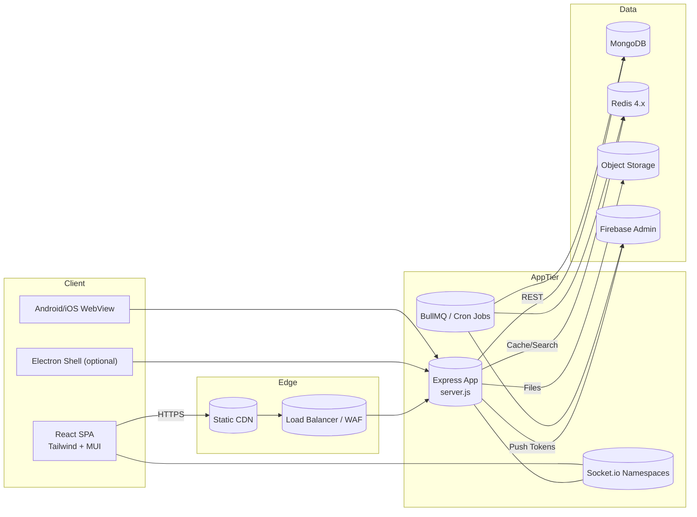
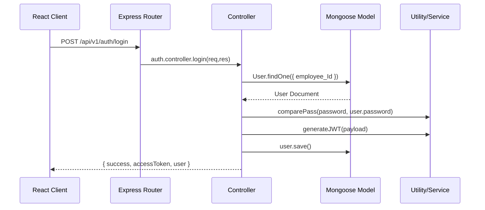

# System Architecture

This page walks through the runtime layout of the HCM platform, highlights the responsibilities of each layer, and explains how requests move between services.

## Runtime Topology

### Deployment Notes

- The API and Socket.io server run from the same Node.js process (`server.js`) to share event emitters.
- Email queues (`BullMQ`) and cron jobs are initialised via `src/utils/cronJobs.js` and worker scripts in `src/services/emailWorker.js`.
- Static assets and uploaded files are exposed under `/public` and `/uploads`, with S3 used for offloading large payloads.

## Request Life Cycle

| Stage | Responsibility | Key Files |
| --- | --- | --- |
| **Express Bootstrap** | Configure CORS, JSON parsing, static asset mounts, connect MongoDB, and wire Socket.io. | `server.js`, `src/config/db.js` |
| **Routing Layer** | Route incoming requests based on `/api/v1/<module>` conventions. | `src/routes/v1/**` |
| **Controller Layer** | Implement business logic using Mongoose models and utilities. | `src/controllers/**` |
| **Domain Models** | Define MongoDB schemas, indexes, hooks, and static helper methods. | `src/models/**` |
| **Services & Utilities** | Encapsulate reusable logic (salary calculations, email queues, file uploads, etc.). | `src/utils/**`, `src/services/**` |
| **Response Handling** | Return standard `{ success, message, data }` payloads. Errors bubble to the global handler. | `server.js` (error middleware), controllers |

## Module Organisation

The backend follows a domain-based folder layout:

- `controllers/attendance/*` – Punch capture, roster enforcement, missed-punch approvals.
- `controllers/payrollv2/*` – Salary structure assignment, statutory computation, payroll settings.
- `controllers/recruitment/*` – Job requisitions, candidate pipelines, dashboards.
- `controllers/engagement/*` – Posts, polls, events, recognition.
- `controllers/user/*` – Profiles, hierarchy, role-based query helpers.

Each controller has a matching route file under `routes/v1/<domain>` and Mongoose models in `models/<domain>`.

### Cross-cutting Services

| Service | Purpose | Location |
| --- | --- | --- |
| **Authentication Middleware** | Validate JWT per device, map permissions, attach enriched user. | `src/middlewares/auth.middleware.js` |
| **Permission Checks** | Fine-grained RBAC via `checkPermission.middleware.js`. | `src/middlewares/checkPermission.middleware.js` |
| **Email Delivery** | Queue emails via BullMQ and workers. | `src/services/emailService.js`, `src/services/emailWorker.js` |
| **Logging** | Winston logger with morgan integration. | `src/utils/logger.js`, `server.js` |
| **Background Schedulers** | Inventory reminders, ticket nudges, poll closures. | `src/utils/cronJobs.js`, `src/jobs/**` |

## Data Storage Strategy

- **MongoDB** is the source of truth for HR data, payroll artefacts, and configuration documents.
- **Redis** backs queueing and features that demand fast ephemeral storage (socket presence, OTP throttling).
- **S3/Cloudinary** store media assets such as employee documents, induction materials, and branding.
- **Firebase** enables FCM push notifications to web and mobile clients.

## Multi-Tenant Hosting Model

Many Razor Infotech customers run the exact same codebase with tenant-specific configuration:

- **One Codebase, Many Tenants** – Git repositories are shared. Differences live solely in environment variables and build artefacts.
- **Separate PM2 Process per Tenant** – each company launches its own PM2 application (e.g., `pm2 start server.js --name hcm-razor --env production -- --port 6006`). Ports are unique per tenant to prevent socket conflicts.
- **Company-Specific `.env`** – secrets such as `PORT`, `FRONTEND_URL`, database connection strings, and branding settings reside in tenant-specific `.env` files. PM2 uses `--env-file` or environment exports per process.
- **Subdomain-per-Tenant** – DNS maps company subdomains (e.g., `razorinfotech.humanmaximizer.com`, `razormar.humanmaximizer.com`) to the shared Hostinger VPS. `SubdomainValidator` on the frontend and proxy rules on Nginx ensure the correct tenant assets are served.
- **Frontend Builds per Tenant** – the React app is built once per company (`npm run build`). Each `dist` folder is deployed to Nginx under a dedicated root (e.g., `/var/www/razorinfotech`). The web server routes `https://company.humanmaximizer.com` to the appropriate static bundle.
- **API Endpoints per Tenant** – upstream Nginx or PM2 ports expose tenant APIs at `https://company.humanmaximizer.com/api/v1`. Despite separate processes, the controllers/models are identical, guaranteeing consistent behaviour across clients.

This architecture enables isolated configuration and uptime while keeping maintenance overhead minimal.

## Error Handling & Observability

- Errors are logged with contextual metadata and stack traces via the `logger` utility. Socket events also log token issues.
- The global error handler in `server.js` prevents crashes and standardises HTTP 500 responses.
- Cron jobs and schedulers log their success/failure to aid background task monitoring.
- The frontend surfaces API errors using toast notifications, while serious issues fall back to route-level error boundaries.

## Next

Continue with the [Backend Service Map](../backend/service-map.md) to see per-module responsibilities, or jump to [Frontend Overview](../frontend/overview.md) to understand the React application layers.

