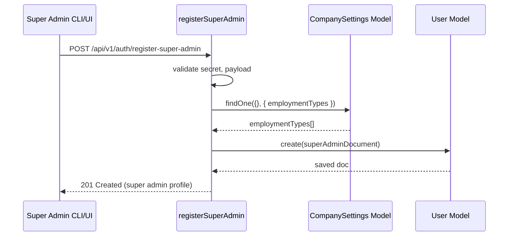
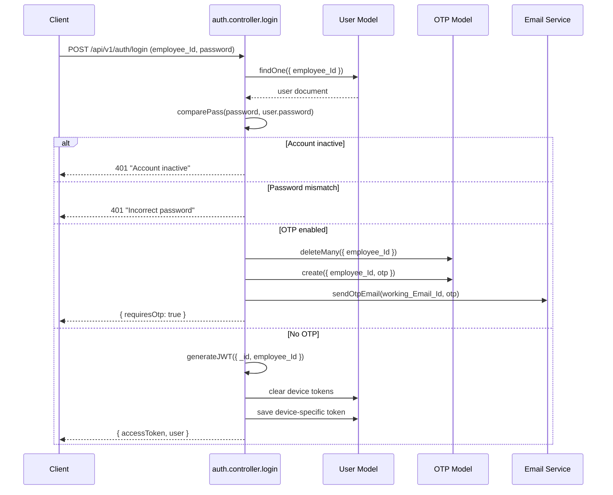
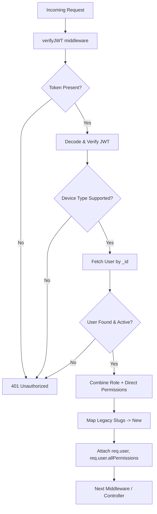

# Authentication & Authorisation

The authentication stack combines secure credential storage, optional OTP verification, device-bound JWTs, and granular permission mapping.  This document explains each step from super-admin creation to guarded route access.

## Components at a Glance

| Component | Purpose | Location |
| --- | --- | --- |
| **User Model** | Stores credentials, role, device tokens, permissions. | `src/models/users/user.model.js` |
| **Auth Controller** | Handles registration, login, OTP, password resets. | `src/controllers/auth/auth.controller.js` |
| **JWT Middleware** | Validates device token, maps permissions, attaches `req.user`. | `src/middlewares/auth.middleware.js` |
| **Permission Middleware** | Enforces permission slugs per route. | `src/middlewares/checkPermission.middleware.js` |
| **OTP Model** | Stores time-boxed OTP codes. | `src/models/otp/otp.model.js` |
| **Email Service** | Sends OTP and password reset messages. | `src/services/emailService.js` |

## Super Admin Bootstrap

The first account is created via `registerSuperAdmin`:

1. Validates a one-time `SUPERADMIN_SECRET_KEY`.
2. Ensures a "Permanent" employment type exists in `CompanySettings`.
3. Creates a user with `user_Role: "super-admin"`, hashed password, and default permissions.
4. Returns the user excluding sensitive fields.



## Login Workflow



### Device Awareness

The API expects an `x-device-type` header (`android`, `ios`, `web`, `desktop`).  Each successful login stores the JWT in the corresponding field on the user document (`accessTokenWeb`, `accessTokenAndroid`, etc.).  This makes token revocation straightforward per device.

## OTP Verification

- OTP values are six-digit numeric codes generated with `crypto.randomInt`.
- Stored in the `OTP` collection, keyed by `employee_Id`.
- The `verifyOtp` controller compares the submitted code and issues the JWT if valid.
- OTPs are deleted immediately after verification or if they expire.

## JWT Validation

All protected routes decorate controllers with `verifyJWT`:

1. Extracts the token from cookies, the `Authorization` header, or `accessToken` query parameter.
2. Verifies the JWT signature using `JWT_SECRET_KEY`.
3. Validates the `x-device-type` header to ensure the token was issued for that channel.
4. Loads the user document, refusing access if the account is inactive.
5. Merges role-derived permissions (`user.permission`) and direct permissions (`user.directPermissions`).
6. Maps legacy permission slugs to modern names using the `permissionMapping` object.
7. Attaches the resulting `allPermissions` array to `req.user` for downstream access.



### Permission Enforcement

Routes requiring specific permissions wrap handlers with `checkPermissionMiddleware(requiredPerm)`. The middleware reads `req.user.allPermissions` populated by `verifyJWT` and responds with HTTP 403 if the slug is missing.

Example:

```javascript
router.post(
  "/user-management/create",
  verifyJWT,
  checkPermission("employee-create-super"),
  userManagementController.createEmployee
);
```

## Password Resets

- **Request Reset:** `forgotPassword` throttled via `express-rate-limit` (`max: 4` per 24 hours). Generates a reset OTP emailed to the user.
- **Verify and Reset:** `resetPassword` endpoint validates the OTP, hashes the new password with `bcrypt`, clears device tokens, and sends an acknowledgement.

## Logout

The `logout` controller clears the device-specific token on the user document and removes that token from persistent storage. Frontend clients also remove FCM tokens and disconnect Socket.io during logout.

## Guest Tokens

For kiosk-style flows, `verifyJWTGuest` validates tokens issued with `JWT_SECRET_FOR_GUEST`. This is intentionally scoped to a smaller permission set and ignores desktop-only device types.

## Summary Checklist

- Always supply `x-device-type` to login and protected routes.
- Use `verifyJWT` and `checkPermission` for new endpoints.
- Regenerate the JWT after critical updates (password change, permission updates).
- Clean up OTPs and device tokens to prevent orphaned sessions.

With these rules in place the authentication stack remains consistent, auditable, and extendable across modules.

