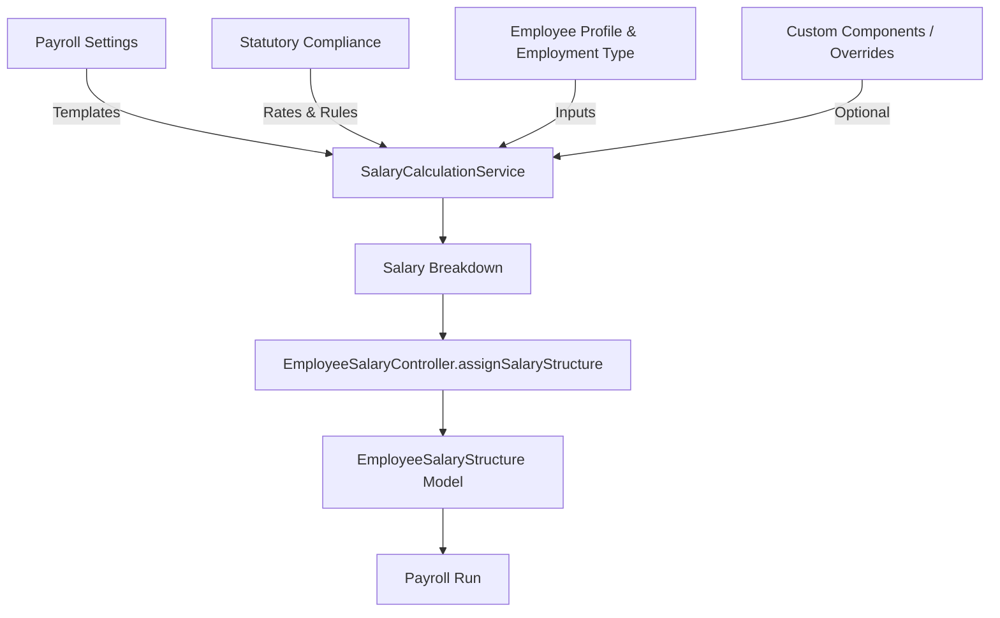
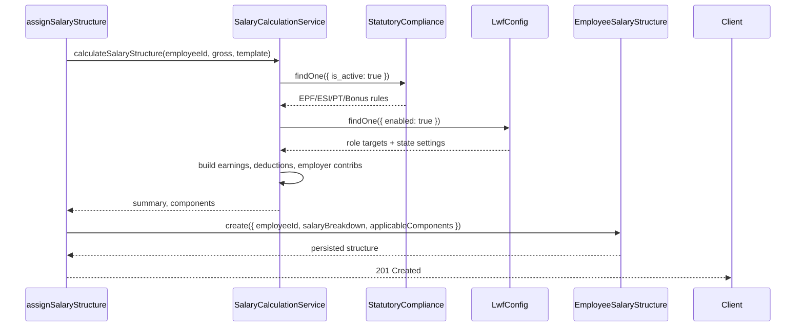

# Payroll Lifecycle

Payroll v2 orchestrates salary template configuration, statutory compliance, salary structure assignment, and payroll execution.  This document follows the path of employee compensation data from template design to final settlement.

## Key Actors

- **Payroll Settings** (`controllers/payrollv2/payrollSettingsController.js`) – Configures templates, earnings/deductions, allowances.
- **Statutory Compliance** (`controllers/payrollv2/statutoryComplianceController.js`) – Maintains EPF, ESI, PT, LWF, gratuity, and bonus rules.
- **Salary Calculation Service** (`src/utils/SalaryCalculationService.js`) – Core engine that computes monthly breakdowns, statutory deductions, employer contributions, and TDS.
- **Employee Salary Structure** (`controllers/payrollv2/employeeSalaryController.js`) – Assigns salary structures to employees and persists the breakdown.
- **Payroll Processor** (`controllers/payrollv2/PayrollProcessorController.js`) – Generates payroll runs, holds/release salaries, exports summaries.

## Data Flow Overview

## Step-by-Step

1. **Template Configuration**
   - Admins define salary templates (earnings, deductions, employer contributions) via the payroll settings UI.
   - Templates include percentage splits (basic, HRA, DA), fixed allowances, and optional custom formulae.
   - Stored in `PayrollSettings` collection.

2. **Compliance Setup**
   - Statutory regulations (EPF/ESI/PT/LWF/TDS/Gratuity/Bonus) are configured once and persisted in `StatutoryCompliance`.
   - PT supports state-level slabs with monthly override logic.
   - LWF supports role/ state targeting (`LwfConfig` model).

3. **Salary Structure Calculation**
   - `SalaryCalculationService.calculateSalaryStructure` consumes the template, compliance settings, gross salary, and employee metadata (role, state, employment type).
   - Output includes:
     - Earnings breakdown (basic, HRA, allowances, special).
     - Deductions (EPF, ESI, PT, LWF, TDS).
     - Employer contributions and summaries.
     - Metadata such as applied state, frequency, and intermediate calculations.
   - The service also resolves role names, state settings, and ensures LWF applies only to targeted roles.

4. **Assignment to Employee**
   - `EmployeeSalaryController.assignSalaryStructure` wraps the calculation and persists the structure in `EmployeeSalaryStructure`.
   - Stores both employee and employer LWF/TDS values, net salary, and compliance context.
   - Additional components can be attached (fixed deductions, reimbursements).

5. **Payroll Execution**
   - `PayrollProcessorController` orchestrates payroll runs:
     - Loads active salary structures.
     - Applies attendance or hold adjustments.
     - Generates payroll batches and exports.
     - Records audit entries.
   - Pending/hold salaries can be toggled via `payrollHoldStore` on the frontend.

6. **Post-Run Activities**
   - Payslips and summaries are generated from the final breakdown.
   - F&F settlements reuse the same salary structure base with exit-specific adjustments.

## Calculations under the Hood

- **Basic, HRA, DA** derived from template percentages against monthly gross.
- **EPF/ESI** use company settings, caps, exemptions. Calculated via methods on the `StatutoryCompliance` model.
- **PT** uses PT master slabs (`StatutoryCompliance.calculatePT`), state selection, and February overrides.
- **LWF** uses `LwfConfig` to determine eligible roles/states and applies monthly deductions.
- **TDS** computed on annual gross earnings using the selected tax regime (new/old) with thresholds defined in `SalaryCalculationService`.
- **Gratuity/Bonus** stored as accrual information for reporting.

## Important Files

| File | Description |
| --- | --- |
| `controllers/payrollv2/employeeSalaryController.js` | Assign, fetch, and manage employee salary structures. |
| `controllers/payrollv2/statutoryComplianceController.js` | CRUD for compliance settings and calculators. |
| `controllers/payrollv2/payrollSettingsController.js` | Template management, validation, and seeding. |
| `utils/SalaryCalculationService.js` | Core calculation logic, including PT/LWF/TDS helpers. |
| `services/employee/SalaryStuctureService.js` | Persists calculation output in `EmployeeSalaryStructure`. |
| `models/payrollNew/*` | Mongoose schemas for templates, structures, compliance. |

## Frontend Touchpoints

- **Salary Assignment Modal** (`components/payrollV2/tabs/modals/AssignSalaryModal.jsx`) – Captures gross salary, template selection, displays preview.
- **Statutory Compliance Settings** (`components/payrollV2/StatutoryCompliancePage.jsx`) – UI to toggle PT/LWF/ESI/EPF and configure states/roles.
- **Payroll Run Console** (`pages/payrollV2/payroll-run/`) – Initiates payroll runs, holds salaries, exports summaries.

Understanding this lifecycle helps when debugging payroll discrepancies, adding new statutory rules, or integrating external payroll exports.

