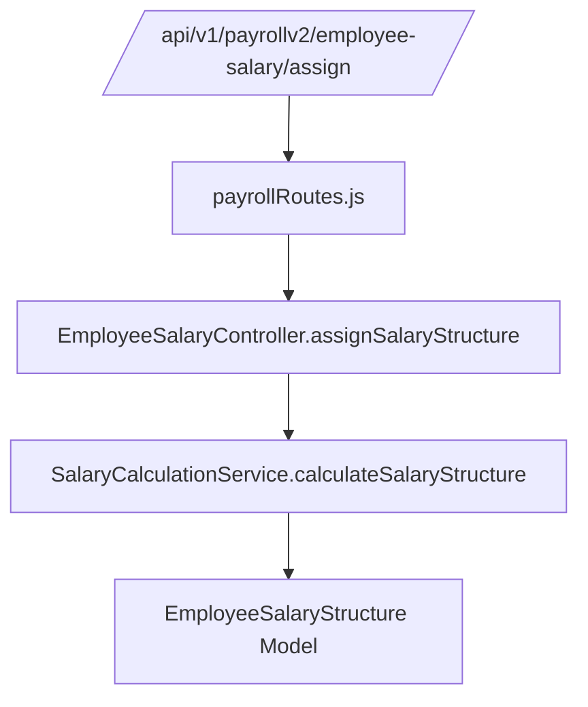
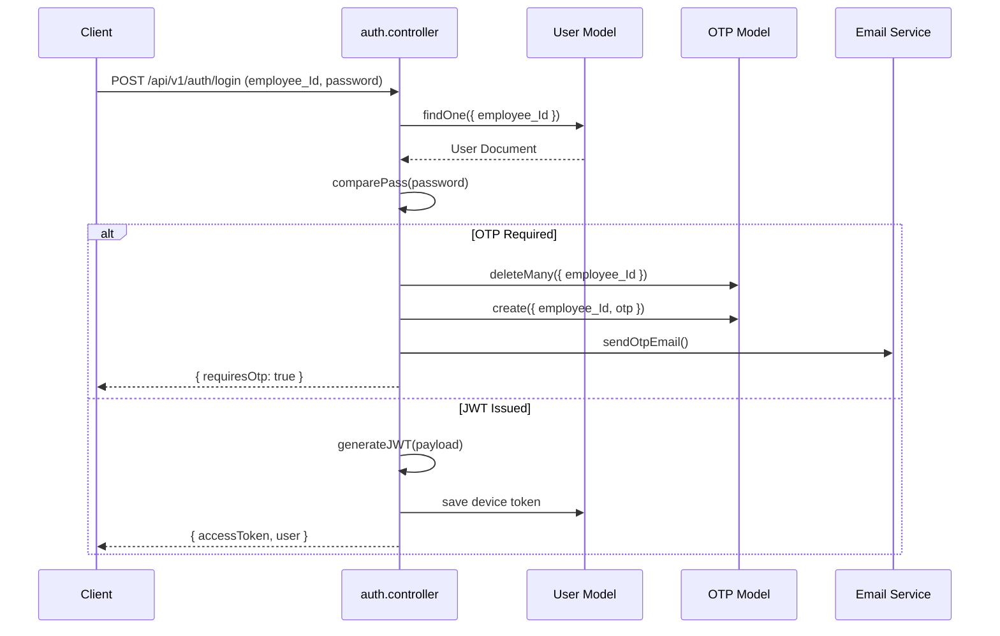

# Backend Service Map

The Express backend is organised by domain.  Every feature lives inside its own folder under `src/controllers`, `src/models`, and `src/routes/v1`.  Utilities and services provide shared functionality (email, salary computation, notifications, etc.).

This document highlights the major modules, their responsibilities, and the key entry points you can explore in the codebase.

## Routing Conventions

- All REST endpoints are mounted beneath `/api/v1`.
- Routes map 1‑to‑1 with controller files. Example: `src/routes/v1/payrollv2/payrollRoutes.js` wires functions from `src/controllers/payrollv2/**`.
- Middlewares handle authentication (`verifyJWT`), permission enforcement (`checkPermission`), multipart uploads (`multer`), and device validation.

## Core Domains

| Domain | Controllers | Models | Description |
| --- | --- | --- | --- |
| **Authentication** | `controllers/auth/auth.controller.js` | `models/users/user.model.js`, `models/otp/otp.model.js` | Super-admin bootstrap, login, OTP, password resets, JWT issuance. |
| **User Management** | `controllers/user/user.controller.js`, `controllers/user-management/userManagement.controller.js` | `models/users/user.model.js` | Profile enrichment, hierarchy lookups, reporting managers, role/permission management. |
| **Company Settings** | `controllers/company-settings/companySettings.controller.js` | `models/company-settings/companySettings.model.js` | Employment types, attendance rules, payroll defaults, shift definitions. |
| **Attendance** | `controllers/attendance/attendance.controller.js`, `controllers/attendance/attendanceUser.controller.js` | `models/attendance/attendance.model.js`, `models/attendance/missedpunchrequest.model.js` | Punch capture, roster enforcement, missed punch remediation, geolocation logs. |
| **Leave & Holidays** | `controllers/leave/leave.controller.js` | `models/leave/leave.model.js`, `models/leave/leaveType.model.js` | Leave applications, balances, approvals, holiday calendars. |
| **Payroll v2** | `controllers/payrollv2/*.js` | `models/payrollNew/*.js`, `models/payroll/*.js` | Salary templates, statutory compliance, payroll settings, salary structure generation, tax profiles. |
| **Recruitment** | `controllers/recruitment/*.js` | `models/recruitment/*.js` | Jobs, candidate pipelines, recruitment analytics, MRFs. |
| **Engagement** | `controllers/Engagement/*.js` | `models/Engagement/*.js` | Posts, polls, recognitions, feedback loops. |
| **Performance** | `controllers/performance/*.js` | `models/performance/*.js` | KPI/KRA tracking, ratings, reviews, dashboards. |
| **Assets & Inventory** | `controllers/asset-management/*.js`, `controllers/inventory-management/*.js` | `models/asset-management/*.js`, `models/inventory-management/*.js` | Asset catalogues, assignments, inventory thresholds, low stock alerts. |
| **Compliance & POSH** | `controllers/poshAct/poshAct.controller.js`, `controllers/disciplinary/*.js` | `models/PoshAct/poshAct.model.js`, `models/disciplinary/disciplinary.model.js` | POSH committee workflows, incident logging, disciplinary actions. |
| **Notifications & Chat** | `controllers/notification/notification.controller.js`, `controllers/chat/chat.controller.js`, `controllers/chat/chat.socket.js` | `models/notification/notification.model.js`, `models/chat/chat.model.js` | Socket.io namespaces, message persistence, push notifications, email digests. |
| **Services & Queues** | `services/emailService.js`, `services/emailQueue.js`, `services/emailWorker.js`, `services/employee/SalaryStuctureService.js`, `services/payroll/**` | n/a (services call models/utilities) | Email delivery via BullMQ/SES, salary structure persistence, payroll exports, notification helpers. |
| **Middlewares** | `middlewares/auth.middleware.js`, `middlewares/checkPermission.middleware.js`, `middlewares/deviceMiddlware.js`, `middlewares/unifiedPunchAuth.middleware.js`, `middlewares/multer.middleware.js` | n/a | Authentication/guest JWT enforcement, permission checks, device auth, file uploads. |

## Supporting Services

| Service | Responsibility | Files |
| --- | --- | --- |
| **Salary Calculation** | Break down salary templates, compute statutory components (EPF/ESI/PT/LWF/TDS), apply company-specific settings. | `src/utils/SalaryCalculationService.js`, `src/services/employee/SalaryStuctureService.js` |
| **Statutory Compliance** | Persist professional tax, ESI, EPF, gratuity settings and expose calculators. | `controllers/payrollv2/statutoryComplianceController.js`, `models/payrollNew/StatutoryCompliance.js` |
| **Email Queue** | Queue transactional emails (OTP, reminders, payroll) and process them asynchronously. | `src/services/emailService.js`, `src/services/emailWorker.js`, `src/utils/emailQueue.js` |
| **Cron Jobs** | Nightly attendance reconciliation, ticket reminders, poll closures. | `src/utils/cronJobs.js`, `src/jobs/**` |
| **File Handling** | Upload to cloud storage, serve downloads, validate MIME types. | `src/utils/fileUpload.js`, `src/middlewares/multer.middleware.js` |
| **Logging & Monitoring** | Structured logging via Winston; optional morgan HTTP access logs. | `src/utils/logger.js`, `server.js` |

## Authentication Flow (Backend Focus)

1. **Super Admin Registration** – `registerSuperAdmin` ensures the secret key matches, verifies employment types, and creates the first administrative user.
2. **Login** – `login` clears previous device tokens, validates password, optionally triggers OTP, and generates a device-specific JWT stored on the user document.
3. **Token Enforcement** – `verifyJWT` reads the `Authorization` header or cookies, validates device type, maps legacy permissions to new slugs, and attaches `req.user.allPermissions`.
4. **Route Permissions** – Many routes wrap controller handlers with `checkPermission("permission-slug")` to guarantee consistent enforcement.

## Error Handling Strategy

- Controllers log contextual errors (`logger.error`) and rethrow or respond via the `formatErrorResponse` helper (see `src/utils/errorHandler.js`).
- The global Express error handler captures uncaught exceptions and crash-proof the API.
- Frontend clients surface `message` and `details` fields returned by the API.

## Tips for Navigating the Code

- Start with the **route** file to confirm endpoints and middleware.
- Open the matching **controller** to understand orchestration logic.
- Follow through to **models** for schema definitions, virtuals, and statics.
- Inspect **utilities/services** referenced by the controller for business rules.

Use this map as a compass; the feature deep-dive pages cover individual domains in more detail.

