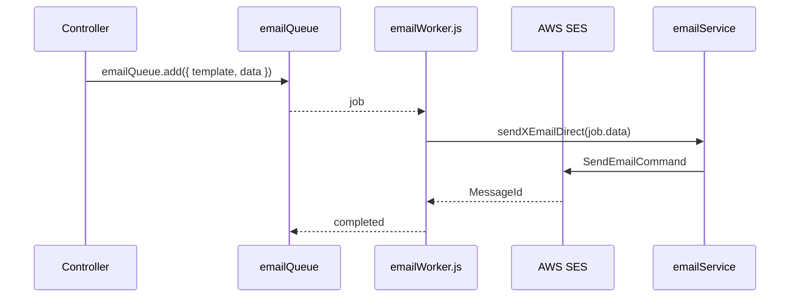

# Backend Services & Queues

The `src/services` folder contains cross-cutting services such as email delivery, queue workers, and domain-specific helpers.  This page documents the key services, the APIs they call (internal/external), and how they interact with controllers and utilities.

## Email Services

### Files

| File | Responsibility |
| --- | --- |
| `services/emailService.js` | Constructs and sends emails directly via AWS SES. |
| `services/emailQueue.js` | BullMQ queue producer for email jobs. |
| `services/emailWorker.js` | BullMQ worker that processes queued emails. |
| `templates/email/**` | HTML/text templates wrapped by `createEmailTemplate`. |

### Flow

### External API Calls

- **AWS SES** (Simple Email Service): `SendEmailCommand` with credentials from `.env`.
- **AWS S3** (indirect via templates): attachments hosted/uploaded using `utils/s3Upload.js`.

### Configuration

- `.env` values: `AWS_ACCESS_KEY_ID`, `AWS_SECRET_ACCESS_KEY`, `AWS_REGION`, `AWS_SES_FROM_EMAIL`, email-specific names.
- `EMAIL_WORKER_CONCURRENCY`, `EMAIL_RATE_LIMIT_MAX`, `EMAIL_RATE_LIMIT_DURATION` tune BullMQ worker throughput.

## Salary Structure Service

| File | Description |
| --- | --- |
| `services/employee/SalaryStuctureService.js` | Persists salary breakdowns, constructs component arrays, stores LWF/TDS metadata. |

### Interaction

- Consumed by `controllers/payrollv2/employeeSalaryController.js`.
- Uses `SalaryCalculationService` output to build `applicableComponents` and `salaryBreakdown`.
- Writes to `EmployeeSalaryStructure` model.

## Payroll Services

| File | Description |
| --- | --- |
| `services/payroll/payrollCalculationService.js` (if present) | Additional payroll utilities beyond the main calculation service. |
| `services/payroll/payrollExportService.js` | Generates Excel/CSV exports for payroll runs. |
| `services/payroll/payrollNotificationService.js` | Sends payroll-specific notifications. |

These services often call:

- `utils/xlsxExporter.js` or `exceljs` to produce spreadsheets.
- `services/emailService.js` to email payslips/notifications.
- `controllers/payrollv2` logic via internal functions.

## Notification service helpers

| File | Description |
| --- | --- |
| `utils/sendPushToUsers.js` | Uses Firebase Admin SDK to send FCM push notifications. |
| `services/notificationService.js` (if present) | Wraps push/email combined notifications. |

## API Integrations

### External APIs

- **AWS** (SES, S3) – for emails and document storage.
- **Firebase Admin** – push notifications.
- **Geo/holiday APIs** – `controllers/common/holidays.controller.js` uses `process.env.NINJA_API_KEY` to call external calendar APIs.

### Internal APIs

- Services primarily interact with internal controllers/models. For example:
  - Salary services call `SalaryCalculationService` and `EmployeeSalaryStructure`.
  - Email services are invoked from controllers (auth, leave, payroll) using helper functions.

## Adding a New Service

1. Create a file under `src/services/<domain>/<name>.js` or reuse existing domain folder.
2. Encapsulate external API interactions and shared logic; keep controllers thin.
3. If the service performs asynchronous/out-of-band work, consider adding a BullMQ queue + worker.
4. Export functions via `export const functionName = async (...) => { ... }`.
5. Ensure environment variables are read via `process.env` and documented (see `.env` template in project setup docs).
6. Update documentation (this page) when new services are added.

Refer to this page while navigating backend services or introducing new service-layer functionality.

