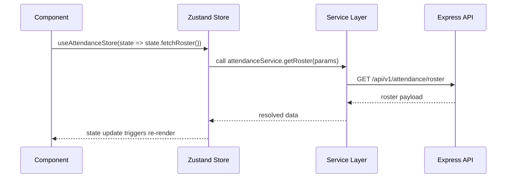

# Frontend Architecture

The HCM frontend is a React 18 single-page application scaffolded with Vite and styled with Tailwind CSS + Material UI.  It integrates Socket.io, Firebase Cloud Messaging, and a large library of domain-focused components.

## Project Layout

```
hcmFrontend/
├── src/
│   ├── App.jsx
│   ├── main.jsx
│   ├── routes/Router.jsx            # Central route config
│   ├── contexts/                    # Global providers (chat, notifications)
│   ├── store/                       # Zustand stores
│   ├── service/                     # API clients, socket service, helpers
│   ├── components/                  # Shared + feature components
│   ├── pages/                       # Route-level composites
│   ├── assets/                      # Static images, templates
│   ├── utils/                       # General utilities (FCM, tokens, etc.)
│   └── firebase/                    # Firebase messaging bootstrap
├── index.html
├── tailwind.config.js
├── vite.config.js
└── package.json
```

## Application Bootstrap

1. `main.jsx` mounts `<App />` inside the root DOM node.
2. `<App />` registers Firebase messaging listeners, initialises the Zustand notification store, attaches offline-gap Electron integrations, and renders `<RouterProvider router={router} />`.
3. `<SubdomainValidator>` guards route rendering based on the tenant subdomain.
4. Global modals and toast infrastructure are included at the root level.

```mermaid
graph TD
    A[Vite Entry (main.jsx)] --> B[App.jsx]
    B --> C[SubdomainValidator]
    C --> D[RouterProvider]
    D --> E[Routes/Router.jsx]
    B --> F[Firebase Messaging Listener]
    B --> G[Zustand Notification Store]
```

## Routing

- Routes are declared in `src/routes/Router.jsx` using nested `createBrowserRouter` definitions.
- Feature routes lazy-load page components to keep bundles small.
- Access control is handled on the server; the frontend inspects `permissions` from the auth store to conditionally render links and sections.

## State Management with Zustand

- `src/store/store.js` exports the `useAuthStore` slice which holds authentication state, user profile details, and login/logout logic.
- Each domain has a dedicated store file (e.g., `useAttendanceStore`, `payrollStore`, `useRecruitmentStore`). These stores encapsulate:
  - API data fetching via services.
  - Local UI state (filters, modals).
  - Normalised entity caches.
- `persist` middleware is used for slices that must survive page reloads (auth, some filters).



## Service Layer

- REST clients are centralised in `src/service/**`. Most services wrap `axios` and inject the bearer token from `useAuthStore`.
- Socket.io integrations live in `src/service/socketService.js`. `disconnectSocket()` is called during logout to free resources.
- `utils/registerFcmToken.js` and `firebase/firebase-config.js` handle push-notification integration.

## UI Toolkit

- Tailwind provides base styling (`index.css` + config).
- Material UI components are used for complex layouts (dialogs, inputs).
- Custom components live under `src/components/**`, grouped by domain (e.g., `payrollV2/`, `attendance/`, `recruit management/`).
- Charts use `apexcharts`, `chart.js`, and `recharts`.
- Forms rely on `react-hook-form`, `yup`, and MUI inputs.

## Notifications & Realtime

- Firebase Cloud Messaging pushes notifications to the app. `App.jsx` listens via `onMessage(...)` and displays a custom toast (`PushNotificationCard`).
- Socket.io channels deliver chat messages, live attendance updates, and other realtime events. Chat logic is wrapped in `ChatContextv2`.

## Authentication Flow (Frontend Perspective)

1. User submits credentials; `useAuthStore.login` sets state and localStorage.
2. On successful login, router redirects based on permission priority.
3. Authenticated requests include the stored `accessToken` header.
4. Logout clears local storage, tokens, sockets, notifications, and engagement permissions.

## Tenant Awareness

- `SubdomainValidator` ensures that the SPA only renders for supported tenant domains (e.g., `razorinfotech`, `razormar`). It redirects unsupported subdomains to a fallback page.
- Tenant-specific branding and company info are fetched via company settings endpoints and cached in the auth store (`setCompanyInfo`).
- Production deployments build once per tenant (`npm run build`), and the resulting `dist` directories are hosted on Nginx under tenant-specific roots so each subdomain serves its own bundle while sharing the same codebase.

## Key Pages

- `src/pages/dashboard/` – Super admin, manager, and employee dashboard variants.
- `src/pages/attendance/` – Live attendance console, punch history, correction forms.
- `src/pages/payrollV2/` – Salary structure builders, compliance configuration, payroll run cockpit.
- `src/pages/recruitment/` – Recruitment dashboards, candidate boards, requisition forms.

Each page is composed of reusable components (`src/components/**`) and interacts with the relevant store/service pair.

## Tips for Contributors

- Use existing stores as references when creating new domain slices.
- Keep API logic inside `service/**` to maintain separation between view and data layers.
- Co-locate heavy UI components in feature directories to reduce coupling.
- Leverage `lazy` imports inside `Router.jsx` for new routes to avoid unnecessary bundle bloat.

Refer to the [Backend Service Map](../backend/service-map.md) for matching API endpoints and data contracts.

