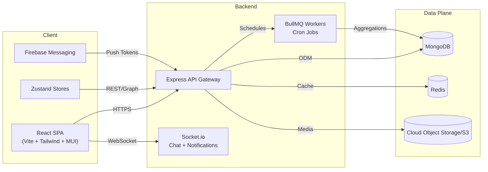

# Human Capital Management Platform

The **HCM platform** is a full-stack Human Resource Management solution that Razor Infotech uses to digitise the complete employee life cycle.  It combines a rich React single-page application, a modular Express.js backend, MongoDB for persistence, Socket.io for realtime collaboration, and background schedulers for automation.

This documentation set explains how the platform is organised, how data flows through major modules, and how to extend or integrate with the system safely.

## Core Capabilities

- **Employee 360** – onboarding, profile management, document vaults, hierarchy, and exits.
- **Time & Attendance** – biometric ingestion, geofencing, missed-punch reconciliation, and roster management.
- **Leave & Compliance** – configurable leave types, approval chains, POSH workflows, disciplinary case tracking.
- **Payroll 2.0** – templates, statutory compliance (EPF/ESI/PT/LWF/TDS), salary structure assignment, and F&F processing.
- **Talent & Engagement** – recruitment pipeline, KPI/KRA reviews, social feed, polls, chat, and notifications.
- **Analytics** – role-specific dashboards powered by aggregated MongoDB queries and scheduled jobs.
- **Multi-Tenant Hosting** – a single codebase powers multiple customer environments; each tenant runs on its own port, environment variables, and subdomain while sharing the same repository.

## High-Level Architecture

### Backend Highlights

- **Express 5 application** bootstrapped in `server.js` with CORS whitelisting, JWT-secured Socket.io namespaces, and global error handling.
- **Domain-driven controllers** grouped under `src/controllers/**`, thin routes under `src/routes/v1/**`, and Mongoose models in `src/models/**`.
- **Authentication** uses JWTs issued per device, OTP/email verification, role + direct permission unions, and middleware in `auth.middleware.js`.
- **Async workloads** utilise BullMQ queues and scheduled scripts to poll attendance devices, send reminders, and finalise payroll cycles.
- **Utilities** in `src/utils/**` include logger, hash helpers, AWS clients, salary calculators, and validation libraries.

### Frontend Highlights

- **React 18 SPA** built with Vite, Tailwind, Material UI, Hero Icons, and ApexCharts.
- **Routing** managed by `react-router-dom` with route manifests in `src/routes/Router.jsx`.
- **State** stored with [Zustand](https://github.com/pmndrs/zustand) (`src/store/**`) and React context providers for chat, notifications, and theme.
- **Services** in `src/service/**` encapsulate API calls, WebSocket clients, and Firebase messaging.
- **Feature directories** under `src/components/**` and `src/pages/**` mirror backend domains (Attendance, Payroll v2, Recruitment, etc.).

## Documentation Map

| Section | Description |
| --- | --- |
| [System Architecture](architecture/overview.md) | Deployment topology, module boundaries, and cross-cutting concerns. |
| [Backend Modules](backend/service-map.md) | Controller, model, route, and util breakdown by feature vertical. |
| [Authentication & Authorisation](backend/authentication.md) | Super-admin bootstrap, login & OTP, JWT validation, permission mapping. |
| [Frontend Architecture](frontend/overview.md) | Routing, global state, UI libraries, and notable feature modules. |
| [Developer Setup](getting-started/project-setup.md) | Local environment, scripts, environment variables, and tooling. |
| [Operational Guides](devops/deployment.md) | Deployment checklist, background workers, and monitoring hooks. |

Each page includes Mermaid flow charts and sequence diagrams to visualise the code paths described.

## Next Steps

1. **Set up your environment** with [Project Setup](getting-started/project-setup.md).
2. **Understand the backend** via [Service Map](backend/service-map.md) and [Authentication](backend/authentication.md).
3. **Explore the frontend** with [Frontend Overview](frontend/overview.md) and the module-specific notes linked within.
4. **Learn the data flows** using diagrams in [Architecture Overview](architecture/overview.md) and [Authentication](backend/authentication.md).

This documentation stays close to the codebase. Examples reference real files so that engineers can jump directly into implementation details. Newly added modules should document their controllers and models following the same format for consistency.

