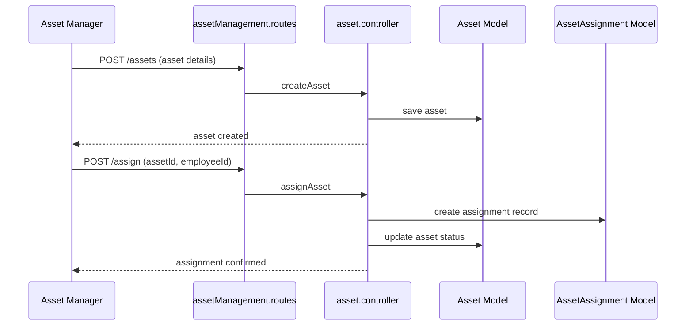

# Asset & Inventory Management

The asset module tracks company-issued assets (laptops, mobile devices, etc.), while the inventory module manages consumables and stock levels. These modules tie into employee profiles, issue management, and notifications.

## Core Permissions

| Permission | Description |
| --- | --- |
| `asset-manage` | Assign and manage assets (`assignAssets`, `add-inventory`). |
| `asset-view` | View asset catalogue. |
| `inventory-manage` | Manage inventory (items, vendors). |

## Backend Components

| Domain | Controllers | Models | Notes |
| --- | --- | --- | --- |
| Asset Management | `controllers/asset-management/asset.controller.js`, `controllers/asset-management/assetAssignment.controller.js` | `models/asset-management/asset.model.js`, `assetAssignment.model.js` | Asset catalogue, assignment history, return workflow. |
| Inventory | `controllers/inventory-management/inventory.controller.js` | `models/inventory-management/inventoryItem.model.js`, `inventoryTransaction.model.js` | Track stock levels, vendors, transactions. |
| Loan & Advance | `controllers/loanAdvanceSalary/*.js` | `models/loanAdvanceSalary/*.js` | Often paired with asset loans (e.g., device purchase loans). |
| Document Centre | `controllers/document-center/DocumentController.js` | Document attachments for assets/inventory. |
| Jobs | `jobs/inventoryLowStockScheduler.js` | Sends low-stock alerts. |

### Key Endpoints

- `GET /api/v1/asset-management/assets` – List assets with filters (status, category).
- `POST /api/v1/asset-management/assets` – Create new asset.
- `POST /api/v1/asset-management/assign` – Assign asset to employee.
- `POST /api/v1/inventory-management/items` – Add inventory item.
- `POST /api/v1/inventory-management/transactions` – Record stock in/out.
- `GET /api/v1/inventory-management/vendors` – Manage vendor data.

## Frontend Components

| Feature | Pages/Components | Stores | Services |
| --- | --- | --- | --- |
| Assets | `pages/assets/AssetDashboard.jsx`, `components/assets/AssetFormModal.jsx`, `components/assets/AssetHistoryModal.jsx` | `store/useAssetStore.js` | `service/assetService.js` |
| Inventory | `pages/inventory/InventoryDashboard.jsx`, `components/inventory/ItemForm.jsx`, `components/inventory/StockTransactionTable.jsx` | `store/loanAdvanceStore.js` (shared), `store/useInventoryStore.js` (if available) | `service/inventoryService.js` |
| Loans | `pages/loan-advance/LoanAdvanceDashboard.jsx`, `components/loan/LoanForm.jsx` | `store/loanAdvanceStore.js` | `service/loanAdvanceService.js` |

Components integrate with the Document Centre for attachments (warranty cards, invoices).

## Notifications & Automation

- Low stock scheduler triggers email/push alerts (`inventoryLowStockScheduler.js`).
- Asset expiry or maintenance reminders handled via cron jobs or manual filters.

## Integration Points

- Asset assignments appear on employee profiles (`user.controller` enriches profile with assigned assets).
- Inventory transactions feed into analytics dashboards.
- Loan and asset data can travel into payroll for deductions (if configured).

## Tenant Considerations

- Each tenant may maintain its own vendor list, asset categories, and low stock thresholds stored in MongoDB.
- The same codebase handles all tenants; `.env` (S3 bucket, email identities) changes per PM2 process.
- Frontend builds can brand asset categories per tenant (logos, naming).

With this reference you can locate asset-related code quickly and reason about the data flow from inventory entries to employee assignments.

