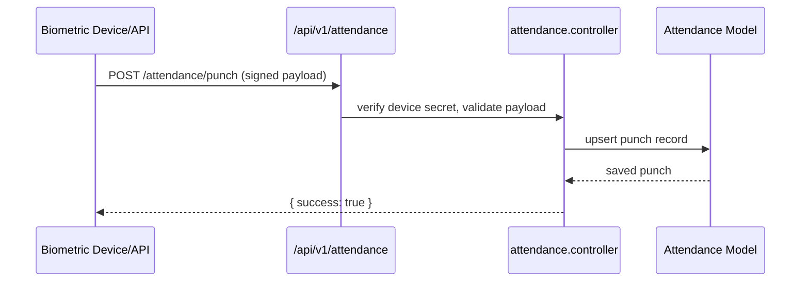
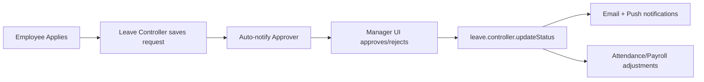

# Attendance & Leave Management

The Attendance & Leave module orchestrates time tracking, shift enforcement, geolocation, missed punch workflows, and leave approvals.  It integrates with payroll for salary adjustments and with notifications for reminders.

## Core Permissions

| Permission | Description |
| --- | --- |
| `attendance-main` | Access attendance admin consoles (`MainAttendance`). |
| `attendance-view-own` | View personal attendance (`myAttendance`). |
| `leave-apply` | Submit leave requests (`applyLeaves`). |
| `leave-manage-subordinate` | Approve/reject subordinate leaves (`acceptandrejectleave`). |
| `leave-management` | Administrative leave operations. |

## Backend Components

### Attendance

| File | Responsibility |
| --- | --- |
| `controllers/attendance/attendance.controller.js` | CRUD for punches, attendance summaries, shift enforcement. |
| `controllers/attendance/attendanceUser.controller.js` | Employee-centric endpoints (own punches, corrections). |
| `controllers/attendance/attendanceLock.controller.js` | Lock/unlock attendance periods, generate reports. |
| `models/attendance/attendance.model.js` | Punch schema, shift references, geolocation data. |
| `models/attendance/missedpunchrequest.model.js` | Missed punch correction requests. |
| `routes/v1/attendance/index.js` | Routes under `/api/v1/attendance`, guarded by `verifyJWT`. |
| `middlewares/unifiedPunchAuth.middleware.js` | Authenticates IoT/biometric device payloads (`DEVICE_SECRET`). |
| `utils/attendanceHelper.js` | Shift calculations, late/early detection, overtime logic. |

### Leave

| File | Responsibility |
| --- | --- |
| `controllers/leave/leave.controller.js` | Create, approve, revoke leave applications, compute balances. |
| `models/leave/leave.model.js` | Leave application documents. |
| `models/leave/leaveType.model.js` | Configurable leave types, carry-forward settings. |
| `controllers/leave/leaveType.controller.js` | Manage leave categories, entitlements. |
| `routes/v1/leave/` | REST endpoints for leaves, types, holiday import. |
| `controllers/common/holidays.controller.js` | Fetch public holidays (optional Ninja API). |

### Schedulers & Integrations

- `jobs/latePunchScheduler.js` – Polled after DB connection to auto-send late punch reminders.
- `jobs/workingDays.js` – Computes working days per period (sheet export helper).
- `services/emailService.js` – Templates for leave approvals, reminders.
- `services/emailWorker.js` – Background email processing for attendance reminders.

## Frontend Components

### Attendance

| Path | Description |
| --- | --- |
| `pages/attendance/AttendanceDashboard.jsx` | Admin view with status summaries, filters, bulk actions. |
| `pages/attendance/AttendanceLogs.jsx` | Detailed punch log, search, export. |
| `pages/attendance/MissedPunchRequests.jsx` | Managers approve/reject corrections. |
| `components/attendance/ShiftScheduler.jsx` | Assign shifts, view rosters. |
| `store/useAttendanceStore.js`, `store/useAttendanceLockStore.js` | Zustand stores for logs, filters, locks. |
| `service/attendanceService.js` | REST wrapper for attendance endpoints. |
| `hooks/useGeolocation` | Handles live tracking and map rendering. |

### Leave

| Path | Description |
| --- | --- |
| `pages/leave-management/LeaveDashboard.jsx` | Manager queue, leave calendar, analytics. |
| `pages/leave-management/MyLeaves.jsx` | Employee leave history and requests. |
| `components/leave/ApplyLeaveModal.jsx` | Leave application form. |
| `components/leave/LeaveBalanceCard.jsx` | Shows balance & entitlement per leave type. |
| `store/useLeaveStore.js`, `store/leaveTypeStore.js` | Zustand stores for leave applications and types. |
| `service/leaveService.js` | HTTP client for leave APIs. |

## Missed Punch Workflow

1. Employee submits correction via `POST /api/v1/attendance/missed-punch`.
2. Request stored in `MissedPunchRequest` with status `Pending`.
3. Manager receives notification (email + push). UI displays queue.
4. Manager approves/rejects; attendance record updated accordingly.
5. Payroll uses finalised attendance for salary deductions.

## Leave Approval Flow

## Configuration & Integrations

- **CompanySettings** defines shift timings, grace periods, holiday calendars.
- Geolocation uses `leaflet` on the frontend and stores coordinates in attendance punches.
- Device integration requires the correct `DEVICE_SECRET` header for `unifiedPunchAuth.middleware.js`.
- Attendance locks prevent retroactive edits once payroll is processed.

## Tips

- Review `attendanceValidationCheck.js` for payroll readiness logic (ensures required punches exist before payroll runs).
- Use the leave reminder scheduler to nudge managers about pending approvals.
- Attendance exports rely on `jobs/workingDays.js`; adjust when adding custom calendars.
- All tenant-specific behaviour (shifts, leave types) is stored under each company's database; only `.env` and ports differ between tenants.

