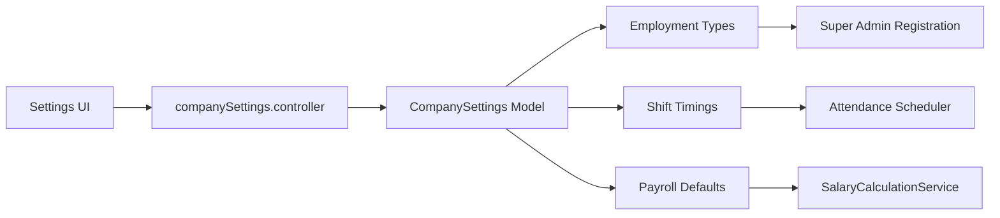

# Company Settings & Permissions

Company Settings is the configuration nucleus of the platform.  It governs departments, designations, employment types, shifts, hierarchy, and permission roles.  Changes impact multiple modules including attendance, payroll, and recruitment.

## Core Permissions

| Permission | Description |
| --- | --- |
| `company-settings` | Access the company settings UI (`CompanySettings`). |
| `company-hierarchy` | Manage departments, designations, reporting (`companyInfo`). |
| `role-create` | Create/update permission roles (`addRole`). |
| `policy-manage` | Manage policy documents (ties into compliance). |

## Backend Components

| Area | Controllers | Models | Notes |
| --- | --- | --- | --- |
| Company Config | `controllers/company-settings/companySettings.controller.js` | `models/company-settings/companySettings.model.js` | Employment types, shifts, geofencing, payroll defaults. |
| Departments/Designations | `controllers/department/department.controller.js`, `controllers/designation/designation.controller.js` | `models/department/department.model.js`, `models/designation/designation.model.js` | Org structure. |
| Permission Roles | `controllers/permission-role/permissionRole.controller.js` | `models/permission-role/permissionRole.model.js` | Role-based permission sets. |
| User Management | `controllers/user-management/userManagement.controller.js` | `models/users/user.model.js` | Role assignment, bulk uploads, employee activation. |
| Organization Chart | `controllers/common/subordinates.controller.js` | `models/users/user.model.js` | Reporting hierarchy, manager-subordinate queries. |

### Key Endpoints

- `GET /api/v1/company-settings` – Fetch global settings (employment types, shifts).
- `PUT /api/v1/company-settings` – Update settings; triggers side effects on dependent modules.
- `GET /api/v1/permission-role` – List roles with permissions.
- `POST /api/v1/permission-role` – Create new role.
- `POST /api/v1/user-management/create` – Add employees with role assignments.
- `GET /api/v1/departments`, `POST /api/v1/departments` – Manage departments.

## Frontend Components

| Feature | Pages/Components | Stores | Services |
| --- | --- | --- | --- |
| Company Profile | `pages/company/CompanyInfo.jsx`, `components/company/CompanyForm.jsx` | `store/companyStore.js`, `store/useCompanySettingsStore.js` | `service/companyService.js` |
| Departments & Teams | `pages/company/DepartmentManagement.jsx`, `components/company/DepartmentTree.jsx` | `store/departmentStore.js` | `service/departmentService.js` |
| Permission Roles | `pages/settings/RolePermissionPage.jsx`, `components/settings/RoleModal.jsx` | `store/permissionRoleStore.js` | `service/permissionRoleService.js` |
| Employment Types | Managed via company settings UI, stored in `companyStore`. |  |  |
| Org Chart | `components/orgChart/OrgChartViewer.jsx` (uses @balkangraph) | `store/orgStore.js` | `service/orgService.js` |

## Permission Mapping

`auth.middleware.js` contains the translation between legacy permission keys and new slugs. Example:

| Legacy Key | New Slug |
| --- | --- |
| `companyInfo` | `company-settings` |
| `addRole` | `role-create` |
| `PolicySystem` | `policy-manage` |
| `viewPolicies` | `policy-view` |

When adding new permissions, update the mapping and ensure routes use the new slug.

## Influence on Other Modules

- **Attendance** – Employment types, shift timings, geofencing settings originate from `CompanySettings`.
- **Payroll** – Default templates, statutory toggles reference company-level settings.
- **Recruitment** – Departments and designations populate job forms.
- **Org Chart** – Reporting lines drive manager lookups and permission checks.

## Tenant Separation

- Each tenant’s `.env` points to its own database; `CompanySettings` data is unique per tenant.
- PM2 instances per tenant load distinct settings while running the same code.
- Frontend builds per tenant read company info via APIs to brand the UI dynamically.

Use this guide when modifying global configuration, provisioning new permissions, or troubleshooting cross-module configuration issues.

