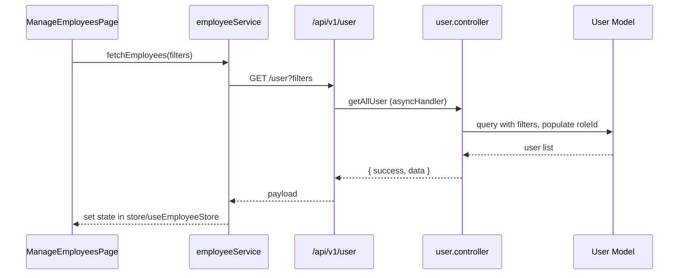

# Employee Management

Employee Management is the hub for HR operations—creating employees, assigning roles, managing subordinates, and viewing organisational data.  It encompasses employee master data, activation/deactivation, asset links, and RAG reporting.

## Permissions

| Permission | Description |
| --- | --- |
| `employee-main` | Access the main employee management console. |
| `employee-create-super` | Add employees (HR/Super admin). |
| `employee-create-manager` | Add employees as manager-level. |
| `employee-view-subordinate` | View subordinate list. |
| `employee-manage-super` | Full employee management, edit profiles. |
| `asset-manage` | Assign assets (linked from manage employees menu). |
| `add-inventory` | Add inventory items (from employee menu). |
| `disciplinary-actions` | Manage disciplinary records per employee. |
| `Rag-report-submission-manager` / `Rag-report-submission-HR` | Submit RAG reports. |

## Backend Components

| File | Responsibility |
| --- | --- |
| `controllers/user/user.controller.js` | Fetch employee profiles, subordinates, reporting hierarchy, role summaries. |
| `controllers/user-management/userManagement.controller.js` | Create/update employees, bulk imports, activation toggles. |
| `controllers/department/department.controller.js` | Manage department metadata used on employee profiles. |
| `controllers/designation/designation.controller.js` | Manage designations/job titles. |
| `controllers/rag/rag.controller.js` | RAG submissions for employees/teams. |
| `models/users/user.model.js` | Core employee schema (personal, employment, permissions). |
| `models/department/department.model.js`, `models/designation/designation.model.js` | Org structure. |
| `routes/v1/user/`, `routes/v1/user-management/` | REST endpoints. |

### Key Endpoints

- `GET /api/v1/user` – List employees with filters/pagination.
- `POST /api/v1/user-management/create` – Create employee.
- `PUT /api/v1/user-management/:id` – Update employee profile.
- `GET /api/v1/user/subordinates` – Retrieve subordinate list for logged-in manager.
- `GET /api/v1/rag/dashboard` – RAG analytics per employee/team.

## Frontend Components

| Path | Description |
| --- | --- |
| `pages/employees/EmployeeManagement.jsx` | Main HR console. |
| `pages/employees/AddEmployee.jsx` | Create employee form for super admins. |
| `pages/employees/AddEmployeeManager.jsx` | Manager-specific employee creation. |
| `pages/employees/Subordinates.jsx` | View subordinate list. |
| `pages/employees/AllEmployees.jsx` | Full directory view. |
| `components/employees/EmployeeTable.jsx` | Reusable table with filters. |
| `components/employees/EmployeeFormModal.jsx` | Modal for editing details. |
| `store/useEmployeeStore.js`, `store/useAllEmployeesStore.js` | Zustand stores for employee lists, filters, loading states. |
| `store/dashboardStore.js` | Provides RAG/performance analytics for dashboards. |
| `service/employeeService.js`, `service/userManagementService.js` | Axios clients for employee APIs. |

## Integrations

- **Assets/Inventory** – from employee profile, asset assignment modal uses `asset.controller`.
- **Disciplinary** – Quick access to disciplinary actions relating to selected employee.
- **RAG** – Manager submits RAG reports from employee dashboard.
- **Org Chart** – Employees feed into organisation chart visualisation.

## Tenant Notes

- Each tenant’s `.env` defines DB connection; all employee data remains isolated.
- Bulk import/export features rely on tenant-specific S3/SES settings for notifications.
- Frontend builds per tenant customise default filters and branding (department names, logos).

This reference helps locate relevant backend controllers and frontend components when maintaining employee management features.

