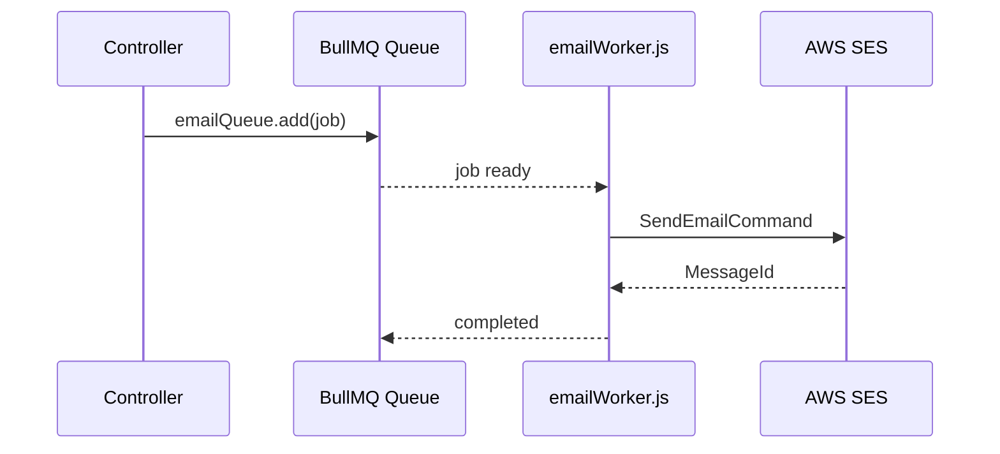

# Notifications & Communication

This module unifies push notifications, email alerts, ticketing, and real-time socket updates to ensure employees receive timely information across the platform.

## Components

| Feature | Description |
| --- | --- |
| Push Notifications | Firebase Cloud Messaging to browser/mobile. |
| Email Notifications | AWS SES via BullMQ queue and worker. |
| Socket.io Notifications | In-app toasts, chat messages, real-time counters. |
| Issue/Ticketing | Employee issue management with notifications. |

## Backend

| File | Responsibility |
| --- | --- |
| `controllers/notification/notification.controller.js` | REST endpoints for listing, reading, deleting notifications. |
| `models/notification/notification.model.js` | Notification schema (type, link, read status). |
| `controllers/chat/chat.socket.js` | Emits realtime events for chat, notifications. |
| `controllers/Issues/issue.controller.js` | Ticket creation, assignment, comment threads. |
| `services/emailService.js`, `services/emailWorker.js` | Email sending pipeline. |
| `utils/sendPushToUsers.js` | FCM push helper. |
| `utils/notificationHelper.js` (if present) | Builds notification payloads. |

### Email Pipeline

### Push Notification Flow

- `registerFcmToken()` obtains token and sends to backend.
- `sendPushToUsers.js` uses Firebase Admin SDK to broadcast.
- Frontend listens in `App.jsx` via `onMessage` and displays `PushNotificationCard`.

## Frontend

| Component | Purpose |
| --- | --- |
| `store/notificationStore.js` | Stores notifications, unread counts. |
| `components/Notification/NotificationBell.jsx` | UI badge showing unread counts. |
| `components/Notification/NotificationList.jsx` | Drawer/list of notifications. |
| `components/Notification/PushNotificationCard.jsx` | Toast for incoming push events. |
| `service/notificationService.js` | REST client for notifications. |
| `service/socketService.js` | Subscribes to `notification:new` events. |

## Ticketing (Issue Management)

- Uses `controllers/Issues/issue.controller.js` and `models/issues/issue.model.js`.
- Zustand store: `store/useIssuesStore.js`.
- Frontend pages: `pages/issue-management/IssueBoard.jsx`.
- Notifications triggered when new tickets are created or status changes.

## Environment Variables

- `FIREBASE_*` for push notifications (configured via service account).
- `AWS_ACCESS_KEY_ID`, `AWS_SECRET_ACCESS_KEY`, `AWS_REGION`, `EMAIL_FROM_*` for SES emails.
- `REDIS_HOST`, `REDIS_PORT`, `EMAIL_WORKER_CONCURRENCY` for BullMQ worker.

## Tenant Considerations

- Each tenant uses its own SES verified identities and Firebase credentials stored in the tenant `.env`.
- PM2 worker processes run per tenant to keep email queues isolated.
- Frontend builds contain tenant-specific Firebase configs (`.env`).

## Extending Notifications

- For new events, call `notification.controller.createNotification`, queue email jobs, and emit socket events.
- Keep payloads consistent (title, body, link) so all clients (toast, list, email) present coherent information.
- Document new notification types in code comments and update this doc accordingly.

