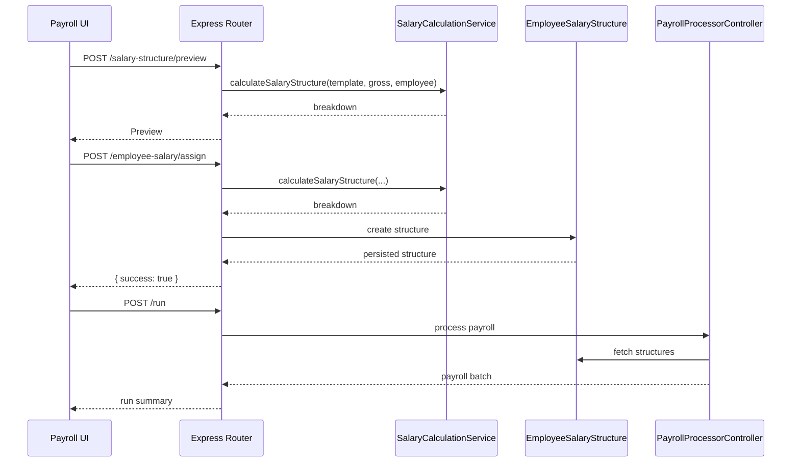

# Payroll Management

Payroll Management automates salary calculation, statutory compliance, payroll runs, and full-and-final (FNF) settlements.  The module integrates with attendance, leave, and employee master data to produce accurate payout summaries.

## Core Permissions

| Permission | Description |
| --- | --- |
| `payroll-main` | Access payroll dashboards and run payroll (legacy `payroll`). |
| `payroll-manage` | Manage payroll settings, salary structures, statutory compliance. |
| `employee-tax-profile` | Maintain employee tax declarations. |
| `fnf-approve` | Approve full & final settlements (`FNFAprroval`). |

## Backend Components

| File | Responsibility |
| --- | --- |
| `controllers/payrollv2/payrollSettingsController.js` | CRUD for payroll templates and configurations. |
| `controllers/payrollv2/statutoryComplianceController.js` | Manage EPF/ESI/PT/LWF/Gratuity/Bonus settings. |
| `controllers/payrollv2/SalaryStructureController.js` | Assign salary structures, preview breakdowns. |
| `controllers/payrollv2/PayrollProcessorController.js` | Run payroll cycles, hold/release salaries, exports. |
| `controllers/payrollv2/PayrollInputController.js` | Import earnings/deductions, validate input sheets. |
| `controllers/payrollv2/TaxSettingsController.js`, `EmployeeTaxProfileController.js` | Employee tax regime, declarations, deductions. |
| `controllers/payrollv2/PayrollBatch.controller.js` | Batch processing for payroll runs, bulk updates. |
| `models/payrollNew/*.js` | Salary template, structure, statutory compliance, payroll records. |
| `models/payroll/*.js` | Legacy payroll schemas (still used for some reports). |
| `utils/SalaryCalculationService.js` | Core salary breakdown engine (earnings, statutory deductions, employer contributions, TDS). |
| `services/employee/SalaryStuctureService.js` | Persists calculation output in `EmployeeSalaryStructure`. |

### API Highlights

- `POST /api/v1/payrollv2/salary-structure/preview` – Preview salary breakdown for template/gross salary.
- `POST /api/v1/payrollv2/employee-salary/assign` – Persist salary structure to an employee.
- `GET /api/v1/payrollv2/statutory-compliance` – Retrieve statutory settings.
- `PUT /api/v1/payrollv2/statutory-compliance` – Update compliance (PT, LWF, etc.).
- `POST /api/v1/payrollv2/run` – Launch payroll run for a pay period.
- `PATCH /api/v1/payrollv2/run/:id/hold` – Hold/unhold salaries.
- `GET /api/v1/payrollv2/export/:id` – Download payroll export (Excel/CSV).

## Frontend Components

| Path | Description |
| --- | --- |
| `pages/payrollV2/PayrollDashboard.jsx` | Overview of payroll runs, pending actions. |
| `pages/payrollV2/payroll-run/` | Wizards for initiating payroll cycles, holding salaries, exporting results. |
| `components/payrollV2/tabs/StatutoryCompliancePage.jsx` | Manage statutory settings (PT, LWF, etc.). |
| `components/payrollV2/tabs/SalaryStructurePage.jsx` | Template and employee salary management. |
| `components/payrollV2/tabs/modals/AssignSalaryModal.jsx` | Assign salary structure preview + confirmation. |
| `components/payrollV2/tabs/modals/ViewEmployeeSalaryModal.jsx` | Detailed view of employee salary breakdown. |
| `store/payrollStore.js`, `store/payrollHoldStore.js`, `store/employeeTaxStore.js` | Zustand stores for payroll runs, holds, tax declarations. |
| `service/payrollService.js`, `service/statutoryComplianceService.js` | Axios wrappers for payroll APIs. |

## Statutory Compliance Summary

| Compliance | Files | Notes |
| --- | --- | --- |
| Professional Tax (PT) | `models/payrollNew/StatutoryCompliance.js`, `calculatePT` | State slabs, February override. Configured per tenant. |
| LWF | `models/payrollNew/LwfConfig.js`, `SalaryCalculationService` | Role + state based, always treated as monthly deduction. |
| EPF / ESI | `StatutoryCompliance.calculateEPF/ESI` | Uses employee salary components and caps. |
| TDS | `SalaryCalculationService.computeAnnualTds` | Annual gross (not CTC), supports new/old regimes. |
| Gratuity / Bonus | Stored in compliance document and surfaced in breakdown summary. |

## Data Relationships

- `EmployeeSalaryStructure` references `User`, stores breakdown, summary, compliance context per effective date.
- `PayrollRun` links to salary structures and attendance records to compute actual payouts.
- `PayrollBatch` group operations for exports and adjustments.
- `TaxDeclaration` holds employee investments and deductions used in TDS.

## Important Utilities

- `src/templates/excel/` – Excel builders for payroll exports.
-> `src/utils/pdfGenerator.js` – Payslip generation (if enabled).
- `src/utils/emailService.js` – Salary slip and payroll notification emails.

## Environment Variables

- `PAYROLL_CUTOFF_DAY`, `PAYROLL_GRACE_PERIOD` (if configured).
- `FRONTEND_URL` used in notification links.
- `AWS_*` for payslip uploads (optional).

## Testing Tips

- Use `/salary-structure/preview` in Postman to verify statutory calculations.
- Configure tenant-specific compliance data before assigning salary structures.
- For multi-tenant deployments ensure each `.env` points to the correct S3 bucket/SES identity to avoid cross-tenant leakage.

Leverage this reference when updating payroll logic or onboarding new tenants into the payroll module.

