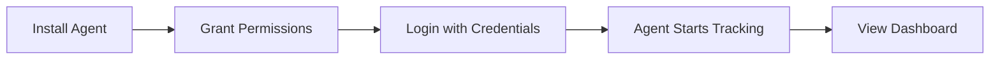
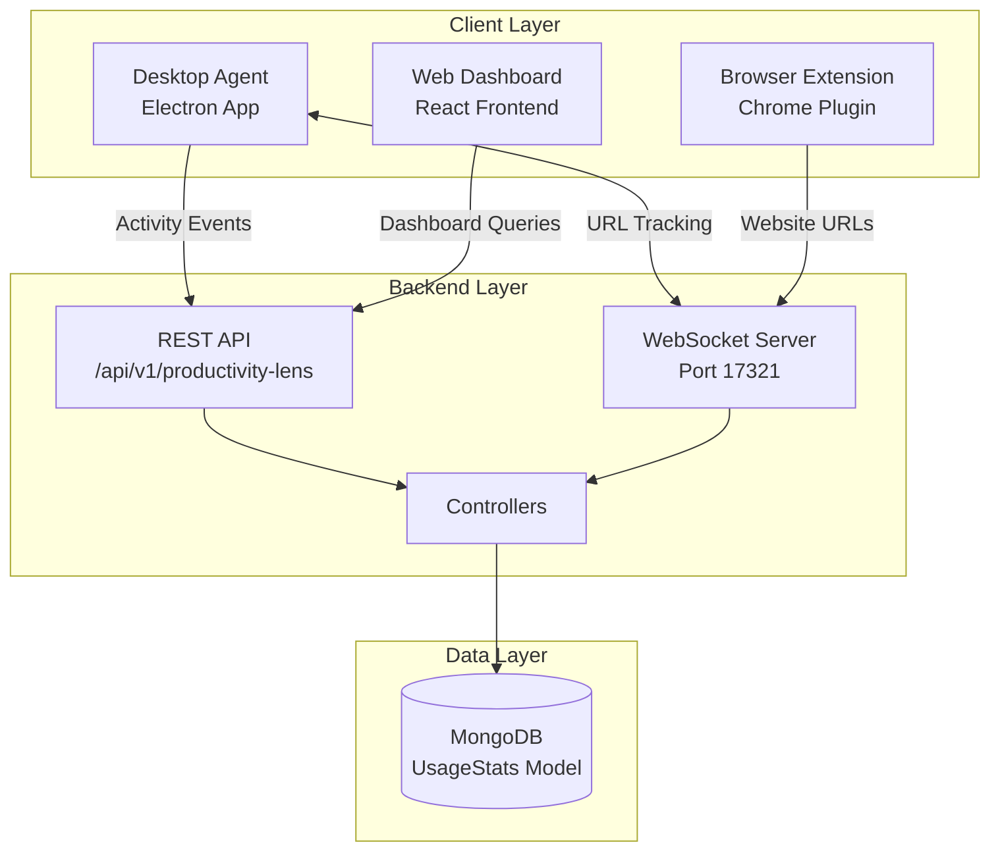
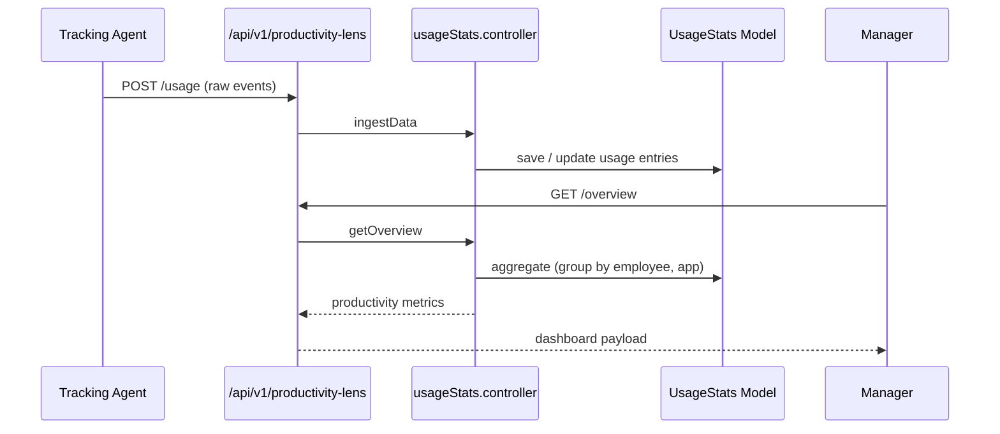
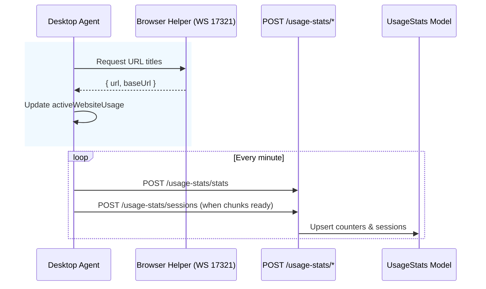
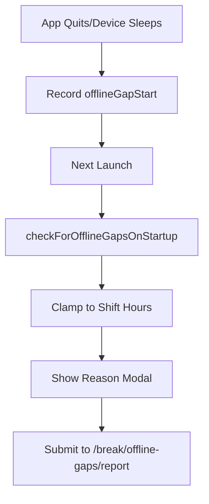

# Productivity Lens

Productivity Lens analyses employee device usage, activity timelines, and productivity scores. It aggregates data into dashboards for managers and employees to improve time management, powered by a cross-platform desktop agent that streams activity signals to the backend.

---

## Quick Start Guide

Get up and running with Productivity Lens in minutes.

### Prerequisites

| Requirement | Details |
|-------------|---------|
| **Desktop Agent** | Install the Electron-based tracking agent on employee workstations |
| **Browser Extension** | (Optional) Chrome extension for enhanced website tracking |
| **Permissions** | Accessibility & Screen Recording permissions (macOS/Windows) |
| **Network Access** | Agent must reach API endpoints and WebSocket port `17321` |

### Setup Steps



1. **Install the Desktop Agent** – Download and install the agent from your company portal
2. **Grant System Permissions** – Allow accessibility and screen recording access when prompted
3. **Login** – Authenticate with your HCM credentials
4. **Verify Tracking** – Check the system tray icon shows "Active" status
5. **Access Dashboard** – Navigate to *Productivity Lenses* in the main menu

:::tip First-Time Users
After installation, the agent takes approximately 1-2 minutes to begin populating your timeline. If data doesn't appear, verify permissions in System Preferences.
:::

---

## User Roles & Capabilities

Different roles have access to different features based on their permissions.

### Employee

| Feature | Description |
|---------|-------------|
| **Personal Dashboard** | View your own productivity metrics and trends |
| **Activity Timeline** | See detailed breakdown of apps/websites used throughout the day |
| **Productivity Score** | Track personal productivity score over time |
| **Break Management** | View and manage break periods |

### Manager

| Feature | Description |
|---------|-------------|
| **Subordinate Dashboard** | View productivity of direct reports |
| **Team Analytics** | Compare team member productivity metrics |
| **Alert Notifications** | Receive alerts when team productivity dips below thresholds |
| **Application Reclassification** | Adjust productive/unproductive app categorizations |

### Administrator

| Feature | Description |
|---------|-------------|
| **Global View** | Access productivity data across all employees |
| **Classification Tables** | Manage tenant-wide application classification rules |
| **Export Reports** | Generate and export comprehensive usage reports |
| **System Configuration** | Configure thresholds, break settings, and alerts |

---

## Permissions Reference

| Permission | Description | Typical Role |
|------------|-------------|--------------|
| `productivity-main` | Access main productivity dashboard | Employee |
| `subordinate-dashboard-productivity` | View subordinate productivity | Manager |
| `productivity-dashboard` | Detailed productivity dashboards | Manager |
| `productivity-team` | Team-level analytics | Manager |
| `productivity-view-all` | Global view of productivity | Admin |
| `productivity-view-subordinate` | Subordinate summary | Manager |

---

## Architecture Overview



---

## Backend Components

| File | Responsibility |
|------|----------------|
| `controllers/productivity-lens/usageStats.controller.js` | Computes productivity metrics, timeline breakdown, application usage |
| `models/productivity-lens/usageStats.model.js` | Stores raw usage data ingested from tracking agents |
| `controllers/productivity-lens/productivityDashboard.controller.js` | Dashboard-specific aggregations |
| `routes/v1/productivity-lens/usageStats.route.js` | Endpoints under `/api/v1/productivity-lens` |
| `utils/productivityHelper.js` | Helper functions for classification |

---

## API Reference

### Endpoints Overview

| Method | Endpoint | Description |
|--------|----------|-------------|
| `GET` | `/api/v1/productivity-lens/overview` | Summary cards for dashboard |
| `GET` | `/api/v1/productivity-lens/subordinate` | Subordinate stats for managers |
| `GET` | `/api/v1/productivity-lens/timeline` | Detailed timeline for selected employee/day |
| `GET` | `/api/v1/productivity-lens/export` | Export usage reports |
| `POST` | `/api/v1/usage-stats/stats` | Ingest per-minute activity counters |
| `POST` | `/api/v1/usage-stats/sessions` | Ingest timeline session data |

### Request/Response Examples

#### GET `/api/v1/productivity-lens/overview`

Retrieves productivity summary for the authenticated user.

**Request Headers:**
```http
Authorization: Bearer <jwt_token>
Content-Type: application/json
```

**Query Parameters:**
| Parameter | Type | Required | Description |
|-----------|------|----------|-------------|
| `date` | string | No | Date in `YYYY-MM-DD` format (defaults to today) |
| `employeeId` | string | No | Target employee ID (managers only) |

**Response:**
```json
{
  "success": true,
  "data": {
    "productivityScore": 78,
    "totalActiveMinutes": 420,
    "productiveMinutes": 328,
    "unproductiveMinutes": 52,
    "neutralMinutes": 40,
    "topApps": [
      { "name": "VS Code", "minutes": 180, "category": "productive" },
      { "name": "Chrome", "minutes": 120, "category": "neutral" },
      { "name": "Slack", "minutes": 45, "category": "productive" }
    ],
    "topWebsites": [
      { "name": "github.com", "minutes": 60, "category": "productive" },
      { "name": "stackoverflow.com", "minutes": 30, "category": "productive" }
    ]
  }
}
```

#### GET `/api/v1/productivity-lens/timeline`

Retrieves detailed activity timeline.

**Query Parameters:**
| Parameter | Type | Required | Description |
|-----------|------|----------|-------------|
| `date` | string | Yes | Date in `YYYY-MM-DD` format |
| `employeeId` | string | Yes | Target employee ID |

**Response:**
```json
{
  "success": true,
  "data": {
    "sessions": [
      {
        "startTime": "2024-01-15T09:00:00Z",
        "endTime": "2024-01-15T09:45:00Z",
        "type": "app",
        "name": "VS Code",
        "category": "productive",
        "durationMinutes": 45
      },
      {
        "startTime": "2024-01-15T09:45:00Z",
        "endTime": "2024-01-15T10:00:00Z",
        "type": "website",
        "name": "github.com",
        "category": "productive",
        "durationMinutes": 15
      }
    ]
  }
}
```

#### POST `/api/v1/usage-stats/stats`

Ingests per-minute activity counters from desktop agent.

**Request Body:**
```json
{
  "employeeId": "emp_12345",
  "date": "2024-01-15",
  "timestamp": "2024-01-15T10:30:00Z",
  "keyboardMinutes": 1,
  "mouseMinutes": 1,
  "keyPressCount": 342,
  "mouseClickCount": 56,
  "activeApp": "VS Code",
  "activeWebsite": null
}
```

**Response:**
```json
{
  "success": true,
  "message": "Stats recorded successfully"
}
```

### Data Flow Sequence



---

## Frontend Components

| Path | Description |
|------|-------------|
| `pages/productivity/MainDashboard.jsx` | Main productivity lens dashboard |
| `pages/productivity/SubordinateDashboard.jsx` | Team-level lens |
| `pages/productivity/ProductivityDashboard.jsx` | Detailed analytics with filters |
| `pages/productivity/TeamProductivity.jsx` | Team comparisons |
| `pages/productivity/AllEmployeeProductivity.jsx` | Global view for admins |
| `components/productivity/ProductivityChart.jsx` | Chart components (heatmap, bar charts) |
| `components/productivity/TimelineView.jsx` | Timeline of activities |
| `store/useUsageStore.js` | Zustand store for productivity data |
| `store/useAllEmployeeRatingsStore.js` | Shared ratings store |
| `service/productivityService.js` | Axios client for productivity APIs |

---

## Desktop Agent

The Electron-based desktop agent (`desktop-app/main.js`) is the primary data collector.

### Core Features

| Feature | Description |
|---------|-------------|
| **Permissions Bootstrap** | `setupPlatformPermissions()` requests accessibility/screen recording permissions |
| **Single Instance Guard** | Prevents duplicate agents per workstation |
| **Auto Launch** | Registers agent to start on OS login via `setupAutoLaunch()` |
| **Activity Listeners** | `uiohook-napi` captures keyboard/mouse; `@paymoapp/active-window` reports foreground window |
| **Usage Snapshotting** | Daily counters persist via `electron-store` to survive restarts |

### Data Pipeline

| Stage | Details |
|-------|---------|
| **Per-minute counters** | 60s interval aggregates keyboard/mouse active minutes and foreground app/website |
| **Website enrichment** | WebSocket on port `17321` receives URLs from browser helper; titles normalized with `stripBrowserSuffix` |
| **Timeline sessions** | `usageSessions` array tracks continuous foreground focus with `closeCurrentSession()` and `flushSessions()` |
| **Backend posting** | `axios.post` to `/usage-stats/stats` (counters) and `/usage-stats/sessions` (timeline) |
| **Hydration** | On startup, `hydrateUsageFromServerIfEmpty()` backfills from API if local counters empty |



---

## Break Detection & Auto Pausing

The agent automatically manages breaks to ensure accurate active time tracking.

| Trigger | Logic | API Call |
|---------|-------|----------|
| **Idle Timeout** | `setupIdleCheck()` polls `powerMonitor.getSystemIdleTime()`. If idle ≥ `autoBreakMinutes`, captures webcam snapshot to confirm absence | `safeStartBreak("idle")` → `POST /attendance-user/start-break` |
| **Lock/Suspend** | `powerMonitor.on("lock-screen"\|"suspend")` closes sessions and starts break | Same as above |
| **Activity Detected** | Any `uIOhook` event ends the break | `safeEndBreak()` → `POST /attendance-user/end-break` |
| **Resume** | After suspend, agent clamps offline gap to shift window and prompts for reason | `/break/offline-gaps/report` |

:::info Sync Mechanism
Break state syncs with a 5-second poll to `checkIfBreakRunning()` to stay aligned with web UI actions.
:::

---

## Offline Gap Workflow



- **Gap Recording**: Unexpected quit, session end, or sleep triggers `offlineGapStart` timestamp storage
- **Startup Check**: `checkForOfflineGapsOnStartup()` runs after credential load
- **Shift Clamping**: Gaps are clamped to employee's shift hours to avoid false positives
- **User Prompt**: Modal (`offline-gap-prompt.html`) collects reason before submission

---

## Configuration Reference

### Environment Variables

| Variable | Description | Default |
|----------|-------------|---------|
| `DEBUG_TIMELINE` | Enable verbose timeline logging | `false` |
| `WS_PORT` | WebSocket server port for browser helper | `17321` |
| `API_BASE_URL` | Backend API base URL | From config |

### Configurable Settings

| Setting | Location | Description |
|---------|----------|-------------|
| `autoBreakMinutes` | `/attendance-user/break-type/:employeeId` | Idle threshold before auto-break |
| Application Classifications | Admin Panel | Productive/Unproductive/Neutral app categories |
| Productivity Thresholds | Tenant Config | Alert thresholds for managers |

---

## Troubleshooting

### Common Issues

#### Timeline Shows Empty Data

**Symptoms:** Dashboard loads but timeline is blank

**Solutions:**
1. **Check Permissions** (macOS): System Preferences → Security & Privacy → Privacy
   - Enable **Accessibility** for the agent
   - Enable **Screen Recording** for the agent
2. **Verify Agent Status**: Check system tray icon shows "Active"
3. **Restart Agent**: Quit and relaunch the desktop agent
4. **Check Network**: Ensure agent can reach API endpoints

#### Agent Not Auto-Starting

**Symptoms:** Agent doesn't launch on system login

**Solutions:**
1. **Re-enable Auto Launch**: Right-click tray icon → Enable Auto Launch
2. **Check Login Items**: System Preferences → Users & Groups → Login Items
3. **Windows**: Verify startup shortcut exists in `shell:startup`

#### WebSocket Connection Failed

**Symptoms:** Website tracking not working, browser URLs not captured

**Solutions:**
1. **Check Port**: Ensure port `17321` is not blocked by firewall
2. **Reinstall Extension**: Remove and reinstall the browser helper extension
3. **Verify Extension Active**: Check extension icon in browser toolbar

#### Break Detection Not Working

**Symptoms:** Breaks not auto-starting when idle

**Solutions:**
1. **Check Idle Threshold**: Verify `autoBreakMinutes` setting in admin panel
2. **Camera Permissions**: Enable camera access for idle confirmation snapshots
3. **Power Settings**: Ensure system isn't sleeping before idle threshold

#### Data Sync Issues

**Symptoms:** Dashboard data doesn't match agent activity

**Solutions:**
1. **Wait for Sync**: Data syncs every minute; allow 1-2 minutes
2. **Check Failed Queue**: Agent queues failed requests in `failedUsageStats`
3. **Force Hydration**: Restart agent to trigger `hydrateUsageFromServerIfEmpty()`

### Error Codes

| Code | Meaning | Resolution |
|------|---------|------------|
| `ECONNREFUSED` | Backend unreachable | Check network/VPN connection |
| `EPERM` | Permission denied | Grant required system permissions |
| `ENOENT` | Resource not found | Verify API endpoint configuration |
| `401` | Unauthorized | Re-authenticate in the agent |
| `429` | Rate limited | Reduce request frequency |

---

## Best Practices

### For Employees

- **Grant all permissions** during initial setup for complete tracking
- **Keep agent running** throughout work hours for accurate data
- **Review your timeline** regularly to understand work patterns
- **Report offline gaps** promptly with accurate reasons

### For Managers

- **Review team dashboards** weekly to identify productivity trends
- **Customize classifications** based on your team's actual tool usage
- **Use data constructively** – focus on patterns, not micromanagement
- **Set reasonable thresholds** for productivity alerts

### For Administrators

- **Maintain classification tables** regularly as new apps emerge
- **Monitor agent health** across the organization
- **Configure shift hours** accurately to avoid false gap reports
- **Review tenant settings** quarterly for optimization

---

## Integration Points

| System | Integration |
|--------|-------------|
| **Performance Reviews** | Productivity insights can inform review discussions |
| **Alert System** | Configurable notifications for productivity dips |
| **Attendance Module** | Break data syncs with attendance records |
| **Reports Module** | Export productivity data for HR analytics |

---

## Tenant Notes

- Each tenant may have custom application classification tables
- `.env` can toggle debug logging (`DEBUG_TIMELINE`)
- PM2 processes ensure data separation for each company
- Classification updates propagate to future calculations only

---

## Related Documentation

- [Frontend Stores](../frontend/stores.md) – Zustand store details for `useUsageStore`
- [Frontend Services](../frontend/services.md) – `productivityService.js` API client
- [Attendance Module](./attendance-leave.md) – Break and shift management integration

---

*This documentation helps maintain productivity analytics, add new dashboards, troubleshoot issues, and adjust classification logic.*
