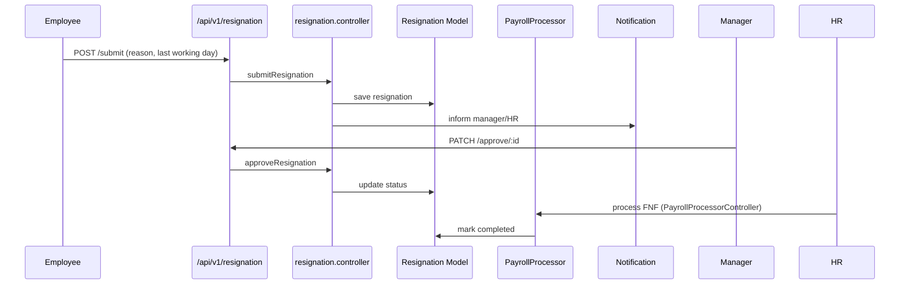

# Resignation & Full & Final Settlement

The Resignation module manages resignation submissions, approvals, and final settlements (F&F).  It coordinates between HR, managers, and finance to ensure smooth offboarding.

## Permissions

| Permission | Description |
| --- | --- |
| `resignation-main` | Access resignation dashboards. |
| `resignation-submit` | Submit resignation. |
| `resignation-manage` | Approve/reject resignations. |
| `resignation-fnf-approve` | HR F&F approvals. |

## Backend Components

| File | Responsibility |
| --- | --- |
| `controllers/resignation/resignation.controller.js` | Submit, approve, track resignation requests, send notifications. |
| `models/resignation/resignation.model.js` | Resignation schema (reason, notice period, approvals). |
| `controllers/payrollv2/PayrollProcessorController.js` | F&F calculations integrate with payroll runs. |
| `controllers/payrollv2/PayrollBatch.controller.js` | Handles F&F batches, exports. |
| `routes/v1/resignation/resignation.route.js` | Routes under `/api/v1/resignation`. |
| `services/emailService.js` | Emails for resignation submissions and approvals. |

### Resignation Flow

## Frontend Components

| Path | Description |
| --- | --- |
| `pages/resignation/ResignationDashboard.jsx` | Overview for HR. |
| `pages/resignation/SubmitResignation.jsx` | Employee resignation form. |
| `pages/resignation/ResignationApprovals.jsx` | Manager/HR approval queue. |
| `pages/resignation/FnfRequestHR.jsx` | HR F&F approval dashboard. |
| `components/resignation/ResignationCard.jsx` | Card view for each case. |
| `components/resignation/FNFChecklist.jsx` | Checklist for settlements. |
| `store/useResignationStore.js`, `store/useFNFStore.js` | Zustand stores. |
| `service/resignationService.js`, `service/fnfService.js` | Axios clients. |

## Integration

- F&F payouts rely on payroll salary structures; ensure payroll module is configured for exiting employees.
- Document Centre can store exit documents (relieving letter).
- Attendance and leave balances feed into F&F calculations.

## Tenant Notes

- Each tenant may customise resignation questionnaires via company settings or frontend configuration.
- Notifications link to tenant-specific frontend URLs.
- PM2 processes ensure resignation data is isolated per tenant.

Refer to this module doc when adjusting resignation workflows or F&F calculations.

