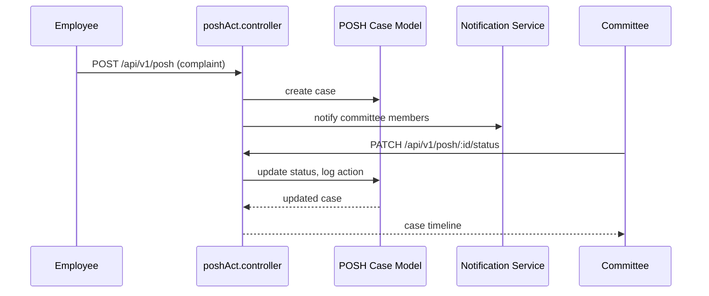

# Compliance & Governance

Compliance modules address statutory obligations (POSH, disciplinary actions), policy distribution, grievance handling, and reporting.  They ensure legal adherence and provide audit trails.

## Core Permissions

| Permission | Description |
| --- | --- |
| `posh-manage` | Manage POSH cases (`poshManager`). |
| `posh-view` | View POSH cases assigned to employee (`poshEmployee`). |
| `disciplinary-actions` | Manage disciplinary cases (`takeDisciplinaryAction`, `disciplinary-create`, `disciplinary-view`). |
| `policy-manage` | CRUD company policies. |
| `policy-view` | View published policies (`companyPolicies`, `viewPolicies`). |
| `ticket-manage-all` | Issue/ticket management for compliance teams. |

## Backend Components

| Domain | Controllers | Models | Notes |
| --- | --- | --- | --- |
| POSH | `controllers/poshAct/poshAct.controller.js` | `models/PoshAct/poshAct.model.js` | Case creation, committee workflow, timelines, document uploads. |
| Disciplinary | `controllers/disciplinary/disciplinary.controller.js` | `models/disciplinary/disciplinary.model.js` | Warnings, suspensions, hearings, outcome logging. |
| Policies | `controllers/policies/policies.controller.js` | `models/policies/policies.model.js` | Policy repository, acknowledgement tracking. |
| Issues/Tickets | `controllers/Issues/issue.controller.js` | `models/issues/issue.model.js` | Employee grievances, escalations, status tracking. |
| Document Centre | `controllers/document-center/DocumentController.js` | `models/document-center/*.js` | Stores policy documents, compliance files in S3. |

### Workflow Example (POSH Case)

## Frontend Components

| Feature | Pages/Components | Stores | Services |
| --- | --- | --- | --- |
| POSH | `pages/posh/POSHDashboard.jsx`, `components/posh/POSHForm.jsx`, `components/posh/CaseTimeline.jsx` | `store/poshStore.js` | `service/poshService.js` |
| Disciplinary | `pages/disciplinary/DisciplinaryDashboard.jsx`, `components/disciplinary/CaseForm.jsx` | `store/useDisciplinaryStore.js` | `service/disciplinaryService.js` |
| Policies | `pages/policies/PolicyLibrary.jsx`, `components/policies/PolicyViewer.jsx`, `components/policies/AcknowledgeModal.jsx` | `store/usePolicyStore.js` | `service/policyService.js` |
| Issues | `pages/issue-management/IssueBoard.jsx`, `components/issues/IssueCard.jsx` | `store/useIssuesStore.js` | `service/issueService.js` |

Policies and documents rely on the Document Centre for file storage. All uploads use S3 via `DocumentController`, with metadata stored in MongoDB.

## Notifications & Audit

- Notifications triggered through `notification.controller` and push/email services.
- Each case maintains an audit log—representing actions, user who performed them, timestamps—to satisfy compliance requirements.
- Export endpoints produce reports for legal submissions.

## Integration with Other Modules

- POSH and disciplinary statuses can affect attendance or payroll actions (e.g., suspension). Controllers emit events or update flags that other modules consume.
- Policy acknowledgments feed into performance or HR dashboards.
- Issue management integrates with engagement notifications to keep employees informed.

## Environment & Tenant Notes

- Tenant-specific `.env` values determine S3 buckets and email identities. Ensure each company uses unique compliance mailboxes.
- Subdomain separation guarantees only authorised tenants access their compliance data.
- PM2 processes isolate compliance escalations per tenant while reusing the same code.

This breakdown should help when extending compliance workflows or auditing existing processes.

