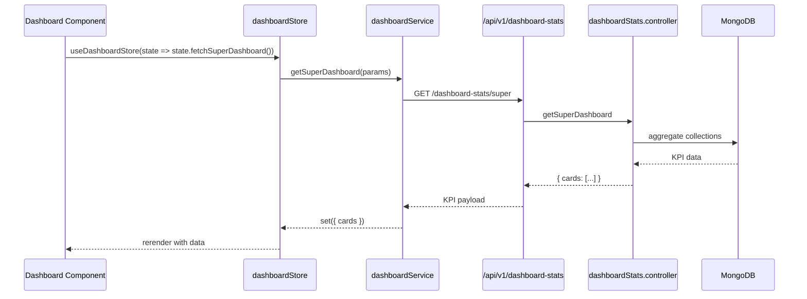

# Dashboards & Analytics

Dashboard modules surface KPI cards, heatmaps, and composite analytics across the platform.  Three primary dashboards ship with the product:

1. **Super Dashboard** (`/dashboard/super-employee-dashboard`) – executive view.
2. **Employee Dashboard** (`/dashboard/employee`) – individual snapshot.
3. **All Dashlets** (`/dashboard/all-dashlets`) – configurable widget board.

## Permissions

| Permission | Description |
| --- | --- |
| `dashboard-super` | Access the super admin dashboard. |
| `dashboard-employee` | Access personal dashboard. |
| `dashboard-all-dashlets` | View the consolidated dashlets page. |

## Backend Components

| File | Responsibility |
| --- | --- |
| `controllers/dashboard-stats/dashboardStats.controller.js` | Core dashboard KPIs (employee counts, attrition, attendance). |
| `controllers/dashboard-stats-user/dashboardStatsUser.controller.js` | Employee-specific KPIs (attendance, leave, recognitions). |
| `controllers/analytics-dashboards-cards/*.js` | Widget data providers (engagement cards, productivity cards, payroll cards). |
| `controllers/rag/rag.controller.js` | RAG reporting (risk, attention, growth). |
| `models/analytics/` (if present) | Aggregation collections for dashboards. |
| `routes/v1/dashboard` | Routes under `/api/v1/dashboard-stats` and related endpoints. |

Dashboards rely heavily on MongoDB aggregation pipelines defined inside the controllers. Many statistics slice across attendance, payroll, leave, and performance collections.

## Frontend Components

| Path | Description |
| --- | --- |
| `pages/dashboard/SuperEmployeeDashboard.jsx` | Super dashboard layout, uses multiple widget components. |
| `pages/dashboard/EmployeeDashboard.jsx` | Employee-specific cards (attendance, leave, recognitions). |
| `pages/dashboard/AllDashlets.jsx` | Configurable widget grid. |
| `components/dashboard/cards/**` | Individual card components (attendance summary, leave balances, payroll stats). |
| `components/dashboard/widgets/**` | Chart widgets (line, bar, pie). |
| `store/dashboardStore.js`, `store/useDashboardStore.js` | Zustands stores caching dashboard data, filters. |
| `service/dashboardService.js`, `service/analyticsService.js` | Axios clients fetching KPI payloads. |

### Data Fetch Flow

## Widgets & Cards

- Engagement cards rely on `analytics-dashboards-cards/engagementCards.controller.js`.
- Attendance cards use `attendance.controller` aggregations.
- Payroll widgets fetch from `payrollv2` controllers summarising salary trends.
- RAG dashboard uses `controllers/rag/rag.controller.js` to compute risk categories.

## Tenant Customisation

- Dashboards are tenant-aware using company stats and branding.
- Each tenant can enable/disable dashlets via backend flags stored in `CompanySettings`.
- Frontend reads `companyStore` to customise available widgets.

## Tips

- When adding a new card, create a controller method (or extend existing aggregator), expose via route, and update the relevant store + component.
- Maintain consistent payload shapes (`{ title, value, trend, meta }`) to fit into generic card components.
- Ensure heavy aggregations use indexes; monitor pipeline performance on large tenant datasets.

