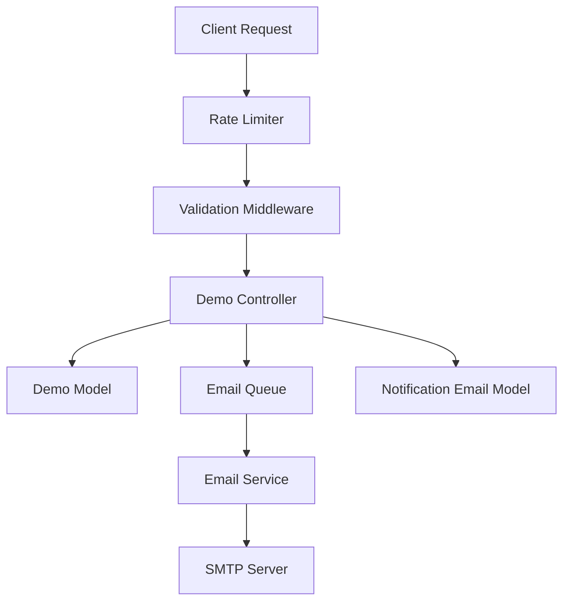
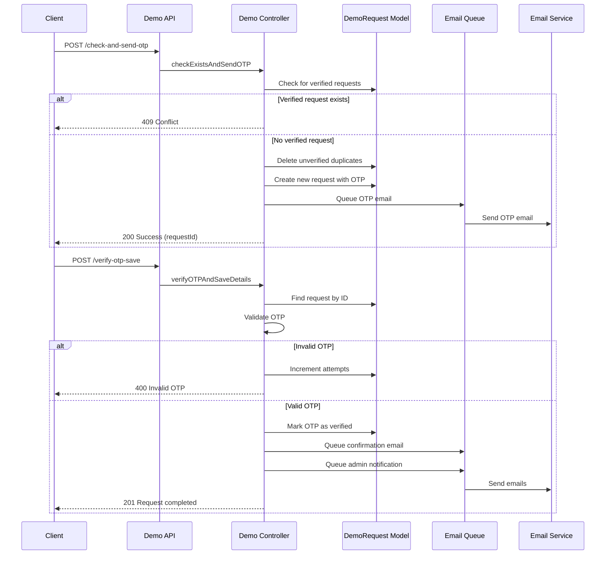
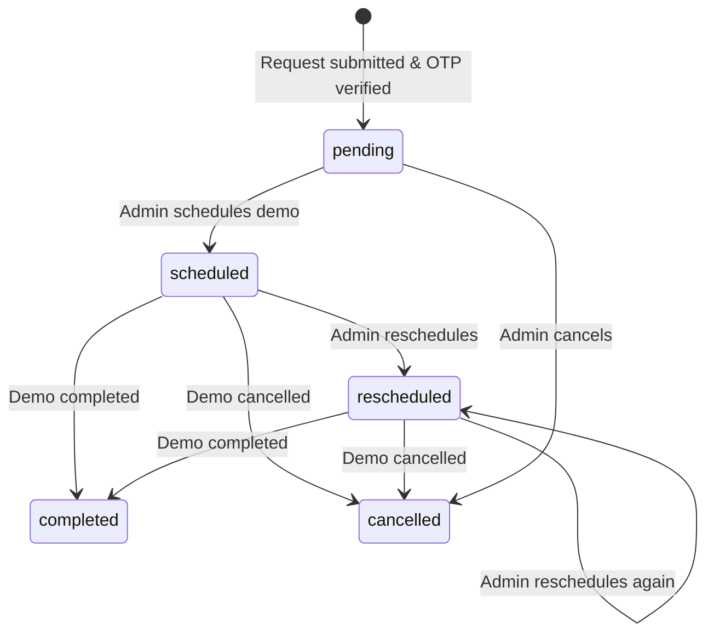

# Demo Management Module (MS1 Server)

The Demo Management module handles the complete lifecycle of product demo requests from initial submission through OTP verification, scheduling, and completion. It includes automated email notifications, status tracking, and administrative tools for managing demo requests.

## Overview

The Demo Management module provides a secure, OTP-verified workflow for potential customers to request product demonstrations. It prevents duplicate submissions, tracks email delivery status, and provides comprehensive administrative tools for managing the demo pipeline.

## Core Features

- **OTP-Based Verification** – Secure email verification before completing demo requests
- **Status Management** – Track requests through pending, scheduled, completed, cancelled, and rescheduled states
- **Automated Email Notifications** – Queue-based email system for OTP, confirmations, scheduling, and status updates
- **Meeting Scheduling** – Schedule and reschedule demos with meeting links and preferred time slots
- **Admin Dashboard** – View, filter, search, and manage all demo requests
- **Statistics & Analytics** – Track demo request metrics and feature preferences
- **Export Functionality** – Export demo requests to CSV for reporting
- **Rate Limiting** – Prevent abuse with configurable rate limits on public endpoints

## Architecture



## Backend Components

### Models

#### `model/demo.model.js` – DemoRequest Schema

The DemoRequest model stores all demo request information:

```javascript
{
  workEmail: String (unique, required, lowercase),
  firstName: String (required),
  lastName: String (required),
  phoneNumber: String (unique, sparse),
  companyName: String (required),
  numberOfEmployees: String,
  seniority: String,
  selectedFeatures: [String],
  status: Enum ['pending', 'scheduled', 'completed', 'cancelled', 'rescheduled'],
  submittedAt: Date,
  scheduledDateTime: Date,
  meetingLink: String,
  preferredTimeSlots: [{
    date: Date,
    time: String,
    timezone: String
  }],
  otp: {
    code: String,
    expiresAt: Date,
    attempts: Number,
    isVerified: Boolean,
    verifiedAt: Date
  },
  emailDeliveryStatus: {
    confirmation: { sent: Boolean, sentAt: Date, attempts: Number },
    scheduled: { sent: Boolean, sentAt: Date, attempts: Number },
    completed: { sent: Boolean, sentAt: Date, attempts: Number },
    cancelled: { sent: Boolean, sentAt: Date, attempts: Number },
    rescheduled: { sent: Boolean, sentAt: Date, attempts: Number },
    'admin-notification': { sent: Boolean, sentAt: Date, attempts: Number },
    otp: { sent: Boolean, sentAt: Date, attempts: Number }
  },
  meetingNotes: [{
    timestamp: Date,
    note: String,
    type: Enum ['initial', 'scheduled', 'completed', 'cancelled', 'pending', 'rescheduled']
  }]
}
```

**Key Features:**
- Unique constraints on `workEmail` and `phoneNumber` to prevent duplicates
- OTP verification tracking with expiration and attempt limits
- Email delivery status tracking for all email types
- Meeting notes history with timestamps

### Controllers

#### `controller/demo.controller.js`

**Public Endpoints (No Authentication Required):**

1. **`checkExistsAndSendOTP`** – Check for existing verified requests and send OTP
   - Validates email/phone uniqueness (blocks if already verified)
   - Deletes unverified duplicate requests
   - Generates 6-digit OTP (expires in 2 minutes)
   - Saves all request details with unverified OTP
   - Queues OTP email

2. **`verifyOTPAndSaveDetails`** – Verify OTP and complete request
   - Validates OTP code (max 3 attempts)
   - Checks expiration (2 minutes)
   - Marks OTP as verified
   - Queues confirmation and admin notification emails

3. **`resendOTP`** – Resend OTP for unverified requests
   - Generates new OTP
   - Resets attempt counter
   - Queues resend OTP email

**Admin Endpoints (Requires `adminVerifyToken`):**

4. **`getDemoRequests`** – List all demo requests with filters
   - Supports pagination, search, status filter, date range
   - Sortable by multiple fields

5. **`getDemoRequestById`** – Get single demo request details

6. **`updateDemoRequestStatus`** – Update status and add note
   - Valid statuses: `pending`, `scheduled`, `completed`, `cancelled`, `rescheduled`
   - Automatically queues appropriate email based on status

7. **`scheduleDemo`** – Schedule a demo meeting
   - Validates future date/time
   - Sets status to `scheduled`
   - Stores meeting link and preferred time slots
   - Queues scheduled email (if not already sent)

8. **`rescheduleDemo`** – Reschedule an existing demo
   - Similar to schedule but sets status to `rescheduled`
   - Queues rescheduled email

9. **`addMeetingNote`** – Add notes to meeting history
   - Supports different note types

10. **`updateDemoRequest`** – General update endpoint
    - Updates any field except protected ones (`_id`, `submittedAt`, timestamps)

11. **`deleteDemoRequest`** – Delete a demo request

12. **`checkExistingDemoRequest`** – Check if email/phone exists
    - Returns existing request details if found

13. **`getDemoRequestStats`** – Get statistics
    - Status breakdown
    - Feature preferences
    - Total and recent request counts

14. **`exportDemoRequests`** – Export to CSV
    - Filterable by status and date range

15. **Email Management Endpoints:**
    - `sendDemoRequestConfirmationEmail`
    - `sendDemoScheduledEmail`
    - `sendDemoCompletedEmail`
    - `sendDemoCancelledEmail`
    - `resendEmail` – Resend specific email type
    - `resendAllFailedEmails` – Resend all failed emails
    - `getEmailDeliveryStatus` – Get delivery status
    - `testEmailConnection` – Test SMTP connection
    - `getEmailQueueStatus` – Get queue status
    - `clearEmailDeliveryStatus` – Clear status (testing)
    - `debugEmailDeliveryStatus` – Debug email status

16. **Configuration Endpoints:**
    - `getFeaturesConfig` – Get available features list
    - `getStatusConfig` – Get status configuration with colors
    - `getSortOptionsConfig` – Get sort options

### Routes

#### `routes/demo.routes.js`

**Rate Limiting:**
- Demo request: 3 requests per 15 minutes per IP
- OTP verification: 5 attempts per 15 minutes per IP
- OTP resend: 3 requests per 5 minutes per IP
- General API: 20 requests per minute per IP

**Route Structure:**
```
POST   /api/v1/demo/demo-requests/check-and-send-otp
POST   /api/v1/demo/demo-requests/verify-otp-save
POST   /api/v1/demo/demo-requests/resend-otp

GET    /api/v1/demo/demo-requests (admin)
GET    /api/v1/demo/demo-requests/:id (admin)
GET    /api/v1/demo/demo-requests/check-existing (admin)
GET    /api/v1/demo/demo-requests/stats (admin)
GET    /api/v1/demo/demo-requests/export (admin)

PATCH  /api/v1/demo/demo-requests/:id (admin)
PATCH  /api/v1/demo/demo-requests/:id/status (admin)
PATCH  /api/v1/demo/demo-requests/:id/schedule (admin)
PATCH  /api/v1/demo/demo-requests/:id/reschedule (admin)
PATCH  /api/v1/demo/demo-requests/:id/notes (admin)

DELETE /api/v1/demo/demo-requests/:id (admin)

GET    /api/v1/demo/config/features (admin)
GET    /api/v1/demo/config/status (admin)
GET    /api/v1/demo/config/sort-options (admin)

POST   /api/v1/demo/demo-requests/:id/send-confirmation-email (admin)
POST   /api/v1/demo/demo-requests/:id/send-scheduled-email (admin)
POST   /api/v1/demo/demo-requests/:id/send-completed-email (admin)
POST   /api/v1/demo/demo-requests/:id/send-cancelled-email (admin)
POST   /api/v1/demo/demo-requests/:id/resend-email (admin)
POST   /api/v1/demo/demo-requests/:id/resend-all-failed (admin)
GET    /api/v1/demo/demo-requests/:id/email-status (admin)
GET    /api/v1/demo/email/test-connection (admin)
GET    /api/v1/demo/email-queue-status (admin)
POST   /api/v1/demo/demo-requests/:id/clear-email-status (admin)
GET    /api/v1/demo/demo-requests/:id/debug-email-status (admin)
POST   /api/v1/demo/test-admin-notification (admin)
```

### Validation

#### `validation/demo.validation.js`

Uses `express-validator` for comprehensive input validation:

- **Email validation** – Valid email format, max 100 characters
- **Phone validation** – International format support
- **Name validation** – Letters and spaces only, 2-50 characters
- **Company validation** – 2-100 characters
- **Feature validation** – Must select from predefined list
- **Date/time validation** – ISO 8601 format, future dates for scheduling
- **MongoDB ID validation** – Valid ObjectId format
- **Status validation** – Must be from allowed enum values

### Email System

#### `utils/demoEmailService.js`

Email service using Nodemailer with SMTP configuration:

**Email Types:**
1. **OTP Email** – 6-digit verification code (expires in 2 minutes)
2. **Confirmation Email** – Sent after OTP verification
3. **Scheduled Email** – Sent when demo is scheduled
4. **Rescheduled Email** – Sent when demo is rescheduled
5. **Completed Email** – Sent when demo is marked complete
6. **Cancelled Email** – Sent when demo is cancelled
7. **Admin Notification** – Sent to configured admin emails on new verified requests

**Configuration:**
- SMTP settings from environment variables (`SMTP_HOST`, `SMTP_PORT`, `SMTP_USER`, `SMTP_PASS`)
- Company branding from `COMPANY_NAME` and `LOGO_URL`

#### `utils/emailQueue.js`

In-memory email queue with automatic processing:

**Features:**
- Prevents duplicate emails (same type + request ID)
- Automatic retry on failure (max 3 attempts)
- Tracks processing status to prevent concurrent sends
- Updates email delivery status in database
- 1-second delay between emails to prevent SMTP overload

**Queue Processing:**
- Processes emails sequentially
- Updates `emailDeliveryStatus` in DemoRequest model
- Handles retries automatically
- Logs all operations for debugging

#### `utils/emailTemplateLoader.js`

Loads and processes HTML email templates:

**Templates:**
- `demo-otp.html` – OTP verification email
- `demo-resend-otp.html` – Resend OTP email
- `demo-confirmation.html` – Request confirmation
- `demo-scheduled.html` – Demo scheduled notification
- `demo-rescheduled.html` – Demo rescheduled notification
- `demo-completed.html` – Demo completed notification
- `demo-cancelled.html` – Demo cancelled notification
- `admin-notification.html` – Admin notification

**Template Processing:**
- Replaces placeholders with actual data
- Formats dates/times appropriately
- Handles optional sections (notes, meeting links)

## Workflow

### Demo Request Flow



### Status Management Flow



## API Reference

### Public Endpoints

#### Check and Send OTP

```http
POST /api/v1/demo/demo-requests/check-and-send-otp
Content-Type: application/json

{
  "workEmail": "user@example.com",
  "phoneNumber": "+1234567890",
  "firstName": "John",
  "lastName": "Doe",
  "companyName": "Acme Corp",
  "numberOfEmployees": "51-200",
  "seniority": "Manager",
  "selectedFeatures": ["Core HR Management", "Payroll Management"],
  "preferredDate": "2024-12-15",
  "preferredTime": "14:00"
}
```

**Response:**
```json
{
  "success": true,
  "message": "Details saved and OTP sent successfully",
  "data": {
    "requestId": "507f1f77bcf86cd799439011",
    "email": "user@example.com",
    "expiresAt": "2024-12-01T10:02:00.000Z",
    "message": "All details saved and OTP sent to your email. Please verify to complete."
  }
}
```

#### Verify OTP

```http
POST /api/v1/demo/demo-requests/verify-otp-save
Content-Type: application/json

{
  "requestId": "507f1f77bcf86cd799439011",
  "otpCode": "123456"
}
```

**Response:**
```json
{
  "success": true,
  "message": "Demo request completed successfully after OTP verification",
  "data": {
    "_id": "507f1f77bcf86cd799439011",
    "workEmail": "user@example.com",
    "firstName": "John",
    "lastName": "Doe",
    "status": "pending",
    "otp": {
      "isVerified": true,
      "verifiedAt": "2024-12-01T10:01:30.000Z"
    },
    ...
  }
}
```

### Admin Endpoints

#### Get Demo Requests

```http
GET /api/v1/demo/demo-requests?status=pending&page=1&limit=10&search=john&sortBy=submittedAt&sortOrder=desc
Authorization: Bearer <admin_token>
```

**Response:**
```json
{
  "success": true,
  "message": "Demo requests retrieved successfully",
  "data": {
    "requests": [...],
    "pagination": {
      "currentPage": 1,
      "totalPages": 5,
      "totalItems": 50,
      "itemsPerPage": 10,
      "hasNextPage": true,
      "hasPrevPage": false
    }
  }
}
```

#### Schedule Demo

```http
PATCH /api/v1/demo/demo-requests/:id/schedule
Authorization: Bearer <admin_token>
Content-Type: application/json

{
  "scheduledDateTime": "2024-12-15T14:00:00.000Z",
  "meetingLink": "https://meet.example.com/demo",
  "notes": "Demo scheduled for product overview",
  "preferredTimeSlots": [{
    "date": "2024-12-15",
    "time": "14:00",
    "timezone": "UTC"
  }]
}
```

## Error Handling

The module uses comprehensive error handling:

**Error Types:**
- **ValidationError** (400) – Invalid input data
- **CastError** (400) – Invalid ID format
- **DuplicateError** (409) – Email/phone already verified
- **NotFoundError** (404) – Request not found
- **RateLimitError** (429) – Too many requests
- **ServerError** (500) – Internal server error

**Error Response Format:**
```json
{
  "success": false,
  "message": "Error message",
  "errors": [
    {
      "field": "workEmail",
      "message": "Valid email address is required"
    }
  ]
}
```

## Environment Variables

Required environment variables:

```env
# SMTP Configuration
SMTP_HOST=smtp.gmail.com
SMTP_PORT=587
SMTP_USER=your-email@gmail.com
SMTP_PASS=your-app-password

# Company Branding
COMPANY_NAME=Human Maximizer HRMS
LOGO_URL=https://example.com/logo.png
ADMIN_PANEL_URL=https://admin.humanmaximizer.com
```

## Security Features

1. **OTP Verification** – 6-digit code, 2-minute expiration, 3 attempt limit
2. **Rate Limiting** – Prevents abuse on public endpoints
3. **Unique Constraints** – Prevents duplicate verified requests
4. **Admin Authentication** – All admin endpoints require JWT token
5. **Input Validation** – Comprehensive validation on all inputs
6. **Email Delivery Tracking** – Prevents duplicate email sends

## Statistics & Analytics

The module provides several analytics endpoints:

- **Status Statistics** – Count of requests by status
- **Feature Preferences** – Most requested features
- **Recent Requests** – Requests in last 7 days
- **Export Functionality** – CSV export with filters

## Integration Points

### Notification Email Model

The module integrates with `NotificationEmail` model to send admin notifications:
- Fetches all active notification emails
- Sends notifications when OTP is verified
- Supports multiple admin recipients

### Email Queue System

- Integrates with shared email queue (`utils/emailQueue.js`)
- Supports multiple email types
- Automatic retry mechanism
- Delivery status tracking

## Best Practices

1. **OTP Management:**
   - Always check expiration before verification
   - Delete unverified duplicates before creating new requests
   - Track attempts to prevent brute force

2. **Email Delivery:**
   - Check `emailDeliveryStatus` before queuing emails
   - Use queue system for all email operations
   - Monitor queue status regularly

3. **Status Updates:**
   - Always add meeting notes when updating status
   - Queue appropriate emails based on status changes
   - Validate status transitions

4. **Error Handling:**
   - Use consistent error response format
   - Log all errors with context
   - Provide helpful error messages to clients

## Testing

### Test Email Connection

```http
GET /api/v1/demo/email/test-connection
Authorization: Bearer <admin_token>
```

### Test Admin Notification

```http
POST /api/v1/demo/test-admin-notification
Authorization: Bearer <admin_token>
```

### Debug Email Status

```http
GET /api/v1/demo/demo-requests/:id/debug-email-status
Authorization: Bearer <admin_token>
```

## Future Enhancements

Potential improvements:
- SMS OTP support
- Calendar integration for scheduling
- Automated reminder emails
- Demo feedback collection
- Integration with CRM systems
- Advanced analytics dashboard
- Multi-language email templates

This module provides a complete, production-ready solution for managing product demo requests with security, reliability, and comprehensive administrative controls.

