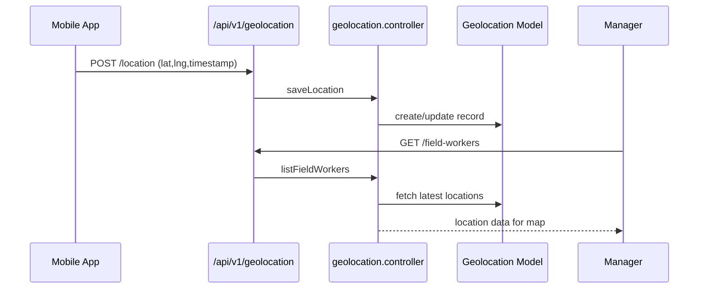

# Geolocation & Field Tracking

This module tracks field workers, geofence compliance, and location visits.  Managers can view live locations, history, and geofence status.

## Permissions

| Permission | Description |
| --- | --- |
| `geolocation-all-permission` | Access field worker dashboards, live map, geofence management. |

## Backend Components

| File | Responsibility |
| --- | --- |
| `controllers/geolocation/geolocation.controller.js` | Field worker location ingestion, live tracking. |
| `controllers/locationTracking/locationTracking.controller.js` | Historical location visits, geofence statuses. |
| `models/geolocation/geolocation.model.js` | Stores live location snapshots. |
| `models/locationTracking/locationVisit.model.js` | Records visits and geofence breaches. |
| `routes/v1/geolocation/geolocation.route.js` | `/api/v1/geolocation` endpoints. |
| `routes/v1/locationTracking/locationTracking.route.js` | `/api/v1/location-tracking`. |
| `utils/geofenceHelper.js` (if present) | Distance calculations, geofence checks. |

### Data Flow

## Frontend Components

| Path | Description |
| --- | --- |
| `pages/geolocation/FieldWorkerDashboard.jsx` | Field worker list with statuses. |
| `pages/geolocation/GeoLocationMap.jsx` | Leaflet-based map showing worker locations. |
| `pages/geolocation/EmployeesGeofencing.jsx` | Geofence status dashboard. |
| `pages/geolocation/LocationVisits.jsx` | Historical visit logs. |
| `components/geolocation/MapView.jsx` | Map component using `leaflet` and `react-leaflet`. |
| `components/geolocation/VisitTimeline.jsx` | Timeline of location visits. |
| `hooks/useGeolocation.js` | Hook to fetch map data. |
| `store/useLocationVisitStore.js`, `store/useGeofencingStore.js` | Zustand stores. |
| `service/geolocationService.js`, `service/locationVisitService.js` | Axios clients. |

## Integrations

- Geofence breaches can trigger attendance regularisation or notifications.
- Onboarding module uses field worker dashboards during setup.
- Productivity insights can factor in location data for field roles.

## Tenant Notes

- Geolocation tracking can be toggled per tenant via company settings.
- Maps require API keys if using map providers beyond leaflet/OpenStreetMap.
- Ensure `.env` includes `FRONTEND_URL` for links in notifications.

Use this guide to modify location tracking logic, geofence validation, or map UI.

