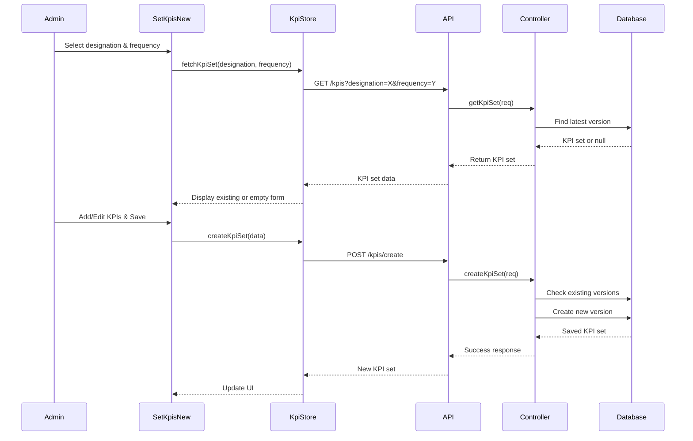
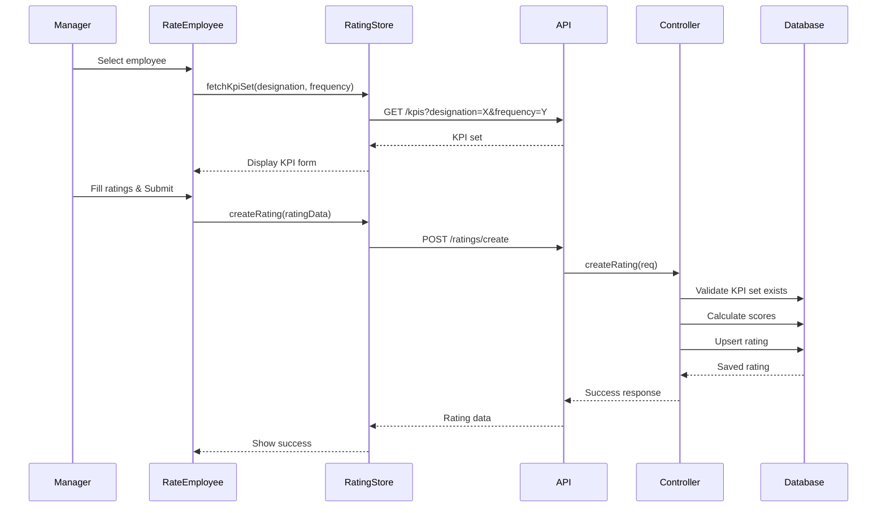
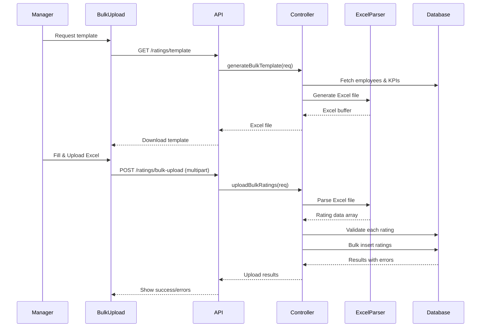

# Performance Management Module - Part 1: Overview & Architecture

This is the first part of a comprehensive guide to the Performance Management module. This document covers the system overview, architecture, core concepts, and component structure.

## Table of Contents

1. [System Overview](#system-overview)
2. [Architecture](#architecture)
3. [Core Concepts](#core-concepts)
4. [Component Structure](#component-structure)
5. [Data Flow](#data-flow)
6. [Technology Stack](#technology-stack)

## System Overview

The Performance Management module is a comprehensive system for managing employee performance evaluations through Key Performance Indicators (KPIs) and ratings. It supports multiple evaluation frequencies, hierarchical access control, bulk operations, and advanced analytics.

### Key Features

- **KPI Set Management**: Define and manage KPI templates by designation and frequency
- **Performance Ratings**: Create and manage individual and bulk ratings
- **Multiple Frequencies**: Support for daily, weekly, monthly, quarterly, half-yearly, and yearly evaluations
- **Bulk Operations**: Excel-based bulk upload for current and past ratings
- **Hierarchical Access**: Self, team, and organization-level views
- **Analytics Dashboard**: Comprehensive performance analytics and visualizations
- **Top Performers**: Identify top performers at organization and designation levels
- **Version Control**: Immutable KPI set versions for historical tracking

### User Roles

| Role            | Access Level | Capabilities                                             |
| --------------- | ------------ | -------------------------------------------------------- |
| **Employee**    | Self         | View own ratings, performance history                    |
| **Manager**     | Team         | Rate team members, view team analytics, bulk operations  |
| **Super Admin** | Organization | Full access, organization-wide analytics, KPI management |

## Architecture

### High-Level Architecture

```
┌─────────────────────────────────────────────────────────────┐
│                    Frontend (React)                         │
│  ┌──────────────┐  ┌──────────────┐  ┌──────────────┐     │
│  │   KPI Mgmt   │  │  Rating Mgmt │  │  Dashboards  │     │
│  │  Components  │  │  Components  │  │  & Analytics│     │
│  └──────────────┘  └──────────────┘  └──────────────┘     │
│         │                  │                  │            │
│         └──────────────────┼──────────────────┘            │
│                            │                                │
│                    ┌───────▼────────┐                       │
│                    │  Zustand Stores│                       │
│                    │  - useKpiStore │                       │
│                    │  - useRatingStore│                     │
│                    └───────┬────────┘                       │
└────────────────────────────┼────────────────────────────────┘
                             │
                    ┌────────▼────────┐
                    │   Backend API   │
                    │   (Express.js)   │
                    └────────┬────────┘
                             │
        ┌────────────────────┼────────────────────┐
        │                    │                    │
┌───────▼────────┐  ┌───────▼────────┐  ┌───────▼────────┐
│  KPI Controller│  │ Rating Controller│  │ Analytics      │
│  & Routes      │  │  & Routes       │  │  Controller    │
└───────┬────────┘  └───────┬────────┘  └───────┬────────┘
        │                    │                    │
        └────────────────────┼────────────────────┘
                             │
                    ┌────────▼────────┐
                    │    MongoDB      │
                    │   Database      │
                    └─────────────────┘
```

### Component Hierarchy

```
Performance Management Module
│
├── KPI Management
│   └── SetKpisNew.jsx
│       ├── Designation Selector
│       ├── Frequency Selector
│       ├── Version Management
│       └── KPI Form (Add/Edit/Delete KPIs)
│
├── Rating Management
│   ├── GiveRatingDashboard.jsx
│   │   ├── RateEmployee.jsx (Individual Rating)
│   │   │   ├── Employee Selector
│   │   │   ├── Frequency & Date Selector
│   │   │   └── RatingModal.jsx
│   │   └── BulkRating.jsx (Bulk Rating)
│   │
│   ├── BulkUploadPast.jsx
│   │   ├── Employee Selector
│   │   ├── Frequency & Date Range Selector
│   │   ├── Excel Template Download
│   │   └── File Upload & Validation
│   │
│   └── RatingDashboard.jsx
│
├── Dashboards
│   ├── ManagerDashboard.jsx
│   │   ├── Team Overview Cards
│   │   ├── Team Performance Table
│   │   └── TeamPerformanceAnalytics.jsx
│   │
│   ├── SuperAdminDashboard.jsx
│   │   ├── Organization Overview
│   │   ├── Department Performance
│   │   └── Organization Analytics
│   │
│   └── RatingDashboard.jsx
│
├── Individual Views
│   ├── MyPerformanceAdvanced.jsx (Employee Self-View)
│   ├── EmployeeRatingAdvanced.jsx (Manager View)
│   ├── EmployeeIndividualRating.jsx
│   └── AllEmployeeRatings.jsx
│
└── Analytics
    ├── PerformanceAnalytics.jsx
    ├── TeamPerformanceAnalytics.jsx
    └── ResponsiveTable.jsx
```

## Core Concepts

### 1. KPI Set

A **KPI Set** is a template that defines performance indicators for a specific job role (designation) and evaluation frequency.

**Structure:**

```javascript
{
  designation: "Sales Manager",      // Job role
  frequency: "monthly",              // Evaluation frequency
  version: 2,                        // Version number (immutable)
  kpis: [                            // Array of KPIs
    {
      kpiName: "Number of Sales",
      type: "quantitative",          // or "qualitative"
      marks: 60,                     // Weight/points
      target: 50,                    // Target value (quantitative only)
      category: "Sales"              // Optional category
    },
    {
      kpiName: "Product Knowledge",
      type: "qualitative",
      marks: 40
    }
  ],
  totalMarks: 100                    // Sum of all KPI marks
}
```

**Key Characteristics:**

- **Immutable Versions**: Each change creates a new version, preserving history
- **Designation-Specific**: Each designation has its own KPI sets
- **Frequency-Specific**: Different frequencies can have different KPIs
- **Total Marks Validation**: Sum of all KPI marks must equal totalMarks

### 2. Rating

A **Rating** is an evaluation of an employee's performance against a KPI set for a specific period.

**Structure:**

```javascript
{
  employeeId: "user123",
  ratedBy: "manager456",            // Manager who created rating
  frequency: "monthly",
  version: 2,                        // KPI set version used
  year: 2024,
  month: 3,                          // For monthly/quarterly
  week: 12,                          // For weekly
  date: "2024-03-15",                // For daily
  kpis: [
    {
      kpiName: "Number of Sales",
      type: "quantitative",
      marks: 60,
      target: 50,
      achieved: 45,                  // Actual achievement
      score: 54                       // Calculated: (achieved/target) * marks
    },
    {
      kpiName: "Product Knowledge",
      type: "qualitative",
      marks: 40,
      score: 36                       // Manager-assigned score
    }
  ],
  totalScore: 90,                     // Sum of all KPI scores
  comment: "Good performance overall"
}
```

**Key Characteristics:**

- **KPI Set Alignment**: Must match a KPI set's structure
- **Period-Specific**: Each rating is for a specific time period
- **Score Calculation**:
  - Quantitative: `score = (achieved / target) * marks`
  - Qualitative: Manager-assigned score (0 to marks)
- **Version Tracking**: Records which KPI set version was used

### 3. Frequencies

The system supports multiple evaluation frequencies:

| Frequency       | Period Identifier | Example       |
| --------------- | ----------------- | ------------- |
| **Daily**       | `date`            | 2024-03-15    |
| **Weekly**      | `year`, `week`    | 2024, Week 12 |
| **Monthly**     | `year`, `month`   | 2024, March   |
| **Quarterly**   | `year`, `quarter` | 2024, Q1      |
| **Half-Yearly** | `year`, `half`    | 2024, H1      |
| **Yearly**      | `year`            | 2024          |

### 4. Version Control

KPI Sets use immutable versioning:

- **New Version Creation**: When updating a KPI set, a new version is created
- **Version Increment**: Automatically increments from the latest version
- **Historical Preservation**: Old versions remain unchanged
- **Rating Association**: Ratings reference the specific version used

**Example:**

```
Designation: Sales Manager, Frequency: Monthly
- Version 1: Created Jan 2024 (3 KPIs, 100 marks)
- Version 2: Created Mar 2024 (4 KPIs, 100 marks) - Added new KPI
- Version 3: Created Jun 2024 (4 KPIs, 120 marks) - Updated marks

Ratings:
- Jan 2024 rating → Uses Version 1
- Mar 2024 rating → Uses Version 2
- Jun 2024 rating → Uses Version 3
```

## Component Structure

### Frontend Components

#### 1. KPI Management (`SetKpisNew.jsx`)

**Purpose:** Create and manage KPI sets for designations and frequencies.

**Key Features:**

- Designation selection
- Frequency selection
- Version management
- KPI CRUD operations
- Total marks validation
- Category management

**Location:** `hcmFrontend/src/components/performance management razor/SetKpisNew.jsx`

#### 2. Rating Components

**GiveRatingDashboard.jsx**

- Main container for rating operations
- Tabs: Individual Rating | Bulk Rating

**RateEmployee.jsx**

- Individual employee rating interface
- Employee search and filter
- Frequency and period selection
- KPI set loading
- Rating submission

**BulkRating.jsx**

- Bulk rating interface for multiple employees
- Excel template generation
- Bulk upload functionality

**BulkUploadPast.jsx**

- Upload ratings for past periods
- Date range selection
- Excel template with past data
- Validation and error handling

#### 3. Dashboard Components

**ManagerDashboard.jsx**

- Team performance overview
- Team member ratings table
- Team analytics
- Filters and search

**SuperAdminDashboard.jsx**

- Organization-wide performance
- Department-level views
- Organization analytics
- Top performers

**RatingDashboard.jsx**

- General rating dashboard
- Quick access to rating functions

#### 4. Individual View Components

**MyPerformanceAdvanced.jsx**

- Employee self-view
- Personal performance history
- Trend analysis
- KPI details

**EmployeeRatingAdvanced.jsx**

- Manager view of individual employee
- Detailed rating history
- Performance trends
- KPI breakdown

#### 5. Analytics Components

**TeamPerformanceAnalytics.jsx**

- Team-level analytics
- Charts and visualizations
- Performance trends
- Distribution analysis

**PerformanceAnalytics.jsx**

- General analytics component
- Reusable analytics widgets

### Backend Structure

#### Routes

**KPI Routes** (`kpiSet.route.js`)

- `POST /api/v1/kpis/create` - Create KPI set
- `GET /api/v1/kpis` - Get KPI set (with filters)
- `GET /api/v1/kpis/all` - Get all KPI sets
- `PUT /api/v1/kpis/update/:id` - Update KPI set (creates new version)
- `DELETE /api/v1/kpis/delete/:id` - Delete KPI set

**Rating Routes** (`userRating.route.js`)

- `POST /api/v1/ratings/create` - Create/update rating
- `GET /api/v1/ratings/template` - Generate bulk template
- `GET /api/v1/ratings/past-template` - Generate past ratings template
- `POST /api/v1/ratings/bulk-upload` - Upload bulk ratings
- `POST /api/v1/ratings/bulk-upload-past` - Upload past ratings
- `GET /api/v1/ratings/my-advanced` - Get own ratings
- `GET /api/v1/ratings/team-advanced` - Get team ratings
- `GET /api/v1/ratings/organization-advanced` - Get org ratings
- `GET /api/v1/ratings/employee-advanced/:id` - Get employee ratings
- `GET /api/v1/ratings/top-performer` - Get top performers
- `GET /api/v1/ratings/manager/team/analytics` - Team analytics
- `GET /api/v1/ratings/superadmin/org/analytics` - Org analytics

#### Controllers

**KPI Controller** (`kpiSet.controller.js`)

- KPI set CRUD operations
- Version management
- Validation logic

**Rating Controller** (`userRating.controller.js`)

- Rating creation and updates
- Bulk upload processing
- Excel template generation
- Analytics computation
- Hierarchical data access

#### Models

**KPI Set Model** (`kpiSet.model.js`)

- Schema definition
- Validation rules
- Indexes

**Rating Model** (`userRating.model.js`)

- Schema definition
- Relationships
- Indexes for queries

## Data Flow

### Creating a KPI Set



### Creating a Rating



### Bulk Upload Flow



## Technology Stack

### Frontend

- **React**: UI framework
- **Zustand**: State management (`useKpiNewStore`, `useRatingNewStore`)
- **React Icons**: Icon library (Fi, Hi, Bs, Md icons)
- **Framer Motion**: Animations
- **React Hot Toast**: Notifications
- **Date-fns**: Date manipulation
- **XLSX**: Excel file handling (for bulk operations)

### Backend

- **Express.js**: Web framework
- **MongoDB**: Database
- **Mongoose**: ODM
- **Multer**: File upload handling
- **XLSX**: Excel parsing
- **JWT**: Authentication

### Key Libraries

**Frontend:**

```javascript
// State Management
import useKpiSetStore from "../../store/useKpiNewStore";
import useRatingStore from "../../store/useRatingNewStore";

// Date Handling
import { format, getISOWeek, startOfMonth, endOfMonth } from "date-fns";

// Excel (if needed)
import * as XLSX from "xlsx";
```

**Backend:**

```javascript
// File Upload
import multer from "multer";
import { upload } from "../../middlewares/multer.middleware.js";

// Excel Processing
import XLSX from "xlsx";

// Database
import mongoose from "mongoose";
```

## Next Steps

Continue reading:

- [Part 2: KPI Management](./performance-management-part2-kpi-management.md)
- [Part 3: Rating Management](./performance-management-part3-rating-management.md)
- [Part 4: Bulk Operations](./performance-management-part4-bulk-operations.md)
- [Part 5: Dashboards and Analytics](./performance-management-part5-dashboards-analytics.md)
- [Part 6: API Reference](./performance-management-part6-api-reference.md)

---

**Last Updated:** 2024  
**Maintained By:** Development Team
