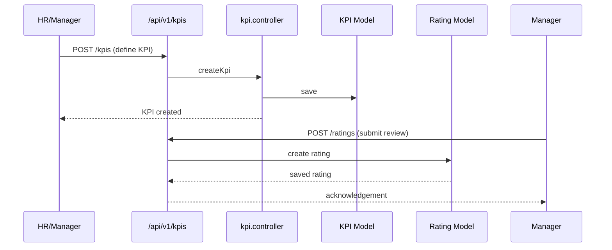

# Performance Management

Performance management covers KPIs/KRAs, ratings, feedback sessions, and goal progress tracking.  It provides both employee and manager views of performance metrics.

## Core Permissions

| Permission | Description |
| --- | --- |
| `performance-management` | Manage KPIs, reviews. |
| `dashboard-employee` | View employee dashboard (`managerDashboard`). |
| `dashboard-super` | Super admin dashboards (performance metrics). |

## Backend Components

| File | Responsibility |
| --- | --- |
| `controllers/performance/kpi.controller.js` | Manage KPI definitions, templates, categories. |
| `controllers/performance/rating.controller.js` | Capture performance ratings, review cycles, action plans. |
| `controllers/performance/review.controller.js` | Handle review sessions, feedback requests (if implemented). |
| `models/performance/kpi.model.js` | KPI schema (objective, weight, owner). |
| `models/performance/rating.model.js` | Ratings schema (score, reviewer, comments). |
| `routes/v1/kpi/*.js`, `routes/v1/ratings/*.js` | API endpoints under `/api/v1/kpis`, `/api/v1/ratings`. |
| `controllers/dashboard-stats/performanceDashboard.controller.js` | Aggregated metrics for dashboards. |

### KPI Lifecycle

## Frontend Components

| Path | Description |
| --- | --- |
| `pages/performance/KpiDashboard.jsx` | Manager overview of KPIs and completion status. |
| `pages/performance/KpiDetail.jsx` | Detailed view of KPI progress, owner updates. |
| `pages/performance/RatingPanel.jsx` | Review submissions, ratings, feedback. |
| `pages/kpi/KpiBuilder.jsx` | Create/edit KPI templates. |
| `components/performance/KpiTable.jsx` | Table listing assignments and progress. |
| `components/performance/RatingForm.jsx` | Enter ratings across multiple criteria. |
| `store/useKpiStore.js`, `store/useRatingStore.js`, `store/useKpiNewStore.js` | Zustand stores for KPI definitions and rating data. |
| `service/kpiService.js`, `service/ratingService.js` | Axios clients for performance APIs. |

## Data Model

- KPIs hold metadata (title, description, weightage) and references to owners (User IDs).
- Ratings reference KPIs and store scores per reviewer.
- Comments, attachments, and history are stored inside the rating documents to preserve context.

## Workflow Highlights

- KPI assignment to employees triggers notifications and displays on dashboards.
- Ratings are submitted at the end of cycles; managers can reopen or adjust scores.
- Performance dashboards aggregate metrics (average scores, pending reviews) for leadership.

## Integrations

- Links with payroll incentives or bonus calculations (using aggregated scores).
| `controllers/bonus/bonus.controller.js` | can reference KPI performance for reward programs. |
- Manager dashboards combine KPI data with attendance/performance analytics via `dashboardStore`.

## Tenant Notes

- Each tenant configures KPI templates suited to their departments.
- Frontend builds per tenant can localise KPI categories and naming.

This module documentation should be the starting point when modifying performance reviews or KPI flows.

