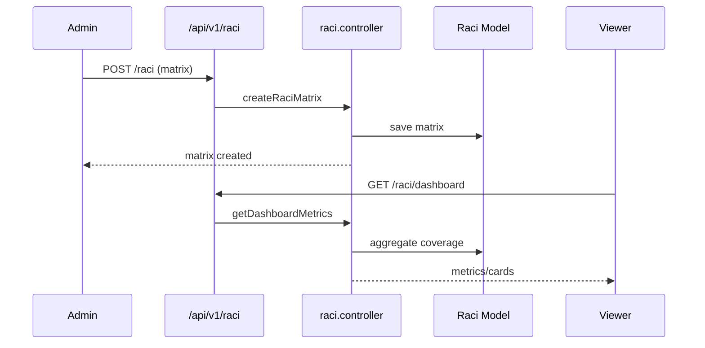

# RACI & Company Analytics

The RACI module maps responsibilities (Responsible, Accountable, Consulted, Informed) across business and operations, providing analytics dashboards for leadership.

## Permissions

| Permission | Description |
| --- | --- |
| `raci-main` | Access main RACI dashboard. |
| `raci-business` | Business-specific RACI analytics. |
| `raci-operations` | Operations-focused RACI analytics. |

## Backend Components

| File | Responsibility |
| --- | --- |
| `controllers/raci/raci.controller.js` | CRUD for RACI matrices, assignments. |
| `models/raci/raci.model.js` | RACI schema (role, function, stakeholders). |
| `routes/v1/raci/raci.route.js` | REST endpoints under `/api/v1/raci`. |
| `controllers/dashboard-stats/raciDashboard.controller.js` | Aggregated analytics (coverage, gaps). |
| `controllers/analytics-dashboards-cards/raciCards.controller.js` | Dashboard widgets. |

## Frontend Components

| Path | Description |
| --- | --- |
| `pages/raci/RaciDashboard.jsx` | Main RACI dashboard. |
| `pages/raci/RaciBusiness.jsx` | Business RACI analytics. |
| `pages/raci/RaciOperations.jsx` | Operations RACI analytics. |
| `components/raci/RaciMatrixTable.jsx` | Matrix editor/list. |
| `components/raci/RaciChart.jsx` | Visualisations (pie/bar). |
| `store/useRaciStore.js` | Zustand store for RACI matrices. |
| `service/raciService.js` | Axios client. |

## Integration

- RACI assignments link to departments and roles defined in company settings.
- Dashboards display coverage gaps to inform hiring and trainings.
- Notifications can alert when RACI entries are missing or outdated (custom logic).

## Tenant Notes

- Each tenant maintains its own RACI matrix, stored in the tenant-specific DB.
- Frontend builds may rename RACI labels to align with company terminology.

Use this doc when adjusting RACI dashboards or extending analytics.

