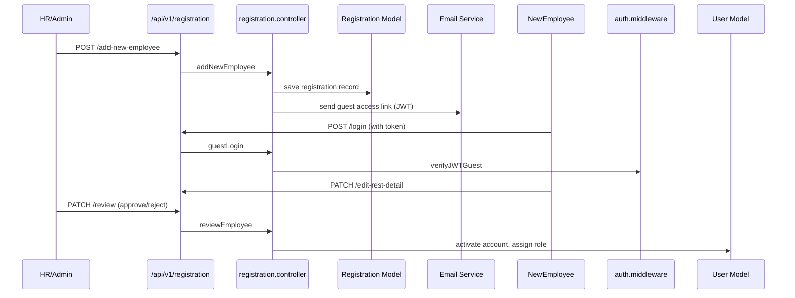

# Registration Module

The registration module captures employee details between recruitment and activation.  It supports multi-step onboarding, guest access tokens, and HR approvals.

## Permissions

| Permission | Description |
| --- | --- |
| `registration/add-new-employee` | Add new employee via registration flow. |
| `registration/edit-rest-detail` | Edit additional employee information post-creation. |
| `registration/review-employee` | HR review/approve registration submissions. |

## Backend Components

| File | Responsibility |
| --- | --- |
| `controllers/registration/registration.controller.js` | Manages registration steps, guest tokens, approvals, email invites. |
| `models/registration/registration.model.js` | Stores registration progress, assigned reviewers. |
| `models/users/user.model.js` | Updated when registration completes and employee is activated. |
| `routes/v1/registration/registration.route.js` | Endpoints under `/api/v1/registration`. |
| `services/emailService.js` | Sends OTP/reset links for registration. |
| `middlewares/auth.middleware.js` | `verifyJWTGuest` validates guest tokens for registration links. |

### Key Endpoints

- `POST /api/v1/registration/add` – Begin registration for a new employee.
- `POST /api/v1/registration/login` – Guest login for employee to complete details.
- `GET /api/v1/registration/verify-token` – Validate guest registration token.
- `POST /api/v1/registration/logout` – End guest session.
- `PATCH /api/v1/registration/review/:id` – HR review/approve/return registration.

## Frontend Components

| Path | Description |
| --- | --- |
| `pages/registration/AddNewEmployee.jsx` | HR form to initiate registration. |
| `pages/registration/EditRestDetailPage.jsx` | Guest-facing page to fill additional details. |
| `pages/registration/RegistrationLogin.jsx` | Guest login component. |
| `pages/registration/ReviewEmployee.jsx` | HR review screen. |
| `store/useRegistrationStore.js`, `store/useRegistrationLoginStore.js` | Zustand stores for registration data. |
| `service/registrationService.js` | REST client for registration endpoints. |

## Guest Token Flow

- Guest links use `JWT_SECRET_FOR_GUEST`.
- Middleware ensures token + device type is valid before allowing updates.
- After completion, tokens are invalidated to prevent reuse.

## Integration Points

- On approval, registration controller triggers user creation/update.
- Works with onboarding module to assign induction/training tasks immediately after approval.
- Email templates located in `templates/email/registrationTemplate.js`.

## Tenant Notes

- Each tenant can customise registration templates/snippets via company settings.
- `.env` contains `FRONTEND_URL` for guest links and `JWT_SECRET_FOR_GUEST`.
- PM2 instances handle registration flows for each tenant separately while sharing code.

Use this guide when modifying registration steps, guest access, or approval workflows.

