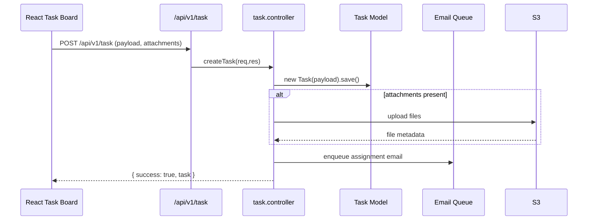

# Task Management

The Task Management module tracks assignments, action items, and daily updates.  It exposes APIs for creating tasks, updating progress, uploading supporting documents, and notifying stakeholders.  The frontend provides dashboards, Kanban-style lists, and manager review screens.

## Core Permissions

| Permission Slug | Description |
| --- | --- |
| `task-main` | Access manager dashboards (`ViewTaskManager`). |
| `task-assign-subordinates` | Create and assign tasks to team members (`ActionTrackerManager`). |
| `task-update` | Update existing tasks (`updateTask`). |
| `task-view-subordinates` | View subordinate tasks (`ViewTaskManager`). |
| `task-create` | (Legacy) Creating personal tasks. |

Permissions map to the legacy values defined in `auth.middleware.js` (`ViewTaskManager`, `updateTask`, `ActionTrackerManager`).

## Backend Components

| File | Responsibility |
| --- | --- |
| `src/controllers/task/task.controller.js` | Main REST controller (create, update, comment, attachments, manager review, reporting). |
| `src/models/task/task.model.js` | Task schema (title, description, assignee, status, priority, due dates, attachments, activity log). |
| `src/routes/v1/task/task.route.js` | Routes under `/api/v1/task`. Applies JWT + permission middleware. |
| `src/utils/fileUpload.js` & `multer.middleware.js` | Handle attachment uploads. |
| `src/utils/logger.js` | Logs critical operations and errors. |
| `src/services/emailService.js` | Sends assignment/overdue emails via BullMQ queue. |

### Key Endpoints

- `POST /api/v1/task` – Create a new task (requires `task-assign-subordinates`).
- `GET /api/v1/task` – List tasks with filters (status, priority, date range).
- `PATCH /api/v1/task/:id` – Update status, add comments, attach files.
- `GET /api/v1/task/summary` – Dashboard metrics for manager widgets.
- `POST /api/v1/task/:id/attachments` – Upload documents (Multer + S3).

### Workflow

## Frontend Components

| Path | Description |
| --- | --- |
| `src/pages/task/TaskDashboard.jsx` | Manager dashboard with summary cards and filters. |
| `src/pages/task/TaskList.jsx` | Task list with search, sorting, pagination. |
| `src/components/task/TaskForm.jsx` | Create/edit task modal using `react-hook-form`. |
| `src/components/task/TaskTimeline.jsx` | Renders task activity logs and comments. |
| `src/components/task/TaskKanban.jsx` | Drag-and-drop view (if enabled). |
| `src/store/taskStore.js` (or `useTaskStore.js`) | Zustand store managing tasks, loading states, filters. |
| `src/service/taskService.js` | Axios wrapper for task endpoints. |

### State Flow

- `useTaskStore.fetchTasks(params)` invokes `taskService.list`.
- Responses cached in store, used by list/kanban components.
- `useTaskStore.createTask` sends data and attachments; on success updates the store to avoid full reload.
- Notifications display toast messages for assignment and status changes.

## Notifications & Emails

- Assignment emails: triggered via `emailQueue` with templates in `src/templates/email/taskAssignmentTemplate.js`.
- Push notifications: socket events emitted (`task:created`, `task:updated`) and consumed by the frontend `socketStore`.

## Additional Notes

- Task linking (e.g., to projects or KPIs) uses reference fields on the task document and is populated lazily when fetching details.
- Attachments default to S3; local fallback uses `/uploads`.
- Cron jobs in `src/jobs/ticketReminderScheduler.js` can be adapted to remind owners about overdue tasks.
- Auditing: task changes append to a history array with metadata (user, timestamp, change summary).

Use this page as the starting point when modifying or extending Task Management features.

