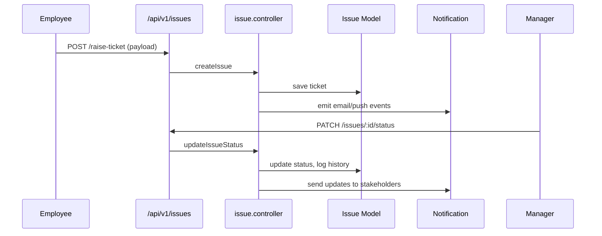

# Ticket & Issue Management

The ticketing module enables employees to raise issues, track status, and escalate POSH-related cases.  It integrates with notifications (email, push, socket) and compliance modules.

## Permissions

| Permission | Description |
| --- | --- |
| `ticket-manage-department` | Manage tickets within the user's department. |
| `assign-ticket-manage-department` | View tickets assigned to the user. |
| `ticket-create` | Raise general support tickets. |
| `ticket-manage-all` | Global ticket management (HR/IT). |
| `ticket-manage-posh` | Manage POSH-specific tickets. |
| `ticket-create-posh` | File POSH complaints. |

## Backend Components

| File | Responsibility |
| --- | --- |
| `controllers/Issues/issue.controller.js` | Create, assign, comment, change status on tickets. |
| `models/issues/issue.model.js` | Ticket schema (category, priority, assignees, activity log). |
| `controllers/poshAct/poshAct.controller.js` | Handles POSH cases linked to ticketing. |
| `routes/v1/issues/issue.route.js` | REST endpoints under `/api/v1/issues`. |
| `services/emailService.js` | Sends email notifications for ticket updates. |
| `services/emailWorker.js` | Processes ticket-related email queue. |
| `utils/sendPushToUsers.js` | Push notifications for ticket status changes. |
| `controllers/notification/notification.controller.js` | Stores notifications for in-app bell. |

### Ticket Workflow

## Frontend Components

| Path | Description |
| --- | --- |
| `pages/tickets/ManageTickets.jsx` | Admin/department head ticket view. |
| `pages/tickets/AssignedTickets.jsx` | Tickets assigned to the logged-in user. |
| `pages/tickets/RaiseTicket.jsx` | Ticket creation form. |
| `pages/tickets/AllTickets.jsx` | Global ticket list (filter by status/category). |
| `components/tickets/TicketCard.jsx` | Card view for Kanban-style boards. |
| `components/tickets/TicketDetailDrawer.jsx` | Detail view with comments, attachments. |
| `store/useIssuesStore.js` | Zustand store fetching/managing ticket data. |
| `service/issueService.js` | Axios client for issue endpoints. |

## Notifications

- Email + push notifications triggered on create, assign, comment, status change.
- Socket.io events keep open ticket views in sync.
- Notifications appear in the bell component via `notificationStore`.

## POSH Integration

- POSH tickets escalate to `poshAct.controller` for compliance workflow.
- POSH-specific permissions determine access to POSH dashboards.
- POSH cases also log history for audits.

## Tenant Considerations

- `.env` values (SES, Firebase) differ per tenant.
- Ticket categories and SLA thresholds stored in tenant-specific documents (CompanySettings or dedicated collections).
- Shared code ensures consistent behaviour while PM2 instances separate runtime.

Use this reference when extending ticket fields, adding escalation logic, or debugging notification flows.

