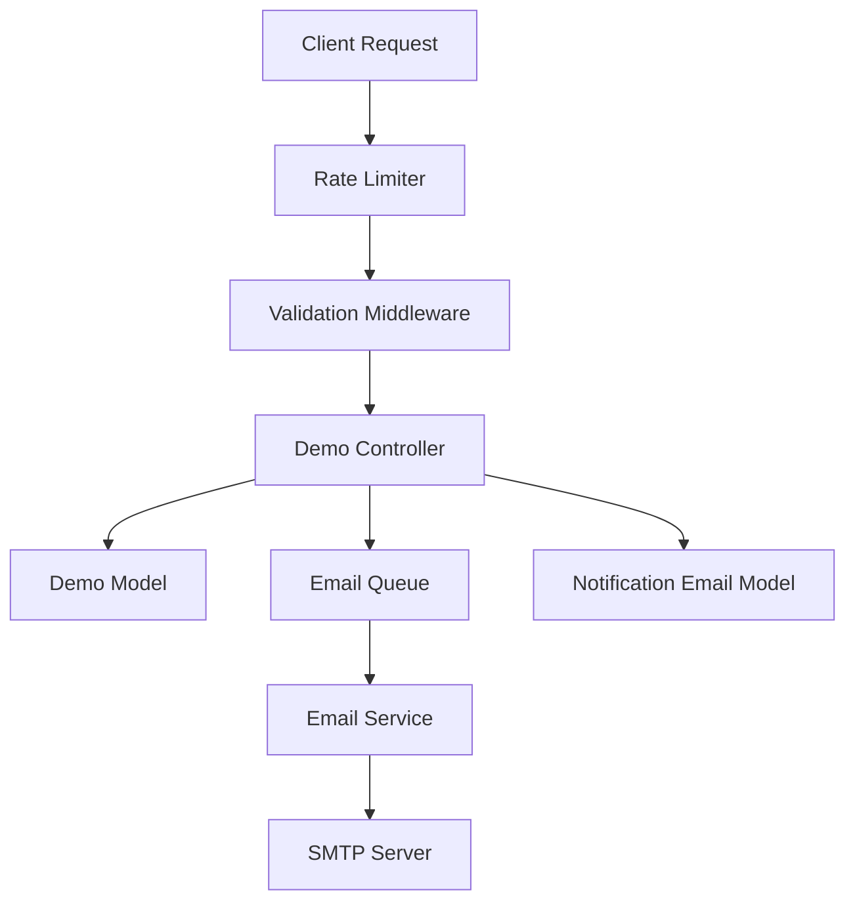
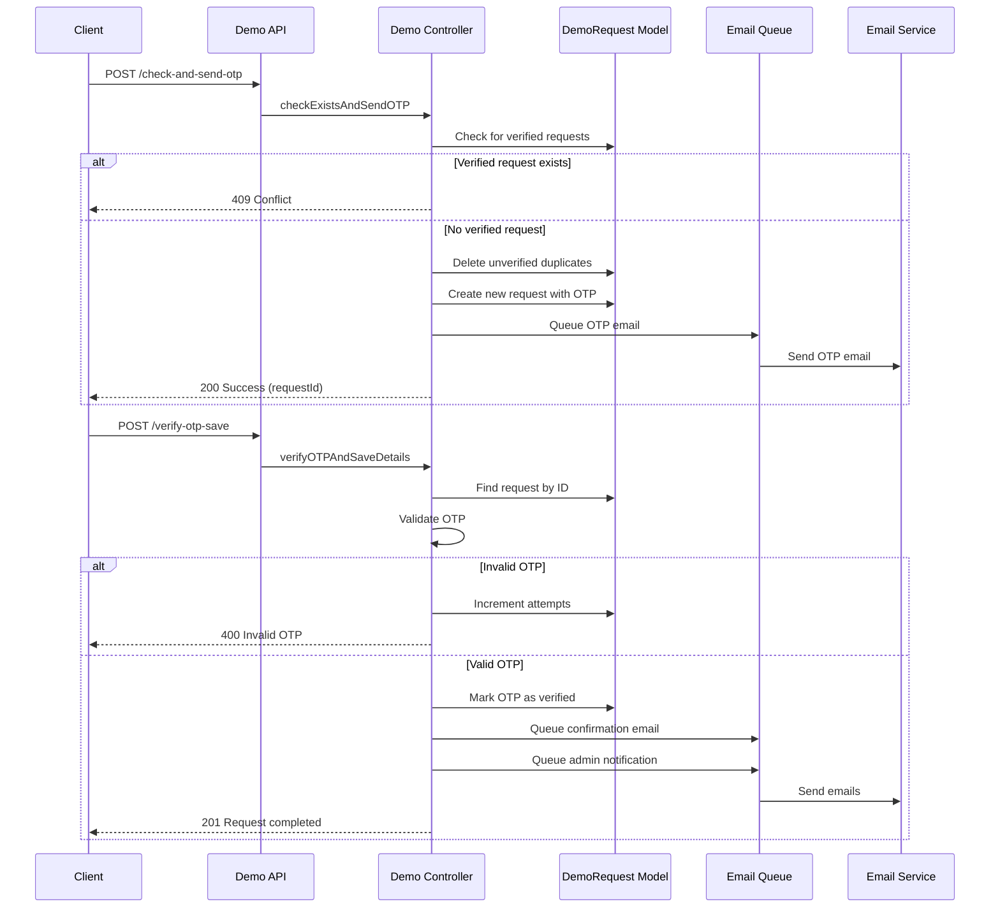
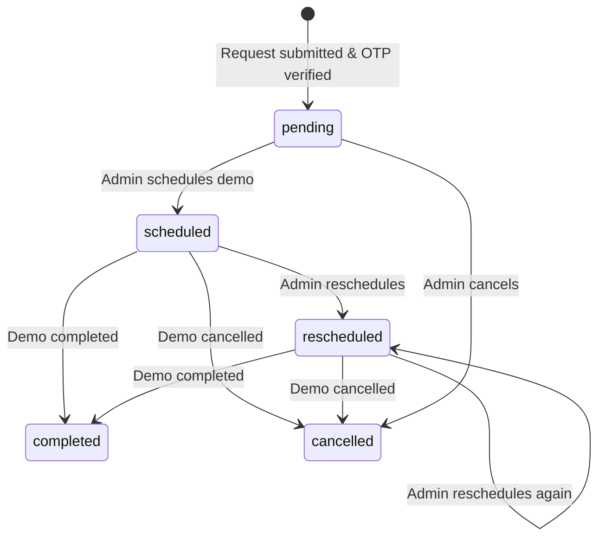

# Demo Management API (Server-Side)

> **Note:** This is the **server-side API documentation** for Demo Management. For the client-side React component, see [MS1 Client - Demo Management Component](../../ms1-client/components/demo-management).

The Demo Management module handles the complete lifecycle of product demo requests from initial submission through OTP verification, scheduling, and completion. It includes automated email notifications, status tracking, and administrative tools for managing demo requests.

## Overview

The Demo Management module provides a secure, OTP-verified workflow for potential customers to request product demonstrations. It prevents duplicate submissions, tracks email delivery status, and provides comprehensive administrative tools for managing the demo pipeline.

## Core Features

- **OTP-Based Verification** – Secure email verification before completing demo requests
- **Status Management** – Track requests through pending, scheduled, completed, cancelled, and rescheduled states
- **Automated Email Notifications** – Queue-based email system for OTP, confirmations, scheduling, and status updates
- **Meeting Scheduling** – Schedule and reschedule demos with meeting links and preferred time slots
- **Admin Dashboard** – View, filter, search, and manage all demo requests
- **Statistics & Analytics** – Track demo request metrics and feature preferences
- **Export Functionality** – Export demo requests to CSV for reporting
- **Rate Limiting** – Prevent abuse with configurable rate limits on public endpoints

## Architecture



### Overall System Flow (Visual Diagram)

```
╔═══════════════════════════════════════════════════════════════════════╗
║            🎯 HOW DEMO MANAGEMENT WORKS 🎯                             ║
║            (Visual Overview for Everyone)                              ║
╚═══════════════════════════════════════════════════════════════════════╝

    ┌─────────────────────────────────────────────────────────────┐
    │                                                             │
    │  STEP 1: 👤 CUSTOMER REQUESTS A DEMO                         │
    │                                                             │
    │  ┌───────────────────────────────────────────────────────┐ │
    │  │                                                       │ │
    │  │  👤 Potential Customer                                │ │
    │  │  ┌─────────────────────────────────────────────┐   │ │
    │  │  │                                               │   │ │
    │  │  │  🖥️  Demo Request Form                        │   │ │
    │  │  │  ┌─────────────────────────────────────┐     │   │ │
    │  │  │  │                                       │     │   │ │
    │  │  │  │  📝 Fill in details:                  │     │   │ │
    │  │  │  │  • Name: John Doe                    │     │   │ │
    │  │  │  │  • Email: john@company.com          │     │   │ │
    │  │  │  │  • Phone: +1234567890               │     │   │ │
    │  │  │  │  • Company: Acme Corp               │     │   │ │
    │  │  │  │  • Features interested in...         │     │   │ │
    │  │  │  │                                       │     │   │ │
    │  │  │  │  [📤 Submit Request]                  │     │   │ │
    │  │  │  └─────────────────────────────────────┘     │   │ │
    │  │  └─────────────────────────────────────────────┘   │ │
    │  │                                                       │ │
    │  │  👆 Action: Customer submits demo request            │ │
    │  └───────────────────────────────────────────────────────┘ │
    │                                                             │
    └─────────────────────────────────────────────────────────────┘
                              │
                              │ ⬇️ Request sent
                              │
    ┌─────────────────────────────────────────────────────────────┐
    │                                                             │
    │  STEP 2: 🔒 SYSTEM SENDS OTP FOR VERIFICATION               │
    │                                                             │
    │  ┌───────────────────────────────────────────────────────┐ │
    │  │                                                       │ │
    │  │  ⚙️  System Processing                                │ │
    │  │  ┌─────────────────────────────────────────────┐   │ │
    │  │  │                                               │   │ │
    │  │  │  ✅ Validation Check                          │   │ │
    │  │  │  ┌─────────────────────────────────────┐   │   │ │
    │  │  │  │ ✓ Email format valid?                │   │ │
    │  │  │  │ ✓ Phone format valid?               │   │ │
    │  │  │  │ ✓ All fields filled?                │   │ │
    │  │  │  └─────────────────────────────────────┘   │   │ │
    │  │  │                                               │   │ │
    │  │  │  🔍 Duplicate Check                          │   │ │
    │  │  │  ┌─────────────────────────────────────┐   │   │ │
    │  │  │  │ 🔎 Checking if email/phone exists...│   │ │
    │  │  │  │ ✓ No duplicate found                 │   │ │
    │  │  │  └─────────────────────────────────────┘   │   │ │
    │  │  │                                               │   │ │
    │  │  │  🔐 Generate OTP                             │   │ │
    │  │  │  ┌─────────────────────────────────────┐   │   │ │
    │  │  │  │ 🔢 Generating 6-digit code...       │   │ │
    │  │  │  │ Code: 123456                        │   │ │
    │  │  │  │ Expires in: 2 minutes               │   │ │
    │  │  │  └─────────────────────────────────────┘   │   │ │
    │  │  │                                               │   │ │
    │  │  │  📧 Queue Email                              │   │ │
    │  │  │  ┌─────────────────────────────────────┐   │   │ │
    │  │  │  │ 📧 Adding OTP email to queue...     │   │ │
    │  │  │  │ ✓ Email queued                      │   │ │
    │  │  │  └─────────────────────────────────────┘   │   │ │
    │  │  └─────────────────────────────────────────────┘   │ │
    │  │                                                       │ │
    │  │  📧 Email Sent to Customer                           │ │
    │  │  ┌─────────────────────────────────────┐         │ │
    │  │  │ 📧 Your OTP Code: 123456            │         │ │
    │  │  │ Valid for 2 minutes                 │         │ │
    │  │  └─────────────────────────────────────┘         │ │
    │  └───────────────────────────────────────────────────────┘ │
    │                                                             │
    └─────────────────────────────────────────────────────────────┘
                              │
                              │ ⬇️ Customer receives email
                              │
    ┌─────────────────────────────────────────────────────────────┐
    │                                                             │
    │  STEP 3: ✅ CUSTOMER VERIFIES OTP                            │
    │                                                             │
    │  ┌───────────────────────────────────────────────────────┐ │
    │  │                                                       │ │
    │  │  👤 Customer                                          │ │
    │  │  ┌─────────────────────────────────────────────┐   │ │
    │  │  │                                               │   │ │
    │  │  │  📧 Checks email                              │   │ │
    │  │  │  ┌─────────────────────────────────────┐   │   │ │
    │  │  │  │ From: demo@company.com              │   │ │
    │  │  │  │ Subject: Your Demo Request OTP      │   │ │
    │  │  │  │                                       │   │ │
    │  │  │  │ Your OTP code is: 123456            │   │ │
    │  │  │  │ Valid for 2 minutes                 │   │ │
    │  │  │  └─────────────────────────────────────┘   │   │ │
    │  │  │                                               │   │ │
    │  │  │  🔐 Enter OTP                               │   │ │
    │  │  │  ┌─────────────────────────────────────┐   │   │ │
    │  │  │  │ Enter OTP Code:                     │   │ │
    │  │  │  │ [123456________________]            │   │ │
    │  │  │  │                                       │   │ │
    │  │  │  │ [✅ Verify OTP]                      │   │ │
    │  │  │  └─────────────────────────────────────┘   │   │ │
    │  │  └─────────────────────────────────────────────┘   │ │
    │  │                                                       │ │
    │  │  ✅ System Verifies:                                 │ │
    │  │  ┌─────────────────────────────────────┐         │ │
    │  │  │ ✓ OTP Code: 123456 - Valid          │         │ │
    │  │  │ ✓ Not expired                        │         │ │
    │  │  │ ✓ Request verified!                 │         │ │
    │  │  └─────────────────────────────────────┘         │ │
    │  └───────────────────────────────────────────────────────┘ │
    │                                                             │
    └─────────────────────────────────────────────────────────────┘
                              │
                              │ ⬇️ Request verified
                              │
    ┌─────────────────────────────────────────────────────────────┐
    │                                                             │
    │  STEP 4: 📧 NOTIFICATIONS SENT                               │
    │                                                             │
    │  ┌───────────────────────────────────────────────────────┐ │
    │  │                                                       │ │
    │  │  📧 Email Queue Processing                            │ │
    │  │  ┌─────────────────────────────────────────────┐   │ │
    │  │  │                                               │   │ │
    │  │  │  1️⃣  Confirmation Email to Customer          │   │ │
    │  │  │  ┌─────────────────────────────────────┐   │   │ │
    │  │  │  │ 📧 "Your demo request received!"    │   │ │
    │  │  │  │ We'll contact you soon.             │   │ │
    │  │  │  └─────────────────────────────────────┘   │   │ │
    │  │  │                                               │   │ │
    │  │  │  2️⃣  Admin Notification                      │   │ │
    │  │  │  ┌─────────────────────────────────────┐   │   │ │
    │  │  │  │ 📧 "New demo request!"              │   │ │
    │  │  │  │ From: John Doe (Acme Corp)          │   │ │
    │  │  │  └─────────────────────────────────────┘   │   │ │
    │  │  └─────────────────────────────────────────────┘   │ │
    │  │                                                       │ │
    │  │  💾 Request Saved in Database                        │ │
    │  │  ┌─────────────────────────────────────┐         │ │
    │  │  │ Status: Pending                      │         │ │
    │  │  │ Waiting for admin to schedule...    │         │ │
    │  │  └─────────────────────────────────────┘         │ │
    │  └───────────────────────────────────────────────────────┘ │
    │                                                             │
    └─────────────────────────────────────────────────────────────┘
                              │
                              │ ⬇️ Admin reviews request
                              │
    ┌─────────────────────────────────────────────────────────────┐
    │                                                             │
    │  STEP 5: 📅 ADMIN SCHEDULES THE DEMO                          │
    │                                                             │
    │  ┌───────────────────────────────────────────────────────┐ │
    │  │                                                       │ │
    │  │  👨‍💼 Admin Dashboard                                  │ │
    │  │  ┌─────────────────────────────────────────────┐   │ │
    │  │  │                                               │   │ │
    │  │  │  📋 Demo Request List                         │   │ │
    │  │  │  ┌─────────────────────────────────────┐     │   │ │
    │  │  │  │ John Doe - Acme Corp               │     │   │ │
    │  │  │  │ Status: Pending                    │     │   │ │
    │  │  │  │ [📅 Schedule Demo]                 │     │   │ │
    │  │  │  └─────────────────────────────────────┘     │   │ │
    │  │  │                                               │   │ │
    │  │  │  📅 Schedule Form                             │   │ │
    │  │  │  ┌─────────────────────────────────────┐     │   │ │
    │  │  │  │ Date: [2024-12-15]                 │     │   │ │
    │  │  │  │ Time: [14:00]                      │     │   │ │
    │  │  │  │ Meeting Link: [https://meet...]    │     │   │ │
    │  │  │  │ Notes: [Product overview demo]     │     │   │ │
    │  │  │  │                                       │     │   │ │
    │  │  │  │ [💾 Schedule]                       │     │   │ │
    │  │  │  └─────────────────────────────────────┘     │   │ │
    │  │  └─────────────────────────────────────────────┘   │ │
    │  │                                                       │ │
    │  │  📧 Scheduled Email Sent                             │ │
    │  │  ┌─────────────────────────────────────┐         │ │
    │  │  │ 📧 "Your demo is scheduled!"         │         │ │
    │  │  │ Date: Dec 15, 2024 at 2:00 PM        │         │ │
    │  │  │ Meeting Link: https://meet...        │         │ │
    │  │  └─────────────────────────────────────┘         │ │
    │  └───────────────────────────────────────────────────────┘ │
    │                                                             │
    └─────────────────────────────────────────────────────────────┘

═══════════════════════════════════════════════════════════════════════

💡 KEY CONCEPTS (In Simple Terms)

🔐 OTP = One-Time Password
   • A 6-digit code sent to your email
   • Valid for only 2 minutes
   • Prevents fake or duplicate requests
   • You must enter it to complete your request

📧 EMAIL QUEUE = Email Delivery System
   • Emails are added to a queue (waiting list)
   • System sends them one by one
   • If email fails, it tries again (up to 3 times)
   • Tracks if email was sent successfully

📋 DEMO REQUEST STATUS = Where the request is in the process
   • Pending = Just submitted, waiting for admin
   • Scheduled = Demo date/time set
   • Completed = Demo finished
   • Cancelled = Request cancelled
   • Rescheduled = Demo moved to different time

👨‍💼 ADMIN DASHBOARD = Admin's control panel
   • See all demo requests
   • Filter by status, date, company
   • Schedule demos
   • Update status
   • Add notes
   • Export data
```

## Backend Components

### Models

#### `model/demo.model.js` – DemoRequest Schema

The DemoRequest model stores all demo request information:

```javascript
{
  workEmail: String (unique, required, lowercase),
  firstName: String (required),
  lastName: String (required),
  phoneNumber: String (unique, sparse),
  companyName: String (required),
  numberOfEmployees: String,
  seniority: String,
  selectedFeatures: [String],
  status: Enum ['pending', 'scheduled', 'completed', 'cancelled', 'rescheduled'],
  submittedAt: Date,
  scheduledDateTime: Date,
  meetingLink: String,
  preferredTimeSlots: [{
    date: Date,
    time: String,
    timezone: String
  }],
  otp: {
    code: String,
    expiresAt: Date,
    attempts: Number,
    isVerified: Boolean,
    verifiedAt: Date
  },
  emailDeliveryStatus: {
    confirmation: { sent: Boolean, sentAt: Date, attempts: Number },
    scheduled: { sent: Boolean, sentAt: Date, attempts: Number },
    completed: { sent: Boolean, sentAt: Date, attempts: Number },
    cancelled: { sent: Boolean, sentAt: Date, attempts: Number },
    rescheduled: { sent: Boolean, sentAt: Date, attempts: Number },
    'admin-notification': { sent: Boolean, sentAt: Date, attempts: Number },
    otp: { sent: Boolean, sentAt: Date, attempts: Number }
  },
  meetingNotes: [{
    timestamp: Date,
    note: String,
    type: Enum ['initial', 'scheduled', 'completed', 'cancelled', 'pending', 'rescheduled']
  }]
}
```

**Key Features:**
- Unique constraints on `workEmail` and `phoneNumber` to prevent duplicates
- OTP verification tracking with expiration and attempt limits
- Email delivery status tracking for all email types
- Meeting notes history with timestamps

### Controllers

#### `controller/demo.controller.js`

**Public Endpoints (No Authentication Required):**

1. **`checkExistsAndSendOTP`** – Check for existing verified requests and send OTP
   - Validates email/phone uniqueness (blocks if already verified)
   - Deletes unverified duplicate requests
   - Generates 6-digit OTP (expires in 2 minutes)
   - Saves all request details with unverified OTP
   - Queues OTP email

2. **`verifyOTPAndSaveDetails`** – Verify OTP and complete request
   - Validates OTP code (max 3 attempts)
   - Checks expiration (2 minutes)
   - Marks OTP as verified
   - Queues confirmation and admin notification emails

3. **`resendOTP`** – Resend OTP for unverified requests
   - Generates new OTP
   - Resets attempt counter
   - Queues resend OTP email

**Admin Endpoints (Requires `adminVerifyToken`):**

4. **`getDemoRequests`** – List all demo requests with filters
   - Supports pagination, search, status filter, date range
   - Sortable by multiple fields

5. **`getDemoRequestById`** – Get single demo request details

6. **`updateDemoRequestStatus`** – Update status and add note
   - Valid statuses: `pending`, `scheduled`, `completed`, `cancelled`, `rescheduled`
   - Automatically queues appropriate email based on status

7. **`scheduleDemo`** – Schedule a demo meeting
   - Validates future date/time
   - Sets status to `scheduled`
   - Stores meeting link and preferred time slots
   - Queues scheduled email (if not already sent)

8. **`rescheduleDemo`** – Reschedule an existing demo
   - Similar to schedule but sets status to `rescheduled`
   - Queues rescheduled email

9. **`addMeetingNote`** – Add notes to meeting history
   - Supports different note types

10. **`updateDemoRequest`** – General update endpoint
    - Updates any field except protected ones (`_id`, `submittedAt`, timestamps)

11. **`deleteDemoRequest`** – Delete a demo request

12. **`checkExistingDemoRequest`** – Check if email/phone exists
    - Returns existing request details if found

13. **`getDemoRequestStats`** – Get statistics
    - Status breakdown
    - Feature preferences
    - Total and recent request counts

14. **`exportDemoRequests`** – Export to CSV
    - Filterable by status and date range

15. **Email Management Endpoints:**
    - `sendDemoRequestConfirmationEmail`
    - `sendDemoScheduledEmail`
    - `sendDemoCompletedEmail`
    - `sendDemoCancelledEmail`
    - `resendEmail` – Resend specific email type
    - `resendAllFailedEmails` – Resend all failed emails
    - `getEmailDeliveryStatus` – Get delivery status
    - `testEmailConnection` – Test SMTP connection
    - `getEmailQueueStatus` – Get queue status
    - `clearEmailDeliveryStatus` – Clear status (testing)
    - `debugEmailDeliveryStatus` – Debug email status

16. **Configuration Endpoints:**
    - `getFeaturesConfig` – Get available features list
    - `getStatusConfig` – Get status configuration with colors
    - `getSortOptionsConfig` – Get sort options

### Routes

#### `routes/demo.routes.js`

**Base URL:** `/api/v1/demo`

**Rate Limiting:**
- Demo request: 3 requests per 15 minutes per IP
- OTP verification: 5 attempts per 15 minutes per IP
- OTP resend: 3 requests per 5 minutes per IP
- General API: 20 requests per minute per IP

**Authentication:**
- Public endpoints: No authentication required
- Admin endpoints: Require `Authorization: Bearer <admin_token>` header

### Validation

#### `validation/demo.validation.js`

Uses `express-validator` for comprehensive input validation:

- **Email validation** – Valid email format, max 100 characters
- **Phone validation** – International format support
- **Name validation** – Letters and spaces only, 2-50 characters
- **Company validation** – 2-100 characters
- **Feature validation** – Must select from predefined list
- **Date/time validation** – ISO 8601 format, future dates for scheduling
- **MongoDB ID validation** – Valid ObjectId format
- **Status validation** – Must be from allowed enum values

### Email System

#### `utils/demoEmailService.js`

Email service using Nodemailer with SMTP configuration:

**Email Types:**
1. **OTP Email** – 6-digit verification code (expires in 2 minutes)
2. **Confirmation Email** – Sent after OTP verification
3. **Scheduled Email** – Sent when demo is scheduled
4. **Rescheduled Email** – Sent when demo is rescheduled
5. **Completed Email** – Sent when demo is marked complete
6. **Cancelled Email** – Sent when demo is cancelled
7. **Admin Notification** – Sent to configured admin emails on new verified requests

**Configuration:**
- SMTP settings from environment variables (`SMTP_HOST`, `SMTP_PORT`, `SMTP_USER`, `SMTP_PASS`)
- Company branding from `COMPANY_NAME` and `LOGO_URL`

#### `utils/emailQueue.js`

In-memory email queue with automatic processing:

**Features:**
- Prevents duplicate emails (same type + request ID)
- Automatic retry on failure (max 3 attempts)
- Tracks processing status to prevent concurrent sends
- Updates email delivery status in database
- 1-second delay between emails to prevent SMTP overload

**Queue Processing:**
- Processes emails sequentially
- Updates `emailDeliveryStatus` in DemoRequest model
- Handles retries automatically
- Logs all operations for debugging

#### `utils/emailTemplateLoader.js`

Loads and processes HTML email templates:

**Templates:**
- `demo-otp.html` – OTP verification email
- `demo-resend-otp.html` – Resend OTP email
- `demo-confirmation.html` – Request confirmation
- `demo-scheduled.html` – Demo scheduled notification
- `demo-rescheduled.html` – Demo rescheduled notification
- `demo-completed.html` – Demo completed notification
- `demo-cancelled.html` – Demo cancelled notification
- `admin-notification.html` – Admin notification

**Template Processing:**
- Replaces placeholders with actual data
- Formats dates/times appropriately
- Handles optional sections (notes, meeting links)

## Workflow

### Demo Request Flow



#### Demo Request Flow (Visual Step-by-Step)

```
╔═══════════════════════════════════════════════════════════════════════╗
║         📝 HOW TO REQUEST A DEMO (Visual Step-by-Step) 📝              ║
╚═══════════════════════════════════════════════════════════════════════╝

    ┌─────────────────────────────────────────────────────────────┐
    │                                                             │
    │  📍 STEP 1: CUSTOMER FILLS OUT DEMO REQUEST FORM            │
    │                                                             │
    │  ┌───────────────────────────────────────────────────────┐ │
    │  │                                                       │ │
    │  │  🖥️  Demo Request Form                                 │ │
    │  │  ┌─────────────────────────────────────────────┐   │ │
    │  │  │                                               │   │ │
    │  │  │  📝 Request a Product Demo                    │   │ │
    │  │  │                                               │   │ │
    │  │  │  ┌─────────────────────────────────────┐     │   │ │
    │  │  │  │ First Name *                         │     │   │ │
    │  │  │  │ [John________________]               │     │   │ │
    │  │  │  └─────────────────────────────────────┘     │   │ │
    │  │  │                                               │   │ │
    │  │  │  ┌─────────────────────────────────────┐     │   │ │
    │  │  │  │ Last Name *                          │     │   │ │
    │  │  │  │ [Doe________________]                │     │   │ │
    │  │  │  └─────────────────────────────────────┘     │   │ │
    │  │  │                                               │   │ │
    │  │  │  ┌─────────────────────────────────────┐     │   │ │
    │  │  │  │ Work Email *                         │     │   │ │
    │  │  │  │ [john@acmecorp.com________]         │     │   │ │
    │  │  │  └─────────────────────────────────────┘     │   │ │
    │  │  │                                               │   │ │
    │  │  │  ┌─────────────────────────────────────┐     │   │ │
    │  │  │  │ Phone Number *                       │     │   │ │
    │  │  │  │ [+1234567890________]               │     │   │ │
    │  │  │  └─────────────────────────────────────┘     │   │ │
    │  │  │                                               │   │ │
    │  │  │  ┌─────────────────────────────────────┐     │   │ │
    │  │  │  │ Company Name *                       │     │   │ │
    │  │  │  │ [Acme Corporation________]          │     │   │ │
    │  │  │  └─────────────────────────────────────┘     │   │ │
    │  │  │                                               │   │ │
    │  │  │  ┌─────────────────────────────────────┐     │   │ │
    │  │  │  │ Features Interested In                │     │   │ │
    │  │  │  │ ☑ Core HR Management                │     │   │ │
    │  │  │  │ ☑ Payroll Management                │     │   │ │
    │  │  │  │ ☐ Attendance Management             │     │   │ │
    │  │  │  └─────────────────────────────────────┘     │   │ │
    │  │  │                                               │   │ │
    │  │  │  [📤 Submit Request]                           │   │ │
    │  │  └─────────────────────────────────────────────┘   │ │
    │  │                                                       │ │
    │  │  👆 Customer clicks "Submit Request"                 │ │
    │  └───────────────────────────────────────────────────────┘ │
    │                                                             │
    └─────────────────────────────────────────────────────────────┘
                              │
                              │ ⬇️ Form submitted
                              │
    ┌─────────────────────────────────────────────────────────────┐
    │                                                             │
    │  📍 STEP 2: SYSTEM CHECKS AND GENERATES OTP                  │
    │                                                             │
    │  ┌───────────────────────────────────────────────────────┐ │
    │  │                                                       │ │
    │  │  ⚙️  System Processing                                │ │
    │  │  ┌─────────────────────────────────────────────┐   │ │
    │  │  │                                               │   │ │
    │  │  │  ✅ Validation                                │   │ │
    │  │  │  ┌─────────────────────────────────────┐   │   │ │
    │  │  │  │ ✓ Email format valid                │   │ │
    │  │  │  │ ✓ Phone format valid                │   │ │
    │  │  │  │ ✓ All required fields filled        │   │ │
    │  │  │  └─────────────────────────────────────┘   │   │ │
    │  │  │                                               │   │ │
    │  │  │  🔍 Duplicate Check                          │   │ │
    │  │  │  ┌─────────────────────────────────────┐   │   │ │
    │  │  │  │ 🔎 Checking if email exists...      │   │ │
    │  │  │  │ ✓ No duplicate found                 │   │ │
    │  │  │  └─────────────────────────────────────┘   │   │ │
    │  │  │                                               │   │ │
    │  │  │  🔐 Generate OTP                             │   │ │
    │  │  │  ┌─────────────────────────────────────┐   │   │ │
    │  │  │  │ 🔢 Generating code...               │   │ │
    │  │  │  │ Code: 123456                        │   │ │
    │  │  │  │ Expires: 2 minutes                  │   │ │
    │  │  │  └─────────────────────────────────────┘   │   │ │
    │  │  │                                               │   │ │
    │  │  │  💾 Save Request                              │   │ │
    │  │  │  ┌─────────────────────────────────────┐   │   │ │
    │  │  │  │ 💾 Saving request...                 │   │ │
    │  │  │  │ Request ID: abc123                  │   │ │
    │  │  │  │ Status: Unverified                   │   │ │
    │  │  │  └─────────────────────────────────────┘   │   │ │
    │  │  │                                               │   │ │
    │  │  │  📧 Queue OTP Email                          │   │ │
    │  │  │  ┌─────────────────────────────────────┐   │   │ │
    │  │  │  │ 📧 Adding to email queue...         │   │ │
    │  │  │  │ ✓ Email queued                      │   │ │
    │  │  │  └─────────────────────────────────────┘   │   │ │
    │  │  └─────────────────────────────────────────────┘   │ │
    │  │                                                       │ │
    │  │  ✅ Response to Customer                             │ │
    │  │  ┌─────────────────────────────────────┐         │ │
    │  │  │ ✓ Request received!                  │         │ │
    │  │  │ Check your email for OTP code        │         │ │
    │  │  │ Request ID: abc123                   │         │ │
    │  │  └─────────────────────────────────────┘         │ │
    │  └───────────────────────────────────────────────────────┘ │
    │                                                             │
    └─────────────────────────────────────────────────────────────┘
                              │
                              │ ⬇️ Email sent
                              │
    ┌─────────────────────────────────────────────────────────────┐
    │                                                             │
    │  📍 STEP 3: CUSTOMER RECEIVES AND ENTERS OTP                 │
    │                                                             │
    │  ┌───────────────────────────────────────────────────────┐ │
    │  │                                                       │ │
    │  │  📧 Customer's Email                                   │ │
    │  │  ┌─────────────────────────────────────────────┐   │ │
    │  │  │                                               │   │ │
    │  │  │  From: demo@company.com                       │   │ │
    │  │  │  Subject: Your Demo Request OTP Code          │   │ │
    │  │  │                                               │   │ │
    │  │  │  ┌─────────────────────────────────────┐   │   │ │
    │  │  │  │ Hello John,                          │   │ │
    │  │  │  │                                       │   │ │
    │  │  │  │ Your OTP code is:                     │   │ │
    │  │  │  │                                       │   │ │
    │  │  │  │  ┌─────────────────────────────┐     │   │ │
    │  │  │  │  │        1 2 3 4 5 6          │     │   │ │
    │  │  │  │  └─────────────────────────────┘     │   │ │
    │  │  │  │                                       │   │ │
    │  │  │  │ This code expires in 2 minutes.       │   │ │
    │  │  │  └─────────────────────────────────────┘   │   │ │
    │  │  └─────────────────────────────────────────────┘   │ │
    │  │                                                       │ │
    │  │  🔐 OTP Verification Page                            │ │
    │  │  ┌─────────────────────────────────────────────┐   │ │
    │  │  │                                               │   │ │
    │  │  │  ✅ Request received!                         │   │ │
    │  │  │  Check your email for OTP code               │   │ │
    │  │  │                                               │   │ │
    │  │  │  ┌─────────────────────────────────────┐   │   │ │
    │  │  │  │ Enter OTP Code:                      │   │ │
    │  │  │  │ [123456________________]             │   │ │
    │  │  │  └─────────────────────────────────────┘   │   │ │
    │  │  │                                               │   │ │
    │  │  │  ⏰ Code expires in: 1:45                     │   │ │
    │  │  │                                               │   │ │
    │  │  │  [✅ Verify OTP]  [📧 Resend OTP]            │   │ │
    │  │  └─────────────────────────────────────────────┘   │ │
    │  │                                                       │ │
    │  │  👆 Customer enters OTP and clicks "Verify"          │ │
    │  └───────────────────────────────────────────────────────┘ │
    │                                                             │
    └─────────────────────────────────────────────────────────────┘
                              │
                              │ ⬇️ OTP verified
                              │
    ┌─────────────────────────────────────────────────────────────┐
    │                                                             │
    │  📍 STEP 4: REQUEST IS COMPLETED AND NOTIFICATIONS SENT      │
    │                                                             │
    │  ┌───────────────────────────────────────────────────────┐ │
    │  │                                                       │ │
    │  │  ✅ Verification Success                              │ │
    │  │  ┌─────────────────────────────────────────────┐   │ │
    │  │  │                                               │   │ │
    │  │  │  ✓ OTP Code: 123456 - Valid                  │   │ │
    │  │  │  ✓ Not expired                                │   │ │
    │  │  │  ✓ Request verified!                         │   │ │
    │  │  │                                               │   │ │
    │  │  │  💾 Updating request status...                │   │ │
    │  │  │  Status: Pending                              │   │ │
    │  │  └─────────────────────────────────────────────┘   │ │
    │  │                                                       │ │
    │  │  📧 Emails Being Sent                                │ │
    │  │  ┌─────────────────────────────────────────────┐   │ │
    │  │  │                                               │   │ │
    │  │  │  1️⃣  Confirmation Email (Customer)          │   │ │
    │  │  │  ┌─────────────────────────────────────┐   │   │ │
    │  │  │  │ 📧 "Demo Request Confirmed!"        │   │ │
    │  │  │  │ We'll contact you soon.             │   │ │
    │  │  │  └─────────────────────────────────────┘   │   │ │
    │  │  │                                               │   │ │
    │  │  │  2️⃣  Admin Notification                      │   │ │
    │  │  │  ┌─────────────────────────────────────┐   │   │ │
    │  │  │  │ 📧 "New Demo Request!"              │   │ │
    │  │  │  │ From: John Doe (Acme Corp)          │   │ │
    │  │  │  │ Status: Pending                     │   │ │
    │  │  │  └─────────────────────────────────────┘   │   │ │
    │  │  └─────────────────────────────────────────────┘   │ │
    │  │                                                       │ │
    │  │  ✅ Success Message                                  │ │
    │  │  ┌─────────────────────────────────────┐         │ │
    │  │  │ ✓ Demo request completed!            │         │ │
    │  │  │ We'll contact you soon.             │         │ │
    │  │  └─────────────────────────────────────┘         │ │
    │  └───────────────────────────────────────────────────────┘ │
    │                                                             │
    └─────────────────────────────────────────────────────────────┘

═══════════════════════════════════════════════════════════════════════

💡 REAL-WORLD EXAMPLE WITH VISUALS:

John wants to request a demo:

┌─────────────────────────────────────────────────────────────┐
│ Step 1: Fill Form                                           │
│                                                             │
│  Name: [John Doe________]                                  │
│  Email: [john@acme.com____]                                │
│  Company: [Acme Corp______]                                │
│  Features: ☑ HR ☑ Payroll                                  │
│                                                             │
│  [📤 Submit Request]                                        │
└─────────────────────────────────────────────────────────────┘
                    ⬇️
┌─────────────────────────────────────────────────────────────┐
│ Step 2: Receive OTP                                         │
│                                                             │
│  📧 Email received:                                         │
│  "Your OTP code is: 123456"                                │
│  "Expires in 2 minutes"                                     │
└─────────────────────────────────────────────────────────────┘
                    ⬇️
┌─────────────────────────────────────────────────────────────┐
│ Step 3: Enter OTP                                           │
│                                                             │
│  Enter OTP: [123456________]                               │
│                                                             │
│  [✅ Verify OTP]                                            │
└─────────────────────────────────────────────────────────────┘
                    ⬇️
┌─────────────────────────────────────────────────────────────┐
│ Step 4: Success!                                            │
│                                                             │
│  ✅ Demo request completed!                                 │
│  We'll contact you soon.                                    │
│                                                             │
│  📧 Confirmation email sent                                 │
└─────────────────────────────────────────────────────────────┘
```

### Status Management Flow



#### Status Management Flow (Visual Diagram)

```
╔═══════════════════════════════════════════════════════════════════════╗
║         📊 DEMO REQUEST STATUS FLOW (Visual Guide) 📊                  ║
╚═══════════════════════════════════════════════════════════════════════╝

    ┌─────────────────────────────────────────────────────────────┐
    │                                                             │
    │  📍 STATUS: PENDING (Initial State)                          │
    │                                                             │
    │  ┌───────────────────────────────────────────────────────┐ │
    │  │                                                       │ │
    │  │  ⏳ Pending Request                                   │ │
    │  │  ┌─────────────────────────────────────────────┐   │ │
    │  │  │                                               │   │ │
    │  │  │  📋 Request Details:                          │   │ │
    │  │  │  • Customer: John Doe                        │   │ │
    │  │  │  • Company: Acme Corp                        │   │ │
    │  │  │  • Status: ⏳ Pending                        │   │ │
    │  │  │  • Submitted: Dec 1, 2024                   │   │ │
    │  │  │                                               │   │ │
    │  │  │  ⏳ Waiting for admin to schedule...          │   │ │
    │  │  │                                               │   │ │
    │  │  │  Admin Actions:                               │   │ │
    │  │  │  [📅 Schedule]  [❌ Cancel]                   │   │ │
    │  │  └─────────────────────────────────────────────┘   │ │
    │  └───────────────────────────────────────────────────────┘ │
    │                                                             │
    └─────────────────────────────────────────────────────────────┘
                              │
                              │ Admin schedules demo
                              │ ⬇️
    ┌─────────────────────────────────────────────────────────────┐
    │                                                             │
    │  📍 STATUS: SCHEDULED                                       │
    │                                                             │
    │  ┌───────────────────────────────────────────────────────┐ │
    │  │                                                       │ │
    │  │  📅 Scheduled Demo                                     │ │
    │  │  ┌─────────────────────────────────────────────┐   │ │
    │  │  │                                               │   │ │
    │  │  │  ✅ Demo Scheduled                            │   │ │
    │  │  │  • Date: Dec 15, 2024                        │   │ │
    │  │  │  • Time: 2:00 PM                             │   │ │
    │  │  │  • Meeting Link: https://meet...             │   │ │
    │  │  │  • Status: 📅 Scheduled                       │   │ │
    │  │  │                                               │   │ │
    │  │  │  📧 Customer notified via email               │   │ │
    │  │  │                                               │   │ │
    │  │  │  Admin Actions:                               │   │ │
    │  │  │  [🔄 Reschedule]  [✅ Complete]  [❌ Cancel]   │   │ │
    │  │  └─────────────────────────────────────────────┘   │ │
    │  └───────────────────────────────────────────────────────┘ │
    │                                                             │
    └─────────────────────────────────────────────────────────────┘
                              │
                              ├──────────────┬──────────────┬──────────────┐
                              │              │              │              │
                              │              │              │              │
                              ▼              ▼              ▼              ▼
    ┌──────────────┐  ┌──────────────┐  ┌──────────────┐  ┌──────────────┐
    │  🔄 RESCHEDULED│  │  ✅ COMPLETED│  │  ❌ CANCELLED│  │  🔄 RESCHEDULED│
    │              │  │              │  │              │  │  (Again)      │
    │  Demo moved  │  │  Demo        │  │  Demo        │  │  Demo moved  │
    │  to new date │  │  finished    │  │  cancelled   │  │  again       │
    │              │  │              │  │              │  │              │
    │  📅 New Date │  │  ✅ Done     │  │  ❌ Stopped  │  │  📅 New Date  │
    │  📧 Notified │  │  📧 Notified │  │  📧 Notified │  │  📧 Notified │
    └──────────────┘  └──────────────┘  └──────────────┘  └──────────────┘

═══════════════════════════════════════════════════════════════════════

📊 STATUS TRANSITIONS VISUAL GUIDE:

┌─────────────────────────────────────────────────────────────┐
│ Status Flow Diagram                                          │
│                                                             │
│  [START]                                                     │
│     │                                                        │
│     ▼                                                        │
│  ⏳ PENDING                                                  │
│     │                                                        │
│     ├─── Admin schedules ───► 📅 SCHEDULED                  │
│     │                              │                        │
│     │                              ├─── Admin reschedules ──► 🔄 RESCHEDULED
│     │                              │                              │
│     │                              ├─── Demo done ──────────► ✅ COMPLETED
│     │                              │                              │
│     │                              └─── Admin cancels ──────► ❌ CANCELLED
│     │                                                        │
│     └─── Admin cancels ──────────► ❌ CANCELLED             │
│                                                             │
│  🔄 RESCHEDULED can go to:                                  │
│     • ✅ COMPLETED (demo done)                              │
│     • ❌ CANCELLED (cancelled)                              │
│     • 🔄 RESCHEDULED (moved again)                          │
└─────────────────────────────────────────────────────────────┘

═══════════════════════════════════════════════════════════════════════

💡 STATUS MEANINGS:

⏳ PENDING
   • Request submitted and OTP verified
   • Waiting for admin to schedule
   • Customer has been notified

📅 SCHEDULED
   • Demo date and time set
   • Meeting link provided
   • Customer notified of schedule

🔄 RESCHEDULED
   • Demo moved to different date/time
   • Customer notified of new schedule
   • Can be rescheduled multiple times

✅ COMPLETED
   • Demo has been conducted
   • Request is finished
   • Customer notified

❌ CANCELLED
   • Demo request cancelled
   • No demo will be conducted
   • Customer notified
```

## API Reference

**Base URL:** `/api/v1/demo`

**Authentication:**
- Public endpoints: No authentication required (rate limited)
- Admin endpoints: Require `Authorization: Bearer <admin_token>` header

**Rate Limits:**
- Demo request: 3 requests per 15 minutes per IP
- OTP verification: 5 attempts per 15 minutes per IP
- OTP resend: 3 requests per 5 minutes per IP
- General API: 20 requests per minute per IP

### Public Endpoints (No Authentication)

#### Check and Send OTP

```http
POST /api/v1/demo/demo-requests/check-and-send-otp
Content-Type: application/json

{
  "workEmail": "user@example.com",
  "phoneNumber": "+1234567890",
  "firstName": "John",
  "lastName": "Doe",
  "companyName": "Acme Corp",
  "numberOfEmployees": "51-200",
  "seniority": "Manager",
  "selectedFeatures": ["Core HR Management", "Payroll Management"],
  "preferredDate": "2024-12-15",
  "preferredTime": "14:00"
}
```

**Response:**
```json
{
  "success": true,
  "message": "Details saved and OTP sent successfully",
  "data": {
    "requestId": "507f1f77bcf86cd799439011",
    "email": "user@example.com",
    "expiresAt": "2024-12-01T10:02:00.000Z",
    "message": "All details saved and OTP sent to your email. Please verify to complete."
  }
}
```

#### Verify OTP

```http
POST /api/v1/demo/demo-requests/verify-otp-save
Content-Type: application/json

{
  "requestId": "507f1f77bcf86cd799439011",
  "otpCode": "123456"
}
```

**Response:**
```json
{
  "success": true,
  "message": "Demo request completed successfully after OTP verification",
  "data": {
    "_id": "507f1f77bcf86cd799439011",
    "workEmail": "user@example.com",
    "firstName": "John",
    "lastName": "Doe",
    "status": "pending",
    "otp": {
      "isVerified": true,
      "verifiedAt": "2024-12-01T10:01:30.000Z"
    },
    ...
  }
}
```

### Admin Endpoints (Require Authentication)

#### Get All Demo Requests

```http
GET /api/v1/demo/demo-requests?status=pending&page=1&limit=10&search=john&sortBy=submittedAt&sortOrder=desc&startDate=2024-01-01&endDate=2024-12-31
Authorization: Bearer <admin_token>
```

**Query Parameters:**
- `status` (optional): Filter by status (`pending`, `scheduled`, `completed`, `cancelled`, `rescheduled`)
- `page` (optional): Page number (default: 1)
- `limit` (optional): Items per page (default: 10, max: 100)
- `search` (optional): Search in name, email, company
- `sortBy` (optional): Sort field (`submittedAt`, `firstName`, `companyName`, `status`)
- `sortOrder` (optional): Sort direction (`asc`, `desc`, default: `desc`)
- `startDate` (optional): Filter from date (ISO format)
- `endDate` (optional): Filter to date (ISO format)

**Response:**
```json
{
  "success": true,
  "message": "Demo requests retrieved successfully",
  "data": {
    "requests": [
      {
        "_id": "507f1f77bcf86cd799439011",
        "workEmail": "john@example.com",
        "firstName": "John",
        "lastName": "Doe",
        "companyName": "Acme Corp",
        "status": "pending",
        "submittedAt": "2024-12-01T10:00:00.000Z",
        "selectedFeatures": ["Core HR Management"],
        ...
      }
    ],
    "pagination": {
      "currentPage": 1,
      "totalPages": 5,
      "totalItems": 50,
      "itemsPerPage": 10,
      "hasNextPage": true,
      "hasPrevPage": false
    }
  }
}
```

**Error Responses:**
- `401 Unauthorized`: Missing or invalid token
- `400 Bad Request`: Invalid query parameters
- `429 Too Many Requests`: Rate limit exceeded

#### Get Demo Request by ID

```http
GET /api/v1/demo/demo-requests/:id
Authorization: Bearer <admin_token>
```

**Path Parameters:**
- `id` (required): MongoDB ObjectId of the demo request

**Response:**
```json
{
  "success": true,
  "message": "Demo request retrieved successfully",
  "data": {
    "_id": "507f1f77bcf86cd799439011",
    "workEmail": "john@example.com",
    "firstName": "John",
    "lastName": "Doe",
    "phoneNumber": "+1234567890",
    "companyName": "Acme Corp",
    "numberOfEmployees": "51-200",
    "seniority": "Manager",
    "selectedFeatures": ["Core HR Management", "Payroll Management"],
    "status": "pending",
    "submittedAt": "2024-12-01T10:00:00.000Z",
    "scheduledDateTime": null,
    "meetingLink": null,
    "otp": {
      "isVerified": true,
      "verifiedAt": "2024-12-01T10:01:30.000Z"
    },
    "emailDeliveryStatus": {
      "confirmation": { "sent": true, "sentAt": "2024-12-01T10:01:35.000Z" },
      "scheduled": { "sent": false }
    },
    "meetingNotes": []
  }
}
```

#### Schedule Demo

```http
PATCH /api/v1/demo/demo-requests/:id/schedule
Authorization: Bearer <admin_token>
Content-Type: application/json

{
  "scheduledDateTime": "2024-12-15T14:00:00.000Z",
  "meetingLink": "https://meet.google.com/abc-def-ghi",
  "notes": "Initial product overview demo"
}
```

**Request Body:**
- `scheduledDateTime` (required): ISO 8601 date-time (must be in future)
- `meetingLink` (optional): Meeting URL (Zoom, Google Meet, etc.)
- `notes` (optional): Meeting notes

**Response:**
```json
{
  "success": true,
  "message": "Demo scheduled successfully",
  "data": {
    "_id": "507f1f77bcf86cd799439011",
    "status": "scheduled",
    "scheduledDateTime": "2024-12-15T14:00:00.000Z",
    "meetingLink": "https://meet.google.com/abc-def-ghi",
    "meetingNotes": [
      {
        "timestamp": "2024-12-01T12:00:00.000Z",
        "note": "Initial product overview demo",
        "type": "scheduled"
      }
    ]
  }
}
```

#### Update Demo Request Status

```http
PATCH /api/v1/demo/demo-requests/:id/status
Authorization: Bearer <admin_token>
Content-Type: application/json

{
  "status": "completed",
  "note": "Demo completed successfully, customer interested in premium plan"
}
```

**Request Body:**
- `status` (required): New status (`pending`, `scheduled`, `completed`, `cancelled`, `rescheduled`)
- `note` (optional): Status change note

**Response:**
```json
{
  "success": true,
  "message": "Demo request status updated successfully",
  "data": {
    "_id": "507f1f77bcf86cd799439011",
    "status": "completed",
    "meetingNotes": [
      {
        "timestamp": "2024-12-15T15:00:00.000Z",
        "note": "Demo completed successfully, customer interested in premium plan",
        "type": "completed"
      }
    ]
  }
}
```

#### Reschedule Demo

```http
PATCH /api/v1/demo/demo-requests/:id/reschedule
Authorization: Bearer <admin_token>
Content-Type: application/json

{
  "scheduledDateTime": "2024-12-20T14:00:00.000Z",
  "meetingLink": "https://meet.google.com/new-link",
  "notes": "Rescheduled due to customer request"
}
```

**Request Body:** Same as Schedule Demo

**Response:** Same format as Schedule Demo, but status is `rescheduled`

#### Add Meeting Note

```http
PATCH /api/v1/demo/demo-requests/:id/notes
Authorization: Bearer <admin_token>
Content-Type: application/json

{
  "note": "Customer asked about integration capabilities",
  "type": "initial"
}
```

**Request Body:**
- `note` (required): Note text
- `type` (optional): Note type (`initial`, `scheduled`, `completed`, `cancelled`, `pending`, `rescheduled`, default: `initial`)

#### Delete Demo Request

```http
DELETE /api/v1/demo/demo-requests/:id
Authorization: Bearer <admin_token>
```

**Response:**
```json
{
  "success": true,
  "message": "Demo request deleted successfully"
}
```

#### Get Demo Request Statistics

```http
GET /api/v1/demo/demo-requests/stats
Authorization: Bearer <admin_token>
```

**Response:**
```json
{
  "success": true,
  "data": {
    "statusBreakdown": {
      "pending": 10,
      "scheduled": 5,
      "completed": 25,
      "cancelled": 3,
      "rescheduled": 2
    },
    "featurePreferences": {
      "Core HR Management": 30,
      "Payroll Management": 25,
      "Attendance Management": 20
    },
    "totalRequests": 45,
    "recentRequests": 12,
    "recentRequestsCount": 12
  }
}
```

#### Export Demo Requests

```http
GET /api/v1/demo/demo-requests/export?status=completed&startDate=2024-01-01&endDate=2024-12-31
Authorization: Bearer <admin_token>
```

**Query Parameters:** Same as Get All Demo Requests

**Response:** CSV file download

#### Configuration Endpoints

**Get Features Config:**
```http
GET /api/v1/demo/config/features
Authorization: Bearer <admin_token>
```

**Get Status Config:**
```http
GET /api/v1/demo/config/status
Authorization: Bearer <admin_token>
```

**Get Sort Options:**
```http
GET /api/v1/demo/config/sort-options
Authorization: Bearer <admin_token>
```

#### Email Management Endpoints

**Send Confirmation Email:**
```http
POST /api/v1/demo/demo-requests/:id/send-confirmation-email
Authorization: Bearer <admin_token>
```

**Send Scheduled Email:**
```http
POST /api/v1/demo/demo-requests/:id/send-scheduled-email
Authorization: Bearer <admin_token>
```

**Resend Email:**
```http
POST /api/v1/demo/demo-requests/:id/resend-email
Authorization: Bearer <admin_token>
Content-Type: application/json

{
  "emailType": "scheduled"
}
```

**Get Email Status:**
```http
GET /api/v1/demo/demo-requests/:id/email-status
Authorization: Bearer <admin_token>
```

**Response:**
```json
{
  "success": true,
  "data": {
    "emailDeliveryStatus": {
      "otp": { "sent": true, "sentAt": "2024-12-01T10:00:05.000Z", "attempts": 1 },
      "confirmation": { "sent": true, "sentAt": "2024-12-01T10:01:35.000Z", "attempts": 1 },
      "scheduled": { "sent": false }
    }
  }
}
```

### Error Responses

All endpoints may return these error responses:

**400 Bad Request:**
```json
{
  "success": false,
  "message": "Validation failed",
  "errors": [
    {
      "field": "workEmail",
      "message": "Valid email address is required"
    }
  ]
}
```

**401 Unauthorized:**
```json
{
  "success": false,
  "message": "Authentication required"
}
```

**404 Not Found:**
```json
{
  "success": false,
  "message": "Demo request not found"
}
```

**409 Conflict:**
```json
{
  "success": false,
  "message": "A demo request with this email address has already been verified",
  "field": "workEmail",
  "duplicateValue": "user@example.com"
}
```

**429 Too Many Requests:**
```json
{
  "success": false,
  "message": "Too many demo requests. Please try again after 15 minutes.",
  "code": "DEMO_REQUEST_RATE_LIMIT_EXCEEDED"
}
```

**500 Internal Server Error:**
```json
{
  "success": false,
  "message": "An error occurred",
  "error": "Error details (only in development)"
}
```
      "hasPrevPage": false
    }
  }
}
```

#### Schedule Demo

```http
PATCH /api/v1/demo/demo-requests/:id/schedule
Authorization: Bearer <admin_token>
Content-Type: application/json

{
  "scheduledDateTime": "2024-12-15T14:00:00.000Z",
  "meetingLink": "https://meet.example.com/demo",
  "notes": "Demo scheduled for product overview",
  "preferredTimeSlots": [{
    "date": "2024-12-15",
    "time": "14:00",
    "timezone": "UTC"
  }]
}
```

## Error Handling

The module uses comprehensive error handling:

**Error Types:**
- **ValidationError** (400) – Invalid input data
- **CastError** (400) – Invalid ID format
- **DuplicateError** (409) – Email/phone already verified
- **NotFoundError** (404) – Request not found
- **RateLimitError** (429) – Too many requests
- **ServerError** (500) – Internal server error

**Error Response Format:**
```json
{
  "success": false,
  "message": "Error message",
  "errors": [
    {
      "field": "workEmail",
      "message": "Valid email address is required"
    }
  ]
}
```

## Environment Variables

Required environment variables:

```env
# SMTP Configuration
SMTP_HOST=smtp.gmail.com
SMTP_PORT=587
SMTP_USER=your-email@gmail.com
SMTP_PASS=your-app-password

# Company Branding
COMPANY_NAME=Human Maximizer HRMS
LOGO_URL=https://example.com/logo.png
ADMIN_PANEL_URL=https://admin.humanmaximizer.com
```

## Security Features

1. **OTP Verification** – 6-digit code, 2-minute expiration, 3 attempt limit
2. **Rate Limiting** – Prevents abuse on public endpoints
3. **Unique Constraints** – Prevents duplicate verified requests
4. **Admin Authentication** – All admin endpoints require JWT token
5. **Input Validation** – Comprehensive validation on all inputs
6. **Email Delivery Tracking** – Prevents duplicate email sends

## Statistics & Analytics

The module provides several analytics endpoints:

- **Status Statistics** – Count of requests by status
- **Feature Preferences** – Most requested features
- **Recent Requests** – Requests in last 7 days
- **Export Functionality** – CSV export with filters

## Integration Points

### Notification Email Model

The module integrates with `NotificationEmail` model to send admin notifications:
- Fetches all active notification emails
- Sends notifications when OTP is verified
- Supports multiple admin recipients

### Email Queue System

- Integrates with shared email queue (`utils/emailQueue.js`)
- Supports multiple email types
- Automatic retry mechanism
- Delivery status tracking

## Best Practices

1. **OTP Management:**
   - Always check expiration before verification
   - Delete unverified duplicates before creating new requests
   - Track attempts to prevent brute force

2. **Email Delivery:**
   - Check `emailDeliveryStatus` before queuing emails
   - Use queue system for all email operations
   - Monitor queue status regularly

3. **Status Updates:**
   - Always add meeting notes when updating status
   - Queue appropriate emails based on status changes
   - Validate status transitions

4. **Error Handling:**
   - Use consistent error response format
   - Log all errors with context
   - Provide helpful error messages to clients

## Testing

### Test Email Connection

```http
GET /api/v1/demo/email/test-connection
Authorization: Bearer <admin_token>
```

### Test Admin Notification

```http
POST /api/v1/demo/test-admin-notification
Authorization: Bearer <admin_token>
```

### Debug Email Status

```http
GET /api/v1/demo/demo-requests/:id/debug-email-status
Authorization: Bearer <admin_token>
```

## Future Enhancements

Potential improvements:
- SMS OTP support
- Calendar integration for scheduling
- Automated reminder emails
- Demo feedback collection
- Integration with CRM systems
- Advanced analytics dashboard
- Multi-language email templates

This module provides a complete, production-ready solution for managing product demo requests with security, reliability, and comprehensive administrative controls.

