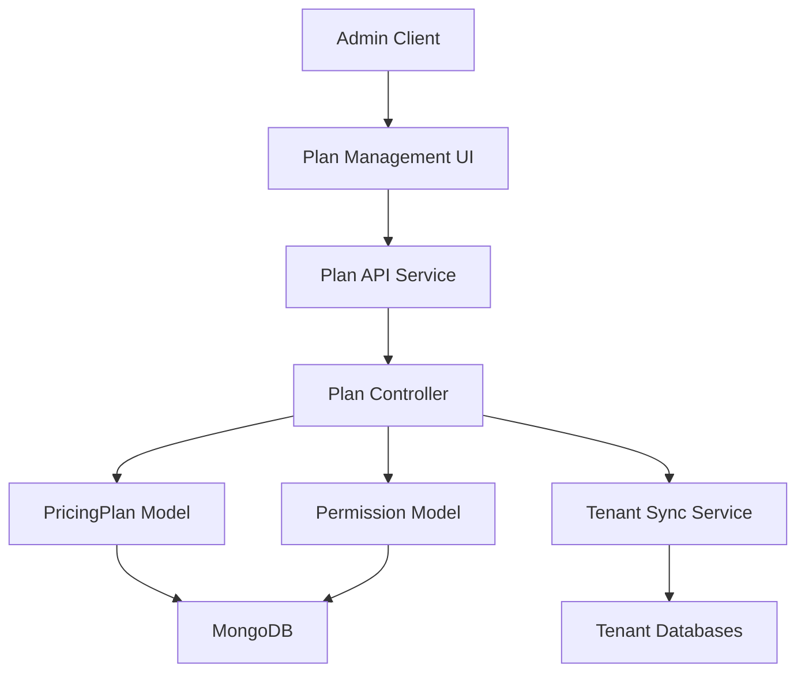
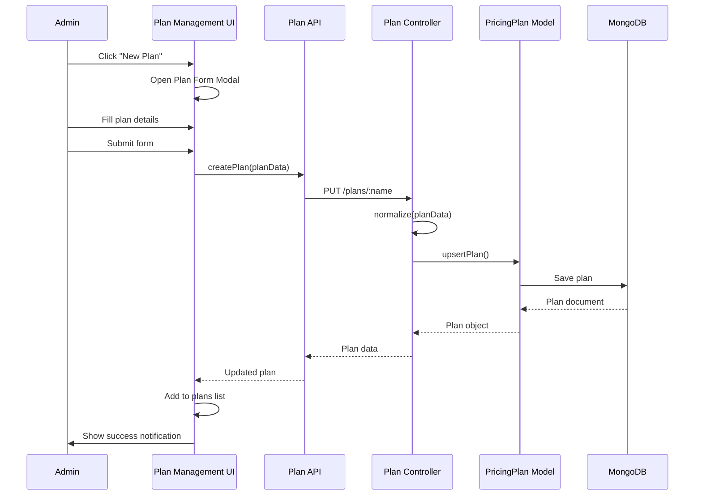
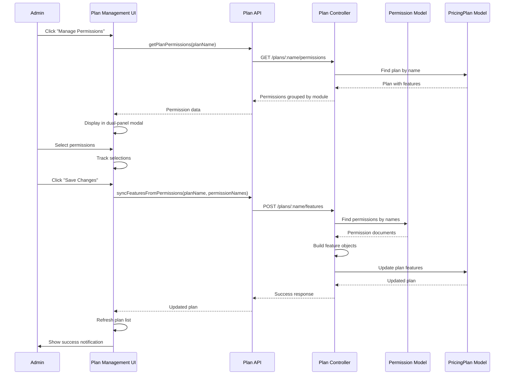
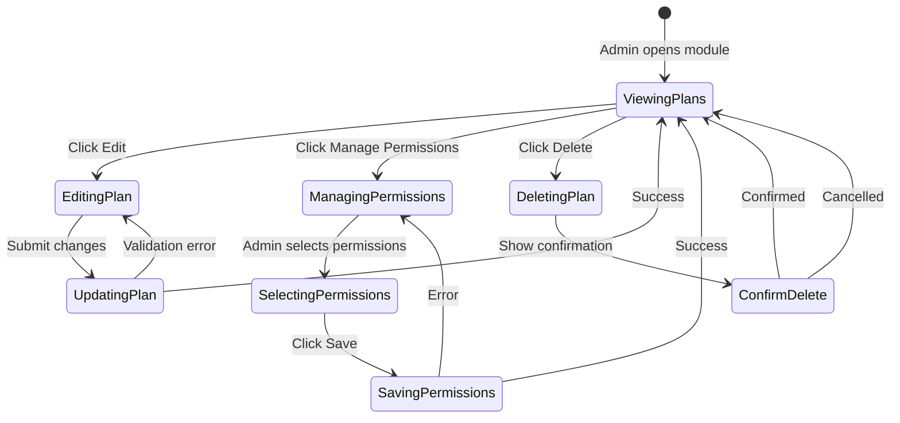

# Plan Management API (Server-Side)

> **Note:** This is the **server-side API documentation** for Plan Management. For the client-side React component, see [MS1 Client - Plan Management Component](../../ms1-client/components/plan-management).

The Plan Management module provides a comprehensive system for creating, managing, and configuring pricing plans with associated permissions. It enables administrators to define subscription tiers, set pricing (monthly and yearly), manage employee limits, and assign granular permissions to each plan.

## Overview

The Plan Management module serves as the foundation for the multi-tenant subscription system. It allows administrators to:
- Create and manage multiple pricing plans (e.g., FREE, BASIC, PREMIUM, ENTERPRISE)
- Configure pricing with monthly and optional yearly rates
- Set employee limits per plan (numeric or unlimited)
- Assign permissions/features to plans from the permission system
- Manage plan visibility and ordering
- Sync plan configurations to tenant databases

## Core Features

- **Plan CRUD Operations** – Create, read, update, and delete pricing plans
- **Permission Management** – Assign granular permissions to plans with module-based organization
- **Flexible Pricing** – Support for monthly and yearly pricing with automatic savings calculation
- **Employee Limits** – Configure numeric limits or unlimited employee capacity per plan
- **Plan Activation** – Enable/disable plans for visibility in the system
- **Sort Ordering** – Control display order of plans
- **UI Features** – Define user-facing feature lists for marketing/presentation
- **Permission Sync** – Automatic synchronization of plan permissions to tenant databases
- **Plan History Tracking** – Track plan changes and assignments in tenant records

## Architecture



### Overall System Flow (Visual Diagram)

```
╔═══════════════════════════════════════════════════════════════════════╗
║              🎯 HOW PLAN MANAGEMENT WORKS 🎯                          ║
║              (Visual Overview for Everyone)                            ║
╚═══════════════════════════════════════════════════════════════════════╝

    ┌─────────────────────────────────────────────────────────────┐
    │                                                             │
    │  STEP 1: 👤 ADMINISTRATOR USES THE SYSTEM                  │
    │                                                             │
    │  ┌───────────────────────────────────────────────────────┐ │
    │  │                                                       │ │
    │  │  👤 Admin User                                        │ │
    │  │  ┌─────────────────────────────────────────────┐   │ │
    │  │  │  🖥️  Browser Screen                          │   │ │
    │  │  │                                               │   │ │
    │  │  │  ┌─────────────────────────────────────┐     │   │ │
    │  │  │  │  📋 Plan Management Page            │     │   │ │
    │  │  │  │                                     │     │   │ │
    │  │  │  │  ┌──────┐  ┌──────┐  ┌──────┐     │     │   │ │
    │  │  │  │  │ FREE │  │BASIC │  │PREMIUM│     │     │   │ │
    │  │  │  │  └──────┘  └──────┘  └──────┘     │     │   │ │
    │  │  │  │                                     │     │   │ │
    │  │  │  │  [➕ New Plan]  [✏️ Edit]  [🗑️ Delete] │     │   │ │
    │  │  │  └─────────────────────────────────────┘     │   │ │
    │  │  └─────────────────────────────────────────────┘   │ │
    │  │                                                       │ │
    │  │  Actions Available:                                  │ │
    │  │  ➕ Create new plans                                 │ │
    │  │  ✏️  Edit existing plans                              │ │
    │  │  🗑️  Delete plans                                   │ │
    │  │  🔐 Assign permissions/features                     │ │
    │  └───────────────────────────────────────────────────────┘ │
    │                                                             │
    └─────────────────────────────────────────────────────────────┘
                              │
                              │ ⬇️ User clicks buttons, fills forms
                              │
    ┌─────────────────────────────────────────────────────────────┐
    │                                                             │
    │  STEP 2: ⚙️ SYSTEM PROCESSES THE REQUEST                    │
    │                                                             │
    │  ┌───────────────────────────────────────────────────────┐ │
    │  │                                                       │ │
    │  │  🖥️  Server Processing                                │ │
    │  │  ┌─────────────────────────────────────────────┐   │ │
    │  │  │                                               │   │ │
    │  │  │  ✅ Validation Check                          │   │ │
    │  │  │  ┌─────────────────────────────────────┐   │   │ │
    │  │  │  │ ✓ Name is valid?                      │   │ │
    │  │  │  │ ✓ Price is valid?                     │   │ │
    │  │  │  │ ✓ All fields filled?                  │   │ │
    │  │  │  └─────────────────────────────────────┘   │   │ │
    │  │  │                                               │   │ │
    │  │  │  🔍 Duplicate Check                          │   │ │
    │  │  │  ┌─────────────────────────────────────┐   │   │ │
    │  │  │  │ 🔎 Searching for existing plan...    │   │ │
    │  │  │  │ ✓ Name not taken ✓                    │   │ │
    │  │  │  └─────────────────────────────────────┘   │   │ │
    │  │  │                                               │   │ │
    │  │  │  💾 Saving to Database                      │   │ │
    │  │  │  ┌─────────────────────────────────────┐   │   │ │
    │  │  │  │ 💾 Saving plan data...                │   │ │
    │  │  │  │ ✓ Plan saved successfully             │   │ │
    │  │  │  └─────────────────────────────────────┘   │   │ │
    │  │  └─────────────────────────────────────────────┘   │ │
    │  │                                                       │ │
    │  │  🔗 Linking Permissions                              │ │
    │  │  📊 Updating Related Information                     │ │
    │  └───────────────────────────────────────────────────────┘ │
    │                                                             │
    └─────────────────────────────────────────────────────────────┘
                              │
                              │ ⬇️ Information is saved
                              │
    ┌─────────────────────────────────────────────────────────────┐
    │                                                             │
    │  STEP 3: 💾 PLAN IS STORED AND AVAILABLE                    │
    │                                                             │
    │  ┌───────────────────────────────────────────────────────┐ │
    │  │                                                       │ │
    │  │  🗄️  Main Database                                    │ │
    │  │  ┌─────────────────────────────────────────────┐   │ │
    │  │  │                                               │   │ │
    │  │  │  📦 Plan Storage                              │   │ │
    │  │  │  ┌─────────────────────────────────────┐   │   │ │
    │  │  │  │ Plan Name: "BASIC"                  │   │ │
    │  │  │  │ 💰 Monthly: ₹999                    │   │ │
    │  │  │  │ 💰 Yearly: ₹9999                   │   │ │
    │  │  │  │ 👥 Employees: 50                    │   │ │
    │  │  │  │ 🔑 Permissions: 25                 │   │ │
    │  │  │  └─────────────────────────────────────┘   │   │ │
    │  │  └─────────────────────────────────────────────┘   │ │
    │  │                                                       │ │
    │  │  🔄 Syncing to Company Databases                     │ │
    │  │  ┌─────────────────────────────────────────────┐   │ │
    │  │  │ 🏢 Company A Database                       │   │ │
    │  │  │ 🏢 Company B Database                       │   │ │
    │  │  │ 🏢 Company C Database                       │   │ │
    │  │  │                                               │   │ │
    │  │  │ When company subscribes:                       │   │ │
    │  │  │ → Plan features added to their database       │   │ │
    │  │  │ → Employees get access to features           │   │ │
    │  │  └─────────────────────────────────────────────┘   │ │
    │  └───────────────────────────────────────────────────────┘ │
    │                                                             │
    └─────────────────────────────────────────────────────────────┘
                              │
                              │ ⬇️ Plan is ready to use
                              │
    ┌─────────────────────────────────────────────────────────────┐
    │                                                             │
    │  STEP 4: 🏢 COMPANIES USE THE PLANS                         │
    │                                                             │
    │  ┌───────────────────────────────────────────────────────┐ │
    │  │                                                       │ │
    │  │  🏢 Company Subscribes                                │ │
    │  │  ┌─────────────────────────────────────────────┐   │ │
    │  │  │                                               │   │ │
    │  │  │  Company: "ABC Corp"                          │   │ │
    │  │  │  Selected Plan: "BASIC"                       │   │ │
    │  │  │  Status: ✅ Active                            │   │ │
    │  │  │                                               │   │ │
    │  │  │  👥 Employees Get Access:                    │   │ │
    │  │  │  • ✅ Can view employees                      │   │ │
    │  │  │  • ✅ Can create tasks                        │   │ │
    │  │  │  • ✅ Can manage attendance                   │   │ │
    │  │  │  • ❌ Cannot delete users (not in plan)      │   │ │
    │  │  └─────────────────────────────────────────────┘   │ │
    │  │                                                       │ │
    │  │  📈 System Tracks:                                   │ │
    │  │  • Which plan each company has                      │ │
    │  │  • When plan expires                                │ │
    │  │  • Usage statistics                                 │ │
    │  │                                                       │ │
    │  │  🔄 Auto-Updates:                                   │ │
    │  │  • Plan changes → Companies updated automatically   │ │
    │  └───────────────────────────────────────────────────────┘ │
    │                                                             │
    └─────────────────────────────────────────────────────────────┘
```

═══════════════════════════════════════════════════════════════════════

📝 WHAT HAPPENS WHEN YOU CREATE A PLAN?

1. You fill out a form with:
   • Plan name (e.g., "BASIC")
   • Monthly price (e.g., ₹999)
   • Yearly price (optional, e.g., ₹9999)
   • Employee limit (e.g., 50 employees or "Unlimited")
   • Description/tagline
   • Features to show customers

2. System checks:
   • Is the name already taken? → Shows error if yes
   • Is the price valid? → Must be a positive number
   • Is all required info provided? → Shows error if missing

3. System saves:
   • Creates the plan in the database
   • Makes it available for companies to subscribe
   • Shows it in the plan list

═══════════════════════════════════════════════════════════════════════

🔐 WHAT HAPPENS WHEN YOU ASSIGN PERMISSIONS?

1. You select a plan and click "Manage Permissions"

2. System shows you:
   • All available permissions (grouped by category)
   • Which permissions are already assigned (in green)
   • Which permissions you can add (in blue)

3. You select permissions:
   • Click to add permissions to the plan
   • Click again to remove permissions
   • Can select all permissions in a category at once

4. You save:
   • System updates the plan with new permissions
   • Companies with this plan automatically get these features
   • Changes apply immediately

═══════════════════════════════════════════════════════════════════════

💡 KEY CONCEPTS (In Simple Terms)

📦 PLAN = A subscription package
   • Like a mobile phone plan (Basic, Premium, etc.)
   • Each plan has different features and pricing

🔑 PERMISSION = A feature or capability
   • Example: "Can view employees", "Can create tasks"
   • Plans have different sets of permissions

🏢 TENANT = A company using the system
   • Each company has their own database
   • They subscribe to a plan
   • They get the features from that plan

🔄 SYNC = Keeping things updated
   • When you change a plan, companies using it get updated
   • Their access automatically changes
```

## Backend Components

### Models

#### `model/pricingPlan.model.js` – PricingPlan Schema

The PricingPlan model stores all plan configuration:

```javascript
{
  name: String (unique, required, uppercase),
  active: Boolean (default: true),
  sortOrder: Number (default: 0, indexed),
  tagline: String (default: ""),
  priceMonthlyINR: Number (required, min: 0),
  priceYearlyINR: Number (optional, min: 0),
  employeeLimit: Mixed (number or "Unlimited", default: 10),
  features: [{
    permissionName: String (required),
    label: String (required),
    description: String (default: ""),
    moduleKey: String (required),
    enabled: Boolean (default: true)
  }],
  featuresUI: [String], // User-facing feature list
  cta: String (default: "Choose"),
  createdAt: Date,
  updatedAt: Date
}
```

**Key Features:**
- Unique constraint on `name` (uppercase)
- Pre-validation hook that hydrates feature details from Permission model
- Automatic label, description, and moduleKey population from permissions
- Support for both numeric and "Unlimited" employee limits
- Optional yearly pricing with automatic savings calculation

**Pre-Validation Hook:**
The schema includes a `pre("validate")` hook that:
1. Extracts permission names from features
2. Fetches corresponding Permission documents
3. Automatically populates label, description, and moduleKey
4. Ensures data consistency between plans and permissions

### Controllers

#### `controller/plan.controller.js`

**Core CRUD Endpoints:**

1. **`listPlans`** – List all plans with optional active filter
   - Supports `?active=true/false` query parameter
   - Returns plans sorted by `sortOrder` and `createdAt`
   - Returns lean documents for performance

2. **`getPlan`** – Get a specific plan by name
   - Case-insensitive name lookup (converted to uppercase)
   - Returns 404 if plan not found

3. **`upsertPlan`** – Create or update a plan by name
   - Creates new plan if name doesn't exist
   - Updates existing plan if name matches
   - Handles name changes by checking for conflicts
   - Normalizes input data (uppercase name, array deduplication)
   - Validates employee limit (numeric or "Unlimited")

4. **`updatePlanById`** – Update plan by MongoDB ObjectId
   - Proper update endpoint using plan ID
   - Only updates fields that are explicitly provided
   - Prevents overwriting with undefined values
   - Checks for duplicate names when name is changed
   - Handles partial updates gracefully

5. **`deletePlan`** – Delete a plan by name
   - Case-insensitive name lookup
   - Returns 404 if plan not found
   - Returns success confirmation

**Permission Management Endpoints:**

6. **`syncFeaturesFromPermissions`** – Sync plan features from permission names
   - Accepts array of permission names
   - Fetches permission details from Permission model
   - Creates feature objects with permission metadata
   - Updates plan with complete feature list
   - Supports upsert (creates plan if doesn't exist)

7. **`getPlanPermissions`** – Get plan permissions with detailed information
   - Returns permissions grouped by module
   - Includes module statistics
   - Returns plan summary (name, pricing, limits)
   - Provides total permission count

8. **`getPlanPermissionsById`** – Get plan permissions by MongoDB ObjectId
   - Same as `getPlanPermissions` but uses plan ID
   - Validates ObjectId format
   - Useful for frontend components using plan IDs

9. **`listPlansWithPermissions`** – List all plans with permission summaries
   - Returns plans with permission counts
   - Includes module count per plan
   - Supports active filter
   - Optimized for dashboard/listing views

**Utility Endpoints:**

10. **`updateExistingPlansWithFeaturesUI`** – Migration utility
    - Updates legacy plans missing `featuresUI` field
    - Sets default featuresUI if missing
    - Useful for data migration

### Routes

#### `routes/plan.routes.js`

**Route Structure:**
```
GET    /api/v1/plans
GET    /api/v1/plans/with-permissions
GET    /api/v1/plans/:name
GET    /api/v1/plans/:name/permissions
GET    /api/v1/plans/id/:id/permissions
PUT    /api/v1/plans/:name
PUT    /api/v1/plans/id/:id
DELETE /api/v1/plans/:name
POST   /api/v1/plans/:name/features
POST   /api/v1/plans/update-features-ui
```

**Route Details:**
- All routes are protected with `adminVerifyToken` middleware
- Name-based routes convert input to uppercase
- ID-based routes validate MongoDB ObjectId format
- Feature sync endpoint requires `permissionNames` array in body

### Data Normalization

The `normalize` function in the controller handles input sanitization:

```javascript
function normalize(body, paramName, preserveFeatures = false) {
  // Converts name to uppercase
  // Deduplicates and trims feature arrays
  // Validates and converts employee limit
  // Handles optional yearly pricing
  // Preserves existing features if preserveFeatures = true
}
```

**Normalization Rules:**
- Plan names are always uppercase
- Features arrays are deduplicated and trimmed
- Employee limits accept numbers or "Unlimited" string
- Yearly pricing is optional and validated
- Empty strings are converted to appropriate defaults

## Workflow

### Plan Creation Flow



#### Plan Creation Flow (Visual Step-by-Step)

```
╔═══════════════════════════════════════════════════════════════════════╗
║         ➕ HOW TO CREATE A NEW PLAN (Visual Step-by-Step) ➕           ║
╚═══════════════════════════════════════════════════════════════════════╝

    ┌─────────────────────────────────────────────────────────────┐
    │                                                             │
    │  📍 STEP 1: YOU CLICK "NEW PLAN" BUTTON                     │
    │                                                             │
    │  ┌───────────────────────────────────────────────────────┐ │
    │  │                                                       │ │
    │  │  🖥️  Your Screen                                      │ │
    │  │  ┌─────────────────────────────────────────────┐   │ │
    │  │  │                                               │   │ │
    │  │  │  📋 Plan Management Page                      │   │ │
    │  │  │                                               │   │ │
    │  │  │  ┌──────┐  ┌──────┐  ┌──────┐               │   │ │
    │  │  │  │ FREE │  │BASIC │  │PREMIUM│               │   │ │
    │  │  │  └──────┘  └──────┘  └──────┘               │   │ │
    │  │  │                                               │   │ │
    │  │  │  ┌─────────────────────────────────────┐     │   │ │
    │  │  │  │  [➕ New Plan]  ← You click here!    │     │   │ │
    │  │  │  └─────────────────────────────────────┘     │   │ │
    │  │  └─────────────────────────────────────────────┘   │ │
    │  │                                                       │ │
    │  │  👆 Action: Click "New Plan" button                │ │
    │  │  ✨ Result: Form window opens                        │ │
    │  └───────────────────────────────────────────────────────┘ │
    │                                                             │
    └─────────────────────────────────────────────────────────────┘
                              │
                              │ ⬇️ Form appears
                              │
    ┌─────────────────────────────────────────────────────────────┐
    │                                                             │
    │  📍 STEP 2: YOU FILL OUT THE FORM                            │
    │                                                             │
    │  ┌───────────────────────────────────────────────────────┐ │
    │  │                                                       │ │
    │  │  📝 Create New Plan Form                              │ │
    │  │  ┌─────────────────────────────────────────────┐   │ │
    │  │  │                                               │   │ │
    │  │  │  ┌─────────────────────────────────────┐     │   │ │
    │  │  │  │ Plan Name *                          │     │   │ │
    │  │  │  │ [BASIC________________]              │     │   │ │
    │  │  │  └─────────────────────────────────────┘     │   │ │
    │  │  │                                               │   │ │
    │  │  │  ┌─────────────────────────────────────┐     │   │ │
    │  │  │  │ Monthly Price (₹) *                  │     │   │ │
    │  │  │  │ [999________________]               │     │   │ │
    │  │  │  └─────────────────────────────────────┘     │   │ │
    │  │  │                                               │   │ │
    │  │  │  ┌─────────────────────────────────────┐     │   │ │
    │  │  │  │ Yearly Price (₹)                    │     │   │ │
    │  │  │  │ [9999_______________]               │     │   │ │
    │  │  │  │ 💡 Save 17% compared to monthly     │     │   │ │
    │  │  │  └─────────────────────────────────────┘     │   │ │
    │  │  │                                               │   │ │
    │  │  │  ┌─────────────────────────────────────┐     │   │ │
    │  │  │  │ Employee Limit                      │     │   │ │
    │  │  │  │ [50_____] [Unlimited]               │     │   │ │
    │  │  │  └─────────────────────────────────────┘     │   │ │
    │  │  │                                               │   │ │
    │  │  │  ┌─────────────────────────────────────┐     │   │ │
    │  │  │  │ Description                          │     │   │ │
    │  │  │  │ [Perfect for small teams________]    │     │   │ │
    │  │  │  └─────────────────────────────────────┘     │   │ │
    │  │  │                                               │   │ │
    │  │  │  ┌─────────────────────────────────────┐     │   │ │
    │  │  │  │ ☑ Active Plan                        │     │   │ │
    │  │  │  └─────────────────────────────────────┘     │   │ │
    │  │  │                                               │   │ │
    │  │  │  [💾 Create Plan]  [❌ Cancel]                │   │ │
    │  │  └─────────────────────────────────────────────┘   │ │
    │  │                                                       │ │
    │  │  💡 Tips shown:                                      │ │
    │  │  • "Save 17%" if yearly price is set               │ │
    │  │  • Error messages if fields are invalid           │ │
    │  └───────────────────────────────────────────────────────┘ │
    │                                                             │
    └─────────────────────────────────────────────────────────────┘
                              │
                              │ ⬇️ You click "Create Plan"
                              │
    ┌─────────────────────────────────────────────────────────────┐
    │                                                             │
    │  📍 STEP 3: SYSTEM CHECKS AND SAVES                         │
    │                                                             │
    │  ┌───────────────────────────────────────────────────────┐ │
    │  │                                                       │ │
    │  │  ⚙️  System Processing                                │ │
    │  │  ┌─────────────────────────────────────────────┐   │ │
    │  │  │                                               │   │ │
    │  │  │  ✅ Validation Checks                         │   │ │
    │  │  │  ┌─────────────────────────────────────┐   │   │ │
    │  │  │  │ ✓ Name: "BASIC" - Valid              │   │ │
    │  │  │  │ ✓ Price: ₹999 - Valid                │   │ │
    │  │  │  │ ✓ All fields filled - Valid          │   │ │
    │  │  │  └─────────────────────────────────────┘   │   │ │
    │  │  │                                               │   │ │
    │  │  │  🔍 Duplicate Check                          │   │ │
    │  │  │  ┌─────────────────────────────────────┐   │   │ │
    │  │  │  │ 🔎 Checking if "BASIC" exists...    │   │ │
    │  │  │  │ ✓ Name available!                    │   │ │
    │  │  │  └─────────────────────────────────────┘   │   │ │
    │  │  │                                               │   │ │
    │  │  │  💾 Saving...                                 │   │ │
    │  │  │  ┌─────────────────────────────────────┐   │   │ │
    │  │  │  │ 💾 Saving to database...             │   │ │
    │  │  │  │ ✓ Plan saved successfully!           │   │ │
    │  │  │  └─────────────────────────────────────┘   │   │ │
    │  │  └─────────────────────────────────────────────┘   │ │
    │  │                                                       │ │
    │  │  ✅ Success Message:                                │ │
    │  │  ┌─────────────────────────────────────┐         │ │
    │  │  │ ✓ Plan "BASIC" created successfully! │         │ │
    │  │  └─────────────────────────────────────┘         │ │
    │  └───────────────────────────────────────────────────────┘ │
    │                                                             │
    └─────────────────────────────────────────────────────────────┘
                              │
                              │ ⬇️ Plan is saved
                              │
    ┌─────────────────────────────────────────────────────────────┐
    │                                                             │
    │  📍 STEP 4: PLAN IS NOW AVAILABLE                            │
    │                                                             │
    │  ┌───────────────────────────────────────────────────────┐ │
    │  │                                                       │ │
    │  │  📋 Updated Plan List                                  │ │
    │  │  ┌─────────────────────────────────────────────┐   │ │
    │  │  │                                               │   │ │
    │  │  │  ┌──────┐  ┌──────┐  ┌──────┐  ┌──────┐   │   │ │
    │  │  │  │ FREE │  │BASIC │  │PREMIUM│  │ENTERPRISE│ │   │ │
    │  │  │  │      │  │ ⭐NEW │  │      │  │        │   │   │ │
    │  │  │  └──────┘  └──────┘  └──────┘  └──────┘   │   │ │
    │  │  │                                               │   │ │
    │  │  │  Your new "BASIC" plan is now visible!       │   │ │
    │  │  └─────────────────────────────────────────────┘   │ │
    │  │                                                       │ │
    │  │  📋 Next Steps Available:                           │ │
    │  │  ┌─────────────────────────────────────┐         │ │
    │  │  │ 🔐 [Manage Permissions]              │         │ │
    │  │  │ ✏️  [Edit Plan]                      │         │ │
    │  │  │ 👁️  [View Details]                   │         │ │
    │  │  └─────────────────────────────────────┘         │ │
    │  └───────────────────────────────────────────────────────┘ │
    │                                                             │
    └─────────────────────────────────────────────────────────────┘

═══════════════════════════════════════════════════════════════════════

💡 REAL-WORLD EXAMPLE WITH VISUALS:

Creating a "BASIC" plan:

┌─────────────────────────────────────────────────────────────┐
│ Step 1: Click Button                                        │
│                                                             │
│  [➕ New Plan] ← Click here                                 │
└─────────────────────────────────────────────────────────────┘
                    ⬇️
┌─────────────────────────────────────────────────────────────┐
│ Step 2: Fill Form                                           │
│                                                             │
│  Plan Name: [BASIC________]                                │
│  Monthly:   [999________]                                 │
│  Yearly:    [9999_______] 💡 Save 17%                     │
│  Employees: [50________]                                  │
│  Desc:      [Perfect for small teams]                      │
│                                                             │
│  [💾 Create Plan]                                          │
└─────────────────────────────────────────────────────────────┘
                    ⬇️
┌─────────────────────────────────────────────────────────────┐
│ Step 3: Success!                                            │
│                                                             │
│  ✅ Plan "BASIC" created successfully!                       │
│                                                             │
│  Your plan list now shows:                                 │
│  ┌──────┐  ┌──────┐  ┌──────┐                            │
│  │ FREE │  │BASIC │  │PREMIUM│                            │
│  └──────┘  └──────┘  └──────┘                            │
└─────────────────────────────────────────────────────────────┘
```

### Permission Assignment Flow



#### Permission Assignment Flow (Visual Step-by-Step)

```
╔═══════════════════════════════════════════════════════════════════════╗
║      🔐 HOW TO ASSIGN PERMISSIONS TO A PLAN (Visual Guide) 🔐          ║
╚═══════════════════════════════════════════════════════════════════════╝

    ┌─────────────────────────────────────────────────────────────┐
    │                                                             │
    │  📍 STEP 1: YOU OPEN THE PERMISSION MANAGER                  │
    │                                                             │
    │  ┌───────────────────────────────────────────────────────┐ │
    │  │                                                       │ │
    │  │  🖥️  Plan Management Page                             │ │
    │  │  ┌─────────────────────────────────────────────┐   │ │
    │  │  │                                               │   │ │
    │  │  │  ┌─────────────────────────────────────┐     │   │ │
    │  │  │  │  📦 BASIC Plan Card                 │     │   │ │
    │  │  │  │                                     │     │   │ │
    │  │  │  │  💰 ₹999/month                     │     │   │ │
    │  │  │  │  👥 50 employees                   │     │   │ │
    │  │  │  │  🔑 25 permissions                 │     │   │ │
    │  │  │  │                                     │     │   │ │
    │  │  │  │  [🔐 Manage Permissions] ← Click!   │     │   │ │
    │  │  │  └─────────────────────────────────────┘     │   │ │
    │  │  └─────────────────────────────────────────────┘   │ │
    │  │                                                       │ │
    │  │  👆 Action: Click "Manage Permissions"              │ │
    │  │  ✨ Result: Permission window opens                  │ │
    │  └───────────────────────────────────────────────────────┘ │
    │                                                             │
    └─────────────────────────────────────────────────────────────┘
                              │
                              │ ⬇️ Window opens
                              │
    ┌─────────────────────────────────────────────────────────────┐
    │                                                             │
    │  📍 STEP 2: YOU SEE THE PERMISSION SCREEN                    │
    │                                                             │
    │  ┌───────────────────────────────────────────────────────┐ │
    │  │                                                       │ │
    │  │  🔐 Assign Permissions to BASIC Plan                  │ │
    │  │  ┌─────────────────────────────────────────────┐   │ │
    │  │  │                                               │   │ │
    │  │  │  ┌──────────────────┐  ┌──────────────────┐ │   │ │
    │  │  │  │  📋 AVAILABLE     │  │  ✅ ASSIGNED     │ │   │ │
    │  │  │  │  (Left Side)      │  │  (Right Side)    │ │   │ │
    │  │  │  ├──────────────────┤  ├──────────────────┤ │   │ │
    │  │  │  │                  │  │                  │ │   │ │
    │  │  │  │  🔍 [Search...]   │  │  🟢 Already      │ │   │ │
    │  │  │  │                  │  │     Assigned:    │ │   │ │
    │  │  │  │  ┌──────────────┐│  │  ┌──────────────┐│ │   │ │
    │  │  │  │  │👤 User Mgmt  ││  │  │👤 User Mgmt  ││ │   │ │
    │  │  │  │  │  ▼ View Users││  │  │  ✓ View Users││ │   │ │
    │  │  │  │  │  + Create    ││  │  │  ✓ Create    ││ │   │ │
    │  │  │  │  │  + Edit      ││  │  │              ││ │   │ │
    │  │  │  │  └──────────────┘│  │  └──────────────┘│ │   │ │
    │  │  │  │                  │  │                  │ │   │ │
    │  │  │  │  ┌──────────────┐│  │  ┌──────────────┐│ │   │ │
    │  │  │  │  │📋 Task Mgmt  ││  │  │📋 Task Mgmt  ││ │   │ │
    │  │  │  │  │  + View Tasks││  │  │  ✓ View Tasks││ │   │ │
    │  │  │  │  │  + Create    ││  │  │              ││ │   │ │
    │  │  │  │  │  + Delete    ││  │  │              ││ │   │ │
    │  │  │  │  └──────────────┘│  │  └──────────────┘│ │   │ │
    │  │  │  │                  │  │                  │ │   │ │
    │  │  │  │  ⚪ White = Can add│  │  🔵 Blue = New   │ │   │ │
    │  │  │  │                  │  │     selection    │ │   │ │
    │  │  │  └──────────────────┘  └──────────────────┘ │   │ │
    │  │  │                                               │   │ │
    │  │  │  📊 Summary:                                  │   │ │
    │  │  │  • Total Modules: 15                         │   │ │
    │  │  │  • 🟢 Already Assigned: 25                   │   │ │
    │  │  │  • 🔵 Newly Selected: 0                      │   │ │
    │  │  └─────────────────────────────────────────────┘   │ │
    │  └───────────────────────────────────────────────────────┘ │
    │                                                             │
    └─────────────────────────────────────────────────────────────┘
                              │
                              │ ⬇️ You select permissions
                              │
    ┌─────────────────────────────────────────────────────────────┐
    │                                                             │
    │  📍 STEP 3: YOU SELECT PERMISSIONS                          │
    │                                                             │
    │  ┌───────────────────────────────────────────────────────┐ │
    │  │                                                       │ │
    │  │  👆 How to Select:                                    │ │
    │  │  ┌─────────────────────────────────────────────┐   │ │
    │  │  │                                               │   │ │
    │  │  │  1️⃣  Click on permission → Moves to right    │   │ │
    │  │  │      Example: Click "Create Tasks"          │   │ │
    │  │  │                                               │   │ │
    │  │  │  2️⃣  Click again → Moves back to left       │   │ │
    │  │  │                                               │   │ │
    │  │  │  3️⃣  Click "Select All" → Adds all in        │   │ │
    │  │  │      category at once                        │   │ │
    │  │  │                                               │   │ │
    │  │  │  🎨 Color Meanings:                           │   │ │
    │  │  │  ┌─────────────────────────────────────┐   │   │ │
    │  │  │  │ 🟢 Green = Already in plan          │   │ │
    │  │  │  │ 🔵 Blue = Just selected (new)        │   │ │
    │  │  │  │ ⚪ White = Available to add          │   │ │
    │  │  │  └─────────────────────────────────────┘   │   │ │
    │  │  │                                               │   │ │
    │  │  │  📊 Updated Summary:                         │   │ │
    │  │  │  • 🟢 Already Assigned: 25                   │   │ │
    │  │  │  • 🔵 Newly Selected: 2 ← Updated!          │   │ │
    │  │  └─────────────────────────────────────────────┘   │ │
    │  └───────────────────────────────────────────────────────┘ │
    │                                                             │
    └─────────────────────────────────────────────────────────────┘
                              │
                              │ ⬇️ You click "Save Changes"
                              │
    ┌─────────────────────────────────────────────────────────────┐
    │                                                             │
    │  📍 STEP 4: YOU SAVE YOUR CHANGES                            │
    │                                                             │
    │  ┌───────────────────────────────────────────────────────┐ │
    │  │                                                       │ │
    │  │  ⚠️  Confirmation Dialog                              │ │
    │  │  ┌─────────────────────────────────────────────┐   │ │
    │  │  │                                               │   │ │
    │  │  │  ⚠️  Save Permission Changes?                 │   │ │
    │  │  │                                               │   │ │
    │  │  │  Are you sure you want to update             │   │ │
    │  │  │  permissions for "BASIC"?                    │   │ │
    │  │  │                                               │   │ │
    │  │  │  Changes:                                     │   │ │
    │  │  │  ➕ Adding 2 new permissions                 │   │ │
    │  │  │  ➖ Removing 0 permissions                   │   │ │
    │  │  │                                               │   │ │
    │  │  │  This will update the plan immediately.       │   │ │
    │  │  │                                               │   │ │
    │  │  │  [❌ Cancel]  [✅ Confirm]                     │   │ │
    │  │  └─────────────────────────────────────────────┘   │ │
    │  │                                                       │ │
    │  │  👆 You click "Confirm"                              │ │
    │  │                                                       │ │
    │  │  ⚙️  System Processing:                              │ │
    │  │  ┌─────────────────────────────────────┐         │ │
    │  │  │ 💾 Saving permissions...            │         │ │
    │  │  │ ✓ Plan updated successfully!        │         │ │
    │  │  └─────────────────────────────────────┘         │ │
    │  │                                                       │ │
    │  │  ✅ Success Message:                                │ │
    │  │  ┌─────────────────────────────────────┐         │ │
    │  │  │ ✓ Permissions updated successfully! │         │ │
    │  │  └─────────────────────────────────────┘         │ │
    │  └───────────────────────────────────────────────────────┘ │
    │                                                             │
    └─────────────────────────────────────────────────────────────┘
                              │
                              │ ⬇️ Changes saved
                              │
    ┌─────────────────────────────────────────────────────────────┐
    │                                                             │
    │  📍 STEP 5: PERMISSIONS ARE NOW ACTIVE                       │
    │                                                             │
    │  ┌───────────────────────────────────────────────────────┐ │
    │  │                                                       │ │
    │  │  ✅ Updated Plan Card                                  │ │
    │  │  ┌─────────────────────────────────────────────┐   │ │
    │  │  │                                               │   │ │
    │  │  │  📦 BASIC Plan                                │   │ │
    │  │  │  💰 ₹999/month                               │   │ │
    │  │  │  👥 50 employees                             │   │ │
    │  │  │  🔑 27 permissions ← Updated!                │   │ │
    │  │  │                                               │   │ │
    │  │  │  ✅ Plan now includes:                        │   │ │
    │  │  │  • Create Tasks                              │   │ │
    │  │  │  • Delete Tasks                              │   │ │
    │  │  │  • (and 25 other permissions)                │   │ │
    │  │  └─────────────────────────────────────────────┘   │ │
    │  │                                                       │ │
    │  │  🏢 Companies with BASIC plan now have:            │ │
    │  │  • Access to create tasks                          │ │
    │  │  • Access to delete tasks                          │ │
    │  │  • All other BASIC plan features                   │ │
    │  └───────────────────────────────────────────────────────┘ │
    │                                                             │
    └─────────────────────────────────────────────────────────────┘

═══════════════════════════════════════════════════════════════════════

💡 REAL-WORLD EXAMPLE WITH VISUALS:

Adding "Create Tasks" and "Delete Tasks" to BASIC plan:

┌─────────────────────────────────────────────────────────────┐
│ Step 1: Click Button                                        │
│                                                             │
│  ┌──────────────┐                                           │
│  │ 📦 BASIC     │                                           │
│  │ [🔐 Manage]  │ ← Click here                              │
│  └──────────────┘                                           │
└─────────────────────────────────────────────────────────────┘
                    ⬇️
┌─────────────────────────────────────────────────────────────┐
│ Step 2: Select Permissions                                  │
│                                                             │
│  ┌──────────────┐  ┌──────────────┐                       │
│  │ AVAILABLE    │  │ ASSIGNED      │                       │
│  │              │  │              │                       │
│  │ 📋 Task Mgmt │  │ 📋 Task Mgmt │                       │
│  │  + Create    │→ │  ✓ Create    │ ← Clicked!            │
│  │  + Delete    │→ │  ✓ Delete    │ ← Clicked!            │
│  └──────────────┘  └──────────────┘                       │
│                                                             │
│  Summary: 🔵 Newly Selected: 2                             │
└─────────────────────────────────────────────────────────────┘
                    ⬇️
┌─────────────────────────────────────────────────────────────┐
│ Step 3: Save & Success!                                      │
│                                                             │
│  [💾 Save Permission Changes]                              │
│                    ⬇️                                       │
│  ⚠️  Confirm: Adding 2 new permissions                     │
│                    ⬇️                                       │
│  ✅ Success! Permissions updated!                            │
│                                                             │
│  BASIC plan now has 27 permissions!                         │
└─────────────────────────────────────────────────────────────┘
```

### Plan Update Flow



## API Reference

**Base URL:** `/api/v1/plans`

**Authentication:** All endpoints require `Authorization: Bearer <admin_token>` header

### List All Plans

```http
GET /api/v1/plans?active=true
Authorization: Bearer <admin_token>
```

**Response:**
```json
[
  {
    "_id": "507f1f77bcf86cd799439011",
    "name": "BASIC",
    "active": true,
    "sortOrder": 1,
    "tagline": "Perfect for small teams",
    "priceMonthlyINR": 999,
    "priceYearlyINR": 9999,
    "employeeLimit": 50,
    "features": [...],
    "featuresUI": ["Basic usage", "Community support"],
    "cta": "Choose",
    "createdAt": "2024-01-01T00:00:00.000Z",
    "updatedAt": "2024-01-01T00:00:00.000Z"
  }
]
```

### Get Plan by Name

```http
GET /api/v1/plans/BASIC
Authorization: Bearer <admin_token>
```

**Response:**
```json
{
  "_id": "507f1f77bcf86cd799439011",
  "name": "BASIC",
  "active": true,
  "sortOrder": 1,
  "tagline": "Perfect for small teams",
  "priceMonthlyINR": 999,
  "priceYearlyINR": 9999,
  "employeeLimit": 50,
  "features": [
    {
      "permissionName": "user.read",
      "label": "View Users",
      "description": "Read user information",
      "moduleKey": "user_management",
      "enabled": true
    }
  ],
  "featuresUI": ["Basic usage", "Community support"],
  "cta": "Choose"
}
```

### Create/Update Plan

```http
PUT /api/v1/plans/BASIC
Authorization: Bearer <admin_token>
Content-Type: application/json

{
  "name": "BASIC",
  "tagline": "Perfect for small teams",
  "priceMonthlyINR": 999,
  "priceYearlyINR": 9999,
  "employeeLimit": 50,
  "featuresUI": ["Basic usage", "Community support", "Limited history"],
  "cta": "Get Started",
  "active": true,
  "sortOrder": 1
}
```

**Response:**
```json
{
  "_id": "507f1f77bcf86cd799439011",
  "name": "BASIC",
  "active": true,
  "sortOrder": 1,
  "tagline": "Perfect for small teams",
  "priceMonthlyINR": 999,
  "priceYearlyINR": 9999,
  "employeeLimit": 50,
  "features": [],
  "featuresUI": ["Basic usage", "Community support", "Limited history"],
  "cta": "Get Started"
}
```

### Update Plan by ID

```http
PUT /api/v1/plans/id/507f1f77bcf86cd799439011
Authorization: Bearer <admin_token>
Content-Type: application/json

{
  "priceMonthlyINR": 1299,
  "tagline": "Updated tagline"
}
```

**Response:**
```json
{
  "_id": "507f1f77bcf86cd799439011",
  "name": "BASIC",
  "priceMonthlyINR": 1299,
  "tagline": "Updated tagline",
  ...
}
```

### Sync Features from Permissions

```http
POST /api/v1/plans/BASIC/features
Authorization: Bearer <admin_token>
Content-Type: application/json

{
  "permissionNames": [
    "user.read",
    "user.create",
    "user.update",
    "task.read",
    "task.create"
  ]
}
```

**Response:**
```json
{
  "ok": true,
  "plan": {
    "_id": "507f1f77bcf86cd799439011",
    "name": "BASIC",
    "features": [
      {
        "permissionName": "user.read",
        "label": "View Users",
        "description": "Read user information",
        "moduleKey": "user_management",
        "enabled": true
      },
      ...
    ]
  }
}
```

### Get Plan Permissions

```http
GET /api/v1/plans/BASIC/permissions
Authorization: Bearer <admin_token>
```

**Response:**
```json
{
  "planName": "BASIC",
  "permissions": [
    {
      "permissionName": "user.read",
      "label": "View Users",
      "description": "Read user information",
      "moduleKey": "user_management",
      "enabled": true
    }
  ],
  "totalPermissions": 5,
  "modules": [
    {
      "moduleKey": "user_management",
      "moduleName": "User Management",
      "permissions": [...]
    }
  ],
  "plan": {
    "name": "BASIC",
    "active": true,
    "tagline": "Perfect for small teams",
    "priceMonthlyINR": 999,
    "priceYearlyINR": 9999,
    "employeeLimit": 50,
    "badge": null,
    "cta": "Choose"
  }
}
```

### Delete Plan

```http
DELETE /api/v1/plans/BASIC
Authorization: Bearer <admin_token>
```

**Path Parameters:**
- `name` (required): Plan name (case-insensitive, will be converted to uppercase)

**Response:**
```json
{
  "ok": true
}
```

**Error Responses:**
- `404 Not Found`: Plan does not exist
- `400 Bad Request`: Plan is assigned to tenants (cannot delete)

### List Plans with Permissions

```http
GET /api/v1/plans/with-permissions
Authorization: Bearer <admin_token>
```

**Response:**
```json
[
  {
    "_id": "507f1f77bcf86cd799439011",
    "name": "BASIC",
    "active": true,
    "priceMonthlyINR": 999,
    "permissionsCount": 5,
    "permissions": [
      {
        "permissionName": "user.read",
        "label": "View Users",
        "moduleKey": "user_management"
      }
    ]
  }
]
```

### Get Plan Permissions by ID

```http
GET /api/v1/plans/id/:id/permissions
Authorization: Bearer <admin_token>
```

**Path Parameters:**
- `id` (required): MongoDB ObjectId of the plan

**Response:** Same format as Get Plan Permissions

### Update Existing Plans with Features UI

```http
POST /api/v1/plans/update-features-ui
Authorization: Bearer <admin_token>
```

**Response:**
```json
{
  "success": true,
  "message": "Updated X plans with featuresUI field"
}
```

### Error Responses

All endpoints may return these error responses:

**400 Bad Request:**
```json
{
  "error": "VALIDATION_ERROR",
  "message": "Plan name is required"
}
```

**404 Not Found:**
```json
{
  "error": "PLAN_NOT_FOUND",
  "message": "Plan \"BASIC\" not found"
}
```

**409 Conflict:**
```json
{
  "error": "DUPLICATE_PLAN",
  "message": "Plan \"BASIC\" already exists"
}
```

**401 Unauthorized:**
```json
{
  "error": "UNAUTHORIZED",
  "message": "Authentication required"
}
```

**500 Internal Server Error:**
```json
{
  "error": "SERVER_ERROR",
  "message": "Internal server error"
}
```

## Integration Points

### Permission Model Integration

The Plan Management module integrates closely with the Permission model:

- **Feature Hydration** – Plan features are automatically hydrated from Permission documents
- **Validation** – Permission names in features must exist in Permission collection
- **Metadata Sync** – Labels, descriptions, and module keys are synced from permissions
- **Module Organization** – Permissions are organized by moduleKey from Permission model

### Tenant Sync Integration

Plans are synchronized to tenant databases:

- **Automatic Sync** – When a plan is assigned to a tenant, features are synced to tenant database
- **Plan Details** – Plan snapshot (pricing, limits) is stored in tenant record
- **Employee Limits** – Base limits and add-ons are calculated and applied
- **Feature Assignment** – Plan features become tenant features in their database

**Sync Process:**
1. Plan is assigned to tenant
2. `applyPlanToTenant()` is called
3. Plan features are normalized and synced
4. Employee limits are calculated (base + add-ons)
5. Plan snapshot is stored in `planDetails`
6. `lastSyncAt` is updated

### Database Utils Integration

The module uses `database.utils.js` for tenant operations:

- **Plan Snapshot** – `buildPlanSnapshot()` creates immutable plan snapshot
- **Feature Normalization** – `normalizePlanFeatures()` converts plan features to tenant format
- **Employee Limit Resolution** – `resolveEmployeeLimit()` calculates effective limits

## Error Handling

The module uses comprehensive error handling:

**Error Types:**
- **ValidationError** (400) – Invalid input data (e.g., negative pricing, invalid employee limit)
- **CastError** (400) – Invalid ID format
- **DuplicateError** (409) – Plan name already exists
- **NotFoundError** (404) – Plan not found
- **ServerError** (500) – Internal server error

**Error Response Format:**
```json
{
  "error": "DUPLICATE_PLAN",
  "message": "Plan \"BASIC\" already exists"
}
```

**Common Error Scenarios:**
1. **Duplicate Plan Name** – Attempting to create plan with existing name
2. **Invalid Employee Limit** – Non-numeric value (except "Unlimited")
3. **Invalid Permission Names** – Permissions that don't exist in Permission model
4. **Missing Required Fields** – Name or priceMonthlyINR not provided
5. **Invalid Plan ID** – ObjectId format validation failure

## Best Practices

1. **Plan Naming:**
   - Use uppercase names (automatically converted)
   - Use descriptive, consistent naming (e.g., FREE, BASIC, PREMIUM, ENTERPRISE)
   - Avoid special characters

2. **Permission Management:**
   - Always use `syncFeaturesFromPermissions()` for bulk permission assignment
   - Use `getPlanPermissions()` to view current assignments before making changes
   - Track changes using `initialExistingPermissions` for proper diff calculation

3. **Pricing:**
   - Set yearly pricing to encourage annual subscriptions
   - Calculate savings percentage for marketing
   - Keep pricing consistent across similar plans

4. **Employee Limits:**
   - Use "Unlimited" for enterprise plans
   - Set realistic limits based on plan tier
   - Consider add-ons for flexibility

5. **Features UI:**
   - Keep feature lists concise (3-5 items)
   - Use user-friendly language (not technical terms)
   - Highlight key differentiators

6. **Plan Updates:**
   - Use `updatePlanById()` for partial updates
   - Only send changed fields to avoid overwriting
   - Test permission changes before applying to production

7. **Error Handling:**
   - Always check for duplicate names before creating
   - Validate employee limits before saving
   - Handle permission sync errors gracefully

## Security Considerations

1. **Admin Authentication** – All endpoints require `adminVerifyToken` middleware
2. **Input Validation** – All inputs are validated and sanitized
3. **Name Uniqueness** – Enforced at database level with unique index
4. **Permission Validation** – Features are validated against Permission model
5. **Data Normalization** – All inputs are normalized before storage

## Performance Considerations

1. **Lean Queries** – List operations use `.lean()` for better performance
2. **Selective Fields** – Permission queries select only needed fields
3. **Indexed Fields** – `sortOrder` and `name` are indexed
4. **Batch Operations** – Permission sync uses batch queries
5. **Caching** – Consider caching plan lists for frequently accessed data

## Testing

### Test Plan Creation

```javascript
// Create a new plan
const planData = {
  name: "TEST",
  tagline: "Test plan",
  priceMonthlyINR: 100,
  employeeLimit: 10,
  active: true
};

const plan = await planApi.upsertPlan("TEST", planData);
```

### Test Permission Assignment

```javascript
// Assign permissions to plan
const permissionNames = ["user.read", "user.create", "task.read"];
const result = await planApi.syncFeaturesFromPermissions("TEST", permissionNames);
```

### Test Plan Update

```javascript
// Update plan pricing
const updates = {
  priceMonthlyINR: 150,
  priceYearlyINR: 1500
};

const updated = await planApi.updatePlanById(planId, updates);
```

## Future Enhancements

Potential improvements:
- Plan versioning for historical tracking
- Plan templates for quick creation
- Bulk plan operations (create/update multiple)
- Plan comparison view
- Usage analytics per plan
- Automated plan recommendations
- Plan migration tools
- Plan expiration and renewal workflows
- Integration with billing systems
- Plan-specific feature flags
- A/B testing for plan configurations

This module provides a complete, production-ready solution for managing pricing plans with granular permission control, flexible pricing options, and seamless integration with the multi-tenant architecture.

