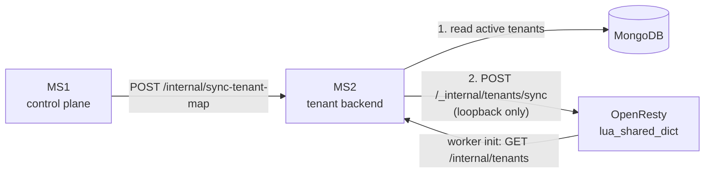

# Edge Routing

Before a request reaches Node, nginx decides whether its subdomain belongs to a
tenant at all. This keeps unknown-subdomain traffic off the application entirely.

## The original design, and why it changed

The first implementation kept the tenant list in a flat file: the backend wrote
`tenants.map` and then ran `nginx -s reload` after every tenant create, update or
deactivation. That worked, but it cost more than it was worth:

- `nginx -s reload` in production needs root. Without password-less sudo, it prompts.
- Creating a tenant depended on MS1 reaching MS2, *and* on the reload succeeding.
- Every tenant CRUD triggered a full nginx reload.
- After an nginx crash the map stayed stale until the next write.

## The current design

The tenant list lives in an in-memory `lua_shared_dict` inside OpenResty. Lookups
are sub-microsecond and mutations are atomic, with no reload.

Two independent paths keep the dict fresh, and either alone is sufficient:

- **Push** — on every tenant CRUD, MS2 diffs the desired set against nginx and
  POSTs the delta to a loopback-only endpoint.
- **Pull** — on nginx worker init, nginx fetches `GET /internal/tenants` from MS2
  over a raw TCP socket, retrying with exponential backoff capped at 30 seconds.

Together they cover every restart ordering.

## Failure behaviour

| Failure | What happens |
| --- | --- |
| MS2 push fails | MS2 leaves its `_lastSubdomains` cache untouched, so the next attempt is still treated as changed and retries the full diff. |
| Nginx bootstrap fails | Retries every 30 s indefinitely; MS2's next push hydrates it in the meantime. |
| Nginx crash or restart | Worker-init pull rebuilds the dict from scratch. |
| MS2 crash or restart | Boot push retries eight times with exponential backoff. |

## Deliberate non-goals

- **No distributed state across nginx instances.** Each instance keeps its own
  dict. They converge because MS2 pushes to all of them (add each URL to
  `NGINX_SYNC_URL`) and each bootstraps from MS2 independently.
- **No persistence across nginx restart.** Bootstrap is idempotent and fast, so
  persisting the dict would add failure modes for no gain.

## Reserved subdomains

`admin`, `apiv2`, `ms1` and `www` never resolve to a tenant. A request arriving
on one of them is treated as having no tenant identity — which, for a web
request, means `TENANT_HEADER_REQUIRED` unless the header supplies one.

## Operational notes

- A tenant that exists in Mongo but not in the dict is turned away at the edge,
  so the user sees a connection failure rather than an application error. If a
  newly created tenant is unreachable, check the sync before checking the app.
- Because the gate is in front of Node, edge rejections do not appear in
  application logs. Look at the nginx access log.
- The loopback-only sync endpoint must stay loopback-only. Exposing it would let
  anyone add or remove tenants from the gate.
