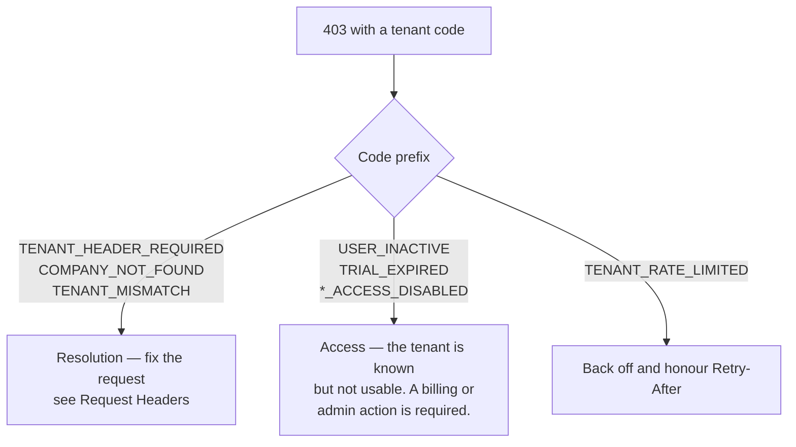

# Tenant Errors

All tenant rejections share one response shape:

```json
{
  "success": false,
  "code": "TENANT_MISMATCH",
  "message": "This device is configured for a different company. Sign in again to reconnect your workspace."
}
```

Branch on `code`, never on `message` — the message is user-facing copy and may
change.

## Resolution failures

Returned by `resolveTenantContext`, before any controller runs.

| Code | Status | Cause | Client action |
| --- | --- | --- | --- |
| `TENANT_HEADER_REQUIRED` | 403 | Web request with no `X-Tenant-Subdomain` and no resolvable host | Add the header. This is a client bug, not a user problem. |
| `COMPANY_NOT_FOUND` | 403 | The subdomain does not match any `Tenant` | Wrong workspace URL, or the tenant was deleted. Send the user back to workspace selection. |
| `TENANT_SUBDOMAIN_MISMATCH` | 403 | The claimed subdomain disagrees with the browser's `Origin`/`Referer` | A misconfigured frontend build. Check the tenant subdomain baked into the bundle. |
| `TENANT_MISMATCH` | 403 | The `companyid` header disagrees with the tenant the subdomain resolves to | The device drifted. Clear stored credentials and re-onboard the workspace. |
| `TENANT_UNRESOLVED` | 403 | Tenant context expected but never established | Usually a mobile request missing both the header and a valid session. |

## Access failures

Returned by `tenantGuard`, after the tenant is known but before the request is served.

| Code | Status | Cause | Client action |
| --- | --- | --- | --- |
| `USER_INACTIVE` | 403 | `tenant.status !== "active"` | The company is suspended. Show a contact-support screen; retrying will not help. |
| `TRIAL_EXPIRED` | 403 | Past `planExpiry`, or past `trialEndDate` on a `FREE` plan | Route to billing / renewal. |
| `WEB_ACCESS_DISABLED` | 403 | `tenant.allowWebAccess === false` | The company has turned off web access. Mobile may still work. |
| `MOBILE_ACCESS_DISABLED` | 403 | `tenant.allowMobileAccess === false` | The company has turned off app access. |
| `TENANT_LOCKED` | 403 | Tenant administratively locked | Contact support. |
| `TENANT_ACCESS_DENIED` | 403 | Generic guard denial | Treat as terminal; log the correlation id. |

## Scoping failures

Raised by `companyScopePlugin`. These are **server-side defects**, not client
errors — a `500` here means a query ran outside tenant context.

| Code | Meaning |
| --- | --- |
| `TENANT_CONTEXT_MISSING` | A non-exempt model was queried with no `companyId` in AsyncLocalStorage. Usually a background job that forgot `runWithTenant()`. |
| `CrossTenantWriteRejected` | A write carried a `companyId` different from the ambient context. Always a bug; never suppress it. |
| `TENANT_INDEX_ASSERTION_FAILED` | Boot-time check: a scoped collection is missing its `companyId`-leading index. |

## Rate limiting

| Code | Status | Meaning |
| --- | --- | --- |
| `TENANT_RATE_LIMITED` | 429 | Per-tenant quota exceeded. Honour `Retry-After`. |

`POST /api/v1/tenant/verify` carries its own limiter — five attempts per 30
seconds, keyed on the caller's IP `/24` prefix combined with `x-device-id` and
the target `companyId`, plus a daily ceiling. It exists to stop tenant
enumeration, so a client that retries aggressively will lock itself out.

## Which layer rejected me?



A rule of thumb: **resolution errors are client bugs, access errors are account
states.** Retrying fixes neither.
