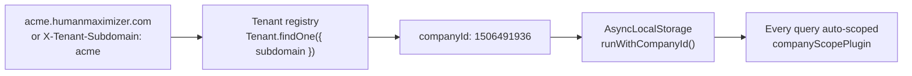

# Tenancy Model

The HCM platform is multi-tenant. A "tenant" is one customer company, and every
piece of data in the system belongs to exactly one of them. This section
describes how the platform decides which company a request belongs to, and what
happens when it cannot.

:::danger This is not optional
A request that fails to establish tenant context is rejected before your
controller runs. If you are writing a client, start with
[Request Headers](request-headers.md).
:::

## Two services, two jobs

| Service | Role |
| --- | --- |
| **MS1** | Control plane. Owns the tenant registry, plans, billing, backups and admin users. One deployment for the whole platform. |
| **MS2** (`hcmBackendv2`) | Tenant backend. Serves the HRMS itself — employees, attendance, payroll, everything under `/api/v1`. |

MS1 creates tenants; MS2 serves them. The two talk over an internal sync channel
described in [Edge Routing](edge-routing.md).

## The identity chain

Tenancy is resolved from the **subdomain**, never from anything the client
asserts about itself:

Three things follow from this, and all three surprise people:

1. **`companyId` is an output, not an input.** It is derived from the subdomain.
   A client that sends a `companyid` header does not choose its tenant — see
   [Request Headers](request-headers.md#the-companyid-header-is-a-cross-check).
2. **There is no `companyId` path or query parameter.** You will not find
   `/api/v1/users?companyId=…` anywhere. Scoping happens below the controller.
3. **Controllers do not filter by company.** `User.find({ role: "HR" })` already
   returns only this tenant's HR users, because the Mongoose plugin rewrote the
   filter. See [Query Scoping](query-scoping.md).

## The `Tenant` document

The registry entry MS1 creates and MS2 reads. Selected fields:

| Field | Type | Purpose |
| --- | --- | --- |
| `companyId` | `Number` | Canonical tenant id — a 10-digit number, e.g. `1506491936` |
| `subdomain` | `String` | The routing key: `acme` in `acme.humanmaximizer.com` |
| `companyName` | `String` | Display name |
| `status` | `String` | `active` gates all access |
| `isActive` | `Boolean` | Soft-delete flag |
| `plan` / `planExpiry` | `String` / `Date` | Paid plan and its expiry |
| `trialStartDate` / `trialEndDate` | `Date` | Trial window for `FREE` plans |
| `employeeLimit` | `Number` | Seat cap |
| `allowWebAccess` / `allowMobileAccess` | `Boolean` | Per-channel kill switches |

`Tenant` is deliberately **exempt** from tenant scoping — it is the control-plane
registry, so resolving a tenant by subdomain is a sanctioned cross-tenant read.
Lookups are cached for 60 seconds.

## Two architectures, one codebase

This is the part most likely to catch you out. Tenancy mode is baked into the
**branch a deployment runs**, not a runtime flag.

| Concern | Shared multi-tenant | Single-tenant |
| --- | --- | --- |
| Database | One shared DB, partitioned by `companyId` | One database per tenant |
| Employee field | `employeeId` | `employee_Id` |
| Employee lookup | scoped by `companyId` | unscoped — the deployment *is* the tenant |
| Uniqueness | compound `{ companyId, employeeId }` | `employee_Id` globally unique |
| Tenant resolution | subdomain → `companyId`, or device key | implicit |
| Query scoping | `companyScopePlugin` + AsyncLocalStorage | not needed |

:::warning The two cannot share a database
The field names differ, the single-tenant `User` model marks `employee_Id` as
globally unique, and single-tenant code performs unscoped lookups. Pointing
single-tenant code at a shared database either finds nothing or silently
attributes records to whichever tenant sorts first. Confirm which mode your
deployment runs before debugging a data-visibility problem.
:::

## Where to go next

- [Request Headers](request-headers.md) — what a client must send
- [Tenant Errors](errors.md) — every rejection code and what to do about it
- [Query Scoping](query-scoping.md) — how `companyId` reaches your queries
- [Edge Routing](edge-routing.md) — how unknown subdomains are turned away
- [Device & Agent Auth](device-auth.md) — biometric agents and the mobile bootstrap
