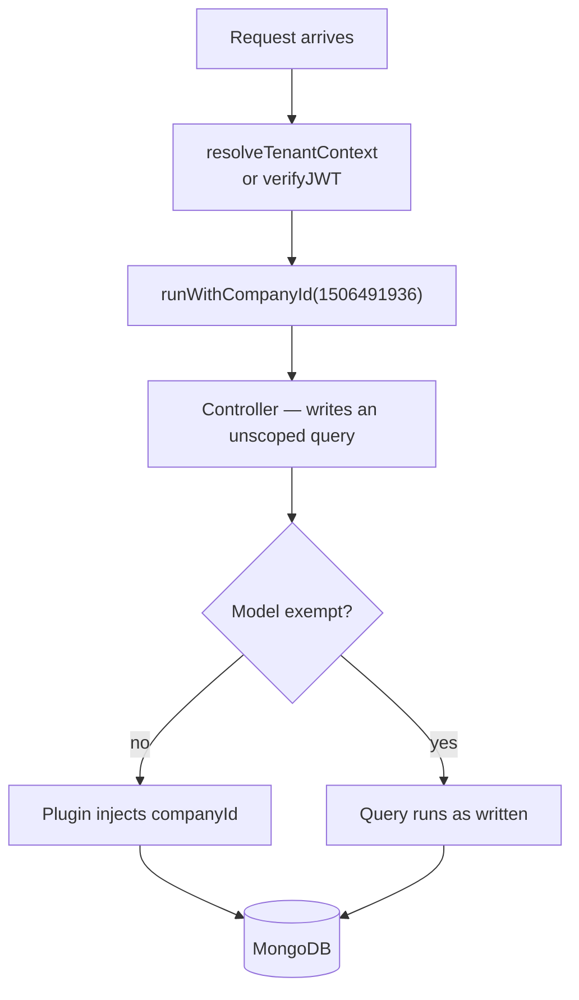

# Query Scoping

Controllers in the tenant backend do not filter by company. They do not need to.
A Mongoose plugin rewrites every query before it reaches MongoDB.

```js
// What you write:
const managers = await User.find({ role: "MANAGER" });

// What actually runs:
db.users.find({ role: "MANAGER", companyId: 1506491936 })
```

The `companyId` comes from AsyncLocalStorage, bound at the edge of the request by
[`resolveTenantContext`](request-headers.md) or by `verifyJWT` for mobile.

## What the plugin does

`companyScopePlugin` is installed globally, so it applies to every schema unless
that schema opts out. On an instrumented schema it:

- **injects** `companyId` on new documents — `save`, `insertMany`, `bulkWrite`
- **adds** `{ companyId }` to every query filter — `find`, `findOne`, `update*`,
  `delete*`, `count*`, and the rest
- **prepends** `{ $match: { companyId } }` to every aggregation pipeline
- **rejects** a write whose `companyId` differs from the ambient context, by
  throwing `CrossTenantWriteRejected`
- **throws** `TenantContextMissing` when a non-exempt model is queried with no
  tenant context at all

Because the value is read from AsyncLocalStorage rather than passed down, no
controller changes were needed to adopt it.



## Background jobs must bind context themselves

A cron job or queue worker has no request, so nothing has bound
AsyncLocalStorage. Querying a scoped model from that context throws
`TenantContextMissing`. Wrap the work:

```js
import { runWithTenant } from "../helpers/runWithTenant.js";

for (const tenant of activeTenants) {
  await runWithTenant(tenant.companyId, async () => {
    await recalculateLeaveBalances();   // scoped automatically
  });
}
```

This is the single most common source of `TENANT_CONTEXT_MISSING` in production.
If you are writing a scheduled task, assume you need `runWithTenant`.

## Exempt models

A short list of models is deliberately not scoped. There are two reasons a model
lands there.

**Cross-tenant by design** — platform data shared by every tenant:

`Tenant`, `SupportUser`, `SupportChat`, `SupportMessage`, `HcmSupportTicket`

**Awaiting a data migration** — these once typed `companyId` as an `ObjectId` or
`String`, which made the plugin's injected `Number` filter throw a cast error.
The code has since been corrected to `companyId: Number`, but existing rows may
still hold the old values, so their controllers keep filtering by hand until the
data is backfilled. `ShiftSwapRequest`, `ShiftLog` and `ShiftTemplate` are in
this group.

:::caution Removing an exemption is a data change, not a code change
Entries come off the list per-batch, only after a tenant's rows are confirmed
migrated. Removing one before the backfill silently empties the module for
every tenant.
:::

Exemption is declared two ways, and both should be present: the schema option
`{ noCompanyScope: true }`, and an entry in `EXEMPT_MODELS` in
`src/plugins/tenantExempt.js`. The list is the source of truth; the schema
option is what the plugin actually checks at schema-build time.

## Indexes

The plugin does **not** mark `companyId` as `index: true`. Mongoose applies
global plugins to child schemas too, and doing so indexed 178 subdocument
`companyId` paths that nothing queries, while duplicating a bare
`{ companyId: 1 }` on collections that already had a `companyId`-leading
compound index.

Instead, `applyCompanyIdIndexPolicy` declares the right index on root schemas
only. A boot-time assertion fails with `TENANT_INDEX_ASSERTION_FAILED` if a
scoped collection is missing it.

## Adding a new model

1. Define the schema normally. Do **not** add a `companyId` field — the plugin
   adds it if absent, typed `Number`.
2. If the model genuinely is cross-tenant, set `{ noCompanyScope: true }` in the
   schema options *and* add its name to `EXEMPT_MODELS`, with a comment saying
   which of the two reasons applies.
3. Write your controller queries without any company filter.
4. Add a test that runs a query under two different `runWithCompanyId` contexts
   and asserts the results do not overlap.

Step 4 is the one people skip. It is also the one that catches a missing
exemption before it reaches production.
